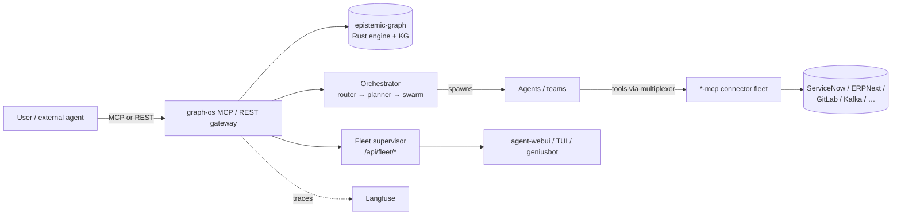

# The Ecosystem — How agent-utilities Fits

agent-utilities is the **spine** of a larger `agent-packages/*` ecosystem: the
shared library + knowledge graph + orchestration that every other piece builds
on. This page maps the pieces and how a request flows through them.

> Hostnames below are generalized placeholders (`*.example.arpa`). Substitute
> your own. No secrets or real endpoints appear here.

## The pieces (one-liners)

### Core
| Project | Role |
|---|---|
| **agent-utilities** | The foundational library: Pydantic-AI harness, graph orchestration, KG facades, ontology, config, MCP server infra (`graph-os`, `mcp-multiplexer`, REST gateway). |
| **epistemic-graph** | The Rust-native graph compute engine (L1 working store + OWL/Datalog reasoning), reached out-of-process over MessagePack/UDS — **no PyO3**. Durable tiers: Postgres/pggraph, with LadybugDB/Neo4j/FalkorDB available. |

### Frontends (all consume the agent-utilities REST gateway / MCP)
| Project | Role |
|---|---|
| **agent-webui** | React web dashboard — chat, graph explorer, ontology Object/Vertex views, and the **Fleet Supervisor** (swarm health, topology, pause/kill, approvals). |
| **agent-terminal-ui** | Textual TUI — sessions, goals, durable task queue, multi-session agent view. |
| **geniusbot** | PySide6 desktop cockpit — service/finance/infra dashboards + embedded terminal. |

### Capabilities & connectors
| Project | Role |
|---|---|
| **agents/&ast;** (the `*-mcp` fleet) | ~50 MCP connectors to enterprise systems (ServiceNow, ERPNext, GitLab/GitHub, LeanIX, Archi, Twenty CRM, Camunda, Keycloak, OpenBao, Technitium DNS, Portainer, Kafka, …). Each runs as a streamable-http container; all template off `create_mcp_server()`. |
| **universal-skills** | 40+ reusable agent skills (deployment, infra, security, workflows) — including the day-0 bootstrap workflow. |
| **skill-graphs** | Generates skill-graph definitions and capability composition. |

### Enterprise service layer (optional, à-la-carte)
| Service | Role | When |
|---|---|---|
| **Keycloak** | OIDC/SAML SSO — root of auth trust | enterprise |
| **OpenBao** | Secrets engine / vault | single-node prod + enterprise |
| **Technitium DNS** | Authoritative `.arpa` zone | enterprise (swarm) |
| **Caddy** | HTTPS ingress / reverse proxy | single-node prod + enterprise |
| **Langfuse** | LLM observability / tracing | any (optional) |
| **LGTM** | Prometheus/Loki/Grafana/Tempo observability | enterprise |
| **Postgres/pggraph** | Durable KG L2 tier | single-node prod + enterprise |
| **Kafka** | Event-sourced mutation backbone | enterprise (optional) |

## How a request flows

1. A user or external agent calls **graph-os** (MCP) or the **REST gateway**.
2. The shared engine handles KG reads/writes; the **orchestrator** decomposes
   goals into teams/swarms.
3. Spawned agents reach external systems through the **`*-mcp` fleet**, federated
   by the **multiplexer**.
4. The **fleet supervisor** surfaces health/topology/approvals to the UIs;
   traces flow to **Langfuse** when configured.

## Deploying the ecosystem

The connector fleet and the backend are deployed by tier — see
[Day-0 Deployment](guides/day0.md) and the recipes
([tiny](recipes/tiny.md) · [single-node prod](recipes/single-node-prod.md) ·
[enterprise](recipes/enterprise.md)). The canonical service list lives in the
generated `mcp-fleet.registry.yml`.
