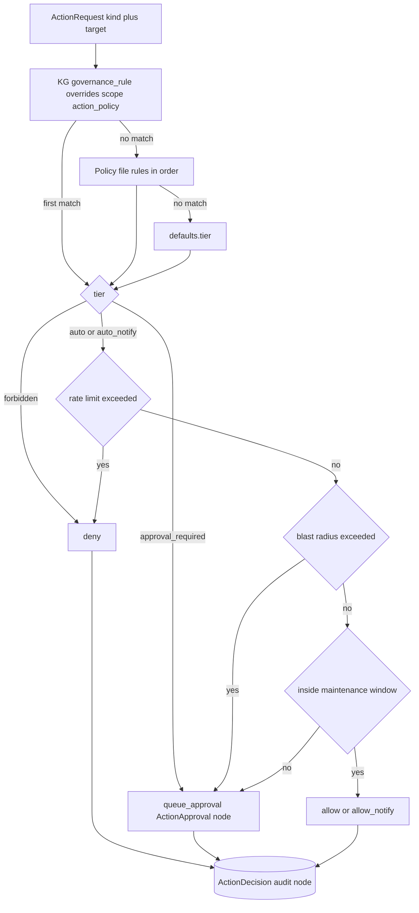

# Worked Example: ActionPolicy Postures

## What this demonstrates

Three complete, ready-to-load ActionPolicy files (CONCEPT:AU-OS.deployment.fleet-lifecycle-control) for three
autonomy postures — **locked-down**, **supervised**, and
**scoped-autonomous** — plus the decision flow they drive: fail-closed
decisions, the durable `ActionDecision` audit ledger, the `ActionApproval`
human queue, and runtime KG `governance_rule` overrides.

The policy files live in this repo:

- [`examples/action-policies/locked-down.yml`](https://github.com/knuckles-team/agent-utilities/blob/main/examples/action-policies/locked-down.yml)
- [`examples/action-policies/supervised.yml`](https://github.com/knuckles-team/agent-utilities/blob/main/examples/action-policies/supervised.yml)
- [`examples/action-policies/scoped-autonomous.yml`](https://github.com/knuckles-team/agent-utilities/blob/main/examples/action-policies/scoped-autonomous.yml)

Deep dive: [fleet_autonomy.md](../architecture/fleet_autonomy.md). The
decision point itself is `agent_utilities/orchestration/action_policy.py`;
the shipped conservative default is `deploy/action-policy.default.yml`
(embedded byte-for-byte as `DEFAULT_POLICY` so installed wheels behave
identically — `tests/unit/test_action_policy.py` asserts the parity).

## Prerequisites (ladder rung)

Any rung of the [deployment ladder](../guides/deployment-configurations.md)
that runs the gateway/daemon. The policy file is consulted by every autonomy
producer — remediation playbooks (AU-OS.host.remediation-playbooks), the fleet reconciler (AU-OS.config.desired-state-fleet-reconciler),
the autoscaler (OS-5.29) — through one call:

```python
from agent_utilities.orchestration.action_policy import ActionRequest, get_action_policy

decision = get_action_policy(engine).decide(
    ActionRequest(kind="restart_service", target="caddy-mcp", source="reconciler")
)
```

## 1. The YAML schema (verified against the loader)

```yaml
version: 1
defaults:                      # applied when a matching rule omits a field
  tier: approval_required      # also the tier when NO rule matches
  rate_limit: {max: 3, window_s: 3600}
  blast_radius: {max_targets: 3, window_s: 3600}
options:                       # optional policy-level behavior knobs
  watch_scale_down: true       # read via ActionPolicy.option(name, default)
rules:                         # first match wins (after KG overrides)
  - kind: restart_service      # action-kind glob (fnmatch), default "*"
    target: "caddy-*"          # target glob (service name), default "*"
    tier: auto                 # auto | auto_notify | approval_required | forbidden
    rate_limit: {max: 2, window_s: 1800}        # per action+target; exceeded => DENY
    blast_radius: {max_targets: 3, window_s: 3600}  # per action kind; exceeded => QUEUE
    maintenance_window: "02:00-05:00"           # "HH:MM-HH:MM" UTC; outside => QUEUE
```

Loader facts worth knowing (all from `action_policy.py`):

- **Tiers → decisions**: `auto` → `allow`, `auto_notify` → `allow_notify`
  (operators are notified via the fleet notification seam),
  `approval_required` → `queue_approval` (files an `ActionApproval` node),
  `forbidden` → `deny`.
- **Pipeline order for auto tiers**: rate limit (deny) → blast radius
  (queue) → maintenance window (queue). `approval_required` and `forbidden`
  short-circuit before those checks.
- **Fail closed**: an unknown `tier` value is treated as
  `approval_required`; a file with no `rules:` list falls back to the
  shipped default; any internal decision error returns `deny`.
- **Window quirk**: an unparseable `maintenance_window` string is ignored
  (the tier still gates); windows may wrap midnight (`"22:00-04:00"`).
- **Durable accounting**: rate/blast budgets are computed from the
  `ActionDecision` ledger in the KG, so N processes share one budget.
- The file is mtime-cached and re-read on change — no restart needed.

Select a posture with the config flag:

```bash
export ACTION_POLICY_PATH=examples/action-policies/supervised.yml
```

Empty/unset `ACTION_POLICY_PATH` resolves to the shipped conservative
default.

## 2. Posture walkthrough

### locked-down

Everything mutating is `forbidden` except `restart_service`, which is
`approval_required` — autonomy can observe, diagnose and *propose a restart
to a human*, nothing more. Even `run_playbook` dispatch needs approval, and
an explicit `{kind: "*", tier: forbidden}` catch-all (plus a `forbidden`
default) refuses any action kind a future module introduces until the file
names it.

### supervised

The day-2 sweet spot: `restart_service` is `auto_notify` with a tight budget
(2 restarts per service per hour — a third is **denied**, because a looping
remediation is broken; restarts touching a 3rd distinct service in an hour
**queue** for approval). Everything that changes what is running —
`scale_service`, `deploy_service`, `rollback_service`, `redeploy_stack`,
`stop_service`, `merge_promotion` — queues for a human grant.

### scoped-autonomous

Self-healing and self-scaling inside guard rails:

- `restart_service`: `auto`, no window (a down service should not wait for
  02:00), 2/service/30 min, blast cap 3 services/hour;
- `scale_service`: `auto_notify` around the clock (load does not respect
  maintenance windows), 4/service/hour, blast cap 2 services/hour — this is
  the rule the OS-5.29 autoscaler's proposals hit;
- `rollback_service`: `auto_notify` (the AU-OS.config.health-gated-deploy-rollback deploy watch must be able
  to roll back at 03:00), once per service per hour;
- `deploy_service`: `auto_notify` for `staging-*` **only inside
  `02:00-05:00` UTC** — outside the window the same proposal is downgraded
  to `queue_approval`; production deploys always queue;
- `redeploy_stack` / `stop_service`: `forbidden` — destructive operations
  are never autonomous;
- `options: {watch_scale_down: true}`: scale-downs also get an AU-OS.config.health-gated-deploy-rollback
  health watch.

## 3. Observed decisions (smoke run)

Loading each file through the real loader and deciding the same sample
requests (engine-less, so approval ids are not minted):

```text
=== locked-down ===
  observe(caddy-mcp) -> allow (tier=auto)
  restart_service(caddy-mcp) -> queue_approval (tier=approval_required)
  scale_service(vector-mcp) -> deny (tier=forbidden)
  deploy_service(staging-twenty) -> deny (tier=forbidden)
  redeploy_stack(kg-backbone) -> deny (tier=forbidden)
  brand_new_kind(anything) -> deny (tier=forbidden)
=== supervised ===
  restart_service(caddy-mcp) -> allow_notify (tier=auto_notify)
  scale_service(vector-mcp) -> queue_approval (tier=approval_required)
  deploy_service(staging-twenty) -> queue_approval (tier=approval_required)
  redeploy_stack(kg-backbone) -> queue_approval (tier=approval_required)
=== scoped-autonomous ===
  restart_service(caddy-mcp) -> allow (tier=auto)
  scale_service(vector-mcp) -> allow_notify (tier=auto_notify)
  deploy_service(staging-twenty) -> queue_approval (tier=auto_notify)
                                    reason: outside maintenance window 02:00-05:00 — queued
  deploy_service(twenty) -> queue_approval (tier=approval_required)
  redeploy_stack(kg-backbone) -> deny (tier=forbidden)
```

(The `staging-twenty` deploy was evaluated outside the 02:00–05:00 UTC
window; inside it, the same request returns `allow_notify`.)

Reproduce with:

```python
from agent_utilities.orchestration.action_policy import ActionPolicy, ActionRequest

policy = ActionPolicy(engine=None,
                      policy_path="examples/action-policies/scoped-autonomous.yml")
print(policy.decide(ActionRequest(kind="scale_service", target="vector-mcp",
                                  source="autoscaler")).decision)
# -> "allow_notify"
```

## 4. The decision flow end to end



- **Every** decision (including denials) writes an `ActionDecision` KG node:
  `kind`, `target`, `params_json`, `source`, `tier`, `decision`, `reason`,
  `rule_origin` (`file` | `kg` | `default`), `approval_id`, `decided_at`,
  `decided_unix`. This node doubles as the durable rate/blast ledger.
- **Approvals**: `queue_approval` files an `ActionApproval` node
  (`status: pending`; deduplicated per kind+target so a recurring divergence
  does not flood the queue). The human flow — both routes verified in
  `agent_utilities/gateway/fleet.py` and mounted under `/api`:

```bash
# list pending approvals (Task nodes awaiting decision + ActionApproval nodes)
curl -sS http://localhost:8000/api/fleet/approvals

# grant one (deny with "decision": "denied")
curl -sS -X POST http://localhost:8000/api/fleet/approvals/grant \
  -H "Content-Type: application/json" \
  -d '{"job_id": "action_approval:1f2a3b4c5d6e", "decision": "approved"}'
```

Expected grant response:

```json
{"status": "success", "result": {"approval_id": "action_approval:1f2a3b4c5d6e", "decision": "approved"}}
```

The fleet reconciler's tick (CONCEPT:AU-OS.config.desired-state-fleet-reconciler, `FLEET_RECONCILER=1`) executes
granted entries through the actuator seam.

## 5. Runtime KG overrides

`governance_rule` nodes with `scope: 'action_policy'` are loaded on every
decision and **always win over file rules** (sorted by `priority`
descending; `active: false` disables a rule without deleting it). Fields are
flat properties or a `rule_json` payload — same keys as the file schema.
Example: temporarily freeze deploys fleet-wide without touching the file:

```bash
curl -sS -X POST http://localhost:8000/api/graph/write \
  -H "Content-Type: application/json" \
  -d '{"action": "add_node", "node_id": "governance_rule:deploy-freeze",
       "node_type": "governance_rule",
       "properties": {"scope": "action_policy", "kind": "deploy_service",
                      "target": "*", "tier": "forbidden", "priority": 100,
                      "active": "true"}}'
```

Set `active` to `"false"` (or delete the node) to lift the freeze. Because KG
rules are consulted before file rules, this overrides *any* posture,
including scoped-autonomous's in-window staging deploys.

---

*Smoke-run against this tree (2026-06-11): all three posture files were loaded
through the real `ActionPolicy` loader and produced the decisions shown in
section 3; `python3 -m pytest tests/unit/test_action_policy.py -q` passed as
part of a 99-test green run. The approvals curl flow was reviewed against code
only.*
