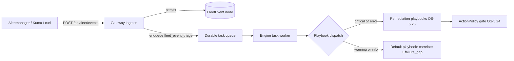

# Worked Example: Wiring Monitoring into Fleet Events

## What this demonstrates

How to point real monitoring systems — Prometheus Alertmanager and Uptime
Kuma — at the gateway's fleet-events webhook ingress
(`POST /api/fleet/events`, CONCEPT:OS-5.15), what each event becomes in the
Knowledge Graph (`FleetEvent` nodes), and how critical events flow into the
OS-5.26 remediation playbooks (`service_down` / `service_flapping` /
`resource_pressure`) with a step-by-step `remediation_log` audit trail.

Deep dive: [fleet_autonomy.md](../architecture/fleet_autonomy.md) and
[event_backbone_architecture.md](../architecture/event_backbone_architecture.md).

## Prerequisites (ladder rung)

This sits on the "gateway + host daemon" rung of the deployment ladder — see
[deployment configurations](../guides/deployment-configurations.md). You need:

- the API gateway running with the graph routes mounted (the fleet routes are
  mounted alongside them under the same prefix, default `/api`);
- the KG engine reachable from the gateway (events are persisted as nodes and
  triaged by the engine's durable task workers — without an engine the ingress
  returns `503` so well-behaved senders retry);
- optionally, a shared secret in `FLEET_EVENTS_TOKEN`.

## 1. The route and its auth

The handler is `agent_utilities/gateway/fleet_events.py:fleet_events_receive`,
mounted by `mount_fleet_routes()` (`agent_utilities/gateway/fleet.py`) as:

```
POST /api/fleet/events[?source=<name>]
```

Auth is a shared-secret header, because Alertmanager and Kuma cannot mint
JWTs:

| Flag | Default | Behavior |
|---|---|---|
| `FLEET_EVENTS_TOKEN` | `None` | When set, every POST must carry a matching `X-Fleet-Events-Token` header or it is rejected with `401` (constant-time compare). Unset = no token required; the OS-5.14 identity middleware still applies when `KG_AUTH_REQUIRED=1`. |

The config is re-read per request, so rotating the token does not require a
gateway restart. A per-source storm cap of 120 accepted events/minute returns
`429` when exceeded.

```bash
export FLEET_EVENTS_TOKEN="$(openssl rand -hex 24)"   # set on the gateway
```

## 2. Prometheus Alertmanager receiver

The normalizer detects the Alertmanager v4 webhook envelope structurally (an
`alerts` list plus `receiver`/`version`/`groupKey`) and emits **one event per
entry in `alerts[]`**. Subject preference: `labels.service` →
`labels.instance` → `labels.job` → `labels.alertname`; severity comes from
`labels.severity` (default `warning`; resolved alerts are downgraded to
`info`); summary from `annotations.summary` → `annotations.description` →
`labels.alertname`.

```yaml
# alertmanager.yml
route:
  receiver: agent-os-fleet

receivers:
  - name: agent-os-fleet
    webhook_configs:
      - url: "https://gateway.example.com/api/fleet/events"
        send_resolved: true # resolved alerts land as severity=info
        http_config:
          # Custom headers require Alertmanager >= 0.25 (http_headers).
          http_headers:
            X-Fleet-Events-Token:
              secrets: ["REPLACE_WITH_FLEET_EVENTS_TOKEN"]
```

On an older Alertmanager without `http_config.http_headers`, leave
`FLEET_EVENTS_TOKEN` unset and restrict the route at the reverse proxy
instead.

## 3. Uptime Kuma webhook notification

In Kuma: **Settings → Notifications → Webhook**, URL
`https://gateway.example.com/api/fleet/events`, body type
**"application/json"** (the default preset body). Kuma's default payload is
exactly what the normalizer expects — a `heartbeat` object, a `monitor`
object, and `msg`:

```json
{
  "heartbeat": {"status": 0, "msg": "connect ECONNREFUSED"},
  "monitor": {"name": "vector-mcp", "url": "https://vector-mcp.arpa"},
  "msg": "[vector-mcp] [DOWN] connect ECONNREFUSED"
}
```

Normalization: `heartbeat.status` maps `0=down, 1=up, 2=pending,
3=maintenance`; `status=down` becomes severity `critical`, everything else
`info`. Subject is `monitor.name` (falling back to `monitor.url`). For the
token, add a custom header `X-Fleet-Events-Token` under the webhook's
"Additional Headers" field.

Any other JSON sender (Portainer webhooks, scripts) falls through to the
generic normalizer: `service`/`subject`/`name`/`host` becomes the subject,
`severity`/`status`/`summary`/`message`/`msg` are read if present, and the
source is taken from `?source=` or the `X-Event-Source` header.

## 4. Post a synthetic event

```bash
curl -sS -X POST "http://localhost:8000/api/fleet/events?source=portainer" \
  -H "Content-Type: application/json" \
  -H "X-Fleet-Events-Token: $FLEET_EVENTS_TOKEN" \
  -d '{"service": "caddy-mcp", "severity": "critical",
       "status": "down", "summary": "synthetic: caddy-mcp is down"}'
```

Expected response (HTTP 200):

```json
{
  "status": "success",
  "accepted": 1,
  "events": [
    {
      "event_id": "fleet_event:1f2a3b4c5d6e",
      "job_id": "<durable triage task id, or null>",
      "source": "portainer",
      "severity": "critical",
      "subject": "caddy-mcp"
    }
  ]
}
```

Error shapes: `401` (bad/missing token), `400` (non-JSON body or nothing
recognized), `429` (storm cap), `503` (engine unavailable — senders should
retry).

## 5. What lands in the KG

Each accepted event becomes a `FleetEvent` node (label and properties from
`persist_event()` in `gateway/fleet_events.py`):

| Property | Example |
|---|---|
| `source` | `portainer` |
| `severity` | `critical` (vocabulary: `critical` / `error` / `warning` / `info`) |
| `subject` | `caddy-mcp` |
| `status` | `down` |
| `summary` | `synthetic: caddy-mcp is down` (truncated to 500 chars) |
| `raw` | original JSON payload (truncated to 4000 chars) |
| `received_at` | `2026-06-11T01:23:45Z` |
| `triage_status` | `pending` → `triaged` once the worker ran |

Query it back:

```bash
curl -sS -X POST http://localhost:8000/api/graph/query \
  -H "Content-Type: application/json" \
  -d '{"action": "cypher", "cypher": "MATCH (e:FleetEvent {subject: \"caddy-mcp\"}) RETURN e ORDER BY e.received_at DESC LIMIT 1"}'
```

## 6. From event to remediation playbook



The gateway enqueues a durable `fleet_event_triage` task; the engine's task
workers dispatch it to
`knowledge_graph/adaptation/fleet_event_triage.py:triage_fleet_event`. The
worker first calls `remediation_playbooks.ensure_registered()`, which
registers the remediation dispatcher via `register_playbook()` for every
`(source, severity)` pair in `{alertmanager, uptime-kuma, portainer, generic}
x {critical, error}` — that is the OS-5.26 seam. Lookup order for a playbook
key is `"<source>:<severity>"` → `"<source>"` → `"default"`.

Every playbook runs the OS-5.15 default playbook first (correlate the subject
to known `Server`/`Session`/`Resource`/`Tool` nodes with `OBSERVED_ON` edges,
and file a `failure_gap` Concept topic for critical/error/firing/down
events), then classifies (`remediation_playbooks._classify`):

- **`resource_pressure`** — summary contains a pressure marker (`disk`,
  `memory`, `oom`, `cpu`, `inode`, `swap`, `no space`, ...). NEVER auto-acts:
  notifies operators and queues an `investigate_resource_pressure` approval.
- **`service_flapping`** — the FleetObserver counted >= 3 down-events for the
  subject inside its window (default 1800 s). Backs off (restarting again
  feeds the flap) and escalates a `restart_service` *proposal* to the
  approval queue.
- **`service_down`** (everything else) — confirm via the FleetObserver (an
  already-recovered service ends the playbook), then propose
  `restart_service` through the ActionPolicy gate (CONCEPT:OS-5.24). Allowed
  ⇒ actuate and schedule an OS-5.27 deploy watch; queued/denied ⇒ escalate
  to the approvals flow + operator notification.

Every step is recorded back onto the originating `FleetEvent` node:

- `remediation_log` — JSON array of `{step, outcome, at, ...}` entries
  (steps: `observe`, `confirm`, `classify`, `policy`, `actuate`, `verify`,
  `escalate`), truncated to 4000 chars;
- `remediation_status` — the latest `"<step>:<outcome>"`, e.g.
  `"verify:scheduled"` or `"escalate:queued"`.

Escalations surface as `ActionApproval` nodes in `GET /api/fleet/approvals`
and are granted via `POST /api/fleet/approvals/grant` — see the
[ActionPolicy postures example](action-policy-postures.md).

Note: with the shipped conservative default policy, `restart_service` is
`approval_required`, so the `service_down` playbook will queue rather than
restart until you load a posture that allows it.

## Verification

```bash
python3 -m pytest tests/unit/test_fleet_events.py -q
```

Expected: all tests pass (covers normalization of all three payload shapes,
token auth, storm cap, persistence and triage enqueue).

---

*Smoke-run against this tree (2026-06-11): `python3 -m pytest
tests/unit/test_fleet_events.py -q` passed as part of a 99-test green run, and
the normalizer was exercised directly (`normalize_payload` on Alertmanager,
Kuma and generic payloads produced the events shown above). The curl flow and
external Alertmanager/Kuma configs were reviewed against code only.*
