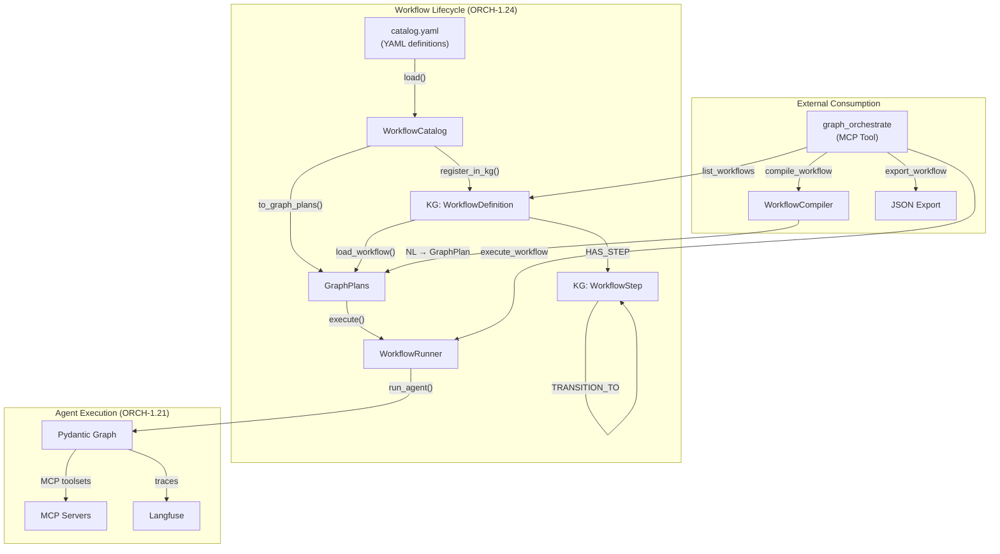

# Orchestration, Workflows & Ingestion Examples

This guide details how to use the `IntelligenceGraphEngine` to ingest external context, define reusable workflows, and orchestrate agents.

## Architecture Overview



## 1. Tool Ingestion (Agent Toolkit)

To register MCP tools and Pydantic AI skills natively into the Knowledge Graph, point the ingest pipeline at the configurations.

```python
import asyncio
from agent_utilities.knowledge_graph.core.engine import IntelligenceGraphEngine
from pathlib import Path

async def main():
    engine = IntelligenceGraphEngine.get_active()

    # Define paths to skill directories and MCP configurations
    sources = [
        "/home/apps/workspace/agent-packages/skills/universal-skills",
        "/home/apps/workspace/agent-packages/skills/skill-graphs",
        "/home/apps/workspace/agent-packages/agent-utilities/docs/examples/example_mcp_config.json"
    ]

    # Ingest the toolkit into the Graph
    result = await engine.ingest_agent_toolkit(sources)
    print(result)

if __name__ == "__main__":
    asyncio.run(main())
```

## 2. Ingesting Codebases, Documents, and Papers

The engine supports asynchronous background ingestion jobs for massive data troves.

```python
# Codebase Ingestion
engine.submit_task(
    target_path="/home/apps/workspace/my-repo",
    is_codebase=True,
    task_type="codebase"
)

# Document Chunking (PDFs, Word Docs)
engine.submit_task(
    target_path="/home/apps/workspace/docs/architecture.pdf",
    is_codebase=False,
    task_type="document"
)

# Research Paper Parsing
engine.submit_task(
    target_path="/home/apps/workspace/papers/attention_is_all_you_need.pdf",
    is_codebase=False,
    task_type="paper"
)
```

## 3. Workflow Catalog — Defining Reusable Workflows

The Workflow Catalog (CONCEPT:ORCH-1.24) lets you define reusable orchestration scenarios in YAML.

### Loading the Built-in Catalog

```python
from agent_utilities.workflows.catalog import WorkflowCatalog

# Load the built-in catalog
catalog = WorkflowCatalog.load()
print(catalog.summary())

# Filter by domain or tag
infra = catalog.filter_by_domain("infrastructure")
research = catalog.filter_by_tag("arxiv")
```

### Registering Workflows in the Knowledge Graph

```python
# Persist all workflows into the KG
workflow_ids = catalog.register_in_kg(engine)
print(f"Registered {len(workflow_ids)} workflows")

# Re-registration auto-increments version
workflow_ids = catalog.register_in_kg(engine)  # v2 now
```

### Exporting for External Consumers

```python
# Export as JSON (for other agents, UIs, CI)
catalog.export_json("/tmp/workflows.json")

# Export as YAML
catalog.export_yaml("/tmp/workflows.yaml")
```

### YAML Catalog Format

```yaml
workflows:
  - name: container_health_check
    description: "Full Docker infrastructure health assessment"
    domain: infrastructure
    tags: [docker, health, monitoring]
    requires: [DOCKER_HOST, container-manager-mcp]
    timeout_seconds: 180
    steps:
      - agent: container-manager-mcp
        task: "List all running containers"
        expected: [container, running]
      - agent: container-manager-mcp
        task: "Show volumes and networks"
        expected: [volume, network]
        depends_on: [0]  # Runs after step 0
```

## 4. Executing Workflows

### Programmatic Execution

```python
from agent_utilities.workflows.runner import WorkflowRunner

runner = WorkflowRunner()

# Execute by name (loads from KG)
result = await runner.execute_by_name("container_health_check", engine)

# Or execute a GraphPlan directly
plan = catalog.get("container_health_check").to_graph_plan()
result = await runner.execute(plan, engine, workflow_name="container_health_check")

# Inspect results
print(result.summary())
print(result.mermaid)  # Execution status diagram

for step in result.step_results:
    print(f"  [{step.status}] {step.node_id}: {step.output[:100]}")
```

### Via MCP Tool (External Agents)

```
# List all available workflows
graph_orchestrate(action="list_workflows")

# Execute a stored workflow
graph_orchestrate(action="execute_workflow", agent_name="container_health_check")

# Compile a new workflow from natural language
graph_orchestrate(
    action="compile_workflow",
    agent_name="my_research_flow",
    task="Search for papers on transformers, summarize top 3, then create a report"
)

# Export a workflow as JSON
graph_orchestrate(action="export_workflow", agent_name="container_health_check")
```

## 5. Dynamic Agent Execution (`run_agent`)

Once ingested, you can dynamically route queries to specialized MCP servers or agent logic using `run_agent()`. The router automatically discovers the best server to satisfy the task.

```python
from agent_utilities.orchestration.agent_runner import run_agent

async def dynamic_execution():
    engine = IntelligenceGraphEngine.get_active()

    # The router discovers that 'repository-manager' provides 'rm_workspace'
    result = await run_agent(
        agent_name="repository-manager-mcp",
        task="Can you use the rm_workspace tool to list the available actions for the workspace?",
        max_steps=5,
        engine=engine
    )
    print(result)
```

## 6. Compiling Workflows from Natural Language

The `WorkflowCompiler` (CONCEPT:ORCH-1.23) parses natural language descriptions into executable `GraphPlan` DAGs.

```python
from agent_utilities.knowledge_graph.workflow_compiler import WorkflowCompiler

compiler = WorkflowCompiler(engine)

# Compile from NL
plan = await compiler.compile(
    "Search for recent AI papers, then summarize the top 3, "
    "and finally create a presentation with the findings."
)

# Compile and persist in one call
workflow_id = await compiler.compile_and_store(
    name="research_to_presentation",
    description="Search papers → summarize → present",
)

# Find and replay a stored workflow by semantic similarity
plan = compiler.find_and_load("summarize papers")
```

## 7. Available Workflow Scenarios

The built-in catalog includes these predefined workflows:

| Name | Domain | Steps | Description |
|------|--------|-------|-------------|
| `container_health_check` | infrastructure | 4 | Full Docker infrastructure health assessment |
| `system_observability_sweep` | infrastructure | 3 | System metrics + Langfuse health |
| `tunnel_and_network_audit` | infrastructure | 3 | SSH tunnels + network interface audit |
| `research_discovery_pipeline` | research | 3 | Paper search → categories → details |
| `ai_research_survey` | research | 3 | Multi-source AI paper survey |
| `workspace_inventory` | development | 2 | Workspace discovery and listing |
| `workspace_health_check` | development | 3 | Workspace + system health combo |
| `full_ecosystem_health` | operations | 4 | End-to-end canary across all systems |
| `capability_discovery` | meta | 3 | Tool introspection across MCP servers |
| `observability_and_research` | research | 3 | Langfuse health + observability papers |

## 8. Specific Server Example Tasks

Here are practical execution prompts that map to the standard MCP suite.

### Container Manager MCP
**Task**: `"Can you list all docker images, list all running containers, get the logs for one of the running containers, show the volumes, and show the networks using your tools?"`

### ScholarX MCP
**Task**: `"Can you use the sx_info tool to list the categories?"`

### Tunnel Manager MCP
**Task**: `"Can you list the active tunnels from the inventory using your tools?"`

### Audio Transcriber MCP
**Task**: `"Can you describe the capabilities of the transcribe_audio tool?"`

### Systems Manager MCP
**Task**: `"Can you get the system memory and CPU stats?"`

### Data Science MCP
**Task**: `"Can you describe the iris dataset using the describe_dataset tool?"`

### Langfuse MCP
**Task**: `"Can you check the langfuse health endpoint or list current projects/datasets using your tools?"`
