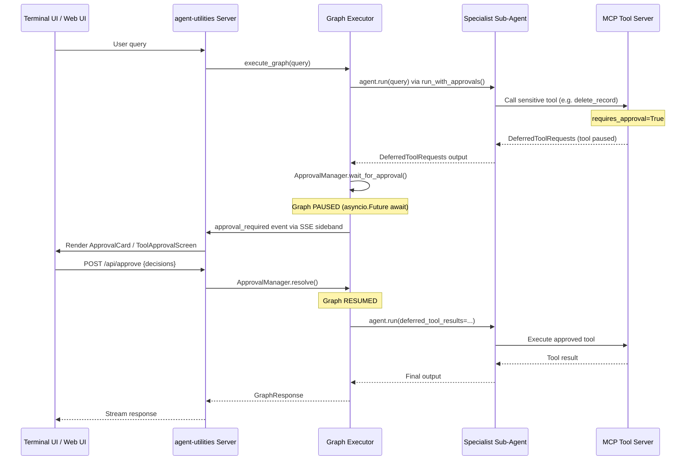

# Features

## Model Registry

`agent-utilities` ships a first-class multi-model registry so a single agent deployment can fan out work across several LLM providers (a fast local LM Studio, a cloud `gpt-4o-mini`, a reasoning `claude-3-opus`, etc.) without any code changes.

**Data model** (`agent_utilities/models/model_registry.py`)

- `ModelCostRate(input: float, output: float)` -- USD per 1M tokens; `0/0` is legal and means "local / zero-cost". UIs render those as `$0.00` rather than `-` so token / tool counts remain meaningful.
- `ModelDefinition` -- one configured model: `id`, `name`, `provider`, `model_id`, optional `base_url`, `api_key_env` (env var name; the raw key is *not* persisted), `tier` (`light | medium | heavy | reasoning`), freeform `tags`, `cost`, `context_window`, `max_output_tokens`, `is_default`.
- `ModelRegistry` -- a list of `ModelDefinition` plus lookup / routing helpers:
  - `get_default()` / `get_by_id(id)` / `list_by_tier(tier)`
  - `pick_for_task(complexity, required_tags)` -- tier-priority match with tag AND-filtering and graceful fallback to the default.
  - `load_from_file(path)` -- reads JSON or YAML; picks parser by file extension.
  - `to_api_payload()` -- wire shape `{"models": [...], "default_id": ...}`.

**Bootstrap priority** (`resolve_model_registry` in `server.py`)

1. Explicit `model_registry` kwarg passed to `build_agent_app` / `create_agent_server` / `create_graph_agent_server`.
2. `MODELS_CONFIG` env var pointing at a JSON or YAML file.
3. Single-model kwargs (`provider`, `model_id`, `base_url`) -> a one-entry registry marked `is_default=True`, tier `medium`.
4. Empty registry.

**Endpoint**
- `GET /models` returns `{"models": [...], "default_id": ...}` straight out of the active registry.
- Mirrored at `GET /api/enhanced/models` by `agent-webui` so the web UI can use the same registry without cross-origin config.

**Example YAML (`models.yml`)**

```yaml
models:
  - id: local-fast
    name: Local LM Studio
    provider: openai
    model_id: llama-3.2-3b-instruct
    base_url: http://localhost:1234/v1
    tier: light
    cost: { input: 0.0, output: 0.0 }
    is_default: true
  - id: cloud-mini
    name: GPT-4o Mini
    provider: openai
    model_id: gpt-4o-mini
    api_key_env: OPENAI_API_KEY
    tier: medium
    tags: [code, tools]
    cost: { input: 0.15, output: 0.6 }
  - id: cloud-opus
    name: Claude 3 Opus
    provider: anthropic
    model_id: claude-3-opus-20240229
    api_key_env: ANTHROPIC_API_KEY
    tier: heavy
    tags: [reasoning, tools]
    cost: { input: 15, output: 75 }
```

Load it with `MODELS_CONFIG=/path/to/models.yml agent-utilities-server`.

---

## Direct Graph Execution

When a `graph_bundle` is present at startup, the AG-UI endpoint (`/ag-ui`) can bypass the outer LLM agent entirely and execute the graph directly. This eliminates one full LLM inference round-trip per request — the LLM no longer needs to decide to call the `run_graph_flow` tool, because the protocol adapter calls it directly.

### How It Works

The fast path uses `graph.iter()` (pydantic-graph beta API) for step-by-step execution:

```python
# Each step yields per-node events for real-time streaming
async for event in execute_graph_iter(graph, config, query):
    for chunk in emitter.translate(event):
        yield chunk  # AG-UI wire format: 0:/2:/8:/9: prefixes
```

**Event types yielded by `run_graph_iter()`:**

| Event Type | Description |
|-----------|-------------|
| `node_transition` | A graph node has started executing (includes active node IDs) |
| `sideband` | Graph lifecycle events (specialist routing, tool calls) |
| `elicitation` | The graph is pausing for human approval |
| `graph_complete` | Execution finished (includes final output) |
| `error` | An error occurred during execution |

Each event includes a `state_snapshot` with the current `GraphState` for observability and audit trails.

### Wire Format (AG-UI)

The `AGUIGraphEmitter` translates graph events to AG-UI wire format:

| Prefix | Purpose |
|--------|---------|
| `0:` | Heartbeat / flush marker |
| `2:` | Text delta streaming chunks |
| `8:` | Sideband annotations (graph events, tool calls) |
| `9:` | Tool call information |

### Configuration

| Variable | Purpose | Default |
|----------|---------|---------|
| `GRAPH_DIRECT_EXECUTION` | Enable direct graph dispatch (bypasses LLM tool-call hop) | `true` |

Set to `false` to restore the legacy `Agent → LLM → run_graph_flow → graph` pipeline.

### Protocol Behavior

| Protocol | Direct Execution? | Details |
|----------|-------------------|---------|
| **AG-UI** | ✅ Full bypass | Uses `execute_graph_iter()` + `AGUIGraphEmitter` |
| **ACP** | ⚡ Optimized | Per-session `agent_factory` with session-aware closures |
| **A2A** | ❌ LLM-mediated | Retains `run_graph_flow` tool for multi-agent negotiation |
| **SSE** | ✅ Already direct | `/stream` has always called `run_graph_stream()` directly |

### Capabilities Unlocked by `graph.iter()`

The `iter()` API provides step-by-step control over graph execution, enabling:

- **Per-node progress streaming**: Real-time AG-UI sideband updates per graph step
- **Elicitation**: Pause between steps when `state.human_approval_required` is set
- **State snapshots**: Every event includes serialized `GraphState` for audit trails
- **Pause/Resume foundation**: State can be serialized to disk mid-execution for later resumption


## Spec-Driven Development (SDD) Lifecycle

The `agent-utilities` ecosystem implements a high-fidelity orchestration pipeline based on Spec-Driven Development. This lifecycle ensures technical precision, architectural consistency, and parallel execution safety.

### Phase 1: Governance & Specification
1. **Project Start**: The **Planner** triggers `constitution-generator` to establish `constitution.md` (governance rules, tech stack).
2. **Feature Definition**: The **Planner** triggers `spec-generator` to produce `spec.md` (user stories, acceptance criteria, requirements).
3. **Technical Approach**: The **Planner** triggers `task-planner` to generate `plan.md` (technical approach) and `tasks.md` (inter-dependent graph of tasks).
4. **Baseline Testing**: Before implementation, the **Planner** triggers `first_run_tests` to establish a verified baseline of the current workspace state.

### Phase 2: Parallel Execution
The **Dispatcher** reads the `tasks.md` and routes sub-tasks to specialized agents.
- **Dependency Tracking**: Tasks are executed in parallel if they have no unmet dependencies.
- **Context Isolation**: Each specialist receives only relevant context for its assigned task.
- **`[P]` Markers**: The `Task.parallel: bool` field and `[P]` markdown markers enable explicit parallel-wave control.
- **Agentic Manual Testing**: Specialists can trigger `run_manual_test` to verify behaviors that are difficult to automate (e.g. CLI output, UI state).

### Phase 3: Continuous Verification
1. **Quality Gate**: After execution, the **Verifier** node uses `spec-verifier` to evaluate the results against the original `spec.md`.
2. **Self-Correction**: If verification fails (score < 0.7), feedback is injected back into the **Planner** for targeted re-planning and execution.
3. **Linear Walkthroughs**: Upon success, the agent triggers `generate_walkthrough` to produce a step-by-step documentation of the implementation.

### Phase 4: Long-Term Memory Evolution
1. **Interactive Explanations**: For complex logic, the agent generates `interactive-explain` artifacts (HTML/JS) to aid human understanding.
2. **Memory Capture**: The `sync_feature_to_memory` tool is invoked to summarize the `Spec`, `ImplementationPlan`, and execution results.
3. **Historical Reference**: Future planning sessions can search the Knowledge Graph to retrieve technical context from previous related work.

### SDD Skills Reference
| Skill | Group | Purpose | Bound To |
|:------|:------|:--------|:---------|
| `constitution-generator` | sdd | Establish project governance and stack. | Planner |
| `spec-generator` | sdd | Create feature-level specifications. | Planner, Architect, Project Manager |
| `task-planner` | sdd | Generate technical implementation plans with `[P]` markers. | Planner, Coordinator |
| `spec-verifier` | sdd | Evaluate results against specifications. | Verifier, QA Expert, Critique |
| `sdd-implementer` | sdd | Execute tasks from the generated plan. | Specialist Programmers |
| `workspace-manager` | sdd | Bootstrap and manage `.specify/` directory layout. | Planner |
| `manual-testing-enhanced` | sdd | Exploratory testing and manual verification. | QA Expert, Verifier |
| `code-walkthrough` | docs | Generates linear codebase documentation. | Document Specialist |
| `interactive-explain` | docs | Generates interactive HTML explanations. | Document Specialist |

---

## Human-in-the-Loop & Tool Safety

### Universal Tool Guard (Global Safety)
By default, `agent-utilities` implements a **Universal Tool Guard** that automatically intercepts sensitive tool calls from MCP servers and graph specialist sub-agents.

Any tool matching specific "danger" patterns (e.g., `delete_*`, `write_*`, `execute_*`, `drop_*`) is flagged with pydantic-ai's native `requires_approval=True` attribute. When a specialist sub-agent calls a flagged tool, the graph **pauses at that exact node** and waits for explicit user approval before continuing.

**Key Features:**
- **Zero Config**: Protections are applied automatically based on tool names via `apply_tool_guard_approvals()`.
- **True Pause-and-Resume**: The graph does NOT terminate on approval requests. It suspends via `asyncio.Future` and resumes when the user responds.
- **Protocol-Agnostic**: Works identically across AG-UI (web UI), terminal UI, ACP, and SSE protocols.
- **Persistent Choices**: When using ACP, users can select "Always Allow" / "Always Deny" for specific tools.
- **Customizable**: Disable with `TOOL_GUARD_MODE=off` or `DISABLE_TOOL_GUARD=True`.

**Sensitive Patterns:**
`delete`, `write`, `execute`, `rm_`, `rmdir`, `drop`, `truncate`, `update`, `patch`, `post`, `put`, `create`, `add`, `upload`, `set`, `reset`, `clear`, `revert`, `replace`, `rename`, `move`, `start`, `stop`, `restart`, `kill`, `terminate`, `reboot`, `shutdown`, `git_*`.

### Approval Manager Architecture



### How to use Elicitation
Elicitation is used when an MCP tool requires additional structured input or confirmation from the user. Both tool approval and MCP elicitation use the same underlying `ApprovalManager` pause/resume mechanism.

**In MCP Tools (FastMCP):**
```python
from fastmcp import FastMCP, Context

mcp = FastMCP("MyServer")

@mcp.tool()
async def book_table(restaurant: str, ctx: Context) -> str:
    confirmation = await ctx.elicit(
        message=f"Please confirm booking for {restaurant}",
        schema={
            "type": "object",
            "properties": {
                "guests": {"type": "integer", "description": "Number of guests"},
                "time": {"type": "string", "description": "Time of booking"}
            },
            "required": ["guests", "time"]
        }
    )
    if confirmation.get("_action") == "cancel":
        return "Booking cancelled by user."
    return f"Booked for {confirmation['guests']} at {confirmation['time']}"
```

---

## JSON Prompting (Structured Prompts)

Agent Utilities uses a **JSON-native** prompting architecture. All system prompts have been migrated from Markdown to `.json` blueprints powered by the `StructuredPrompt` Pydantic model. This ensures that every agent task is explicitly specified and type-safe.

### Key Benefits
- **Zero Guesswork**: Explicitly specify task, tone, audience, and structure.
- **Type Safety**: Pydantic models validate prompt structure before execution.
- **Graph Integration**: Prompts can be hydrated dynamically from the Knowledge Graph.
- **Nested Blueprints**: Define reusable components like hooks, body structures, and CTAs.

### Usage Example
```json
{
  "task": "write a tweet",
  "topic": "dopamine detox",
  "style": "viral",
  "structure": {
    "hook": "curiosity-driven",
    "body": "3 insights",
    "cta": "question"
  }
}
```

---

## Agentic Engineering Patterns

### 1. Spec-Driven TDD (Red/Green/Refactor)
Agents natively support a Spec-Driven TDD workflow. Requirements from the `SDDManager` are used to drive a formalized Red-Green-Refactor cycle:
- **Red Phase**: Subagent writes a failing test case based on requirements.
- **Green Phase**: Subagent implements code to satisfy the test.
- **Refactor Phase**: Subagent optimizes code quality while maintaining test pass status.
- **Tools**: `run_tdd_cycle`, `setup_sdd`, `save_spec`.

### 2. Isolated Subagent Dispatch
Complex tasks are broken down and dispatched to specialized subagents with isolated contexts:
- **Isolation**: Each subagent receives a fresh, curated context to prevent "context pollution."
- **Specialization**: Subagents are spawned with specific toolsets (e.g., TDD experts, shell experts).
- **Orchestration**: Parallel execution via the Dispatcher's task-graph awareness.

### 3. Agentic Manual Testing
Verification of behaviors that are difficult to unit-test (e.g., CLI output, network state) is performed via autonomous manual testing:
- **Goal-Oriented**: The agent is given a verification goal and autonomous access to shell/curl tools.
- **Runtime Verification**: Steps are executed in real-time to confirm system state.
- **Tools**: `run_manual_test`.

### 4. Knowledge Hoarding (Pattern Templates)
Successful engineering cycles (e.g., a specific TDD solution for a recurring problem) are persisted as reusable **Pattern Templates** in the Knowledge Graph:
- **Recombination**: Agents search for existing templates to "hoard" and recombine successful solutions.
- **Self-Improvement**: Successful outcomes increase the `success_rate` and `importance_score` of patterns.
- **Graph Nodes**: `PatternTemplate` nodes linked via `IMPLEMENTS` and `DERIVED_FROM`.

---

## Emergent Architecture (CONCEPT:KG-2.0 through AU-017)

The Emergent Architecture layer enables dynamic agent coalition formation, evolutionary variant selection, metacognitive self-modeling, and attention-based output quality filtering. See [emergent-architecture.md](emergent-architecture.md) for complete documentation.

### 5. KG Object-Graph Mapper (CONCEPT:KG-2.0)
Declarative bidirectional mapping between Pydantic `RegistryNode` models and Knowledge Graph nodes. Eliminates manual `_upsert_node()` / `_serialize_node()` patterns.
- **Module**: `agent_utilities/knowledge_graph/ogm.py`
- **Features**: Auto label resolution, `@kg_label` decorator, dual-write (NetworkX + backend), change watchers

### 6. Swarm Orchestration (CONCEPT:ORCH-1.0)
Dynamic agent swarm formation replacing static specialist dispatch. Tasks are decomposed into trees, specialists are ranked by tri-signal affinity, and sub-agents are spawned with parallel/sequential execution.
- **Module**: `agent_utilities/graph/swarm.py`
- **Features**: LLM task decomposition, affinity scoring, recursive sub-swarms, coalition KG tracking

### 7. Evolutionary Variant Selection (CONCEPT:AHE-3.2)
Population-based competition for prompts, skills, and configurations using dual-strategy generation (LLM-driven + parametric mutations) and tournament selection.
- **Module**: `agent_utilities/harness/variant_pool.py`
- **Features**: Parametric mutations, fitness from `OutcomeEvaluation.reward`, tournament selection, auto-pruning

### 8. Persistent Self-Model (CONCEPT:KG-2.1)
Versioned metacognitive self-model that aggregates session outcomes into a persistent KG chain. Integrates with OWL for reasoner-driven capability assessment.
- **Module**: `agent_utilities/knowledge_graph/self_model.py`
- **Features**: Versioned chain with `CURRENT` pointer, temporal trend analysis, OWL promotion, self-explanation

### 9. Global Workspace Attention (CONCEPT:ORCH-1.2)
Always-on attention mechanism that scores specialist outputs by relevance, confidence, and track record before integration. Cost: ~50ms per query (no LLM round-trip).
- **Module**: `agent_utilities/graph/workspace_attention.py`
- **Features**: Tri-signal scoring, configurable weights, KG broadcast for training signal

---

## First Principles Architecture (CONCEPT:ORCH-1.2 through AU-027)

The First Principles Architecture rewires the routing, dispatch, and feedback layers from basic primitives to solve scalability and intelligence bottlenecks. See [first-principles.md](first-principles.md) for the complete deep-dive.

### 10. Registry Hot Cache (CONCEPT:ORCH-1.2)
Session-scoped `_RegistryCache` singleton providing O(1) specialist lookups with event-driven invalidation. Reduces prompt bloat from 50+ specialist descriptions to only the top-7 relevant per query.
- **Module**: `agent_utilities/graph/config_helpers.py`
- **Features**: Query-keyed caching, 4 invalidation triggers (MCP reload, pipeline, Self-Model, TeamConfig), no TTL risk
- **Deep-Dive**: [registry-cache.md](registry-cache.md)

### 11. TeamConfig Promotion (CONCEPT:AHE-3.3)
Proven specialist coalitions are persisted as reusable `TeamConfigNode` templates in the Knowledge Graph. Enables 3-stage hybrid routing: TeamConfig match → Self-Model bias → LLM planning fallback.
- **Module**: `agent_utilities/knowledge_graph/engine_registry.py`
- **Features**: Coalition promotion, domain-pattern matching, EMA-based success rate tracking, RLM + TeamConfig synergy

### 12. AgentCapability Type System (CONCEPT:ORCH-1.2)
First-class KG capability nodes with auto-activation, trigger conditions, and dynamic handler binding. Capabilities like RLM, critic, and summarizer activate automatically based on input constraints.
- **Module**: `agent_utilities/models/knowledge_graph.py`, `agent_utilities/graph/executor.py`
- **Features**: Trigger conditions (input_size_gt, domain, has_images), HAS_CAPABILITY edges, priority ordering

### 13. PlannerGraphSkill (CONCEPT:ECO-4.2)
A2A-native routing entry point that bypasses LLM orchestration overhead. When a `graph_bundle` is present, A2A requests route directly through the graph planner.
- **Module**: `agent_utilities/protocols/a2a_graph_skill.py`, `agent_utilities/server/app.py`
- **Features**: Automatic registration when graph is present, priority over LLM-mediated routing

---

## Post-Execution Feedback Loop

The verification synthesizer (`graph/verification.py`) now feeds execution outcomes back to two learning systems:

1. **Self-Model Update**: `SelfModel.update_after_session(state)` aggregates domain success rates, tool proficiency, and failure patterns into the versioned metacognitive self-model.
2. **TeamConfig Reward**: `record_team_outcome(config_id, success)` updates the success rate of the used team template via exponential moving average.

Both updates trigger **registry cache invalidation** (AU-024), ensuring future routing decisions reflect the latest knowledge.

---

## Process Lifecycle Management

The server ensures all child processes (MCP servers, TUI, background threads) are cleaned up on exit. See [process-lifecycle.md](process-lifecycle.md) for the full architecture.

- **Handlers**: `atexit`, `SIGTERM`, `SIGINT` registered in `server/__init__.py`
- **Strategy**: Child-only cleanup via `pgrep -P <pid>` (avoids self-termination)
- **Safety**: Signal handler chaining preserves existing handlers, idempotency guard prevents double-cleanup


## Concept Traceability

- `CONCEPT:OS-5.0` — Agent Identity Management
- `CONCEPT:OS-5.0` — Graph Router Step
- `CONCEPT:ECO-4.0` — Planner Step
- `CONCEPT:ORCH-1.3` — Verifier Step
- `CONCEPT:ORCH-1.1` — Guardrails & Safety Patterns
- `CONCEPT:OS-5.2` — Evaluation & Monitoring
- `CONCEPT:AHE-3.1` — Task Prioritization
- `CONCEPT:ORCH-1.1` — Exploration & Discovery
- `CONCEPT:AHE-3.2` — Agentic Coding Patterns
- `CONCEPT:ORCH-1.2` — Registry Hot Cache
- `CONCEPT:AHE-3.3` — TeamConfig Promotion & Proven Team Reuse
- `CONCEPT:ORCH-1.2` — AgentCapability Type System & Auto-Activation
- `CONCEPT:ECO-4.2` — A2A PlannerGraphSkill (Graph-Native Routing)


## Local Secret Storage (Vault & SQLite)

The `agent-utilities` ecosystem provides a unified `SecretsClient` (AU-011) designed to replace static `.env` files. It supports three backends: `inmemory`, `sqlite` (persistent), and `vault` (hvac).

### Setting Up the Backend

To configure your agent to use your Vault (hvac) or SQLite secret store, export these environment variables:

**For HashiCorp Vault:**
```bash
# Requires: pip install agent-utilities[vault]
export SECRETS_BACKEND=vault
export SECRETS_VAULT_URL=https://vault.example.com
export SECRETS_VAULT_MOUNT=secret
export VAULT_TOKEN=hvs.xxx
```

**For Persistent SQLite (Encrypted at rest with Fernet):**
```bash
export SECRETS_BACKEND=sqlite
export SECRETS_SQLITE_PATH=~/.agent-utilities/secrets.db
```

### Using Secrets in Agent Code

During graph execution, the agent can resolve secrets natively via the `GraphDeps` context, so your code doesn't need to depend on `os.environ` or python-dotenv:

```python
from agent_utilities.security.secrets_client import create_secrets_client

# Inside a graph node or specialist logic
if ctx.deps.secrets_client:
    # Gets from Vault/SQLite, falls back to env var if missing
    token = ctx.deps.secrets_client.get_or_env("gitlab/token", "GITLAB_TOKEN")
```

### Using URI Schemes for Configuration

If you're mapping secrets into an MCP configuration (`mcp_config.json`) or reading strings elsewhere, you can use the `vault://` or `sqlite://` URI schemes to inject secrets directly at runtime without exposing them in plaintext config files:

```python
client = create_secrets_client()

# Resolves from HashiCorp Vault KV mount
token = client.resolve_ref("vault://agents/mcp/gitlab/token")

# Resolves from SQLite db
token = client.resolve_ref("sqlite://gitlab/token")

# Resolves from environment variable (legacy fallback)
token = client.resolve_ref("env://GITLAB_TOKEN")
```
