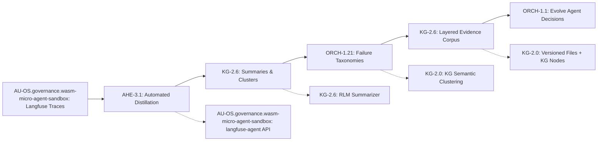
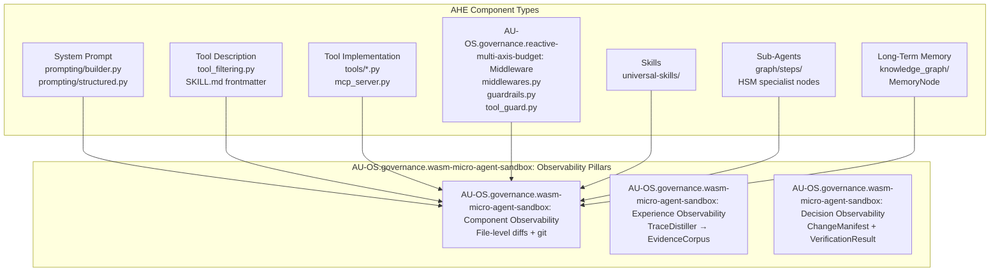
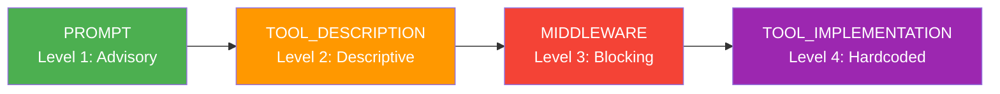

# Agentic Harness Engineering (AHE) — Architecture

> CONCEPT:AU-AHE.harness.harness-evolution — Agentic Harness Engineering

## Overview

AHE is a closed-loop optimization framework where an **Evolve Agent**
iteratively improves the agent harness — its tools, middleware, memory,
skills, sub-agents, and system prompt — guided by three pillars of
structured observability.

## Hybrid State Model

| State Layer | Implementation | Storage |
|---|---|---|
| **Epistemic** (what the agent knows) | `IntelligenceGraphEngine` + MAGMA views | `knowledge_graph.db` |
| **Normative** (what the agent is allowed to do) | Component files (prompts, middleware, tools) | Filesystem + git |
| **Causal** (what caused improvement) | Change Manifests | `.specify/manifests/` + KG |

## AHE Evolution Loop



## Component Types

AHE decomposes the harness into 7 independently editable component types:



## Constraint Hierarchy

Constraints escalate through 4 enforcement levels when violations are detected:



When a constraint is violated at the prompt level, the `ConstraintEngine`
auto-escalates it to middleware-level enforcement after the escalation
threshold is reached. This ensures the agent cannot repeatedly "forget"
important constraints.

## Package Structure

```
agent_utilities/harness/
├── __init__.py              # Package exports (CONCEPT:AU-AHE.harness.harness-evolution)
├── manifest.py              # ComponentType, ComponentEdit, ChangeManifest
├── evidence_corpus.py       # EvidenceLayer, EvidenceEntry, EvidenceCorpus
├── component_registry.py    # HarnessComponentRegistry
├── trace_backend.py         # TraceBackend ABC + Langfuse/OTel/File backends
├── evolve_agent.py          # EvolveAgent (lightweight + full modes)
├── verifier.py              # ManifestVerifier + auto-revert
└── constraint_engine.py     # ConstraintLevel, ConstraintEngine
```

## Integration Points

- **SDD Pipeline**: Manifests stored in `.specify/manifests/` alongside specs/plans
- **Knowledge Graph**: `ChangeManifest`, `ComponentEditRecord`, `EvidenceRecord`, `ConstraintState` node types
- **RLM**: `TraceDistiller` (`knowledge_graph/adaptation/trace_distiller.py`) uses RLM for deep failure analysis on massive trace data
- **Langfuse Agent**: Direct API import via `from langfuse_agent.api_client import LangfuseApi` (see `harness/trace_backend.py` `LangfuseTraceBackend`)
