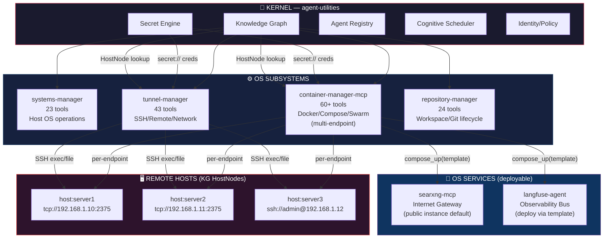
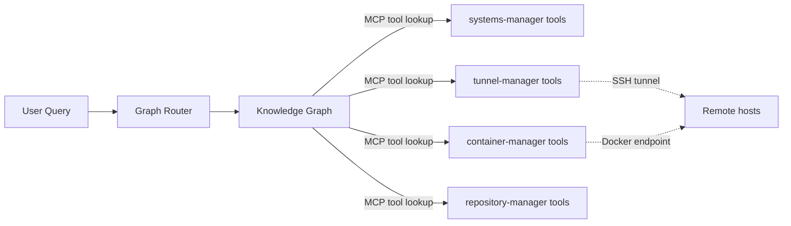
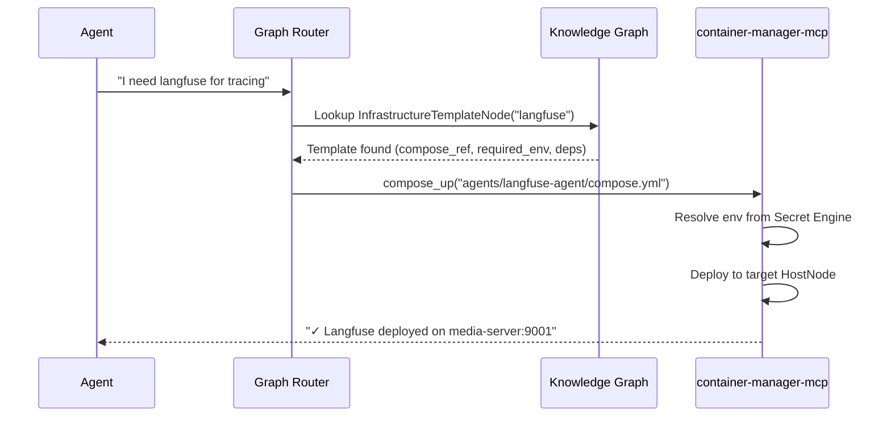
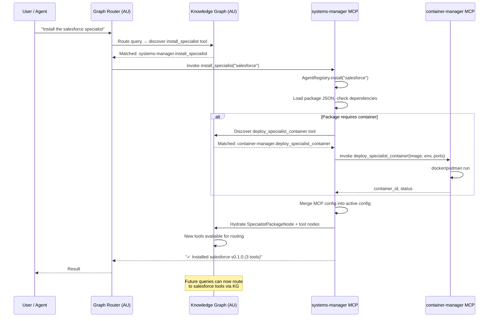
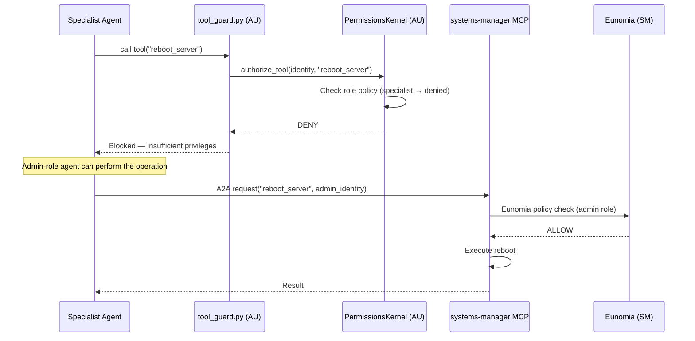

# Agent OS Architecture Reference

> How `agent-utilities` (kernel), `systems-manager` (OS layer), `container-manager-mcp` (container runtime), `tunnel-manager` (network stack), and `repository-manager` (workspace) work together as a unified Agent Operating System, with the Knowledge Graph as the routing fabric.

## Architecture Overview

The Agent OS is a multi-subsystem architecture where the Knowledge Graph drives all tool discovery, routing, and infrastructure orchestration.

### Subsystem Map



### Default Communication: MCP via KG

All MCP servers are loaded into the Knowledge Graph at startup via `sync_mcp_agents()`. The graph router discovers and invokes tools through the KG — this is the **native path**.



**Priority order**:
1. **MCP tools via KG** (default) — tools are registered in the KG and invoked directly
2. **A2A protocol** (fallback) — only for remote/networked agents

---

## Subsystem Tiers

### Tier 1: OS Subsystems (auto-installed)

These are always-on core primitives. Auto-installed on first `AgentRegistry` init.

| Subsystem | Package | Key Capabilities | # Tools |
|:---|:---|:---|:---|
| ⚙️ **OS Layer** | `systems-manager` | Host OS ops, Agent OS MCP wrappers, process/cron/services | 23+ |
| 📦 **Container Runtime** | `container-manager-mcp` | Docker/Compose/Swarm lifecycle, multi-endpoint, specialist deploy | 60+ |
| 🌐 **Network Stack** | `tunnel-manager` | SSH tunnels, remote exec, file transfer, inventory, security audit | 43 |
| 📂 **Workspace** | `repository-manager` | Git workspace mgmt, project install/build/validate, dep graphs | 24 |

### Tier 2: OS Services (deploy-on-demand)

External dependencies that can be deployed via Infrastructure Templates.

| Service | Package | Default Behavior |
|:---|:---|:---|
| 🔍 **Internet Gateway** | `searxng-mcp` | Uses random public instance — no deployment required |
| 📊 **Observability** | `langfuse-agent` | Deployed via compose template when observability is requested |

### Tier 3: Domain Specialists (27 packages)

Available in the default catalog for on-demand install. See [agent-registry.md](../1_graph_orchestration/agent-registry.md) for the full package table.

---

## Functional Boundaries

### Layer 1: `agent-utilities` — The Kernel

Pure Python library. Owns all models, logic, graph orchestration, and KG. **Never runs as a standalone server.**

| Responsibility | Module | Concept |
|:---|:---|:---|
| Scheduler logic | `core/cognitive_scheduler.py` | CONCEPT:OS-5.2 |
| Identity & policy logic | `security/permissions_kernel.py` | CONCEPT:OS-5.2 |
| Registry logic + default catalog | `core/registry_cli.py` + `core/default_catalog.py` | CONCEPT:OS-5.2 |
| File watcher | `automation/file_watcher.py` | CONCEPT:OS-5.0 |
| Maintenance cron | `automation/maintenance_cron.py` | CONCEPT:OS-5.2 |
| KG models (incl. HostNode) | `models/knowledge_graph.py` | CONCEPT:KG-2.0 |
| Infrastructure templates | `core/infrastructure_templates.py` | NEW |
| Tool guard | `security/tool_guard.py` | CONCEPT:ORCH-1.0 |
| Self-model + ACO | `knowledge_graph/self_model.py` | CONCEPT:KG-2.1 |

### Layer 2: `systems-manager` — The OS Layer

MCP server + CLI for host-level operations. Exposes Agent OS kernel operations as **privileged MCP tools** by importing from `agent-utilities`.

| Tool Group | # Tools | Wraps |
|:---|:---|:---|
| Identity management | 4 | `PermissionsKernel` |
| Policy management | 4 | `PermissionsKernel` |
| Specialist registry | 4 | `AgentRegistry` |
| Agent health | 4 | `CognitiveScheduler` |
| File watcher | 3 | `FileWatcher` |
| Maintenance scheduling | 4 | `MaintenanceCron` |
| *Plus 67 existing OS tools* | 67 | Native |

### Layer 3: `container-manager-mcp` — The Container Runtime

MCP server + CLI for container runtime operations. Supports multi-endpoint targeting — can manage Docker daemons on multiple remote hosts.

| Tool Group | # Tools | Purpose |
|:---|:---|:---|
| Specialist deployment | 4 | Containerized specialist lifecycle |
| Infrastructure templates | N/A | Deploy compose-based services on-demand |
| *Plus 32 existing container tools* | 32 | Native Docker/Podman ops |

**Multi-endpoint support**: Uses Docker SDK's native `DOCKER_HOST` env var, which supports `tcp://`, `ssh://`, and `unix://` connections. Can also discover Docker hosts via KG `HostNode` entries.

### Layer 4: `tunnel-manager` — The Network Stack

MCP server + CLI for SSH-based remote operations. Not required for container access (container-manager-mcp handles that natively), but essential for general remote ops.

| Tool Group | Purpose |
|:---|:---|
| Host inventory | Manage SSH hosts as Pydantic-native `HostNode` entries in KG |
| Remote execution | Run commands on remote hosts |
| File transfer | Send/receive files via SFTP |
| Network topology | Discover and map network structure |
| Security audit | SSH config audit and key management |

### Layer 5: `repository-manager` — The Workspace

MCP server + CLI for git workspace lifecycle management.

| Tool Group | Purpose |
|:---|:---|
| Git operations | Clone, pull, push, branch, merge |
| Workspace management | Multi-repo workspace setup and validation |
| Dependency graphs | Build and query project dependency trees |
| Project lifecycle | Install, build, test, validate projects |

---

## KG Host Nodes

Remote hosts are first-class KG citizens via `HostNode`. Credentials are resolved through the `secret://` engine — passwords and keys are never stored in plaintext.

```python
HostNode(
    id="host:media-server",
    name="media-server",
    hostname="192.168.1.10",
    alias="media-server",
    user="admin",
    credential_ref="secret://hosts/media-server/password",
    identity_file_ref="secret://hosts/media-server/identity",
    docker_endpoint="tcp://192.168.1.10:2375",
    docker_host=True,
    swarm_role="manager",
    container_manager_url="http://192.168.1.10:9050",
    labels={"role": "media", "location": "rack-2"},
)
```

### How Hosts Are Used

1. **container-manager-mcp** queries KG for `node_type=host AND docker_host=true`, targets `docker_endpoint` per-operation
2. **tunnel-manager** queries KG for any `HostNode`, resolves `credential_ref` via Secret Engine, connects via SSH
3. **systems-manager** health checks poll `HostNode.last_seen` and update `health_status`
4. **Infrastructure Templates** deploy to a specific host by targeting its `docker_endpoint`

---

## Infrastructure Templates

Every agent package ships a `compose.yml`. These become **Infrastructure Templates** — blueprints that `container-manager-mcp` can reference to scaffold dependencies on-demand.



### Template Resolution

```
Agent needs langfuse → KG lookup → InfrastructureTemplateNode found
  → Check deps: needs postgres? → Deploy postgres template first
  → Resolve env: secret://langfuse/token → Secret Engine
  → Pick target host: KG query docker_host=true
  → container-manager-mcp.compose_up(template.compose_ref)
```

---

## KG-Driven Specialist Installation

The canonical flow. The Knowledge Graph drives tool discovery, routing, and hydration:



After installation, the new specialist's tools are **immediately discoverable** by the graph router. No restart required.

---

## Identity-Based Authorization Flow

How the Permissions Kernel (CONCEPT:OS-5.2) enforces role-based access across the OS layer:



**Deny takes precedence** over a generic wildcard allow. Only explicit non-wildcard allow patterns can override denials. See [permissions-kernel.md](../5_agent_os_infrastructure/permissions-kernel.md) for the full policy schema.

---

## Default Catalog

The Agent Registry ships 38 packages out-of-the-box via `default_catalog.py`:

| Category | Count | Auto-installed? |
|:---|:---|:---|
| OS Subsystems | 4 | ✅ Yes |
| OS Services | 2 | ❌ Available |
| Domain Specialists | 27 | ❌ Available |
| Community MCPs | 5 | ❌ Available |

OS subsystems are auto-installed on first `AgentRegistry.__init__()`. All others are placed in `available/` for on-demand install via `specialist_install`.

Use `reseed_defaults()` to refresh the available catalog (like `apt update`).

---

## Responsibility Matrix

| Capability | agent-utilities | systems-manager | container-manager-mcp | tunnel-manager | repository-manager |
|:---|:---:|:---:|:---:|:---:|:---:|
| **KG routing fabric** | ✅ Owner | — | — | — | — |
| **Scheduler logic** (CONCEPT:OS-5.2) | ✅ Owner | — | — | — | — |
| **Scheduler MCP tools** | — | ✅ Owner | — | — | — |
| **Identity/Policy logic** (CONCEPT:OS-5.2) | ✅ Owner | — | — | — | — |
| **Identity/Policy MCP tools** | — | ✅ Owner | — | — | — |
| **Registry logic + catalog** (CONCEPT:OS-5.2) | ✅ Owner | — | — | — | — |
| **Registry MCP tools** | — | ✅ Owner | — | — | — |
| **Container lifecycle** | — | — | ✅ Owner | — | — |
| **Compose/Swarm orchestration** | — | — | ✅ Owner | — | — |
| **Specialist container deploy** | — | — | ✅ Owner | — | — |
| **Infrastructure templates** | ✅ Models | — | ✅ Executor | — | — |
| **SSH remote operations** | — | — | — | ✅ Owner | — |
| **Host inventory (KG HostNodes)** | ✅ Models | — | Consumer | ✅ Writer | — |
| **File transfer** | — | — | — | ✅ Owner | — |
| **Git operations** | — | — | — | — | ✅ Owner |
| **Workspace management** | — | — | — | — | ✅ Owner |
| **Dependency graphs** | — | — | — | — | ✅ Owner |
| Process/service/cron OS ops | — | ✅ Owner | — | — | — |
| Firewall/SSH/users | — | ✅ Owner | — | — | — |
| Eunomia RBAC enforcement | — | ✅ Both | ✅ Both | — | — |

---

## Future Architecture Concepts

### DevOps Integration (gitlab-api + github-agent)

The `repository-manager` handles git primitives. The `gitlab-api` and `github-agent` packages provide the platform layer — issues, merge requests, pipelines, code review. With codebases ingested into the KG, linking issues to code nodes (`IssueNode --affects--> CodeNode`) enables full traceability.

### KG Extension Packs

Each MCP repo could ship a `kg_extension/` module with domain ontology (OWL/Pydantic node types + relationships). When a specialist is installed via `AgentRegistry.install()`, the extension auto-hydrates the KG with domain-specific schema. Example: `from servicenow_api.kg_extension import register_ontology`.

---

## Related Documentation

- [Cognitive Scheduler (CONCEPT:OS-5.2)](../5_agent_os_infrastructure/cognitive-scheduler.md)
- [Permissions Kernel (CONCEPT:OS-5.2)](../5_agent_os_infrastructure/permissions-kernel.md)
- [Agent Registry (CONCEPT:OS-5.2)](../1_graph_orchestration/agent-registry.md)
- [Overview & Concept Galaxy](overview.md)
