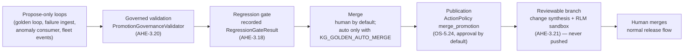

# Enabling Autonomous Evolution

The platform's self-evolution arcs are fully wired but **off by default**: the
daemon ticks for the golden loop (`KG-2.7`) and failure-driven evolution
(`AHE-3.18`) are registered in the engine's maintenance scheduler, yet their
flags default to `False` in code. That is deliberate — turning a fleet
autonomous is a *deployment* decision, made in your `.env`, never a library
default.

This guide describes the safety chain you get when you turn the loops on, and
exactly which flags do what.

## The safety chain

Every autonomous change passes four independent stages, each of which can stop
it:



1. **Propose-only loops.** The golden loop, the failure-evolution sweep, the
   PerformanceAnomaly consumer (`AHE-3.19`) and fleet-event triage
   (`OS-5.15`) only ever *write proposals*: `failure_gap` Concept topics, spec
   drafts under `.specify/`, and `TeamSpec`/`AgentSpec` proposal nodes. No
   code executes, nothing is promoted.
2. **Governed validation.** `GovernedAutoMerger` now constructs the
   *production* `PromotionGovernanceValidator` by default
   (`knowledge_graph/research/promotion_governance.py`). A promotion candidate
   must clear all four rules: MergePolicy quality thresholds, the bundled
   SHACL governance shapes (`shapes/governance.shapes.ttl`), the recorded
   regression-gate verdict, and active constitution `forbid` rules in the KG.
3. **Regression gate.** Failure remediations carry a live regression check
   bound to the failures they address; every verdict is also persisted as a
   `RegressionGateResult` node, and a recorded `hold` blocks promotion until a
   later gate run records a `pass`.
4. **Human merge.** With `KG_GOLDEN_AUTO_MERGE` unset (the default), even a
   proposal that passes every gate stays proposal-only; promotion is a human
   act. Flipping it on delegates only the *final* step — to the governed,
   audited path above, with every decision logged through the
   `golden_loop.auto_merge` audit trail.
5. **Publication as a reviewable branch (`AHE-3.21`).** Promotion used to end
   at a KG lifecycle flip. The evolution→branch bridge closes that gap: a
   *merged* proposal is materialized into a concrete change set and published
   as a **local git branch** — gated by the operational `ActionPolicy`'s
   reserved `merge_promotion` action kind (`OS-5.24`), which ships
   `approval_required`. Nothing is ever pushed or merged to `main`; a human
   reviews the branch and takes it through the normal release flow.

## The evolution→branch bridge (AHE-3.21)

Two modules under `knowledge_graph/research/` implement the bridge:

* **`change_synthesis.py`** — materializes a promoted proposal into a
  `ChangeSet`, with **no LLM calls** (generation belongs to the golden loop's
  synthesize/distill stages):
  * a proposal that embeds explicit file artifacts (`files` /
    `files_json` = `[{"path", "content"}, ...]`) becomes a `kind="code"`
    change set, validated through the tiered RLM sandbox (`ORCH-1.38`):
    per-file syntax compile + best-effort import. Proposal-named tests
    (`tests` / `tests_json`) are run later in the publisher's worktree, where
    the full repository context exists — a snippet sandbox cannot run
    repo-relative pytest (an honest v1 limit). Sandbox-invalid change sets
    are never published.
  * a prose-only proposal (most SpecDrafts/TeamSpecs) becomes a
    `kind="sdd_plan"` change set: an SDD skeleton under
    `.specify/specs/<topic>/` (`spec.md` + `tasks.md`). For prose, that
    skeleton **is** the reviewable artifact.
* **`change_publisher.py`** — the publication seam. `ChangePublisher` is a
  protocol (`publish(change_set, metadata) -> PublishResult`); the default
  `LocalBranchPublisher` uses plain `git`: it adds a **fresh worktree** off
  the target repo's default branch under `EVOLUTION_WORKTREE_ROOT` (default
  `data_dir()/evolution_worktrees` — never a checkout's working tree),
  applies the change set, runs proposal-named tests + the injected
  regression gate (`make_regression_check`, `AHE-3.18`), and commits citing
  the proposal + concept ids. The result (branch, sha, gate verdict) is
  recorded as a `ProposalPublication` node linked `PUBLISHED_AS` from the
  proposal, stamped onto the proposal node, and mirrored into
  `ActionExecution` + the `golden_loop.publish_proposal` audit trail.

### The human workflow (approve → publish → merge)

1. A proposal merges through the governed chain (or you decide to publish a
   promoted one). The bridge consults the ActionPolicy; with the shipped
   policy the `merge_promotion` action **queues an approval** — visible in
   `GET /api/fleet/approvals`.
2. A human grants it: `POST /api/fleet/approvals/grant` with the approval's
   `job_id`. (Granted `merge_promotion` approvals are deliberately *not*
   drained by the fleet reconciler — they belong to the bridge.)
3. The human (or any agent surface) triggers the one-shot publication:
   `graph_orchestrate(action="publish_proposal", task="<proposal node id>")`
   over MCP, or REST `POST /api/graph/orchestrate/publish-proposal` with
   `{"proposal_id": "..."}`. The granted approval is consumed; the change set
   is synthesized, sandbox-validated, and published as a local branch.
4. Review the branch (`PublishResult.worktree_path` / `branch` on the
   proposal node), then merge + release through the normal flow
   (workspace-validator phased `auto_push`). The bridge never pushes.

A deployment that wants zero manual steps can relax the tier with a KG
override — `governance_rule {scope: 'action_policy', kind: 'merge_promotion',
tier: 'auto'}` — at which point a merged proposal publishes its branch
immediately (still local, still human-merged).

### Wiring an MCP-backed publisher

agent-utilities takes no hard dependency on repository-manager. A deployment
that wants publication to flow through its repo tooling (e.g. the
`rm_git`/`rm_worktree` MCP tools, which can also open a hosted PR) registers
its own publisher at startup — same seam pattern as `set_fleet_actuator`:

```python
from agent_utilities.knowledge_graph.research.change_publisher import (
    PublishResult, set_change_publisher,
)

class RepositoryManagerPublisher:
    name = "repository_manager"

    def __init__(self, mcp_call):  # e.g. a bound multiplexer client
        self._call = mcp_call

    def publish(self, change_set, metadata=None):
        # rm_worktree: create a worktree + branch; rm_git: apply/commit (and
        # optionally push + open a PR — that policy lives in the deployment,
        # not in agent-utilities).
        ...
        return PublishResult(ok=True, branch=..., commit_sha=..., repo_path=...)

set_change_publisher(RepositoryManagerPublisher(mcp_call))
```

## Flags

All flags are typed `AgentConfig` fields (see
[Configuration](configuration.md)); set them in the deployment `.env` (see the
commented blocks in `.env.example` and `docker/mcp.compose.yml`).

| Flag | Default | Effect |
| --- | --- | --- |
| `KG_GOLDEN_LOOP` | `false` | Hourly propose-only self-evolution cycle (intake → acquire → resolve → distill/synthesize proposals). |
| `KG_GOLDEN_LOOP_INTERVAL` / `KG_GOLDEN_LOOP_TOPICS` | `3600` / `5` | Tick cadence and per-cycle topic budget. |
| `KG_FAILURE_EVOLUTION` | `false` | Pull Langfuse failures → `failure_gap` topics → regression-gated remediation cycle. |
| `KG_FAILURE_EVOLUTION_INTERVAL` / `KG_FAILURE_EVOLUTION_WINDOW` | `3600` / `86400` | Tick cadence and telemetry look-back. |
| `KG_ANOMALY_CONSUMER` | `true` | Consume unconsumed `PerformanceAnomaly` nodes into `failure_gap` topics (cheap, LLM-free, propose-only — on by default). |
| `KG_GOLDEN_AUTO_MERGE` | `false` | Allow governed proposal→active promotion. Keep `false` until you trust the proposal stream. |
| `KG_GOLDEN_MERGE_THRESHOLD` | `0.85` | Minimum proposal quality score for auto-merge eligibility. |
| `EVOLUTION_WORKTREE_ROOT` | `data_dir()/evolution_worktrees` | Where the `AHE-3.21` bridge creates fresh git worktrees when publishing a promoted proposal as a local branch. |
| `FLEET_EVENTS_TOKEN` | unset | Shared secret for the `POST /api/fleet/events` monitoring-webhook ingress (`OS-5.15`). |
| `FLEET_RECONCILER` | `false` | Desired-state fleet reconciler tick — registry vs observed, converged through the `OS-5.24` ActionPolicy gate (see [Fleet Autonomy](../architecture/fleet_autonomy.md)). |
| `ACTION_POLICY_PATH` | shipped default | Operational action policy (tiers / rate limits / maintenance windows / blast-radius caps); the shipped default keeps every mutating action approval-required (`OS-5.24`). |

## Recommended rollout

1. Enable `KG_GOLDEN_LOOP=true` and `KG_FAILURE_EVOLUTION=true` and watch the
   proposal stream (`EvolutionCycle` nodes, `failure_gap` Concepts, audit log)
   for a few cycles. Nothing merges.
2. Point Alertmanager / Uptime Kuma at `POST /api/fleet/events` (set
   `FLEET_EVENTS_TOKEN`) so production incidents also feed the loop. Critical
   events now dispatch the `OS-5.26` remediation playbooks — with the shipped
   action policy every mutating step lands in `GET /api/fleet/approvals`
   instead of executing.
3. Only once the proposals are consistently sane, consider
   `KG_GOLDEN_AUTO_MERGE=true`. Every promotion remains gated by the
   `AHE-3.20` validator + regression gate and is fully audited; rejected
   proposals stay proposal-only for human review.
4. With auto-merge on, merged proposals additionally queue a
   `merge_promotion` approval (`AHE-3.21`). Work the approve → publish →
   merge loop above; only relax the tier to `auto` once you trust the
   published branches — even then nothing is pushed without a human.

## Closing the loop: generate, verify, ratchet (AHE-3.22 / AHE-3.23 / AHE-3.24)

Through `AHE-3.21` the loop could *branch* a code change, but nothing on the live
path ever **generated** the diff — every real proposal fell back to the prose SDD
skeleton and a human wrote the code. These three concepts close that gap; together
they turn "branch a change" into "branch a **verified, capability-ratcheted**
change". All three sit inside the existing `governed_publish` flow, so the OS-5.24
`merge_promotion` ActionPolicy gate (default: human approval queue) still fronts
everything — nothing here can auto-merge or push.

- **AHE-3.22 — autonomous code-synthesis** (`research/code_synthesis.py`). Before
  synthesis, for a proposal that names a resolvable, existing, repo-relative `.py`
  target and carries no embedded files, a single-file generator reads that file and
  emits a `{path, content}` edit, fed into the **unchanged**
  `synthesize_change_set → validate_in_sandbox → publisher` pipeline via the new
  `extra_files` seam. Safety envelope: single attributed `.py` file only;
  un-attributed proposals fall through to the prose skeleton exactly as before; the
  generated file is sandbox-validated (a broken diff is never branched); the default
  generator self-degrades to "no edit" when no model is reachable. The LLM call lives
  in `code_synthesis.py` — `change_synthesis.py` stays generation-free.

- **AHE-3.24 — capability ratchet** (`research/capability_ratchet.py`). After a
  branch is published, a standing capability suite is run **in that worktree**,
  producing a per-capability score vector compared against a persisted
  `CapabilityScoreVector` baseline node. Every tracked capability must stay
  at-or-above baseline (monotone ratchet); a passing run advances the baseline, the
  first run bootstraps it. A worktree with no probes present is *not measured* and
  never blocks. The recorded `CapabilityRatchetResult` is consulted by the `AHE-3.20`
  promotion-governance gate as an additional predicate.

- **AHE-3.23 — verified apply→verify→rollback**. The keep/abandon decision is the
  authoritative recommendation from the existing `ManifestVerifier`
  (`confirm` / `partial_revert` / `full_revert`, derived from the measured benchmark
  delta), fed the ratchet's before/after scores. On a `*_revert` recommendation — or
  any per-capability regression — `governed_publish` **abandons the branch**
  (`git worktree remove` + `branch -D`); since the branch was never pushed, the
  publication is fully undone. The probe set (`DEFAULT_CAPABILITY_TARGETS`) is tunable.
