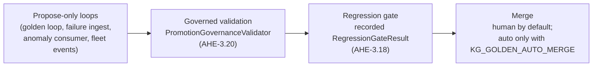

# Enabling Autonomous Evolution

The platform's self-evolution arcs are fully wired but **off by default**: the
daemon ticks for the golden loop (`KG-2.7`) and failure-driven evolution
(`AHE-3.18`) are registered in the engine's maintenance scheduler, yet their
flags default to `False` in code. That is deliberate — turning a fleet
autonomous is a *deployment* decision, made in your `.env`, never a library
default.

This guide describes the safety chain you get when you turn the loops on, and
exactly which flags do what.

## The safety chain

Every autonomous change passes four independent stages, each of which can stop
it:

1. **Propose-only loops.** The golden loop, the failure-evolution sweep, the
   PerformanceAnomaly consumer (`AHE-3.19`) and fleet-event triage
   (`OS-5.15`) only ever *write proposals*: `failure_gap` Concept topics, spec
   drafts under `.specify/`, and `TeamSpec`/`AgentSpec` proposal nodes. No
   code executes, nothing is promoted.
2. **Governed validation.** `GovernedAutoMerger` now constructs the
   *production* `PromotionGovernanceValidator` by default
   (`knowledge_graph/research/promotion_governance.py`). A promotion candidate
   must clear all four rules: MergePolicy quality thresholds, the bundled
   SHACL governance shapes (`shapes/governance.shapes.ttl`), the recorded
   regression-gate verdict, and active constitution `forbid` rules in the KG.
3. **Regression gate.** Failure remediations carry a live regression check
   bound to the failures they address; every verdict is also persisted as a
   `RegressionGateResult` node, and a recorded `hold` blocks promotion until a
   later gate run records a `pass`.
4. **Human merge.** With `KG_GOLDEN_AUTO_MERGE` unset (the default), even a
   proposal that passes every gate stays proposal-only; promotion is a human
   act. Flipping it on delegates only the *final* step — to the governed,
   audited path above, with every decision logged through the
   `golden_loop.auto_merge` audit trail.

## Flags

All flags are typed `AgentConfig` fields (see
[Configuration](configuration.md)); set them in the deployment `.env` (see the
commented blocks in `.env.example` and `docker/mcp.compose.yml`).

| Flag | Default | Effect |
| --- | --- | --- |
| `KG_GOLDEN_LOOP` | `false` | Hourly propose-only self-evolution cycle (intake → acquire → resolve → distill/synthesize proposals). |
| `KG_GOLDEN_LOOP_INTERVAL` / `KG_GOLDEN_LOOP_TOPICS` | `3600` / `5` | Tick cadence and per-cycle topic budget. |
| `KG_FAILURE_EVOLUTION` | `false` | Pull Langfuse failures → `failure_gap` topics → regression-gated remediation cycle. |
| `KG_FAILURE_EVOLUTION_INTERVAL` / `KG_FAILURE_EVOLUTION_WINDOW` | `3600` / `86400` | Tick cadence and telemetry look-back. |
| `KG_ANOMALY_CONSUMER` | `true` | Consume unconsumed `PerformanceAnomaly` nodes into `failure_gap` topics (cheap, LLM-free, propose-only — on by default). |
| `KG_GOLDEN_AUTO_MERGE` | `false` | Allow governed proposal→active promotion. Keep `false` until you trust the proposal stream. |
| `KG_GOLDEN_MERGE_THRESHOLD` | `0.85` | Minimum proposal quality score for auto-merge eligibility. |
| `FLEET_EVENTS_TOKEN` | unset | Shared secret for the `POST /api/fleet/events` monitoring-webhook ingress (`OS-5.15`). |

## Recommended rollout

1. Enable `KG_GOLDEN_LOOP=true` and `KG_FAILURE_EVOLUTION=true` and watch the
   proposal stream (`EvolutionCycle` nodes, `failure_gap` Concepts, audit log)
   for a few cycles. Nothing merges.
2. Point Alertmanager / Uptime Kuma at `POST /api/fleet/events` (set
   `FLEET_EVENTS_TOKEN`) so production incidents also feed the loop.
3. Only once the proposals are consistently sane, consider
   `KG_GOLDEN_AUTO_MERGE=true`. Every promotion remains gated by the
   `AHE-3.20` validator + regression gate and is fully audited; rejected
   proposals stay proposal-only for human review.
