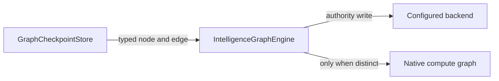
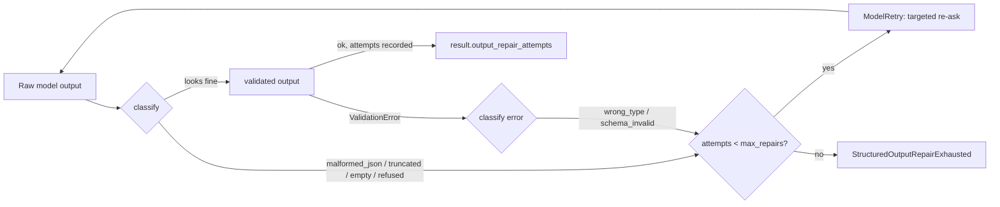

# Capabilities (Self-Healing Patterns)

> CONCEPT:AU-ORCH.adapter.hot-cache-invalidation — Resilient Agent Capabilities

## Overview

The `capabilities/` module provides self-healing and resilience patterns that the agent uses to maintain stability during long-running sessions. These are cross-cutting concerns that augment any agent's behavior.

## Components

### Checkpointing (`capabilities/checkpointing.py`)

Captures full conversation snapshots (`Checkpoint`) at tool and turn boundaries, enabling cross-process session fork, rewind, and resumability. **(HSM Concept: State Snapshot)**

Checkpoints are written through a pluggable `CheckpointStore` (`InMemoryCheckpointStore`, `FileCheckpointStore`, or `GraphCheckpointStore` for KG persistence) and wired into the agent run loop by `CheckpointMiddleware` / `CheckpointToolset`.
`GraphCheckpointStore` writes through the graph engine's typed `add_node` and
`add_edge` seams. They materialize the canonical `node_type=checkpoint` and
`relationship=SNAPSHOT_OF` properties, persist the configured backend first, and
avoid duplicate writes when the native compute graph is itself the authority.



```python
from agent_utilities.capabilities.checkpointing import (
    Checkpoint,
    GraphCheckpointStore,
)

store = GraphCheckpointStore(engine)
cp = Checkpoint(id="cp_3", label="step_3", turn=3, messages=current_messages)
await store.save(cp)

# On failure recovery:
restored = await store.get("cp_3")
```

### Context Window Warnings (`capabilities/context_warnings.py`)

`ContextLimitWarner` monitors token usage and injects warnings when the context window is approaching its limit, helping the model decide when to wrap up or be concise.

- **Token tracking**: Estimates context usage against the model's token limit
- **Warning thresholds**: `warn_at` (URGENT, default 70%) and `critical_at` (CRITICAL, default 90%)
- **Graph persistence**: CRITICAL breaches are recorded in the Knowledge Graph

### Eviction (`capabilities/eviction.py`)

Implements `ToolOutputEviction`, which intercepts massive tool outputs (above a size threshold), offloads them to the Knowledge Base, and leaves a concise preview in the message history. This keeps the working context lean during long, tool-heavy conversations.

### Structured-Output Repair (`capabilities/output_repair.py`)

> CONCEPT:AU-AHE.harness.structured-output-repair

`StructuredOutputRepair` classifies every structured (schema-validated) output
failure into an explicit taxonomy — `malformed_json`, `schema_invalid`,
`truncated`, `refused`, `empty`, `wrong_type`, `budget_exceeded_mid_output` —
and drives a **bounded** classify-then-repair loop instead of letting
pydantic-ai's undifferentiated `ValidationError`/`ModelRetry` bounce hide *why*
a run needed a retry:

- **Pre-validation classification** (`before_output_validate`): malformed
  JSON, truncation, an empty response, or an outright textual refusal are all
  still visible as raw text before pydantic-ai attempts to parse them.
- **Post-validation classification** (`on_output_validate_error`): a
  pydantic `ValidationError` is split into `wrong_type` (a value's type was
  wrong but the shape was right) vs `schema_invalid` (a structural mismatch).
- **Bounded retry** (`max_repairs`, default 2): each classified failure gets
  ONE targeted, classification-specific re-ask; exhausting the bound raises
  the typed `StructuredOutputRepairExhausted` — never an unbounded retry
  storm, never pydantic-ai's own generic `UnexpectedModelBehavior`.
- **Truthful provenance**: every attempt (classification + what was tried) is
  recorded, and a successful repair stamps `output_repair_attempts` onto the
  `AgentRunResult` (a failed one stamps it onto the propagated exception) — a
  caller holding either can never read a repaired run back as a clean first-try
  success. Note this is caller-level visibility only: the persisted RunTrace/KG
  record does not read the field yet (D-W15-13).
- **Budget exhaustion is never retried** (`on_run_error`): `UsageLimitExceeded`
  mid-output or an upstream `ContentFilterError` refusal is recorded but
  always propagated — repairing a budget violation would only spend more of
  the budget that already tripped.

Wired default-ON (`capabilities/composition.py`), it also bumps the
underlying Agent's `retries={"output": max_repairs}` so pydantic-ai's own
retry budget never pre-empts this module's classified exhaustion path
(`output_repair_retries`). It is a pure no-op for the many agents whose
`output_type` is plain text — the underlying hooks never fire for
unstructured output.



### Hooks (`capabilities/hooks.py`)

Lifecycle hooks (`HooksCapability`) fire at key `HookEvent` points in agent execution. Each hook receives a `HookInput` and may return a `HookResult` to modify args/results or cancel a tool call:

- `BEFORE_RUN`: Beginning of an agent run
- `AFTER_RUN`: End of an agent run
- `PRE_TOOL_USE`: Before tool execution
- `POST_TOOL_USE`: After a successful tool execution
- `POST_TOOL_USE_FAILURE`: After a tool execution raises

### Stuck-Loop Detection (`capabilities/stuck_loop.py`)

Detects when an agent is repeating the same actions without progress:

- **Repetition detection**: Identifies duplicate tool calls or responses
- **Escalation**: After N repeated patterns, forces a strategy change
- **Circuit breaker**: Terminates the loop after configurable max retries **(HSM Concept: Guard Condition)**

### Teams (`capabilities/teams.py`)

`TeamCapability` provides multi-agent coordination primitives:

- **Shared task management**: A shared todo list (`SharedTodoItem`) coordinated across team members
- **P2P messaging**: `message_member()` routes messages to a team member over ACP, falling back to A2A
- **TeamConfig Promotion (CONCEPT:AU-AHE.evaluation.interpretability-tests)**: Successful coalitions are persisted as reusable `TeamConfigNode` templates in the Knowledge Graph. See [first-principles.md](first-principles.md) for details on proven team reuse and reward tracking.

---

## AgentCapability Type System (CONCEPT:AU-ORCH.adapter.hot-cache-invalidation)

> See also: [First Principles Architecture](first-principles.md) for the complete CONCEPT:AU-ORCH.adapter.hot-cache-invalidation deep-dive.

The AgentCapability system extends the static tool-binding model with dynamic, condition-based capability activation. Capabilities are modeled as first-class Knowledge Graph nodes (`AgentCapabilityNode`) with trigger conditions that are evaluated at execution time.

### How It Works

1. Capabilities are registered in the KG with `auto_activate=true` and `trigger_conditions`
2. Before each specialist execution, the executor queries for capabilities linked via `HAS_CAPABILITY` edges
3. If trigger conditions are met (e.g., input > 5000 chars), the capability handler is activated

### Example Capabilities

| Capability | Trigger | Effect |
|-----------|---------|--------|
| RLM (Recursive LM) | `input_size_gt: 5000` | Decomposes large inputs into recursive sub-problems |
| Critic | `domain: code` | Adds code review step before final output |
| Summarizer | `tool_count_gt: 20` | Compresses specialist context before LLM call |

---

## Registry Hot Cache (CONCEPT:AU-ORCH.adapter.hot-cache-invalidation)

> See also: [Registry Cache Deep-Dive](registry-cache.md) for the complete architecture.

The Registry Hot Cache provides session-scoped O(1) specialist lookups, replacing the previous O(N) full-registry scan on every routing call. Key features:

- **Filtered specialist injection**: Only the top-7 relevant specialists are injected into the LLM prompt, reducing token consumption by ~7x
- **Event-driven invalidation**: Cache invalidates on MCP reload, pipeline completion, Self-Model updates, and TeamConfig promotions
- **Zero TTL risk**: No time-based expiry — invalidation only fires when underlying data changes

### Integration with Routing

The router uses `get_relevant_specialists(query, engine)` instead of the full registry, ensuring:

1. The LLM sees fewer, more relevant specialist descriptions
2. Routing accuracy improves due to reduced prompt noise
3. Latency decreases from eliminated registry scans
