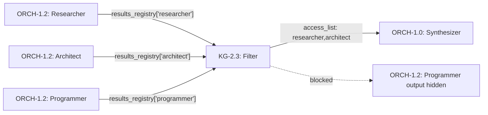
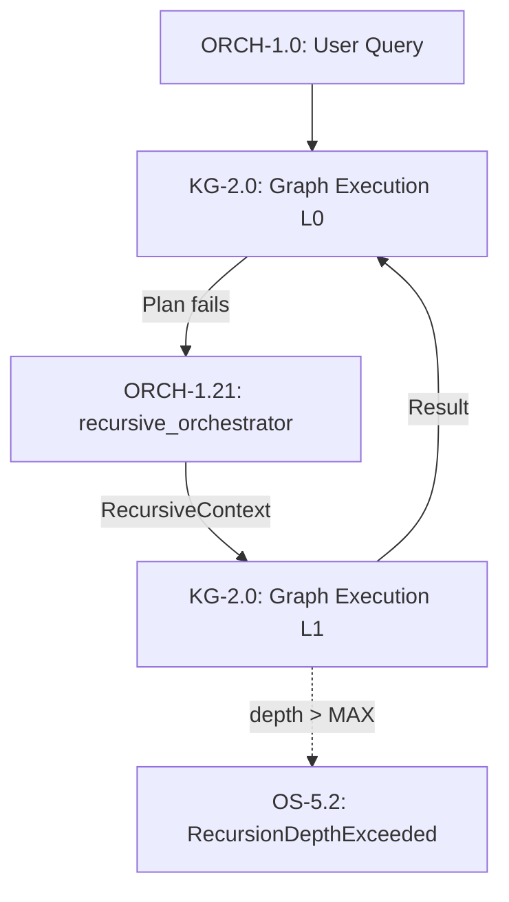

# Conductor Orchestration (CONCEPT:ORCH-1.1 to CONCEPT:ORCH-1.1)

> **Source**: *"Learning to Orchestrate Agents in Natural Language with the Conductor"* — Nielsen et al., ICLR 2026, Sakana AI

This document describes four architectural concepts inspired by the RL Conductor paper that enhance the agent-utilities orchestration pipeline with refined subtask decomposition, context isolation, model synergy tracking, and recursive self-referential graph execution.

## CONCEPT:ORCH-1.1: Conductor Workflow Specification

**Module**: `agent_utilities/models/graph.py` — `ExecutionStep.refined_subtask`

### Motivation

In the original orchestration pipeline, each specialist receives the raw user query verbatim. The Conductor paper demonstrates that a trained policy generates focused, specialist-specific sub-instructions that significantly outperform raw query forwarding.

### Design

The `refined_subtask` field on `ExecutionStep` carries a natural-language instruction crafted by the router/planner for each specific specialist:

```python
ExecutionStep(
    node_id="python_programmer",
    refined_subtask="Implement a FastAPI REST API with JWT authentication middleware",
    access_list=["researcher"],  # CONCEPT:ORCH-1.1: only sees researcher output
)
```

**Executor preference chain**: `refined_subtask` → `input_data` → `state.query`

### Router Integration

The router's system prompt now includes CONCEPT:ORCH-1.1 instructions:

> For EACH step in your plan, include a `refined_subtask` — a focused,
> specific instruction tailored for that specialist.

---

## CONCEPT:ORCH-1.1: Execution Visibility Graph

**Module**: `agent_utilities/graph/executor.py` — `_resolve_access_context()`

### Motivation

The Conductor paper defines an `access_list` per workflow step that controls which prior step outputs are visible. This prevents context pollution where a specialist receives irrelevant information from unrelated prior steps.

### Design

The `access_list` field on `ExecutionStep` supports three modes:

| Access List | Behavior |
|:---|:---|
| `[]` (empty) | No prior results shared |
| `["all"]` | Full `results_registry` injected |
| `["researcher", "architect"]` | Only matching results injected |

### Data Flow



### Helper Function

```python
def _resolve_access_context(
    step: ExecutionStep,
    results_registry: dict[str, Any],
) -> str:
    """Filter results_registry based on step's access_list."""
```

---

## CONCEPT:AHE-3.3: Model Synergy Tracker

**Module**: `agent_utilities/knowledge_graph/self_model.py`

### Motivation

When multiple models collaborate in a session, certain combinations consistently outperform others. The Conductor paper's adaptive worker pool selection inspires tracking which model combinations work best together.

### Design

The `model_synergies` field on `SelfModelNode` stores sorted, pipe-delimited model combination keys with EMA success rates:

```python
model_synergies = {
    "gpt-4o|claude-sonnet": 0.85,    # Strong combination
    "gemini-2.5|llama-3": 0.45,       # Weak combination
}
```

### EMA Update Rule

```
new_rate = α × session_success + (1 - α) × old_rate
```

Where `α = 0.3` and `session_success ∈ {0.0, 1.0}`.

### Query Interface

```python
synergies = self_model.get_best_synergies(
    available_models=["gpt-4o", "claude-sonnet", "gemini-2.5"],
    top_k=3,
)
# Returns: [("gpt-4o|claude-sonnet", 0.85), ...]
```

---

## CONCEPT:ORCH-1.1: Recursive Graph Orchestration

**Module**: `agent_utilities/graph/recursive_executor.py`

### Motivation

The Conductor paper demonstrates that allowing the orchestrator to specify *itself* as a worker enables adaptive test-time scaling. When a plan fails, a recursive call can devise and execute a fundamentally different strategy using the parent's error context.

### Design



### Depth Control

| Configuration | Default | Description |
|:---|:---|:---|
| `MAX_RECURSION_DEPTH` env var | `2` | Hard ceiling on nesting depth |
| `GraphState.recursion_depth` | `0` | Current nesting level |

### RecursiveContext

```python
@dataclass
class RecursiveContext:
    parent_query: str
    parent_plan_summary: str
    parent_error: str
    parent_results: dict[str, Any]
    recursion_depth: int = 1
```

### Composition with CONCEPT:ORCH-1.1 (RLM)

Both CONCEPT:ORCH-1.1 (RLM) and CONCEPT:ORCH-1.1 provide recursive execution, but at different levels:

- **RLM (CONCEPT:ORCH-1.1)**: Sub-shell-level recursion within a single specialist
- **Recursive Orchestration (CONCEPT:ORCH-1.1)**: Graph-level recursion that re-plans the entire specialist topology

These compose naturally — an inner recursive graph can still use RLM within its specialists.

---

## Configuration Reference

| Variable | Default | Description |
|:---|:---|:---|
| `MAX_RECURSION_DEPTH` | `2` | Maximum nesting depth for recursive orchestration (CONCEPT:ORCH-1.1) |

## Related Concepts

| Concept | Relationship |
|:---|:---|
| CONCEPT:ORCH-1.0 (Graph Orchestration) | CONCEPT:ORCH-1.1 extend the graph plan model |
| CONCEPT:ORCH-1.1 (RLM) | CONCEPT:ORCH-1.1 composes with RLM at different recursion levels |
| CONCEPT:KG-2.1 (Self-Model) | CONCEPT:AHE-3.3 extends SelfModel with synergy tracking |
| CONCEPT:ORCH-1.2 (Confidence-Gated Router) | CONCEPT:AHE-3.3 feeds synergy data into routing decisions |
| CONCEPT:KG-2.2 (KG Eval Capture) | Future: reward tuples from CONCEPT:KG-2.2 will train the Conductor policy |
