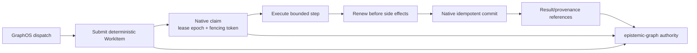

# Graph-Native Durable Execution (CONCEPT:AU-ECO.messaging.native-backend-abstraction)

Durable orchestration uses the Rust-native `epistemic-graph` engine as its sole
work-state authority. Every resumable unit is a `WorkItem`; no parallel store,
lease table, or task record owns execution state.

## Authority model



The authoritative lifecycle is:

```text
submitted -> ready -> leased -> running
    -> succeeded | failed | cancelled | dead_letter
```

The native transaction family owns claim, heartbeat, lease expiry, fencing,
dependency release, retry, cancellation, and terminal commit. A transition is
accepted only when its tenant, lease owner, lease epoch, and fencing token still
match. If the engine-native verb is unavailable, execution fails closed.

## Checkpoints and replay safety

A WorkItem carries the portable execution references needed to resume work:
`payload_ref`, `checkpoint_id`, dependency identifiers, attempt and retry state,
and terminal `result_ref` or `error_ref`. Checkpoint bodies and large results are
addressed by opaque references; machine paths, display names, credentials, and
raw payloads do not become work metadata.

Replay safety comes from two engine-enforced invariants:

- **Deterministic identity and idempotency.** A logical dispatch reuses its
  deterministic WorkItem/idempotency key. Repeated delivery cannot create a
  second execution authority, and a repeated matching terminal commit is a
  no-op.
- **Fenced effects.** Workers renew their lease immediately before a bounded
  side effect and commit with the matching fence. A stale worker cannot commit
  after a newer lease epoch has been issued.

Queue acknowledgements happen only after the fenced WorkItem result is durable.
A crash before acknowledgement therefore causes a safe redelivery; a crash after
the native commit resolves through the same idempotency key without applying the
effect twice.

## GraphOS surface

Submit durable work through `graph_jobs` (or the higher-level
`graph_orchestrate` and workflow tools), then inspect the same WorkItem by its
returned job identifier:

```json
{
  "tool": "graph_jobs",
  "arguments": {
    "action": "dispatch",
    "task": "Summarize the latest governed ingestion results",
    "dependencies": "[]"
  }
}
```

```json
{
  "tool": "graph_jobs",
  "arguments": {
    "action": "status",
    "job_id": "<opaque job identifier>"
  }
}
```

`status` is a read-only projection of the WorkItem. It never exposes lease
capabilities or creates another writable lifecycle. Raw WorkItems remain
queryable through governed `graph_query` Cypher when an operator needs the DAG
or audit view.

`graph_jobs(action="cancel")` is the matching cooperative cancellation request.
It uses the native `CancelWorkItem` transition and returns `not_cancelled` when
the job is missing, terminal, or cannot be cancelled under its active lease.

### MCP Tasks compatibility

GraphOS maps asynchronous job handles to the durable WorkItem authority; it
does not create a second task store. The 2026-07-28 MCP Tasks extension requires
the `io.modelcontextprotocol/tasks` capability plus `tasks/get`, `tasks/update`,
and `tasks/cancel` wire handlers. FastMCP 3.4.5 still exposes the incompatible
2025-11-25 experimental lifecycle (`tasks/result` and `tasks/list`) and its
installed MCP types do not contain the 2026 request/result handlers. GraphOS
therefore explicitly disables that legacy capability rather than advertising a
Tasks surface it cannot serve. Status and cancellation remain available through
the same `graph_jobs` MCP tool and `/api/graph/jobs` REST route; mid-flight
input is not exposed as MCP Tasks until the SDK ships the 2026 extension API.

## Operational checks

- Run `agent-utilities-doctor --only engine a2a_persistence` before dispatch.
- Run `agent-dispatch-worker` for queued agent turns; workers claim and commit
  through native WorkItem operations.
- Treat `dead_letter`, repeated lease loss, or an unavailable native verb as an
  operational failure. Do not add a local fallback authority.

See [Queue-Driven Agent Dispatch](../architecture/agent_dispatch.md),
[Graph Authority Convergence](../architecture/graph-authority-convergence.md),
and the [Unified Scheduling recipe](../recipes/unified-scheduling.md) for the
worker, queue, and dependency-DAG details.
