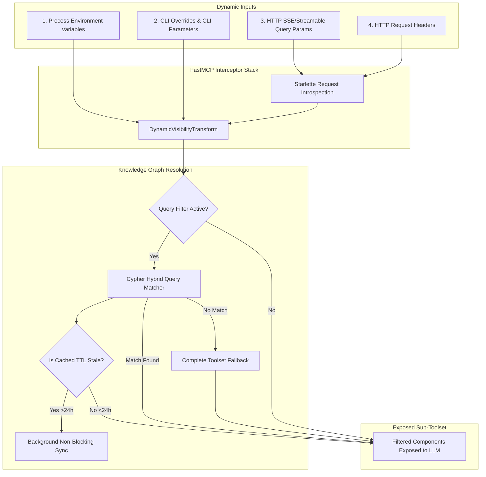

# Centralized Dynamic Tool Selection & Visibility

To prevent LLM context window bloup, optimize token usage, and significantly speed up request routing, the `agent-utilities` core features a high-performance **Centralized Dynamic Tool Selection and Visibility** system. This mechanism allows downstream clients, agents, and external systems to dynamically specify precisely which subset of tools should be exposed by any MCP server at runtime.

This system is fully centralized within `create_mcp_server()` inside the `agent-utilities` server factory (`agent_utilities/mcp/server_factory.py`), meaning **every downstream MCP server in `agent-packages/agents/*` automatically inherits this optimization without any custom code changes.**

---

## High-Level Architecture

The dynamic tool filtering flow integrates multiple input channels, processes request metadata, and performs optional high-speed, LLM-free Cypher matching against the Active Knowledge Graph:



---

## 1. Dynamic Selection Input Channels

Dynamic tool configurations are evaluated dynamically in hierarchical order of precedence (Headers > Query Parameters > CLI > Environment Variables):

### Process Environment Variables (Defaults)
Set base default tool sets or tags for a process instance:
- `MCP_ENABLED_TOOLS` or `MCP_ENABLED_COMPONENTS`: Comma-separated list of enabled tool names (e.g. `list_directories,view_file`).
- `MCP_DISABLED_TOOLS` or `MCP_DISABLED_COMPONENTS`: Comma-separated list of tools to hide explicitly.
- `MCP_ENABLED_TAGS`: Comma-separated tags to expose.
- `MCP_DISABLED_TAGS`: Comma-separated tags to exclude.

### CLI Parameters (Instance Overrides)
Standard CLI options exposed on all servers created via `create_mcp_server()`:
- `--tools`: Comma-separated string of enabled tool names. Overrides environment variables.
- `--disabled-tools`: Comma-separated string of tools to disable.

### HTTP SSE/Streamable Query Parameters
Clients connecting to remote HTTP/SSE servers can pass dynamic query variables directly in the connection URL. This enables ad-hoc, request-level context scoping:
- `?tools=tool1,tool2` / `?toolsets=tool1,tool2`: Filter to explicit tool list.
- `?disabled_tools=tool1,tool2` / `?disabled_toolsets=tool1,tool2`: Exclude specific tools.
- `?tags=git,filesystem`: Enable only tools matching these categories.
- `?disabled_tags=network`: Exclude tools matching these categories.
- `?q=dns` / `?query=git` / `?search=files`: Activate Knowledge Graph semantic resolution.

### HTTP Custom Request Headers (Highest Precedence)
For secure agent-to-agent (A2A) calls, custom headers can be attached to the request envelope:
- `x-mcp-enabled-tools` or `x-mcp-enabled-components`: Expose only specified tools.
- `x-mcp-disabled-tools` or `x-mcp-disabled-components`: Explicitly exclude specified tools.
- `x-mcp-enabled-tags`: Filter by specific category tags.
- `x-mcp-disabled-tags`: Exclude matching category tags.
- `x-mcp-query` or `x-mcp-search`: Semantic graph matching query.

---

## 2. LLM-Free Graph-Based Toolset Resolution

When a client passes a query filter (e.g. `?q=search` or header `x-mcp-query: directory`), the system automatically delegates resolution to the **Knowledge Graph** to discover relevant tools dynamically.

### Concept Overview (CONCEPT:AU-ECO.mcp.toolkit-live-discovery)
Unlike traditional slow and expensive LLM-based tool classification, this path uses the `DynamicToolOrchestrator` to execute high-speed, direct Cypher queries on the local graph database backend. It retrieves matching tool nodes based on name matching, description contents, and system-defined tags.

### Cypher Query Implementation
The orchestrator executes a multi-vector read-only match against tool nodes attached to the current server:

```cypher
MATCH (s:Server {name: $server_name})-[r:PROVIDES]->(t:CallableResource)
WHERE toLower(t.name) CONTAINS toLower($query)
   OR toLower(t.description) CONTAINS toLower($query)
   OR any(tag IN t.tags WHERE toLower(tag) CONTAINS toLower($query))
RETURN t.name AS name, t.tags AS tags
```

### Self-Healing & Fallback Execution
- **Fallback Chain**: If the Knowledge Graph matches nothing or fails, the orchestrator automatically cascades to a safe fallback path, returning the full set of configured tools for the server so that the agent remains functional.
- **Lazy Cache Synchronization**: To maintain peak sub-millisecond response times, tool nodes are stored in the graph. The orchestrator inspects the server node's updated timestamp:
  - If the cache age is less than 24 hours, it returns results instantly.
  - If the cache age exceeds 24 hours, the orchestrator continues with the current request instantly, but concurrently spins up a **non-blocking background task** (`refresh_cached_tools`) to introspect the live server and update graph nodes asynchronously.

---

## 3. How to Use & Integration Examples

### Example A: Exposing Specific Tools on Startup (CLI)
```bash
# Start an MCP server exposing ONLY git-related tools
uv run git-agent-mcp -t stdio --tools clone_repo,git_status
```

### Example B: Client Connection via Query Parameters (SSE)
```python
from mcp import ClientSession, SSEClientTransport

# Scope the session dynamically to file viewer and editor tools only
async with SSEClientTransport("http://localhost:8001/sse?tools=view_file,edit_file") as transport:
    async with ClientSession(transport) as session:
        # The agent only sees the two requested tools
        tools = await session.list_tools()
        print(tools)
```

### Example C: Request-Specific Semantic Routing via Custom Headers
An orchestrator dispatching a sub-agent to search logs can attach context-sensitive headers dynamically:

```python
import httpx

headers = {
    "x-mcp-query": "logs analysis",
    "x-mcp-disabled-tags": "write,delete" # Restrict mutation capabilities
}

async with httpx.AsyncClient() as client:
    response = await client.get("http://localhost:8001/tools", headers=headers)
    print(response.json()) # Returns only log-related, non-destructive tools
```

---

## 4. Verification and Security

The dynamic tool selection layer is strictly governed by the standard `DynamicVisibilityTransform` middleware inside the unified server factory.

### Key Guarantees
- **Robust Schema Protection**: Interactive arguments (`--tools` / `--disabled-tools`) are sanitized and cast into strict Python sets to prevent any parameter injection attacks.
- **Fail-Safe Operation**: Any runtime exception in Starlette request parsing or GraphOS connection automatically intercepts the trace, reports a debug warning, and falls back to exposing the complete set of capabilities.
- **Full Thread Safety**: Async background synchronization prevents any blocking or latency overheads during live tool requests.
