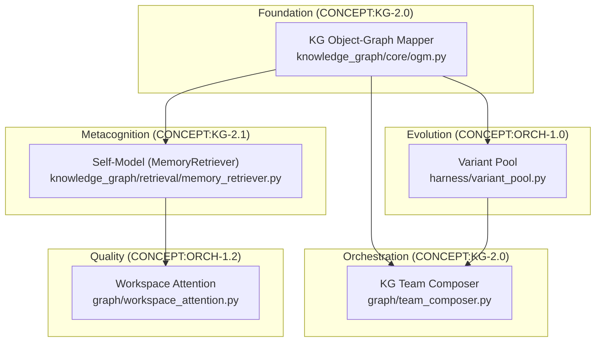

# Emergent Architecture

> **Concepts:** CONCEPT:KG-2.0, CONCEPT:KG-2.0, CONCEPT:ORCH-1.0, CONCEPT:KG-2.1, CONCEPT:ORCH-1.2
>
> See also: [First Principles Architecture](../1_graph_orchestration/first-principles.md) for CONCEPT:ORCH-1.2 through CONCEPT:ECO-4.0 (Registry Cache, TeamConfig, AgentCapability, PlannerGraphSkill).

This document describes the Emergent Architecture layer of `agent-utilities` — a suite of five interconnected modules that enable dynamic agent coalition formation, evolutionary variant selection, metacognitive self-modeling, and attention-based output quality filtering.

## Overview

The Emergent Architecture builds on top of the existing infrastructure:

- **14-Phase Unified Intelligence Graph** — knowledge pipeline (CONCEPT:ORCH-1.0)
- **HSM Orchestration** — hierarchical state machine (graph/hsm.py)
- **AHE (Agentic Harness Engineering)** — component evolution (CONCEPT:AHE-3.0)
- **OWL Reasoning Sidecar** — deterministic inference (knowledge_graph/core/owl_bridge.py)



---

## CONCEPT:KG-2.0 — KG Object-Graph Mapper (OGM)

**Module:** `agent_utilities/knowledge_graph/core/ogm.py`

The OGM provides declarative, bidirectional mapping between Pydantic `RegistryNode` subclasses and Knowledge Graph nodes. It replaces manual `_upsert_node()` / `_serialize_node()` patterns throughout the engine.

### Features

- **Auto label resolution**: Derives PascalCase KG labels from `RegistryNodeType` enum values (e.g., `self_model` → `SelfModel`)
- **`@kg_label` decorator**: Override auto-derived labels for custom node types
- **Bidirectional CRUD**: `upsert()` (Pydantic → KG), `load()` (KG → Pydantic), `delete()`
- **Dual-write**: Syncs both NetworkX in-memory graph and persistent backend
- **Change watchers**: Register callbacks for event-driven invalidation

### Usage

```python
from agent_utilities.knowledge_graph.core.ogm import KGMapper
from agent_utilities.models.knowledge_graph import SelfModelNode

mapper = KGMapper(engine)

# Upsert a node
node = SelfModelNode(id="sm:001", name="Self-Model v1", version=1)
mapper.upsert(node)

# Load it back
loaded = mapper.load("sm:001", SelfModelNode)

# Create an edge
mapper.upsert_edge("sm:001", "sm:000", "SUPERSEDES")

# Watch for changes
mapper.watch("SelfModel", lambda event, node: print(f"{event}: {node.id}"))
```

---

## CONCEPT:ORCH-1.0 — Dynamic Team Composition

**Module:** `agent_utilities/graph/team_composer.py` (`KGTeamComposer`)

> **Note:** The earlier `SwarmOrchestrator` (`graph/swarm.py` / `graph/swarm_models.py`)
> with its `decompose_and_spawn()` / `compute_affinity()` API and `SWARM_MODE` /
> `SWARM_MAX_DEPTH` / `SWARM_MAX_AGENTS` env vars has been removed. Dynamic coalition
> formation is now driven by `KGTeamComposer`, which delegates topology synthesis to
> `AgentOrchestrationEngine.synthesize_team()`. The `SwarmCoalitionNode` model is
> retained for KG persistence of coalition records.

Replaces static specialist dispatch with dynamic team formation. For each task,
`compose_team()`:

1. **Reuse**: Try a proven `TeamConfigNode` template first (CONCEPT:AHE-3.3)
2. **Synthesize**: If no proven team, dynamically build a specialist subgraph using KG primitives
3. **Return**: A fully specified `TeamComposition`

### Models

- **`TeamComposition`**: Resolved specialist coalition for a task
- **`TeamConfigNode`**: Promoted, reusable proven-team template
- **`SwarmCoalitionNode`**: KG-persisted coalition record

### Usage

```python
from agent_utilities.graph.team_composer import KGTeamComposer

composer = KGTeamComposer(engine)
composition = composer.compose_team(
    "Analyze GitLab project and create Jira tickets for issues",
    domain="general",
    complexity=3,
)
# After execution, promote a successful coalition for future reuse
composer.promote_to_team_config(composition, success=True, quality_score=0.9)
```

---

## CONCEPT:AHE-3.2 — Evolutionary Variant Selection

**Module:** `agent_utilities/harness/variant_pool.py`

Manages competing variants of prompts, skills, or sub-graph configurations using a dual-strategy generation approach and tournament-based fitness selection.

### Dual Generation Strategy

| Strategy | Method | Description |
|----------|--------|-------------|
| **LLM-driven** | `EvolveAgent` integration | Uses critique signals to generate targeted variants |
| **Parametric** | `generate_parametric_variant()` | Applies structured mutations: content prefix/suffix, metadata overrides |

### Lifecycle

```
register_variant() → evaluate_fitness() → tournament_select()
→ promote_winner() → prune_losers()
```

### Fitness Evaluation

Fitness is computed by aggregating `OutcomeEvaluationNode.reward` values linked to episodes that used the variant. The aggregation path:

```
(variant) ← USES/EXECUTED_BY ← (episode) → PRODUCED_OUTCOME → (evaluation)
```

### KG Edge Types

| Edge | Purpose |
|------|---------|
| `VARIANT_OF` | Links variant to its base component |
| `EVOLVED_FROM` | Tracks mutation lineage |
| `SUPERSEDES` | Marks a promoted variant as the new baseline |

### Usage

```python
from agent_utilities.harness.variant_pool import VariantPool

pool = VariantPool(engine)

# Generate a parametric variant
variant = pool.generate_parametric_variant(
    base_prompt,
    mutations={"content_suffix": "Always respond concisely."},
)

# Register and evaluate
pool.register_variant(base_prompt.id, variant, generation=1)
fitness = pool.evaluate_fitness(variant.id)

# Select and promote winners
winners = pool.tournament_select(base_prompt.id, top_k=3)
pool.promote_winner(winners[0], base_prompt.id)
pool.prune_losers(base_prompt.id, keep=3)
```

---

## CONCEPT:KG-2.1 — Persistent Self-Model

**Module:** `agent_utilities/knowledge_graph/retrieval/memory_retriever.py` (`MemoryRetriever`; the `SelfModel` name and the `knowledge_graph/self_model.py` import path are retained as back-compat aliases)

A versioned metacognitive self-model that aggregates session outcomes into a persistent KG representation of the agent's capabilities, strengths, and known failure modes.

### Architecture

```
[Anchor: self:agent-model]
    ──CURRENT_SELF_MODEL──→ [SelfModel v3]
                                ──SUPERSEDES──→ [SelfModel v2]
                                                    ──SUPERSEDES──→ [SelfModel v1]
```

- **Versioned chain**: Each session creates a new `SelfModelNode`
- **CURRENT pointer**: O(1) lookup of latest version via `CURRENT_SELF_MODEL` edge
- **Temporal analysis**: Traverse `SUPERSEDES` chain for trend analysis

### Data Model

```python
class SelfModelNode(RegistryNode):
    version: int                           # Monotonically increasing
    domain_success_rates: dict[str, float] # e.g., {"gitlab": 0.85}
    capability_confidence: dict[str, float]
    tool_proficiency: dict[str, float]
    total_sessions: int
    total_tasks_completed: int
    known_failure_patterns: list[str]
    session_id: str
```

### OWL Integration

`promote_to_owl()` pushes self-model triples into the OWL ontology:

- `SelfModel rdf:type Agent`
- `SelfModel hasCapability Capability_X`
- `Capability_X confidenceScore 0.85`
- `SelfModel knownWeakness FailurePattern_Y`

This enables the OWL reasoner to infer routing decisions like "I am competent at GitLab tasks" or "I should delegate medical tasks."

### Usage

```python
from agent_utilities.knowledge_graph.self_model import SelfModel

sm = SelfModel(engine)
model = sm.get_or_create()

# After a session
sm.update_after_session(graph_state)

# Query capabilities
caps = sm.query_capabilities("gitlab")
# {'success_rate': 0.85, 'confidence': 0.9, 'proficiency': 0.7}

# Track improvement
trend = sm.temporal_trend("gitlab", lookback=5)
# [0.6, 0.7, 0.75, 0.8, 0.85]

# Self-explanation
print(sm.explain_self())
# # Agent Self-Model (v3)
# **Sessions**: 10 | **Tasks completed**: 42
# ## Domain Proficiency
# - **gitlab**: ████████░░ 85%
```

---

## CONCEPT:ORCH-1.2 — Global Workspace Attention

**Module:** `agent_utilities/graph/workspace_attention.py`

Always-on attention mechanism for specialist output quality filtering. Inspired by Global Workspace Theory (GWT), specialist outputs compete for integration into the final response.

### Scoring Signals

| Signal | Weight | Source |
|--------|--------|--------|
| **Relevance** | 50% | Embedding cosine similarity to query |
| **Track record** | 30% | Historical success from self-model (CONCEPT:KG-2.1) |
| **Confidence** | 20% | Self-reported via parsed patterns |

Composite: `0.5 × relevance + 0.3 × track_record + 0.2 × confidence`

### Performance

- **Latency**: ~50ms per query (embedding comparison + sort)
- **Cost**: No LLM round-trip required
- **Activation**: Always-on for consistent quality improvement

### Confidence Extraction

The attention mechanism automatically parses confidence from specialist outputs:

```
"Confidence: 0.85"          → 0.85
"I'm 90% sure about this"  → 0.90
"Here are the results"      → 0.50 (default)
```

### Usage

```python
from agent_utilities.graph.workspace_attention import WorkspaceAttention

gwt = WorkspaceAttention(max_broadcast_slots=5)

# Score specialist outputs
proposals = gwt.collect_proposals(
    specialist_outputs={"spec:gitlab": "Found 5 projects...", ...},
    query="list all projects",
    engine=engine,
    self_model=self_model,
)

# Select winners
winners = gwt.select_winners(proposals)

# Persist to KG for training signal
gwt.broadcast_to_kg(winners, engine, task_id="task:123")
```

---

## KG Schema Additions

### Node Types (RegistryNodeType)

| Type | Concept | Description |
|------|---------|-------------|
| `SELF_MODEL` | CONCEPT:KG-2.1 | Versioned metacognitive self-model |
| `SWARM_COALITION` | CONCEPT:KG-2.0 | Dynamic agent coalition record |
| `PROPOSAL` | CONCEPT:ORCH-1.2 | GWT specialist output proposal |
| `TEAM_CONFIG` | CONCEPT:AHE-3.3 | Proven specialist coalition template (see [first-principles.md](../1_graph_orchestration/first-principles.md)) |
| `AGENT_CAPABILITY` | CONCEPT:ORCH-1.2 | Dynamic capability with trigger conditions (see [first-principles.md](../1_graph_orchestration/first-principles.md)) |

### Edge Types (RegistryEdgeType)

| Type | Concept | Description |
|------|---------|-------------|
| `VARIANT_OF` | CONCEPT:ORCH-1.0 | Links variant to base component |
| `CURRENT_SELF_MODEL` | CONCEPT:KG-2.1 | Pointer to latest self-model version |
| `SPAWNED_BY` | CONCEPT:KG-2.0 | Tracks swarm agent parentage |
| `COORDINATED_BY` | CONCEPT:KG-2.0 | Links specialist to coordinator |
| `PROPOSED_FOR` | CONCEPT:ORCH-1.2 | Links proposal to its specialist |
| `HAS_CAPABILITY` | CONCEPT:ORCH-1.2 | Links specialist → capability node (see [first-principles.md](../1_graph_orchestration/first-principles.md)) |
| `REUSED_TEAM` | CONCEPT:AHE-3.3 | Links session → TeamConfig for reuse tracking (see [first-principles.md](../1_graph_orchestration/first-principles.md)) |
| `USES_PROMPT` | CONCEPT:AHE-3.3 | Links specialist → JSON prompt template (see [first-principles.md](../1_graph_orchestration/first-principles.md)) |

---

## Testing

All modules have comprehensive test suites:

```bash
# Individual modules
python -m pytest tests/test_kg_ogm.py -v               # CONCEPT:KG-2.0
python -m pytest tests/test_variant_pool.py -v         # CONCEPT:ORCH-1.0
python -m pytest tests/test_memory_retriever.py -v     # CONCEPT:KG-2.1 (Self-Model)
python -m pytest tests/test_workspace_attention.py -v  # CONCEPT:ORCH-1.2

# First Principles Architecture tests
python -m pytest tests/unit/core/test_config_helpers.py -v       # CONCEPT:ORCH-1.2
python -m pytest tests/test_team_config.py -v                    # CONCEPT:AHE-3.3
python -m pytest tests/unit/core/test_capabilities.py -v         # CONCEPT:ORCH-1.2

# All emergent + first-principles tests
python -m pytest tests/test_kg_ogm.py tests/test_variant_pool.py \
    tests/test_memory_retriever.py tests/test_workspace_attention.py \
    tests/unit/core/test_config_helpers.py \
    tests/test_team_config.py \
    tests/unit/core/test_capabilities.py -v
```
