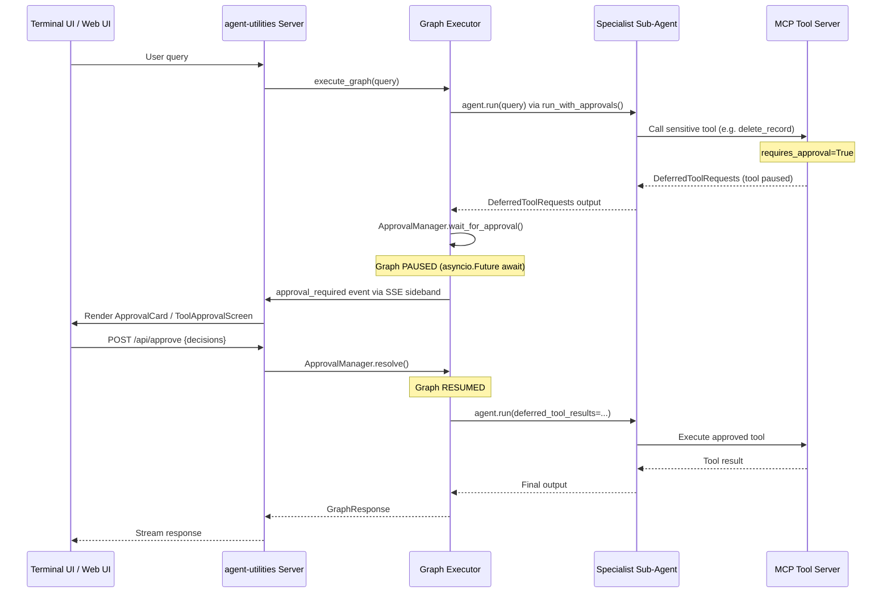

# Features

## Model Registry

`agent-utilities` ships a first-class multi-model registry so a single agent deployment can fan out work across several LLM providers (a fast local LM Studio, a cloud `gpt-4o-mini`, a reasoning `claude-3-opus`, etc.) without any code changes.

**Data model** (`agent_utilities/models/schema_definition.py` & `agent_utilities/core/config.py`)

- `ChatModelConfig` & `EmbeddingModelConfig` -- one configured model with explicit capability properties (e.g. `intelligence_level`, `supports_json`, `vision`).
- `AgentConfig` -- Unified XDG system configuration storing `chat_models` and `embedding_models`.
  - Global `config` object handles hot-reloading via `config.reload()`.
  - Provides dynamic lookups like `config.get_chat_model(intelligence_level="super")`.

**Bootstrap priority** (`resolve_model_registry` via `AgentConfig`)

1. XDG-compliant `~/.config/agent-utilities/config.json`.
2. Explicit kwargs or environment fallbacks (e.g., `LITE_LLM_MODEL_ID` via `.env`) injected at startup.

**Endpoint**
- `GET /models` returns the models from `AgentConfig`.
- Mirrored at `GET /api/enhanced/models` by `agent-webui`.

**Example JSON (`~/.config/agent-utilities/config.json`)**

```json
{
  "chat_models": [
    {
      "id": "gpt-4o-mini",
      "provider": "openai",
      "intelligence_level": "normal",
      "supports_json": true,
      "vision": true
    }
  ]
}
```

---

## Direct Graph Execution

When a `graph_bundle` is present at startup, the AG-UI endpoint (`/ag-ui`) can bypass the outer LLM agent entirely and execute the graph directly. This eliminates one full LLM inference round-trip per request — the LLM no longer needs to decide to call the `run_graph_flow` tool, because the protocol adapter calls it directly.

### How It Works

The fast path uses `graph.iter()` (pydantic-graph beta API) for step-by-step execution:

```python
# Each step yields per-node events for real-time streaming
async for event in execute_graph_iter(graph, config, query):
    for chunk in emitter.translate(event):
        yield chunk  # AG-UI wire format: 0:/2:/8:/9: prefixes
```

**Event types yielded by `run_graph_iter()`:**

| Event Type | Description |
|-----------|-------------|
| `node_transition` | A graph node has started executing (includes active node IDs) |
| `sideband` | Graph lifecycle events (specialist routing, tool calls) |
| `elicitation` | The graph is pausing for human approval |
| `graph_complete` | Execution finished (includes final output) |
| `error` | An error occurred during execution |

Each event includes a `state_snapshot` with the current `GraphState` for observability and audit trails.

### Wire Format (AG-UI)

The `AGUIGraphEmitter` translates graph events to AG-UI wire format:

| Prefix | Purpose |
|--------|---------|
| `0:` | Heartbeat / flush marker |
| `2:` | Text delta streaming chunks |
| `8:` | Sideband annotations (graph events, tool calls) |
| `9:` | Tool call information |

### Configuration

| Variable | Purpose | Default |
|----------|---------|---------|
| `GRAPH_DIRECT_EXECUTION` | Enable direct graph dispatch (bypasses LLM tool-call hop) | `true` |

Set to `false` to restore the legacy `Agent → LLM → run_graph_flow → graph` pipeline.

### Protocol Behavior

| Protocol | Direct Execution? | Details |
|----------|-------------------|---------|
| **AG-UI** | ✅ Full bypass | Uses `execute_graph_iter()` + `AGUIGraphEmitter` |
| **ACP** | ⚡ Optimized | Per-session `agent_factory` with session-aware closures |
| **A2A** | ❌ LLM-mediated | Retains `run_graph_flow` tool for multi-agent negotiation |
| **SSE** | ✅ Already direct | `/stream` has always called `run_graph_stream()` directly |

### Capabilities Unlocked by `graph.iter()`

The `iter()` API provides step-by-step control over graph execution, enabling:

- **Per-node progress streaming**: Real-time AG-UI sideband updates per graph step
- **Elicitation**: Pause between steps when `state.human_approval_required` is set
- **State snapshots**: Every event includes serialized `GraphState` for audit trails
- **Pause/Resume foundation**: State can be serialized to disk mid-execution for later resumption


## Spec-Driven Development (SDD) Lifecycle

The `agent-utilities` ecosystem implements a high-fidelity orchestration pipeline based on Spec-Driven Development. This lifecycle ensures technical precision, architectural consistency, and parallel execution safety.

### Phase 1: Governance & Specification
1. **Project Start**: The **Planner** triggers `constitution-generator` to establish `constitution.md` (governance rules, tech stack).
2. **Feature Definition**: The **Planner** triggers `spec-generator` to produce `spec.md` (user stories, acceptance criteria, requirements).
3. **Technical Approach**: The **Planner** triggers `task-planner` to generate `plan.md` (technical approach) and `tasks.md` (inter-dependent graph of tasks).
4. **Baseline Testing**: Before implementation, the **Planner** triggers `first_run_tests` to establish a verified baseline of the current workspace state.

### Phase 2: Parallel Execution
The **Dispatcher** reads the `tasks.md` and routes sub-tasks to specialized agents.
- **Dependency Tracking**: Tasks are executed in parallel if they have no unmet dependencies.
- **Context Isolation**: Each specialist receives only relevant context for its assigned task.
- **`[P]` Markers**: The `Task.parallel: bool` field and `[P]` markdown markers enable explicit parallel-wave control.
- **Agentic Manual Testing**: Specialists can trigger `run_manual_test` to verify behaviors that are difficult to automate (e.g. CLI output, UI state).

### Phase 3: Continuous Verification
1. **Quality Gate**: After execution, the **Verifier** node uses `spec-verifier` to evaluate the results against the original `spec.md`.
2. **Self-Correction**: If verification fails (score < 0.7), feedback is injected back into the **Planner** for targeted re-planning and execution.
3. **Linear Walkthroughs**: Upon success, the agent triggers `generate_walkthrough` to produce a step-by-step documentation of the implementation.

### Phase 4: Long-Term Memory Evolution
1. **Interactive Explanations**: For complex logic, the agent generates `interactive-explain` artifacts (HTML/JS) to aid human understanding.
2. **Memory Capture**: The `sync_feature_to_memory` tool is invoked to summarize the `Spec`, `ImplementationPlan`, and execution results.
3. **Historical Reference**: Future planning sessions can search the Knowledge Graph to retrieve technical context from previous related work.

### SDD Skills Reference
| Skill | Group | Purpose | Bound To |
|:------|:------|:--------|:---------|
| `constitution-generator` | sdd | Establish project governance and stack. | Planner |
| `spec-generator` | sdd | Create feature-level specifications. | Planner, Architect, Project Manager |
| `task-planner` | sdd | Generate technical implementation plans with `[P]` markers. | Planner, Coordinator |
| `spec-verifier` | sdd | Evaluate results against specifications. | Verifier, QA Expert, Critique |
| `sdd-implementer` | sdd | Execute tasks from the generated plan. | Specialist Programmers |
| `workspace-manager` | sdd | Bootstrap and manage `.specify/` directory layout. | Planner |
| `manual-testing-enhanced` | sdd | Exploratory testing and manual verification. | QA Expert, Verifier |
| `code-walkthrough` | docs | Generates linear codebase documentation. | Document Specialist |
| `interactive-explain` | docs | Generates interactive HTML explanations. | Document Specialist |

---

## Human-in-the-Loop & Tool Safety

### Universal Tool Guard (Global Safety)
By default, `agent-utilities` implements a **Universal Tool Guard** that automatically intercepts sensitive tool calls from MCP servers and graph specialist sub-agents.

Any tool matching specific "danger" patterns (e.g., `delete_*`, `write_*`, `execute_*`, `drop_*`) is flagged with pydantic-ai's native `requires_approval=True` attribute. When a specialist sub-agent calls a flagged tool, the graph **pauses at that exact node** and waits for explicit user approval before continuing.

**Key Features:**
- **Zero Config**: Protections are applied automatically based on tool names via `apply_tool_guard_approvals()`.
- **True Pause-and-Resume**: The graph does NOT terminate on approval requests. It suspends via `asyncio.Future` and resumes when the user responds.
- **Protocol-Agnostic**: Works identically across AG-UI (web UI), terminal UI, ACP, and SSE protocols.
- **Persistent Choices**: When using ACP, users can select "Always Allow" / "Always Deny" for specific tools.
- **Customizable**: Disable with `TOOL_GUARD_MODE=off` or `DISABLE_TOOL_GUARD=True`.

**Sensitive Patterns:**
`delete`, `write`, `execute`, `rm_`, `rmdir`, `drop`, `truncate`, `update`, `patch`, `post`, `put`, `create`, `add`, `upload`, `set`, `reset`, `clear`, `revert`, `replace`, `rename`, `move`, `start`, `stop`, `restart`, `kill`, `terminate`, `reboot`, `shutdown`, `git_*`.

### Approval Manager Architecture



### How to use Elicitation
Elicitation is used when an MCP tool requires additional structured input or confirmation from the user. Both tool approval and MCP elicitation use the same underlying `ApprovalManager` pause/resume mechanism.

**In MCP Tools (FastMCP):**
```python
from fastmcp import FastMCP, Context

mcp = FastMCP("MyServer")

@mcp.tool()
async def book_table(restaurant: str, ctx: Context) -> str:
    confirmation = await ctx.elicit(
        message=f"Please confirm booking for {restaurant}",
        schema={
            "type": "object",
            "properties": {
                "guests": {"type": "integer", "description": "Number of guests"},
                "time": {"type": "string", "description": "Time of booking"}
            },
            "required": ["guests", "time"]
        }
    )
    if confirmation.get("_action") == "cancel":
        return "Booking cancelled by user."
    return f"Booked for {confirmation['guests']} at {confirmation['time']}"
```

---

## JSON Prompting (Structured Prompts)

Agent Utilities uses a **JSON-native** prompting architecture. All system prompts have been migrated from Markdown to `.json` blueprints powered by the `StructuredPrompt` Pydantic model. This ensures that every agent task is explicitly specified and type-safe.

### Key Benefits
- **Zero Guesswork**: Explicitly specify task, tone, audience, and structure.
- **Type Safety**: Pydantic models validate prompt structure before execution.
- **Graph Integration**: Prompts can be hydrated dynamically from the Knowledge Graph.
- **Nested Blueprints**: Define reusable components like hooks, body structures, and CTAs.

### Usage Example
```json
{
  "task": "write a tweet",
  "topic": "dopamine detox",
  "style": "viral",
  "structure": {
    "hook": "curiosity-driven",
    "body": "3 insights",
    "cta": "question"
  }
}
```

---

## Agentic Engineering Patterns

### 1. Spec-Driven TDD (Red/Green/Refactor)
Agents natively support a Spec-Driven TDD workflow. Requirements from the `SDDManager` are used to drive a formalized Red-Green-Refactor cycle:
- **Red Phase**: Subagent writes a failing test case based on requirements.
- **Green Phase**: Subagent implements code to satisfy the test.
- **Refactor Phase**: Subagent optimizes code quality while maintaining test pass status.
- **Tools**: `run_tdd_cycle`, `setup_sdd`, `save_spec`.

### 2. Isolated Subagent Dispatch
Complex tasks are broken down and dispatched to specialized subagents with isolated contexts:
- **Isolation**: Each subagent receives a fresh, curated context to prevent "context pollution."
- **Specialization**: Subagents are spawned with specific toolsets (e.g., TDD experts, shell experts).
- **Orchestration**: Parallel execution via the Dispatcher's task-graph awareness.

### 3. Agentic Manual Testing
Verification of behaviors that are difficult to unit-test (e.g., CLI output, network state) is performed via autonomous manual testing:
- **Goal-Oriented**: The agent is given a verification goal and autonomous access to shell/curl tools.
- **Runtime Verification**: Steps are executed in real-time to confirm system state.
- **Tools**: `run_manual_test`.

### 4. Knowledge Hoarding (Pattern Templates)
Successful engineering cycles (e.g., a specific TDD solution for a recurring problem) are persisted as reusable **Pattern Templates** in the Knowledge Graph:
- **Recombination**: Agents search for existing templates to "hoard" and recombine successful solutions.
- **Self-Improvement**: Successful outcomes increase the `success_rate` and `importance_score` of patterns.
- **Graph Nodes**: `PatternTemplate` nodes linked via `IMPLEMENTS` and `DERIVED_FROM`.

---

## Emergent Architecture (CONCEPT:AU-KG.query.object-graph-mapper through CONCEPT:AU-ORCH.adapter.hot-cache-invalidation)

The Emergent Architecture layer enables dynamic agent coalition formation, evolutionary variant selection, metacognitive self-modeling, and attention-based output quality filtering. See [emergent-architecture.md](../2_epistemic_knowledge_graph/emergent-architecture.md) for complete documentation.

### 5. KG Object-Graph Mapper (CONCEPT:AU-KG.query.object-graph-mapper)
Declarative bidirectional mapping between Pydantic `RegistryNode` models and Knowledge Graph nodes. Eliminates manual `_upsert_node()` / `_serialize_node()` patterns.
- **Module**: `agent_utilities/knowledge_graph/core/ogm.py`
- **Features**: Auto label resolution, `@kg_label` decorator, dual-write (NetworkX + backend), change watchers

### 6. Dynamic Team Composition (CONCEPT:AU-ORCH.execution.inject-signal-board-observations)
Dynamic specialist team formation replacing static dispatch. `KGTeamComposer.compose_team()` first tries a proven `TeamConfigNode`, then synthesizes a specialist subgraph via `AgentOrchestrationEngine.synthesize_team()`. (The earlier `SwarmOrchestrator`/`graph/swarm.py` API has been removed.)
- **Module**: `agent_utilities/graph/team_composer.py`
- **Features**: proven-team reuse, dynamic topology synthesis, coalition KG tracking (`SwarmCoalitionNode`)

### 7. Evolutionary Variant Selection (CONCEPT:AU-AHE.harness.evolutionary-aggregation)
Population-based competition for prompts, skills, and configurations using dual-strategy generation (LLM-driven + parametric mutations) and tournament selection.
- **Module**: `agent_utilities/harness/variant_pool.py`
- **Features**: Parametric mutations, fitness from `OutcomeEvaluation.reward`, tournament selection, auto-pruning

### 8. Persistent Self-Model (CONCEPT:AU-KG.memory.tiered-memory-caching)
Versioned metacognitive self-model that aggregates session outcomes into a persistent KG chain. Integrates with OWL for reasoner-driven capability assessment.
- **Module**: `agent_utilities/knowledge_graph/retrieval/memory_retriever.py` (`MemoryRetriever`; aliased as `SelfModel` via `knowledge_graph/self_model.py`)
- **Features**: Versioned chain with `CURRENT` pointer, temporal trend analysis, OWL promotion, self-explanation

### 9. Global Workspace Attention (CONCEPT:AU-ORCH.adapter.hot-cache-invalidation)
Always-on attention mechanism that scores specialist outputs by relevance, confidence, and track record before integration. Cost: ~50ms per query (no LLM round-trip).
- **Module**: `agent_utilities/graph/workspace_attention.py`
- **Features**: Tri-signal scoring, configurable weights, KG broadcast for training signal

---

## First Principles Architecture (CONCEPT:AU-ORCH.adapter.hot-cache-invalidation through CONCEPT:AU-ECO.messaging.native-backend-abstraction)

The First Principles Architecture rewires the routing, dispatch, and feedback layers from basic primitives to solve scalability and intelligence bottlenecks. See [first-principles.md](../1_graph_orchestration/first-principles.md) for the complete deep-dive.

### 10. Registry Hot Cache (CONCEPT:AU-ORCH.adapter.hot-cache-invalidation)
Session-scoped `_RegistryCache` singleton providing O(1) specialist lookups with event-driven invalidation. Reduces prompt bloat from 50+ specialist descriptions to only the top-7 relevant per query.
- **Module**: `agent_utilities/core/config.py`
- **Features**: Query-keyed caching, 4 invalidation triggers (MCP reload, pipeline, Self-Model, TeamConfig), no TTL risk
- **Deep-Dive**: [registry-cache.md](../1_graph_orchestration/registry-cache.md)

### 11. TeamConfig Promotion (CONCEPT:AU-AHE.evaluation.interpretability-tests)
Proven specialist coalitions are persisted as reusable `TeamConfigNode` templates in the Knowledge Graph. Enables 3-stage hybrid routing: TeamConfig match → Self-Model bias → LLM planning fallback.
- **Module**: `agent_utilities/core/registry/kg_adapter.py` (`record_team_outcome`); team composition in `agent_utilities/graph/team_composer.py`
- **Features**: Coalition promotion, domain-pattern matching, EMA-based success rate tracking, RLM + TeamConfig synergy

### 12. AgentCapability Type System (CONCEPT:AU-ORCH.adapter.hot-cache-invalidation)
First-class KG capability nodes with auto-activation, trigger conditions, and dynamic handler binding. Capabilities like RLM, critic, and summarizer activate automatically based on input constraints.
- **Module**: `agent_utilities/models/knowledge_graph.py`, `agent_utilities/graph/executor.py`
- **Features**: Trigger conditions (input_size_gt, domain, has_images), HAS_CAPABILITY edges, priority ordering

### 13. PlannerGraphSkill (CONCEPT:AU-ECO.messaging.native-backend-abstraction)
A2A-native routing entry point that bypasses LLM orchestration overhead. When a `graph_bundle` is present, A2A requests route directly through the graph planner.
- **Module**: `agent_utilities/protocols/a2a_graph_skill.py`, `agent_utilities/server/app.py`
- **Features**: Automatic registration when graph is present, priority over LLM-mediated routing

---

## Post-Execution Feedback Loop

The verification synthesizer (`graph/verification.py`) now feeds execution outcomes back to two learning systems:

1. **Self-Model Update**: `SelfModel.update_after_session(state)` aggregates domain success rates, tool proficiency, and failure patterns into the versioned metacognitive self-model.
2. **TeamConfig Reward**: `record_team_outcome(config_id, success)` updates the success rate of the used team template via exponential moving average.

Both updates trigger **registry cache invalidation** (CONCEPT:AU-ORCH.adapter.hot-cache-invalidation), ensuring future routing decisions reflect the latest knowledge.

---

## Process Lifecycle Management

The server ensures all child processes (MCP servers, TUI, background threads) are cleaned up on exit. See [process-lifecycle.md](../5_agent_os_infrastructure/process-lifecycle.md) for the full architecture.

- **Handlers**: `atexit`, `SIGTERM`, `SIGINT` registered in `server/__init__.py`
- **Strategy**: Child-only cleanup via `pgrep -P <pid>` (avoids self-termination)
- **Safety**: Signal handler chaining preserves existing handlers, idempotency guard prevents double-cleanup


## Concept Traceability

- `CONCEPT:AU-OS.safety.doom-loop-detection` — Agent Identity Management
- `CONCEPT:AU-OS.safety.doom-loop-detection` — Graph Router Step
- `CONCEPT:AU-ECO.messaging.native-backend-abstraction` — Planner Step
- `CONCEPT:AU-ORCH.execution.execution-budget-caps` — Verifier Step
- `CONCEPT:AU-ORCH.planning.recursion-nesting-depth` — Guardrails & Safety Patterns
- `CONCEPT:AU-OS.state.cognitive-scheduler-preemption` — Evaluation & Monitoring
- `CONCEPT:AU-AHE.evaluation.adaptive-reasoning-effort` — Task Prioritization
- `CONCEPT:AU-ORCH.planning.recursion-nesting-depth` — Exploration & Discovery
- `CONCEPT:AU-AHE.harness.evolutionary-aggregation` — Agentic Coding Patterns
- `CONCEPT:AU-ORCH.adapter.hot-cache-invalidation` — Registry Hot Cache
- `CONCEPT:AU-AHE.evaluation.interpretability-tests` — TeamConfig Promotion & Proven Team Reuse
- `CONCEPT:AU-ORCH.adapter.hot-cache-invalidation` — AgentCapability Type System & Auto-Activation
- `CONCEPT:AU-ECO.messaging.native-backend-abstraction` — A2A PlannerGraphSkill (Graph-Native Routing)


## Local Secret Storage (Vault, OpenBao, & SQLite)

The `agent-utilities` ecosystem provides a unified `SecretsClient` (CONCEPT:AU-OS.config.secrets-authentication) designed to replace static `.env` files. It supports three backends: `inmemory`, `sqlite` (persistent), and `vault` (supporting HashiCorp Vault & OpenBao via `hvac`).

### Setting Up the Backend

To configure your agent to use your Vault (or OpenBao) or SQLite secret store, export these environment variables:

**For HashiCorp Vault & OpenBao:**
```bash
# Requires: pip install agent-utilities[vault]
export SECRETS_BACKEND=vault
export SECRETS_VAULT_URL=https://openbao.example.com  # URL of your OpenBao or HashiCorp Vault server
export SECRETS_VAULT_MOUNT=secret
export VAULT_TOKEN=hvs.xxx
```

**For Persistent SQLite (Encrypted at rest with Fernet):**
```bash
export SECRETS_BACKEND=sqlite
export SECRETS_SQLITE_PATH=~/.agent-utilities/secrets.db
```

### Using Secrets in Agent Code

During graph execution, the agent can resolve secrets natively via the `GraphDeps` context, so your code doesn't need to depend on `os.environ` or python-dotenv:

```python
from agent_utilities.security.secrets_client import create_secrets_client

# Inside a graph node or specialist logic
if ctx.deps.secrets_client:
    # Gets from Vault/OpenBao/SQLite, falls back to env var if missing
    token = ctx.deps.secrets_client.get_or_env("gitlab/token", "GITLAB_TOKEN")
```

### Using URI Schemes for Configuration

If you're mapping secrets into an MCP configuration (`mcp_config.json`) or reading strings elsewhere, you can use the `vault://` or `sqlite://` URI schemes to inject secrets directly at runtime without exposing them in plaintext config files:

```python
client = create_secrets_client()

# Resolves from Vault or OpenBao KV mount
token = client.resolve_ref("vault://agents/mcp/gitlab/token")

# Resolves from SQLite db
token = client.resolve_ref("sqlite://gitlab/token")

# Resolves from environment variable (legacy fallback)
token = client.resolve_ref("env://GITLAB_TOKEN")
```


## Comprehensive Feature List

- **Multi-Domain Architectural Pattern**: Transitioned `agent-utilities` to a Multi-Domain Expert System supporting modular expansion into `finance`, `medical`, `law`, and `science`. Domain integrations leverage Vectorized Topological Memory and the core Knowledge Graph, with heavy domain-specific dependencies optionally loaded via tags (e.g., `agent-utilities[finance]`).
- **Quantitative Finance Framework**: Production-grade, KG-native financial framework designed for global asset classes (Crypto, Equities, Forex, Derivatives, Prediction Markets). Includes Stationary Feature Engineering (ADF tests), Topological TradingLSTM (sequence processing + networkx regimes), Laplace Ensemble Fusion (for Open-Meteo probability conversion), Cost-Aware Threshold Filtering (for Polymarket/Kalshi arbitrage), Walk-Forward Validation, Quarter-Kelly Risk Optimization, and Kolmogorov-Smirnov shift detection. Orchestrated entirely via a **single, omnipotent `quant` MCP Tool**, dynamically routing across intelligence, data, execution, and portfolio risk domains to minimize LLM token bloat.
- **Background Concept Research Daemon (CONCEPT:AU-KG.research.research-pipeline-runner)**: Native, persistent background intelligence integration. Selects high-degree concepts and queues them for deep analysis using the configured inference model (configured via `model_registry_path` and `KG_INFERENCE_MODEL`).
- **API Client Standardization**: Unified `api_client.py` file naming convention across the entire ecosystem, simplifying downstream imports and skill tooling.
- **FIBO & Quant Ontology Alignment**: Extended `ontology.ttl` with `DomainEntity`, `ScientificEntity`, `LegalEntity`, and specialized finance classes (`FinancialInstrument`, `TradingStrategy`, `StationaryFeature`, `LSTMNetwork`, `MarketRegime`, `ExecutionSignal`, `KellySizing`).
- **Native Multi-Modal (Vision) Support (CONCEPT:AU-ORCH.execution.inject-signal-board-observations)**: Direct processing of image context within the graph orchestrator. Decodes base64 image data into `pydantic_ai.BinaryContent` for high-fidelity multi-modal reasoning.
- **Dynamic MCP Tool Distribution (CONCEPT:AU-ECO.messaging.native-backend-abstraction)**: Load an `mcp_config.json` and the system automatically connects to each MCP server, extracts and tags every tool, partitions them into focused specialist agents (~10-20 tools each), and registers them as graph nodes at runtime. This keeps context windows light — "GitLab Projects" specialist only sees 10 project tools.
- **Registry Hot Cache (CONCEPT:AU-ORCH.adapter.hot-cache-invalidation)**: Session-scoped O(1) specialist lookups with event-driven invalidation. Filters 50+ specialists down to the top-7 relevant per query, reducing prompt bloat by ~7x. Invalidates on MCP reload, pipeline completion, Self-Model updates, and TeamConfig promotions.
- **TeamConfig Promotion (CONCEPT:AU-AHE.evaluation.interpretability-tests)**: Proven specialist coalitions are automatically persisted as reusable templates in the Knowledge Graph. Enables 3-stage hybrid routing: TeamConfig match → Self-Model bias → LLM planning fallback. Includes RLM + TeamConfig synergy for automatic recursive decomposition on large inputs.
- **AgentCapability Auto-Activation (CONCEPT:AU-ORCH.adapter.hot-cache-invalidation)**: First-class KG capability nodes with trigger conditions and handler modules. Capabilities like RLM, critic, and summarizer auto-activate based on input constraints (e.g., input size, domain, tool count).
- **A2A-Native Graph Execution (CONCEPT:AU-ECO.messaging.native-backend-abstraction)**: `PlannerGraphSkill` provides a direct A2A entry point that bypasses LLM orchestration overhead. When a graph is present, A2A requests route directly through the graph planner.
- **A2A Config File (CONCEPT:AU-ECO.messaging.native-backend-abstraction)**: File-based external A2A agent discovery via `a2a_config.json`. Supports `secret://`, `env://`, and `vault://` auth token resolution. Includes soft-fail startup and periodic background re-fetch of remote agent cards.
- **Unified Specialist Model (CONCEPT:AU-ORCH.adapter.hot-cache-invalidation)**: Collapses the `prompt`/`mcp` agent type distinction into a single `specialist` type. Any specialist can host any combination of MCP tools and/or agent skills. A2A agents remain their own execution protocol.
- **Post-Execution Feedback Loop (CONCEPT:AU-AHE.evaluation.interpretability-tests)**: Verification outcomes feed back to both the Self-Model (domain success rates, tool proficiency) and TeamConfig (reward tracking), enabling continuous routing improvement.
- **Process Lifecycle Management (CONCEPT:AU-OS.state.cognitive-scheduler-preemption)**: `atexit` and signal handlers ensure all child processes (MCP servers, TUI, background threads) are gracefully killed on server exit.
- **Flexible Skill Loading (CONCEPT:AU-ECO.messaging.native-backend-abstraction)**: Unified `skill_types` parameter to dynamically load `universal` skills, `graphs`, or custom workspace toolsets.
- **Advanced Graph Orchestration (CONCEPT:AU-ORCH.execution.inject-signal-board-observations)**: Router → Planner → Dispatcher pipeline with parallel fan-out execution. Dynamic step registration for both hardcoded skill agents and MCP-discovered specialists.
- **Dynamic Workflow Execution (CONCEPT:AU-ORCH.execution.workflow-lifecycle-management)**: Autonomous, adversarial loops that iteratively converge on a `completion_state`. Uses `max_fan_out` to spawn parallel subagent problem-solving tracks and integrates GitOps workflows for automated PR submissions upon success.
- **Self-Healing (CONCEPT:AU-ORCH.execution.execution-budget-caps)**: Circuit breaker for MCP Servers (closed/open/half-open), specialist fallback chain, tool-level retries with exponential backoff, per-node timeout, and automatic re-planning on failure.
- **Self-Correcting (CONCEPT:AU-AHE.evaluation.adaptive-reasoning-effort)**: Verifier feedback loop with structured `ValidationResult` scoring. Low-quality results trigger re-dispatch with feedback injection and preserved message history.
- **Self-Improving (CONCEPT:AU-KG.memory.tiered-memory-caching)**: Execution memory persisted natively to the Knowledge Graph after each run. Past failure patterns automatically inform future routing decisions via the Self-Model (CONCEPT:AU-KG.memory.tiered-memory-caching).
- **Agentic Engineering Patterns (CONCEPT:AU-AHE.harness.evolutionary-aggregation)**: Out-of-the-box support for **TDD Cycles** (Red-Green-Refactor), **First Run Tests** (baseline establishment), **Agentic Manual Testing** (exploratory verification), **Code Walkthroughs** (linear documentation), and **Interactive Explanations** (HTML/JS artifacts).
- **Observability (CONCEPT:AU-OS.config.secrets-authentication)**: Real-time **Graph Streaming** (SSE) and lifecycle events. Per-step state snapshots via `graph.iter()`. Native **Langfuse Tracing** with continuous learning loop evaluators, alongside OTEL/logfire gates.
- **Direct Graph Execution (CONCEPT:AU-ORCH.execution.inject-signal-board-observations)**: Protocol adapters (AG-UI, ACP) can bypass the outer LLM agent and invoke `graph.iter()` directly, eliminating one full inference round-trip per request. Controlled via `GRAPH_DIRECT_EXECUTION` env var.
- **Specialist Discovery (CONCEPT:AU-ECO.messaging.native-backend-abstraction)**: Automated discovery of domain specialists directly from the **Knowledge Graph**.
- **Agent Server (CONCEPT:AU-ECO.messaging.native-backend-abstraction)**: Built-in FastAPI server with standardized `/mcp`, `/a2a`, `/acp` (Standardized Protocol), and **`/docs` (Swagger UI)** endpoints.
- **Automatic Documentation (CONCEPT:AU-ECO.messaging.native-backend-abstraction)**: Runtime generation of OpenAPI specifications for all agent server APIs.
- **Workspace Management (CONCEPT:AU-OS.safety.doom-loop-detection)**: Automated management of agent state through standardized structures. (Note: Legacy files like `IDENTITY.md` and `USER.md` have been migrated to the Knowledge Graph and `main_agent.json` templates).
- **Spec-Driven Development (SDD) (CONCEPT:AU-ORCH.planning.spec-driven-pipeline)**: High-fidelity orchestration pipeline that decomposes goals into structured Specifications (`Spec`), Implementation Plans, and dependency-aware Tasks. Ensures technical precision and parallel execution safety.
- **Unified Intelligence Graph (CONCEPT:AU-ORCH.execution.inject-signal-board-observations)**: A unified Knowledge Graph powered by **graph-os MCP native ingestion**. Enables deep structural codebase awareness, cross-repository symbol mapping, and long-term agent memory. Includes a **Hybrid OWL Reasoning Sidecar** for deterministic transitive inference and a **Graph Integrity Validator** for post-ingestion validation.
- **Unified Memory Architecture**: Features Memento Context Management, Multi-Timescale dynamics, and Cross-Agent Observational Bridges. See [Memory Architecture](docs/pillars/memory_architecture.md) for full details.
- **Graph Database Abstraction (CONCEPT:AU-KG.query.object-graph-mapper)**: Single `GraphBackend` interface (`knowledge_graph/backends/`) fronting the **one database** — the Rust **epistemic-graph** engine (`epistemic_graph_backend.py`), the authority for all reads and writes. With `GRAPH_BACKEND=fanout`, committed writes fan out asynchronously and losslessly (durable outbox, replay-on-reconnect) to optional **mirrors** for interop/BI/DR — **pg-age/PostgreSQL** (`postgresql_backend.py`), **LadybugDB**, **FalkorDB**, **Neo4j** — none of which is the authority or on the read path.
- **Automated Graph Maintenance (CONCEPT:AU-KG.query.object-graph-mapper)**: A single consolidated `_maintenance_scheduler_loop` (`knowledge_graph/core/engine_tasks.py`) runs the former analysis/compaction/evolution/enrichment daemons as `_tick_*` jobs behind one background-throttle gate. Handles vector embedding enrichment, scheduled log pruning, intelligent chat summarization, and **Concept Merging/Pruning** to ensure sustainable long-term memory. Supports **Hub Node Protection** for critical foundational knowledge.
- **Confidence-Gated & Adaptive Model Routing (CONCEPT:AU-ORCH.adapter.hot-cache-invalidation)**: Adaptive model tier selection using runtime confidence signals from specialist consensus, plus fast-path model routing (`gpt-4o-mini`) for simple queries. High-confidence groups route to cheaper models; low-confidence groups escalate. Also leverages ACO pheromone trails to actively down-weight specialists with historically low success rates.
- **Evolutionary Aggregation (CONCEPT:AU-ORCH.adapter.hot-cache-invalidation)**: Group-level diversity scoring with three-tier aggregation (majority vote / light synthesis / deep aggregation). Convergence-aware early stopping prevents diversity collapse in multi-loop specialist tasks.
- **Schema Packs (CONCEPT:AU-KG.ingest.engineering-rules)**: Domain-configurable KG profiles with dual ADDITIVE/EXCLUSIVE modes. Scopes active node types, edge types, retrieval boosts, and OWL extensions to a specific domain. Pre-built packs: `core`, `research-state`, `biomedical`, `finance`.
- **Backlink-Density Retrieval Boost (CONCEPT:AU-KG.ingest.engineering-rules)**: Logarithmic in-degree retrieval weighting in `HybridRetriever`. Hub entities with many inbound edges are boosted proportionally. Pack-configurable strategy: `global`, `context_only`, or `disabled`.
- **KG Eval Capture (CONCEPT:AU-KG.ingest.engineering-rules)**: Lightweight regression testing harness recording query-result pairs to a separate SQLite database. Enables Jaccard@k replay and top-1 stability tracking after KG changes.
- **Conductor Workflow Specification (CONCEPT:AU-ORCH.planning.recursion-nesting-depth)**: Refined natural-language subtask instructions per specialist step. The planner crafts focused sub-goals tailored to each specialist's strengths instead of forwarding the raw user query. Inspired by the RL Conductor (Nielsen et al., ICLR 2026).
- **Multi-Level Abstraction Layering (CONCEPT:AU-ORCH.execution.execution-budget-caps)**: Planners emit coarse-grained abstraction steps and delegate fine-grained execution to specialist nodes, reducing upfront planning token overhead.
- **Execution Visibility Graph (CONCEPT:AU-ORCH.planning.recursion-nesting-depth)**: Per-step `access_list` controlling which prior step results are visible to each specialist. Enables tree-structured workflows with precise context isolation, reducing prompt bloat and preventing context pollution.
- **Model Synergy Tracker (CONCEPT:AU-AHE.evaluation.interpretability-tests)**: Tracks per-model-combination success rates in the SelfModel via EMA. When a preferred model becomes unavailable, the system queries historical synergies to find the best alternative combination.
- **Recursive Graph Orchestration (CONCEPT:AU-ORCH.planning.recursion-nesting-depth)**: Nested `run_graph()` calls for self-referential test-time scaling. When a plan fails, a recursive orchestrator spawns an inner graph with the parent's full error context to devise a corrected strategy. Controlled by `MAX_RECURSION_DEPTH` (default 2).
- **Structural Fingerprint Engine (CONCEPT:AU-KG.memory.auto-similarity-memory-graph)**: AST-based signature extraction and three-level change classification (NONE/COSMETIC/STRUCTURAL) for incremental KG updates. Avoids costly full re-ingestion when only comments or formatting changed. Generic capability for any workspace.
- **Graph Integrity Validator (CONCEPT:AU-KG.memory.auto-similarity-memory-graph)**: Non-blocking 4-tier graph validation inspired by Understand-Anything's graph-reviewer. Auto-fixes LLM type aliases (30+ mappings), clamps out-of-range scores, detects dangling edges, orphan nodes, and self-referencing loops. Runs automatically during graph-os ingestion.
- **Entity-Claim Extraction / MAGMA Completion (CONCEPT:AU-KG.ingest.engineering-rules)**: Two-phase entity-claim extraction that fills the MAGMA epistemic view with real data. Deterministic regex extraction of citations, wikilinks, and assertions + `ClaimNode` model with confidence scoring. `retrieve_epistemic_view()` now fully implemented with Cypher queries.
- **Wide-Search Orchestration (CONCEPT:AU-ORCH.planning.recursion-nesting-depth)**: Pydantic-native Graph node architecture for orchestrating large-scale extractions. Automates batch decomposition within the SDD pipeline and uses a hybrid validation strategy (fast-path schema validation + slow-path `wide_search_joiner` LLM repair node).
- **Trace Distillation Error Categorization (CONCEPT:AU-AHE.evaluation.adaptive-reasoning-effort)**: Categorizes orchestrator (`ORCHESTRATOR_SKILL`) vs worker (`WORKER_SKILL`) failure modes through AHE skill distillation to enable targeted self-evolving updates.
- **Context-Aware Entity Representations (CONCEPT:AU-KG.ingest.engineering-rules)**: Injects multi-hop topological structure (up to 2 levels of parents/children) and OWL-inferred relationships directly into node vector embeddings. Enables robust "topology-aware" semantic search and immediate re-embedding on inference downfeed.
- **Experience Node Architecture (CONCEPT:AU-AHE.evaluation.backtest-harness)**: Introduces `ExperienceNode` to natively store condition-action tactical rules inside the Knowledge Graph for continual learning.
- **Cross-Rollout Critique (CONCEPT:AU-AHE.evaluation.backtest-harness)**: Adds contrastive self-correction distillation. When a failure is followed by a successful retry, the system distills the action-level tactical fix and persists it as an `ExperienceNode`.
- **Decomposed Context Retrieval (CONCEPT:AU-AHE.evaluation.backtest-harness)**: Modifies `HybridRetriever` to decompose complex queries into abstract technical sub-queries for targeted multi-vector retrieval, expanding context precision.
- **Inductive Knowledge Hypergraphs (CONCEPT:AU-KG.compute.cross-pillar-synergy)**: Implements Positional Interaction Encodings (`EncPI`) to map true n-ary relationships (hyperedges) natively into the unified intelligence pipeline. By vectorizing relation intersections, the `HybridRetriever` achieves zero-shot generalization over entirely novel runtime topologies.
- **Offline/Async Knowledge Compression (CONCEPT:AU-KG.compute.cross-pillar-synergy)**: Adds `TraceDistiller` to periodically run `SynthesisEngine` background tasks, abstracting episode-level execution traces into generalized `PreferenceNode` and `PrincipleNode` knowledge points.
- **Topological Mincut Partitioning (CONCEPT:AU-KG.compute.spectral-cluster-navigator)**: Uses NetworkX Louvain detection to dynamically partition the Knowledge Graph into emergent topological clusters. Includes Label Propagation fallback for failed partitioning loops. Stable communities are persisted back to the cypher backend, providing hierarchical waypoints for graph traversal.
- **Temporal Drift & EWC Consolidation (CONCEPT:AU-AHE.evaluation.backtest-harness)**: Tracks concept drift across node embeddings via coefficient of variation. Mitigates catastrophic forgetting by applying a lightweight Fisher-proxy Elastic Weight Consolidation (EWC++) when modifying established knowledge graph representations.
- **Heavy Thinking Orchestration (CONCEPT:AU-AHE.evaluation.backtest-harness)**: Two-stage parallel-then-deliberate reasoning pipeline adapted from HEAVYSKILL research. Spawns K parallel thinker agents (default 4), prunes thinking tokens, shuffles trajectory order to prevent position bias, and synthesizes a consensus answer via sequential deliberation. Features tiered hybrid complexity gating (heuristic → confidence → LLM fallback), iterative convergence refinement, KG-native `TrajectoryNode`/`DeliberationNode` persistence, and `WorkspaceAttention.deliberation_score()` for cross-trajectory consensus analysis.
- **Horizon-Aware Task Curriculum (CONCEPT:AU-AHE.evaluation.backtest-harness)**: Progressive horizon scheduling derived from Long-Horizon Training research (Kim et al., ICML 2026). Implements `MacroAction` composition to reduce effective interaction steps, `SubgoalCheckpoint` milestones for intermediate credit assignment, and configurable promotion policies (threshold/plateau/adaptive EMA) to advance through progressively longer horizons.
- **Decomposed Reward Signals (CONCEPT:AU-AHE.evaluation.adaptive-reasoning-effort)**: Separates step-level reward (local constraint satisfaction) from trajectory-level reward (goal achievement) using `R_total = R_trajectory + α·ΣR_step`. Prevents penalizing correct intermediate steps in failed trajectories. `RewardDecomposer` extracts distillation insights (correct-in-failures, incorrect-in-successes patterns) for experience pipeline integration.
- **Prompt Injection Scanner (CONCEPT:AU-OS.config.secrets-authentication)**: Pattern-based runtime threat detection with 25+ threat vectors covering reverse shells, data exfiltration, privilege escalation, encoded payloads, and prompt override attempts. Adapted from Goose's `scanner.rs`. Integrates with `PolicyEngine` and persists findings as `SecurityFindingNode` in the KG for OWL transitive risk propagation.
- **Tool Repetition Guard (CONCEPT:AU-OS.config.secrets-authentication)**: Prevents infinite tool call loops by tracking consecutive identical calls and per-session budgets. Adapted from Goose's `tool_monitor.rs`. Denied repetitions distill into `ExperienceNode` tactical rules (CONCEPT:AU-AHE.evaluation.backtest-harness) for cross-session loop avoidance.
- **Structured Retry Manager (CONCEPT:AU-ORCH.execution.execution-budget-caps)**: Shell-based success checks, on-failure hooks, and configurable timeouts. Adapted from Goose's `retry.rs`. Retry outcomes feed into `TeamConfigNode` reward signaling for routing improvement.
- **Multi-Strategy EvalRunner (CONCEPT:AU-AHE.evaluation.adaptive-reasoning-effort)**: Three scoring modes — exact match (Jaccard-normalized), semantic similarity (embedding cosine), and LLM-as-Judge (structured JSON prompt) — with configurable composite weights and `EvaluationMonitor` integration. Ported from MATE's `eval_runner.py`. OWL-promoted as `eval_run` nodes.
- **Token Usage Tracker (CONCEPT:AU-OS.config.secrets-authentication)**: 4-bucket granular token analytics (prompt/response/thoughts/tool_use) with session aggregation, per-agent breakdown, budget alerting, and `record_from_llm_response()` adapter for pydantic-ai. Ported from MATE's `token_usage_service.py`. OWL-promoted as `token_usage_record` nodes.
- **Audit Logger (CONCEPT:AU-OS.config.secrets-authentication)**: Append-only compliance audit trail with 30+ action constants, never-raise semantics, FIFO eviction, configurable retention, and query filtering. Ported from MATE's `audit_service.py`. OWL-promoted as `audit_log` nodes.
- **Guardrail Callback Engine (CONCEPT:AU-OS.config.secrets-authentication)**: Push-based input/output guardrail interception with block/redact/warn/log actions, regex and keyword pattern matching, and `PolicyEngine` adapter for unified evaluation. Ported from MATE's `guardrail_callback.py`. OWL-promoted as `guardrail_trigger` nodes.
- **Agent Config Versioning (CONCEPT:AU-AHE.harness.evolutionary-aggregation)**: Immutable configuration snapshots with sequential versioning, forward-only rollback, structured diffs, and SUPERSEDES edge chains. Ported from MATE's `AgentConfigVersion` model. OWL-promoted as `agent_config_version` nodes.
- **Research Intelligence Pipeline (CONCEPT:AU-KG.research.research-pipeline-runner)**: Automated end-to-end research ingestion: ScholarX Discovery → 9-domain Relevance Scoring → Tiered Ingestion (full KG + SQLite for relevant papers ≥3.0, abstract-only for marginal ≥1.0) → OWL Enrichment → Digest Generation. Supports arXiv papers via ScholarX, local files (PDF/HTML/Markdown), and web URLs. KG-backed watchlists via PolicyNodes.
- **KG Source Resolver (CONCEPT:AU-KG.research.research-pipeline-runner)**: Bridges the KG indexing layer to the comparative-analysis skill by materializing stored documents to filesystem paths with metadata enrichment. Enables `--kg-query` flag in `discover_projects.py` for KG-backed source resolution. Optional — gracefully returns empty when no KG is available.
- **Cross-Session Chat Recall (CONCEPT:AU-KG.memory.tiered-memory-caching)**: Keyword-based search across stored chat sessions using the KG Cypher backend. Adapted from Goose's `ChatHistorySearch`. Provides `search_chat_history()` with relevance scoring and date filtering.
- **Topological Analogy Engine (CONCEPT:AU-KG.compute.spectral-cluster-navigator)**: Leverages exact subgraph isomorphism (networkx VF2) and vectorized embeddings (`EncPI`) to find analogous subgraphs across different domains, enabling structural pattern matching and cross-domain innovation extraction.
- **OWL-Driven Semantic Subsumption (CONCEPT:AU-KG.ingest.engineering-rules)**: Hierarchy-aware zero-shot ontology alignment. Automatically computes topological embedding cosine similarity against OWL class prototypes to infer and inject new concepts directly into the correct class lineage.
- **JSON-as-Code Prompting & Governance (CONCEPT:AU-OS.config.secrets-authentication)**: Standardized Pydantic models for structured prompting. Moves away from free-form Markdown to robust, versioned JSON blueprints for high-precision task specification. Engineering rule books have been migrated to the `agent_utilities/policies/` directory with versioned YAML frontmatter, and prompt-based governance uses an explicit `rules` key.
- **Topological Vulnerability Scanner (CONCEPT:AU-OS.config.secrets-authentication)**: Enhances security by moving beyond text-based pattern-matching. Scans execution graphs for structural vulnerabilities (e.g., untrusted data flows, circular dependency deadlocks) by matching them against known risk subgraphs in the KG.
- **Formal Relations Engine (CONCEPT:AU-KG.research.research-pipeline-runner)**: Mathematical relation properties (Reflexive, Symmetric, Transitive closures) and Equivalence Classes from MCS Ch 4 for zero-shot entity resolution.
- **State Machine Invariant Engine (CONCEPT:AU-KG.research.research-pipeline-runner)**: Deterministic Finite Automata (DFA) abstractions and provable state invariants from MCS Ch 6 to prevent infinite loops.
- **Markov Transition Forecasting (CONCEPT:AU-KG.research.research-pipeline-runner)**: Markov Chain transition matrices over agent interaction traces (Vectorized Topologies) from MCS Ch 21 to predict statistical failure nodes via stationary distribution.
- **Graph-Native Durable Execution (CONCEPT:AU-ECO.messaging.native-backend-abstraction)**: Integrates DBOS-style fault-tolerant resumability natively into the epistemic-graph engine (the one database) for multi-leg algorithmic trading.
- **Secure Jupyter Sandbox (CONCEPT:AU-ECO.messaging.native-backend-abstraction)**: Isolated execution environments for quantitative analysis with State Machine invariant checks and AST-based Vectorized Topology safety boundaries.
- **OWL-Driven AgentSpecs Catalog (CONCEPT:AU-AHE.evaluation.backtest-harness)**: Dynamic generation of JSON blueprints from Knowledge Graph configurations, ensuring strict semantic typing via OWL Ontologies.
- **Project-Aware Memory (AGENTS.md) (CONCEPT:AU-KG.memory.tiered-memory-caching)**: Native support for Claude-style project rules and memory. Backend automatically loads and injects `AGENTS.md` (Project Rules) into the system prompt for high-fidelity codebase awareness.
- **Agent-Interpretable Model Evolver (CONCEPT:AU-AHE.evaluation.interpretability-tests)**: Autoresearch loop that evolves scikit-learn-compatible model classes optimized for both predictive accuracy and LLM readability via `__str__()`. Manages Pareto frontier tracking, reward decomposition (AHE-3.10 integration), and KG-native evolutionary lineage via `EVOLVED_MODEL` edges. Actual model fitting delegated to `data-science-mcp` via MCP tool calls. Based on Microsoft Research's Agentic-iModels (arXiv:2605.03808).
- **LLM-Graded Interpretability Tests (CONCEPT:AU-AHE.evaluation.interpretability-tests)**: 6-category, 200-test protocol measuring whether an LLM can simulate model behavior (predictions, feature effects, counterfactuals) from `__str__()` alone. Includes reward hacking detection, numerical tolerance grading, and EvalRunner (AHE-3.12) integration. Based on arXiv:2605.03808.
- **Topological Graph Visualization (CONCEPT:AU-KG.research.research-pipeline-runner)**: Scalable WebGL-based Knowledge Graph visualization engine using Sigma.js and ForceAtlas2 physics for the `agent-webui`. Implements intelligent mass assignment and radial clustering for high-mass structural nodes to prevent graph spaghetti at 100K+ scale. Provides full interactive CRUD capabilities via React overlay UIs.
- **Model Display Optimization (CONCEPT:AU-KG.research.research-pipeline-runner)**: Display-predict decoupling engine optimizing model `__str__()` for agent consumption independently of `predict()` logic. 5 strategies: linear_collapse, piecewise_table, symbolic_equation, coefficient_summary, and adaptive (SmartAdditive pattern). Bounded complexity budgets and per-feature R² gating. Based on arXiv:2605.03808.
- **Learned Agent Routing (CONCEPT:AU-ORCH.adapter.kg-graph-materialization)**: Jointly optimizes decomposition depth, worker choice, and inference budget from execution traces. Three policies: RuleBasedPolicy, TraceLearnedPolicy (softmax scoring from historical traces with EMA quality tracking), CostAwareRouter (Pareto-optimal cost/accuracy filtering). Derived from Uno-Orchestra research (arXiv:2605.05007v1).
- **Elastic Context Operators (CONCEPT:AU-KG.ingest.engineering-rules)**: 5 atomic operators (Skip, Compress, Rollback, Snippet, Delete) for elastic context orchestration with checkpoint/rollback support. Derived from LongSeeker (arXiv:2605.05191v1).
- **Versioned KG Mutations (CONCEPT:AU-KG.memory.auto-similarity-memory-graph)**: Git-like transactional mutation semantics: KGTransaction, KGCommit, KGVersionEngine (commit/rollback/diff), KGDiff. Derived from Evolving Idea Graphs (arXiv:2605.04922v1).
- **Dynamic Skill Evolution (CONCEPT:AU-ECO.messaging.native-backend-abstraction)**: On-the-fly skill creation and synthesis: SkillNeologismDetector, SkillFactory, SkillMerger. Derived from Skill Neologisms (arXiv:2605.04970v1).
- **Jailbreak Robustness Hardening (CONCEPT:AU-OS.config.secrets-authentication)**: 4-category SoK jailbreak taxonomy (template/optimization/LLM/manual) with 12 new threat patterns. Derived from SoK: Robustness against Jailbreak (arXiv:2605.05058v1).
- **KG-Native Agentic Task Detection (CONCEPT:AU-AHE.evaluation.backtest-harness)**: Evaluates topological complexity via KG subgraphs to route dense API toolchains to complex models automatically.
- **Topological Reasoning Detection (CONCEPT:AU-AHE.evaluation.backtest-harness)**: Maps user queries to `MathematicalFoundationNode` or quantitative financial concepts to trigger reasoning models natively.
- **Ontological Fallback Chains (CONCEPT:AU-ORCH.adapter.hot-cache-invalidation)**: Uses the KG to find fallback models dynamically (via semantic equivalents) rather than relying on static lists during rate limits or server errors.
- **Vectorized Context-Window Filtering (CONCEPT:AU-KG.research.research-pipeline-runner)**: Semantically prunes non-relevant subgraph context before swapping models on token overflow, ensuring only contextually distant nodes are dropped.
- **Topological Session Persistence (CONCEPT:AU-OS.safety.doom-loop-detection)**: Pins the model for multi-turn conversations directly to the SessionNode to avoid jarring mid-thread model bouncing.
- **KG-Driven Pydantic Graph Engine (CONCEPT:AU-ORCH.adapter.kg-graph-materialization)**: Shifts from synthesizing graph configurations to dynamically polling the Knowledge Graph for state transitions at every step.
- **KG Graph Materialization Factory (CONCEPT:AU-ORCH.adapter.kg-graph-materialization)**: `build_pydantic_graph_from_kg()` factory that materializes executable pydantic-graph topologies from KG-stored `AgentTemplate` blueprints. Performs topological sort (Kahn's algorithm) on `DEPENDS_ON` edges, resolves prompts via `USES_PROMPT`, binds tools via `REQUIRES_TOOLSET`, and produces `KGGraphResult` structures with full provenance tracking. Integrated into the router hot path as a 3-stage strategy: TeamConfig match → KG Template materialization → LLM fallback.
- **Ontological State Checkpointing (CONCEPT:AU-KG.research.research-pipeline-runner)**: Persists Pydantic Graph active states as ExecutionStateNodes, enabling zero-latency resume and background agent handoffs.
- **Adaptive Tool Provisioning (CONCEPT:AU-ECO.messaging.native-backend-abstraction)**: Real-time provisioning of MCP tools, APIs, and native functions into an execution context strictly driven by KG capabilities.
- **Graph-Native Team Evolution (CONCEPT:AU-AHE.evaluation.backtest-harness)**: Analyzes historical execution traces to autonomously propose architectural topological mutations and capability expansions.
- **Terminal Agent Launcher (CONCEPT:AU-ECO.messaging.native-backend-abstraction)**: `launch_agent_in_terminal()` (`agent_utilities/core/agent_launcher.py`) spawns CLI agents (`agent-terminal-ui`, `claude`, `opencode`, `devin`) in managed tmux sessions with configurable prompt and override flags. Default agent configurable via `DEFAULT_TERMINAL_AGENT` in XDG config.
- **Native Innovation Discovery Engine (CONCEPT:AU-KG.query.object-graph-mapper)**: Backend-native biomimicry and technology signal extraction via `discover_innovations()`. Performs vector search + keyword-driven signal enrichment (14 biomimicry, 28 tech keywords) with zero LLM calls. Exposed through the `graph_search(mode='discover')` MCP tool for instant innovation cross-referencing across all ingested research papers and codebases.
- **Native LLM Analysis via FastMCP Sampling (CONCEPT:AU-KG.query.object-graph-mapper)**: `graph_analyze` MCP tool leveraging FastMCP's `ctx.sample()` for server-side LLM processing. Supports 3-layer pipeline: L1 vector discovery → L2 LLM synthesis (feature recommendations) → L3 deep extraction (algorithms, patterns, integration blueprints). All processing happens inside the MCP server — skills consume enriched results.
- **Background Concept Research Daemon (CONCEPT:AU-KG.research.research-pipeline-runner)**: An automated deep-analysis loop within the `SQLiteTaskQueue`. Triggered via `graph_analyze(action="background_research")`, this persistent worker natively extracts features, infers `ANALOGOUS_TO` relationships, and recursively researches new concepts down to `KG_ANALYSIS_MAX_DEPTH` without blocking the main agent workflow. Configurable via `KG_INFERENCE_MODEL` and `KG_LLM_CONCURRENCY`.
- **Multi-IDE Conversation Log Ingestion (CONCEPT:AU-KG.memory.tiered-memory-caching)**: Native ingestion pipeline for external IDE/agent conversation logs from Antigravity, Windsurf, Claude Code, and Codex. Creates `Thread`/`Message` nodes with temporal metadata and source provenance. Triggered via `graph_ingest(target_path='conversations')` or filtered with `graph_ingest(target_path='conversations:antigravity,windsurf')`.
- **Disk-Aware DB Backup (CONCEPT:AU-KG.query.object-graph-mapper)**: Self-healing database management with disk-space-aware backups (skips if <1GB free), non-destructive WAL corruption recovery (preserves main DB, only cleans transient WAL/journal files), and configurable backup retention via `DEFAULT_KG_BACKUPS`.
- **Super-Assimilation Evolution Pipeline (CONCEPT:AU-KG.query.object-graph-mapper + AHE-3.2)**: Autonomous, KG-driven feature assimilation from external codebases and research papers. Ingests 60+ repositories via the graph-os MCP native ingestion, preserves each codebase's `constitution.md` as KG PolicyNodes, and runs parallelized comparative analysis across all 5 pillars (ORCH, KG, AHE, ECO, OS) with 34-concept cross-referencing. Enforces the **Wire or Discard** heuristic: every assimilated feature MUST connect to an existing hot path within ≤3 hops, extend existing concepts (not duplicate), and produce zero dead code. Constitution rules from ingested codebases inform integration constraints during SDD plan generation.
- **Tool-Agnostic Pre-Edit Safety Hooks (CONCEPT:AU-OS.safety.tool-agnostic-file-safety)**: Automatically protects workspace files from destructive AI edits across any connected agent environment. Files are backed up to the XDG standard directory (`~/.local/share/agent-utilities/backups/`) prior to modification.
- **Nested Subfolder Instructions (CONCEPT:AU-OS.context.nested-instructions)**: Allows agents to dynamically inherit specific rules when operating within subdirectories. Recursively aggregates `AGENTS.md` and `INSTRUCTIONS.md` context from the target directory up to the workspace root, enabling subfolder-level overriding.
