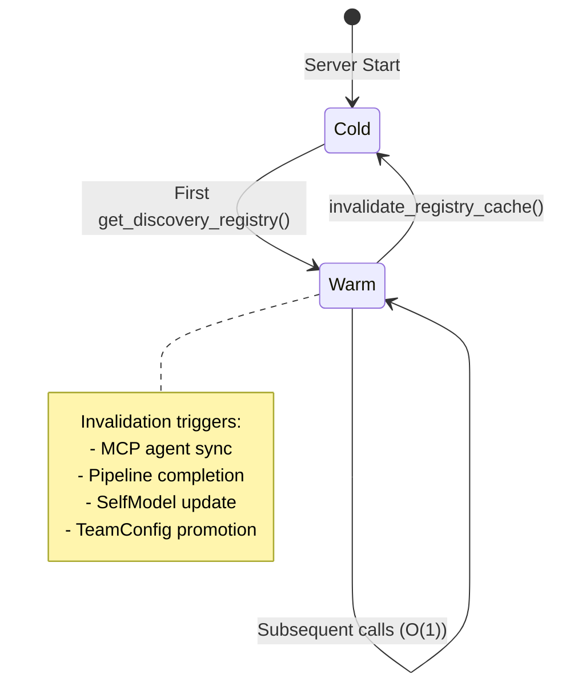
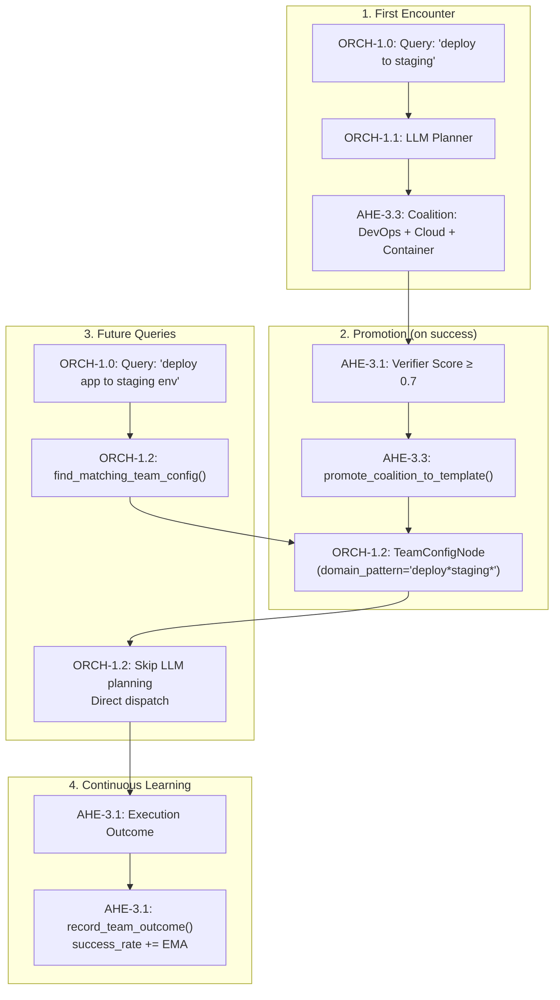

# First Principles Architecture

> **Concepts:** CONCEPT:AU-ORCH.adapter.hot-cache-invalidation, CONCEPT:AU-AHE.evaluation.interpretability-tests, CONCEPT:AU-ORCH.adapter.hot-cache-invalidation, CONCEPT:AU-ECO.messaging.native-backend-abstraction

This document describes the **First Principles Architecture** layer — a set of four foundational concepts that rewire the routing, dispatch, and feedback loops of `agent-utilities` from basic primitives. These concepts were designed to solve specific scalability, performance, and intelligence bottlenecks that emerge when the system manages dozens of specialists and hundreds of tools.

## Problems Solved

| Problem | Root Cause | Solution |
|---------|-----------|----------|
| **Prompt bloat** | Every routing call serialized the full specialist registry into the LLM prompt | CONCEPT:AU-ORCH.adapter.hot-cache-invalidation: Hot cache filters to top-7 relevant specialists per query |
| **Redundant team discovery** | LLM re-discovers the same specialist combinations for recurring query patterns | CONCEPT:AU-AHE.evaluation.interpretability-tests: TeamConfig promotes proven coalitions as reusable templates |
| **Static tool binding** | Specialists had fixed tool sets; capabilities like RLM or critic were never auto-attached | CONCEPT:AU-ORCH.adapter.hot-cache-invalidation: AgentCapability nodes auto-activate based on input constraints |
| **LLM orchestration overhead** | A2A requests required a full LLM planning round-trip even when the graph planner could handle them | CONCEPT:AU-ECO.messaging.native-backend-abstraction: PlannerGraphSkill provides a direct graph-backed A2A entry point |
| **No feedback loop** | Execution outcomes were never fed back to improve future routing | CONCEPT:AU-AHE.evaluation.interpretability-tests + CONCEPT:AU-KG.memory.tiered-memory-caching: Verification outcomes update Self-Model and TeamConfig rewards |

## Architecture Overview

```mermaid
graph LR
    subgraph Ingress ["Protocol Ingress"]
        ECO-4.1: A2A[A2A] --> PGS["PlannerGraphSkill\n(CONCEPT:AU-ECO.messaging.native-backend-abstraction)"]
        ECO-4.1: ACP[ACP] --> Router
        AGUI[ECO-4.0: AG-UI] --> Router
    end

    subgraph Routing ["3-Stage Hybrid Routing"]
        PGS --> Router
        Router --> TC{"TeamConfig\nMatch?\n(CONCEPT:AU-AHE.evaluation.interpretability-tests)"}
        TC -- "Hit" --> Dispatch
        TC -- "Miss" --> SM{"Self-Model\nBias?\n(CONCEPT:AU-KG.memory.tiered-memory-caching)"}
        SM --> LLM["ORCH-1.1: LLM Planner\n(Filtered Prompt)"]
        LLM --> Dispatch
    end

    subgraph Execution ["Dispatch & Execute"]
        Dispatch --> Cache["Registry Cache\n(CONCEPT:AU-ORCH.adapter.hot-cache-invalidation)"]
        Cache --> Specs["ORCH-1.2: Top-7 Specialists"]
        Specs --> Cap{"Capability\nAuto-Activate?\n(CONCEPT:AU-ORCH.adapter.hot-cache-invalidation)"}
        Cap --> Exec["ORCH-1.21: Parallel Execution"]
    end

    subgraph Feedback ["Post-Execution Feedback"]
        Exec --> Verify["AHE-3.1: Verifier"]
        Verify --> SMUpdate["AHE-3.3: Self-Model\nUpdate"]
        Verify --> TCReward["ORCH-1.2: TeamConfig\nReward"]
        SMUpdate --> CacheInv["AU-ECO.mcp.toolkit-live-discovery: Cache\nInvalidation"]
        TCReward --> CacheInv
    end
```

---

## CONCEPT:AU-ORCH.adapter.hot-cache-invalidation — Registry Hot Cache

**Module:** `agent_utilities/core/config.py`

### Problem

Every call to the router required a full registry scan — iterating over all registered specialists (potentially 50+) to serialize their descriptions into the LLM prompt. This created two issues:

1. **Latency**: O(N) scan on every routing call
2. **Prompt bloat**: Injecting 50+ specialist descriptions consumed thousands of tokens, reducing the LLM's effective reasoning window

### Solution

A session-scoped `_RegistryCache` singleton that caches the full specialist registry and provides filtered, query-relevant subsets:

```python
from agent_utilities.core.config import (
    get_discovery_registry,        # Full cached registry
    get_relevant_specialists,      # Filtered top-K for a query
    invalidate_registry_cache,     # Event-driven invalidation
)

# Get only the specialists relevant to "deploy to staging"
relevant = get_relevant_specialists(
    query="deploy the app to staging",
    engine=knowledge_engine,
    top_k=7,
)
# Returns: ["DevOps", "Cloud", "Container Manager", ...]
```

### Cache Lifecycle



### Invalidation Triggers

The cache is invalidated by 4 event sources, ensuring it stays in sync:

| Trigger | Location | Why |
|---------|----------|-----|
| MCP Sync | `mcp/agent_manager.py` → `sync_mcp_agents()` | New tools may create new specialists |
| Pipeline Completion | `knowledge_graph/pipeline/runner.py` → `PipelineRunner.run()` | Code graph changes may affect routing |
| Self-Model Update | `knowledge_graph/self_model.py` | New proficiency data should influence specialist ranking |
| TeamConfig Promotion | `core/registry/kg_adapter.py` → `promote_coalition_to_template()` | New team templates change routing priorities |

---

## CONCEPT:AU-AHE.evaluation.interpretability-tests — TeamConfig Promotion & Proven Team Reuse

**Module:** `agent_utilities/core/registry/kg_adapter.py`

### Problem

The LLM planner would rediscover the same specialist combinations for recurring query patterns. A user who frequently asks "deploy to staging" would see the LLM re-derive the `[DevOps, Cloud, Container Manager]` coalition every time — wasting inference tokens and adding latency.

### Solution

**TeamConfig** nodes persist proven specialist coalitions as reusable templates in the Knowledge Graph. When a similar query arrives, the router checks for a matching TeamConfig *before* invoking the LLM planner.

### TeamConfig Lifecycle



### Data Model

```python
class TeamConfigNode(RegistryNode):
    """CONCEPT:AU-AHE.evaluation.interpretability-tests — Proven Team Reuse"""
    node_type: str = "TEAM_CONFIG"
    domain_pattern: str           # e.g., "deploy*staging*"
    specialist_ids: list[str]     # Ordered specialist node IDs
    success_rate: float = 0.5     # EMA-updated after each use
    uses_count: int = 0
    capability_overrides: dict    # e.g., {"rlm": True} for large inputs
```

### RLM + TeamConfig Synergy

When a TeamConfig is selected and the input exceeds a size threshold, the system auto-attaches the RLM capability to specialists:

```python
# In routing.py — when TeamConfig match is found:
if len(query) > 5000 and "rlm" not in team_config.capability_overrides:
    team_config.capability_overrides["rlm"] = True
    # RLM becomes part of the proven team template
```

### Key Functions

| Function | Purpose |
|----------|---------|
| `find_matching_team_config(domain, query)` | Search for a reusable TeamConfig matching the query |
| `promote_coalition_to_template(specialists, domain, query)` | Create a new TeamConfig from a successful coalition |
| `record_team_outcome(config_id, success)` | Update TeamConfig success_rate via EMA |
| `link_prompt_to_agent(agent_id, prompt_id)` | Create USES_PROMPT edges for traceability |

---

## CONCEPT:AU-ORCH.adapter.hot-cache-invalidation — AgentCapability Type System

**Module:** `agent_utilities/models/knowledge_graph.py`, `agent_utilities/graph/executor.py`

### Problem

Specialist agents had static, fixed tool bindings defined at registration time. Cross-cutting capabilities like RLM (recursive decomposition), critic (code review), or summarizer (context compression) were never dynamically attached based on the actual task characteristics.

### Solution

`AgentCapabilityNode` is a first-class Knowledge Graph node that models capabilities with trigger conditions, handler modules, and auto-activation flags. During execution, the system queries the KG for capabilities associated with the active specialist and activates them when trigger conditions are met.

### Data Model

```python
class AgentCapabilityNode(RegistryNode):
    """CONCEPT:AU-ORCH.adapter.hot-cache-invalidation — Agent Capability Type System"""
    node_type: str = "AGENT_CAPABILITY"
    capability_type: str          # e.g., "rlm", "critic", "summarizer"
    auto_activate: bool = False   # If True, system checks triggers automatically
    trigger_conditions: dict      # e.g., {"input_size_gt": 5000, "domain": "code"}
    handler_module: str           # e.g., "agent_utilities.rlm.executor"
    priority: int = 0             # Higher = checked first
```

### Auto-Activation in Executor

The executor loop in `executor.py` checks for auto-activatable capabilities before each specialist run:

```python
# Simplified from executor.py
for specialist in specialists:
    capabilities = engine.query(
        "MATCH (s)-[:HAS_CAPABILITY]->(c:AgentCapability) "
        "WHERE s.id = $sid AND c.auto_activate = true "
        "RETURN c",
        sid=specialist.id,
    )
    for cap in capabilities:
        if _check_trigger(cap.trigger_conditions, input_text):
            logger.info("[CONCEPT:AU-ORCH.adapter.hot-cache-invalidation] Auto-activating %s for %s", cap.capability_type, specialist.name)
            # Activate the capability handler before execution
```

### Trigger Condition Evaluation

| Condition Key | Example Value | Meaning |
|---------------|---------------|---------|
| `input_size_gt` | `5000` | Input exceeds 5000 characters |
| `domain` | `"code"` | Task is code-related |
| `has_images` | `true` | Input contains image data |
| `tool_count_gt` | `20` | Specialist has >20 tools |

---

## CONCEPT:AU-ECO.messaging.native-backend-abstraction — PlannerGraphSkill (A2A-Native Routing)

**Module:** `agent_utilities/protocols/a2a_graph_skill.py`, `agent_utilities/server/app.py`

### Problem

A2A requests always went through the full LLM-mediated pipeline: parse request → LLM decides routing → dispatch to graph. This added an unnecessary inference round-trip when the graph planner already had enough information to handle the request directly.

### Solution

`PlannerGraphSkill` is an A2A-native skill that routes requests directly through the graph planner, bypassing LLM orchestration overhead:

```python
class PlannerGraphSkill:
    """CONCEPT:AU-ECO.messaging.native-backend-abstraction — A2A-Native PlannerAgent"""

    def __init__(self, graph_bundle):
        self.graph_bundle = graph_bundle

    async def execute(self, request):
        """Direct graph-backed planning — no LLM round-trip."""
        state = GraphState(user_query=request.query)
        result = await run_graph_flow(self.graph_bundle, state)
        return result
```

### Registration

The skill is automatically registered in `server/app.py` when a `graph_bundle` is available:

```python
# In build_agent_app():
if graph_bundle:
    planner_skill = PlannerGraphSkill(graph_bundle)
    a2a_skills.append(planner_skill)  # Registered before generic LLM skill
```

### Routing Priority

| Priority | Entry Point | When Used |
|----------|------------|-----------|
| 1 (highest) | `PlannerGraphSkill` | A2A requests when `graph_bundle` is present |
| 2 | Direct Graph Execution | AG-UI/ACP when `GRAPH_DIRECT_EXECUTION=true` |
| 3 (fallback) | LLM-Mediated | When no graph is available or A2A negotiation needed |

---

## KG Schema Additions

### Node Types

| Type | Concept | Description |
|------|---------|-------------|
| `TEAM_CONFIG` | CONCEPT:AU-AHE.evaluation.interpretability-tests | Proven specialist coalition template |
| `AGENT_CAPABILITY` | CONCEPT:AU-ORCH.adapter.hot-cache-invalidation | Dynamic capability with trigger conditions |

### Edge Types

| Type | Concept | Description |
|------|---------|-------------|
| `HAS_CAPABILITY` | CONCEPT:AU-ORCH.adapter.hot-cache-invalidation | Links specialist → capability |
| `REUSED_TEAM` | CONCEPT:AU-AHE.evaluation.interpretability-tests | Links session → TeamConfig (tracks reuse) |
| `USES_PROMPT` | CONCEPT:AU-AHE.evaluation.interpretability-tests | Links specialist → JSON prompt template |

---

## Testing

```bash
# Registry cache tests
python -m pytest tests/unit/core/test_config_helpers.py -v

# TeamConfig promotion and reward tracking
python -m pytest tests/test_team_config.py -v

# AgentCapability node and auto-activation
python -m pytest tests/unit/core/test_capabilities.py \
    tests/unit/graph/test_capability_designation.py -v

# All first-principles tests
python -m pytest tests/unit/core/test_config_helpers.py \
    tests/test_team_config.py \
    tests/unit/core/test_capabilities.py -v
```

---

## Related Documentation

- [Registry Cache Deep-Dive](../1_graph_orchestration/registry-cache.md) — Focused cache architecture and performance analysis
- [Process Lifecycle Management](../5_agent_os_infrastructure/process-lifecycle.md) — Sidecar cleanup and signal handling
- [Emergent Architecture](../2_epistemic_knowledge_graph/emergent-architecture.md) — CONCEPT:AU-KG.query.object-graph-mapper through CONCEPT:AU-ORCH.adapter.hot-cache-invalidation (OGM, Swarm, Self-Model, Attention)
- [Architecture](../1_graph_orchestration/architecture.md) — Full system architecture with routing diagrams
