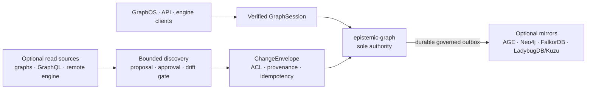

# Graph Database Deployment & Multi-Backend Guide

> **CONCEPT:AU-KG.query.object-graph-mapper** — governed graph deployment

The Rust-native `epistemic-graph` engine is the sole primary authority and
system of record. It serves operational reads, commits writes, runs graph and
multimodal compute, and persists authoritative state. PostgreSQL/Apache AGE,
Neo4j, FalkorDB, LadybugDB/Kuzu, GraphQL, and remote graph engines are optional
external systems with one of two explicit roles:

- **mirror** — receives the engine's governed replication stream for interop,
  analytics, external query, or disaster recovery;
- **read source** — is discovered and mapped under approval, then materialized
  into the engine through native `ChangeEnvelope` transactions.

An external database never replaces the engine authority, receives direct
operational lifecycle writes, or becomes an implicit fallback.

## Authority contract


```mermaid
flowchart LR
    CLIENT["GraphOS · API · engine clients"] --> SESSION["Verified GraphSession"]
    SESSION --> EG["epistemic-graph<br/>sole authority"]
    EG -->|"durable governed outbox"| MIRRORS["Optional mirrors<br/>AGE · Neo4j · FalkorDB · LadybugDB/Kuzu"]
    SOURCES["Optional read sources<br/>graphs · GraphQL · remote engine"] --> DISCOVER["Bounded discovery<br/>proposal · approval · drift gate"]
    DISCOVER --> ENVELOPE["ChangeEnvelope<br/>ACL · provenance · idempotency"]
    ENVELOPE --> EG
```

The engine authority requires no selector or external graph service. Declaring
one or more `role=mirror` connections (or naming them in
`GRAPH_MIRROR_TARGETS`) automatically adds governed fan-out around the same
authority. Alternate-authority and backend-mode selectors are not accepted.

## Role and capability matrix

| System | Allowed role | Typical purpose | Operational authority |
|---|---|---|---|
| `epistemic-graph` | authority | Graph, semantic, vector, multimodal, work-state, and durable compute | **Yes — sole authority** |
| PostgreSQL + Apache AGE | mirror or read source | openCypher, vector/relational analytics, BI, DR | No |
| Neo4j | mirror or read source | Native-Cypher interoperability and external analysis | No |
| FalkorDB | mirror or read source | Redis-backed graph interoperability | No |
| LadybugDB/Kuzu | mirror or read source | Embedded, single-writer external graph copy | No |
| Remote `epistemic-graph` | read source | Governed federation/materialization | No |
| GraphQL | read source | Schema-discovered document or domain ingestion | No |

External products are independently deployed and operated. Agent Utilities
stores only neutral aliases and secret references; endpoint, database, identity,
credential, TLS, query, schema, mapping, and ontology material stay in the
operator's runtime secret system.

## Deploy the authority

Install GraphOS with the bundled full engine. Configure the engine's
persistence, transport, authentication, and TLS through AgentConfig and runtime
secret references appropriate to the selected deployment profile. There is no
backend or authority selector to set.

For a durable deployment, configure an engine persistence directory through the
deployment layer. The engine's built-in redb store commits before acknowledgement;
no PostgreSQL, Neo4j, or embedded Python database is required for authority
durability. See [Deployment Configurations](deployment-configurations.md) for the
single-node and clustered profiles.

## Add an optional mirror

Declare each mirror by a neutral name, backend kind, `role=mirror`, and a
runtime connection-profile reference. The referenced document holds all
transport and trust material and is resolved only when the mirror connects.

```json
{
  "GRAPH_MIRROR_TARGETS": ["analytics-mirror"],
  "KG_CONNECTIONS": [
    {
      "name": "analytics-mirror",
      "backend": "age",
      "role": "mirror",
      "connection_profile_ref": "secret://graph-connections/analytics-mirror"
    }
  ]
}
```

The write path is:

1. Commit the mutation to `epistemic-graph`.
2. Append the mutation to the named mirror's durable outbox.
3. Apply asynchronously through the mirror's single drainer.
4. Retain and replay an unavailable mirror's ordered tail after recovery.

A file-locked LadybugDB/Kuzu mirror is still owned by one drainer. Agent and MCP
processes must not open it directly. A mirror is eventually consistent and must
not be used to answer authority reads.

### Mirror operations

```text
graph_configure action=list_connections
graph_configure action=mirror_status
graph_configure action=reconcile config_key=analytics-mirror
```

`mirror_status` reports bounded health and lag without returning endpoints,
credentials, certificate paths, or raw error payloads. Reconciliation copies
the authoritative graph into the mirror through backend-native, idempotent
upserts.

## Add an optional external graph source

A source is not a mirror. It is read only, and its records become operational
only after the governed connector materializes them into the engine. Supported
adapters include Neo4j/openCypher, Apache AGE, LadybugDB/Kuzu, remote
`epistemic-graph`, and GraphQL.

AgentConfig stores a reference-only declaration:

```json
{
  "EXTERNAL_GRAPH_CONNECTORS": [
    {
      "name": "domain-source",
      "source_alias": "domain-source",
      "backend": "neo4j",
      "connection_profile_ref": "secret://external-graphs/domain-source/connection",
      "mapping_policy_ref": "secret://external-graphs/domain-source/mapping",
      "tls_profile_ref": "secret://external-graphs/domain-source/tls",
      "require_approval": true
    }
  ]
}
```

Then run the current-only lifecycle:

```text
graph_configure action=discover_connection_schema config_key=domain-source
graph_configure action=propose_connection_mapping config_key=domain-source
graph_configure action=approve_connection_mapping config_key=domain-source
graph_configure action=external_graph_doctor config_key=domain-source
graph_configure action=ingest_connection config_key=domain-source
```

Discovery is bounded and read-only. Approval binds the source schema digest,
mapping-policy digest, identity rule, ACL policy, and ingestion bounds. Every
ingest rediscovers the schema and fails closed on partial discovery or drift.
The approved mapping emits native, idempotent `ChangeEnvelope` transactions;
raw source identifiers are keyed to opaque identities before persistence.

GraphQL uses the same lifecycle. Its operation, variables, headers, and schema
remain in referenced runtime documents. Introspection is opt-in, generated
mappings still require approval, and mutation/subscription operations are
rejected.

See [Universal External Graph Connectors](../architecture/universal-external-graph-connectors.md)
and [Privacy-safe External Graph Ingestion](../architecture/privacy-safe-external-ingestion.md)
for adapter limits and profile schemas.

## Verification gates

Run the focused doctor checks after changing authority, mirror, source, or trust
configuration:

```bash
agent-utilities-doctor --only engine graph_backend graph_connections transport_security
```

The deployment is ready only when:

- the engine authority is reachable and durable under the selected profile;
- every named mirror has a resolvable reference, verified TLS, and no stalled
  outbox tail;
- every external source passes the connector capability gate and has an
  approved, drift-free mapping;
- no inline endpoint, credential, certificate, query, custom ontology, local
  path, or personal identifier exists in AgentConfig or tracked files.

For backend conformance tests, use the sequential matrix in
[Backend Parity and Profile Testing](backend-parity-and-profile-testing.md).
Those tests validate optional systems; they do not promote one to authority.

## Failure handling

- **Authority unavailable:** fail closed. Do not redirect reads or writes to a
  mirror.
- **Mirror unavailable:** the authority continues; retain the outbox tail,
  repair the runtime profile, then reconcile.
- **Source unavailable or drifting:** ingest applies no authoritative snapshot
  deletion and does not advance its checkpoint. Rediscover, review, and approve
  a new mapping.
- **TLS verification failure:** repair the referenced CA/mTLS profile. Never
  hardcode `verify=false` or disable certificate validation.
- **Single-writer mirror contention:** stop unmanaged writers and leave ownership
  with the one governed mirror drainer.

The deeper storage and replication design is documented in
[Graph Backend Architecture](../architecture/graph_backends_architecture.md).
