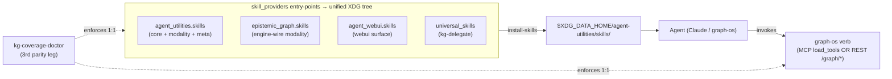

# The `kg-*` Skill Suite

> A standardized, discoverable skill for **every** capability on the graph-os surface.
> Concept: `AU-ECO.mcp.kg-skill-verb-coverage` (the coverage gate that keeps it honest).

## Why this exists

graph-os exposes ~84 MCP verbs (`graph_*`, `engine_*`, `ontology_*`, `object_*`, …) plus a
REST twin for each. Historically an agent had to *know* those verbs existed to use them. The
`kg-*` skill suite makes the whole surface **self-describing**: one `SKILL.md` per capability,
each with a trigger-oriented `description` an agent routes on, and a body that says exactly how
to invoke the underlying verb. A CI/pre-commit gate keeps the suite **1:1** with the live verb
surface, so a new verb can never ship without a skill and a skill can never point at a dead verb.



## Naming convention (user-locked)

`kg-<capability>` where `<capability>` = the MCP verb **minus the `graph_` prefix**, with
`_`→`-`. So `graph_ontology` → **`kg-ontology`**, `graph_query` → **`kg-query`**. The slug alone
maps a skill to its verb, so the coverage doctor can diff mechanically with zero configuration
for the common case.

Two escape hatches for the parts of the surface that are not a clean 1:1:

| Frontmatter | Purpose |
|---|---|
| `tier: core \| modality \| meta \| surface` | Declares what kind of skill it is. `core`/`modality` wrap a verb; `meta`/`surface` do not and are **exempt** from the coverage check. |
| `wraps: [verb, …]` | For a skill that fronts **several** verbs (e.g. `kg-ingest` fronts `graph_ingest` + `source_sync` + …). Omit when the slug already implies the single verb. |

## The catalog (64 skills)

### Core verb skills — `tier: core` (agent-utilities)

Slug-only (slug → `graph_<x>`): `kg-query` · `kg-ask` · `kg-table` · `kg-context` ·
`kg-message` · `kg-write` · `kg-feedback` · `kg-analyze` · `kg-orchestrate` · `kg-configure` ·
`kg-research` · `kg-evaluate` · `kg-explain` · `kg-observe` · `kg-goals` · `kg-loops` ·
`kg-schedules` · `kg-sandbox` · `kg-feeds` · `kg-hydrate` · `kg-writeback` · `kg-etl` ·
`kg-share` · `kg-reach` · `kg-bus` · `kg-secret` · `kg-broker` · `kg-kvcache` · `kg-promql` ·
`kg-traces` · `kg-gis` · `kg-memory` · `kg-fork`.

Grouped (declare `wraps:`):

| Skill | Wraps |
|---|---|
| `kg-search` | `graph_search`, `graph_search_synthesis`, `graph_federated_search` |
| `kg-code` | `graph_code`, `graph_code_nav` |
| `kg-sessions` | `graph_sessions`, `ingest_sessions`, `usage_query` |
| `kg-ontology` | `graph_ontology`, every `ontology_*` + `object_*` verb |
| `kg-ingest` | `graph_ingest`, `source_sync`, `source_drain`, `source_connector`, `document_process` |
| `kg-ask` | `graph_ask`, `ask_data` |
| `kg-query` | `graph_query`, `nl_query` |
| `kg-goals` | `graph_goals`, `spec_ticket` |
| `kg-extract-concepts` | `concept_registry` |
| `kg-persist-report` | `research_artifact` |

### Modality skills — `tier: modality` (wrap the `engine_*` domains)

| Skill | Wraps | Provider |
|---|---|---|
| `kg-modality-nodes-edges` | `engine_nodes`, `engine_edges`, `engine_graph`, `engine_lifecycle` | AU |
| `kg-modality-blob` | `engine_blob` | AU |
| `kg-modality-analytics` | `engine_analytics`, `engine_datascience` | AU |
| `kg-modality-timeseries` | `engine_timeseries` | AU |
| `kg-modality-streaming` | `engine_streaming` | AU |
| `kg-modality-txn` | `engine_txn` | AU |
| `kg-modality-ledger` | `engine_ledger` | AU |
| `kg-modality-channels` | `engine_channels` | AU |
| `kg-modality-finance` | `engine_finance` | AU |
| `kg-modality-sparql` | `engine_rdf` (SPARQL 1.1 over HTTP) | epistemic-graph |
| `kg-modality-reasoning` | `engine_reasoning` (OWL-RL / rules) | epistemic-graph |
| `kg-modality-sql` | `engine_query` (pgwire / psql) | epistemic-graph |
| `kg-modality-consensus` | `engine_consensus`, `engine_resharding`, `engine_tenants` | epistemic-graph |

The engine-wire modality skills live in **epistemic-graph** because that package owns the wire
protocols (SPARQL HTTP, pgwire/Bolt, cluster/raft) and their documentation.

### Meta skills — `tier: meta` (agent-utilities, not verb wrappers)

| Skill | Purpose |
|---|---|
| `kg-mux-use` | The multiplexer meta-tools (`find_tools` / `list_catalog` / `load_tools` / `unload_tools` / `multiplexer_status`) — discover + mount fleet tools on demand. |
| `kg-mux-extend` | Add & register a child MCP server end-to-end (`mcp_config*.json` + `readme_mcp_examples` + `graph_configure action=register_mcp`). |
| `kg-capability-builder` | The end-to-end recipe: engine crate → `engine_<domain>`/`graph_*` verb → REST route → wrapping skill. |
| `kg-coverage-doctor` | The gate keeping this suite 1:1 with the verb surface (see below). |
| `kg-delegate` | Routes work to the graph-os orchestrator (`graph_orchestrate execute_workflow`). *Renamed from `kg-delegation-router`; lives in universal-skills.* |

### Surface skills — `tier: surface` (agent-webui, the web UI)

`kg-webui-graphviz` · `kg-webui-ontology-operator` · `kg-webui-admin` · `kg-webui-dashboards` ·
`kg-webui-extraction` · `kg-webui-swe`. Each maps to the `/api/enhanced/*`, `/api/fleet/*`,
`/api/graph/*`, `/api/runtime/*`, `/api/observability/*` routes it drives (see
`agent-webui/src/lib/api.ts`).

## Installing the suite

Skills ship inside their owning package's wheel and are discovered by the hub through the
`agent_utilities.skill_providers` entry-point group (`core/providers.py`). Install them into any
agent tool with the **`skill-installer`** skill:

```bash
# Recommended for Claude Code: symlink the atomic layer (includes every kg-* verb skill + kg-delegate)
install-skills --tool claude --symlink --layer atomic

# One-command bootstrap into every agent tool present on the host
install-skills --all-detected --symlink --layer atomic
```

`--symlink` links to the installed package (no duplicate files, auto-updates on
`pip install -U`). The heavy skill-*workflows* stay on the graph-os orchestrator; Claude fires
them via `kg-delegate` rather than loading all of them into context.

> **Editable-install note.** Discovery reads setuptools entry-point metadata. After adding or
> renaming a provider's skills in an editable checkout, refresh its metadata
> (`pip install -e <pkg> --no-deps`) so `install-skills` sees the new entry-points — otherwise
> `entry_points()` returns stale data and the new skills are skipped.

## Invoking a `kg-*` skill

Every skill body documents both paths into graph-os:

- **MCP:** `load_tools(tools=["<verb>"])` via the multiplexer, then call the verb.
- **REST twin:** `POST /graph/<verb>` (or `/engine/*`, `/ontology/*`, …) with a JSON body
  carrying the `action` and its arguments. The verb→route map is `ACTION_TOOL_ROUTES` in
  `agent_utilities/mcp/kg_server.py`.

## The coverage doctor (`kg-coverage-doctor`)

`AU-ECO.mcp.kg-skill-verb-coverage` is the **third parity leg** of
`tests/unit/test_gateway_mcp_parity.py` (the first two enforce MCP-tool ⇄ REST-route parity).
Its logic lives in `agent_utilities/mcp/skill_coverage.py` and is shared by the test and the
skill's CLI:

```bash
python -m agent_utilities.mcp.skill_coverage        # exit 0 = green, 1 = drift with a report
pytest tests/unit/test_gateway_mcp_parity.py -q     # legs 1-3
pre-commit run guardrail-kg-skill-coverage --all-files
```

It asserts:

1. **Coverage** — every verb in the live `kg_server.REGISTERED_TOOLS` (minus a tiny, justified
   `INTENTIONALLY_UNSKILLED` set — currently just `quant`) is wrapped by ≥1 `kg-*` skill.
2. **No orphans** — every `tier: core|modality` skill maps to a real verb (by slug or `wraps:`).
3. **Exemptions** — `tier: meta|surface` skills are excluded.

Discovery unions live entry-point dirs with a direct import-path resolve of the known provider
modules, so the gate is stable even when editable-install entry-point metadata is stale.

## Adding a new `kg-*` skill

1. A new graph-os verb landed (or you're wrapping an existing one). Author the skill with
   **`skill-builder`** — `name` == dir, a trigger-oriented `description`, `license: MIT`, `tags`,
   `tier:`, and `wraps:` if it fronts more than its slug-implied verb.
2. Put it in the right provider: `agent_utilities/skills/` (core/modality/meta), the owning
   engine package (`epistemic_graph/skills/` for wire modality), or `agent_webui/skills/`
   (surface).
3. Run `python -m agent_utilities.mcp.skill_coverage` → drive it to **0 uncovered, 0 orphans**.
4. `install-skills --tool claude --symlink --layer atomic` to pick it up.

If a verb is intentionally *not* surfaced as a skill, add it to
`skill_coverage.INTENTIONALLY_UNSKILLED` with a one-line reason — that is the only sanctioned
way to keep the gate green without a skill.

## Not yet covered (blocked on verbs)

- **`kg-graphql`** — needs a `graph_graphql` verb/route.
- **`kg-modality-lakehouse`** — needs `engine_lake` in `_DOMAIN_CLASSES`.

The coverage doctor correctly does **not** require these until their verbs ship.
