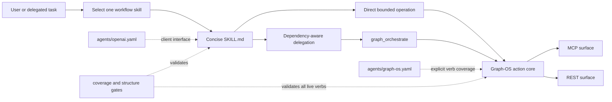

# The pre-bundled workflow skill suite

Agent Utilities ships exactly ten comprehensive workflow skills. Callers select a
current domain or platform workflow and it chooses the appropriate GraphOS
operations.

## Architecture


```mermaid
flowchart LR
    Request[User or delegated task] --> Select[Select one workflow skill]
    Select --> Skill[Concise SKILL.md]
    Skill --> Direct[Direct bounded operation]
    Skill --> Delegate[Dependency-aware delegation]
    Direct --> Core[Graph-OS action core]
    Delegate --> Orchestrator[graph_orchestrate]
    Orchestrator --> Core
    Core --> MCP[MCP surface]
    Core --> REST[REST surface]

    OpenAI[agents/openai.yaml] -. client interface .-> Skill
    Coverage[agents/graph-os.yaml] -. explicit verb coverage .-> Core
    Gate[coverage and structure gates] -. validates .-> Skill
    Gate -. validates all live verbs .-> Core
```

The prose and machine contracts are deliberately separate:

- `SKILL.md` contains only `name` and `description` frontmatter plus the portable
  operating workflow.
- `agents/openai.yaml` contains the generated display name, short description, and
  a default prompt that explicitly invokes the skill.
- `agents/graph-os.yaml` contains Graph-OS-only coverage metadata.

## Current inventory

| Skill | Primary responsibility | Live verbs claimed |
|---|---|---:|
| `graph-query-and-explanation` | Query, search, code navigation, epistemic answers, and cited explanation | 21 |
| `graph-ingestion-and-integration` | Source onboarding, document processing, delta sync, ETL, and writeback | 10 |
| `graph-modeling-and-mutation` | Ontology, objects, concepts, memory, and governed writes | 17 |
| `graph-research-and-analysis` | Research, mining, learning, causal analysis, feedback, and reports | 9 |
| `graph-orchestration-and-automation` | Goals, workflows, schedules, sandboxes, run control, and messaging | 16 |
| `graph-runtime-and-governance` | Configuration, health, incidents, audit, compliance, sessions, and traces | 12 |
| `graph-engine-and-modalities` | Native SQL, SPARQL/RDF, reasoning, analytic, stream, ledger, cluster, tenancy, RBAC, and admin domains | 25 core + 1 `finance` |
| `agent-utilities-development` | Isolated implementation, live wiring, tests, docs, and delivery gates | — |
| `agent-utilities-deployment` | Profile-driven installation, rollout, migration, verification, upgrade, and recovery | — |
| `agent-utilities-evolution` | Evidence assimilation, proposals, optimization, and regression hardening | — |

The seven domain skills explicitly cover all 110 required Graph-OS ToolSpecs
(104 granular capabilities plus six intent entry points) and the optional
`finance` ToolSpec `quant`. The three platform skills orchestrate those domains
but do not claim new verbs.

## Graph-OS sidecar schema

Every retained skill has `agents/graph-os.yaml` using the closed version-2 schema:

```yaml
schema_version: 2
tier: domain
claims:
  core:
    - graph_query
    - graph_search
  features:
    finance:
      - quant
```

Rules:

- `tier` is `domain` or `platform`.
- `claims` contains exactly `core` and `features`.
- A domain skill has sorted, unique claims and at least one core or feature claim.
- A platform skill has an empty `core` list and empty `features` mapping.
- Core claims cover required ToolSpecs. Optional claims are nested under their
  enabling feature; `quant`, for example, is valid only under `finance`.
- Unknown keys are invalid.
- Coverage is never inferred from the directory name or from `SKILL.md`.
- Each canonical ToolSpec has exactly one domain owner; overlapping claims are invalid.
- Schema version 1 and `wraps` are rejected rather than translated.
- There are no intentionally-unskilled waivers; every required and optional
  ToolSpec is explicit.

This design allows a skill to remain a coherent workflow instead of degenerating
into one wrapper per verb.

## Direct and delegated use

Use a skill directly for one bounded operation with an obvious verification. Let
the same skill delegate through `graph-orchestrate` when the request has independent
work, dependencies, multiple domains, or a useful critique/synthesis stage.

Choose an economy model class for deterministic extraction, classification,
formatting, and bounded operational checks. Use a stronger reasoning model for
architecture, causal judgment, adversarial review, and final synthesis. Authorization
and privacy constraints stay unchanged across model or delegation boundaries.

The distribution-owned version-2 forward-test matrix under
`agent_utilities/skills/` defines one direct and one
delegated synthetic task for every skill. Direct cases are no-tool semantic checks.
Delegated cases enter through `graph_orchestrate` with a sorted, least-privilege child
tool allowlist and fixed step and token limits. Every case is read-only, uses only
`$skill` and `skill://<name>` references, and requires metadata-only observability.
Validation evidence must not retain a local filesystem path, personal name, private
endpoint, credential, raw model output, or raw trace identifier.

## Installation and discovery

The suite is packaged under `agent_utilities/skills/` and exposed through the
`agent_utilities.skill_providers` entry-point group. Run
`agent-utilities install` to materialize provider contributions for supported
agent clients. The installation contains only the ten current names.

## Validation

Run the structural, interface, privacy, and forward-matrix gate:

```bash
python -m agent_utilities.skills.validation
```

Run the live MCP-to-skill coverage comparison:

```bash
python -m agent_utilities.mcp.skill_coverage
pytest tests/unit/test_gateway_mcp_parity.py -q
```

Run the skill-creator validator once for every retained directory after changing
skill prose or interface metadata. The gate additionally checks the exact ten-skill
taxonomy, standard frontmatter, both sidecars, the 500-line ceiling, sensitive-data
patterns, and the 20-case forward matrix.

For an ad hoc diagnostic against an already deployed GraphOS endpoint, run direct
or delegated mode without release evidence:

```bash
agent-utilities-validate-skills \
  --mode direct \
  --report reports/skill-validation-matrix.md
```

`--mode all` is not an ad hoc report command. It is the exact-release evidence
producer and therefore requires adjacent Markdown/JSON destinations plus all seven
verified digests and external signer/verifier references:

```bash
agent-utilities-validate-skills \
  --mode all \
  --report <external-report.md> \
  --evidence <external-validation.json> \
  --release-id release-<id> \
  --release-specification-digest sha256:<digest> \
  --promotion-evidence-digest sha256:<digest> \
  --graph-os-digest sha256:<digest> \
  --engine-digest sha256:<digest> \
  --runtime-config-digest sha256:<digest> \
  --runtime-profile-digest sha256:<digest> \
  --model-registry-digest sha256:<digest> \
  --signer-command-ref SKILL_VALIDATION_EVIDENCE_SIGNER_COMMAND \
  --verifier-command-ref SKILL_VALIDATION_EVIDENCE_VERIFIER_COMMAND
```

Operators should not assemble those arguments manually. The release path is
`graph-os-generate-skill-runtime-profile`,
`graph-os-generate-skill-certification`, `graph-os-certify-skills`, and then
`graph-os-verify-skill-certification`; see
[Exact skill-validation certification](../release/skill-validation-certification.md).
Regenerate evidence for every exact installed artifact rather than committing a
stale golden result or an environment-specific deployment profile.

The harness starts no service and loads no model itself. The exact certification
orchestrator owns its verified HTTPS loopback OIDC authority and injects it only
into campaign children. Configure the endpoint, model registry, model TLS trust,
Langfuse exporter, and Langfuse MCP child through `AgentConfig`; do not put
endpoints, credentials, or CA paths in the matrix. Content capture must remain
disabled. Direct cases use the exact
skill body as their system instructions and a typed output contract. Delegated cases
execute through the single-operation
`graph_orchestrate(agent_name=..., task=..., ...)` surface with no `action`
argument. The returned opaque `run_id` is polled to the exact terminal state
`completed` through `graph_jobs(action="status", job_id=run_id)`.

Delegated validation accepts only `output` plus an opaque handle containing 128
CSPRNG bits (`run:` plus 32 lowercase hexadecimal characters), and optional
`mermaid`, followed by the exact terminal status `completed`. Every shorter or
alternate response shape and every other terminal status fails validation.

All cases run sequentially. Blocking exporter work admits one worker at a time; a
timeout or cancellation poisons and aborts that certification process so abandoned
SDK calls cannot accumulate past the case budget. For each case the harness queries the Langfuse MCP child
by the exact tenant-qualified opaque trace name and requires exactly one trace whose
closed metadata binds the same run, configured model, model class, skill, and skill
body digest. It verifies the mounted child reports metadata-only retention before any
case runs, then requires exactly one corresponding `Trace` node written through
GraphOS parent mediation under the verified `kg:write` session. Unrelated project
traces are never fetched; zero or duplicate exact matches fail closed. The generated
report stores only controlled status values, safe route
slugs, opaque run/trace references, and controlled error codes. Report publication is
atomic through no-follow directory descriptors, rejects symlink destinations, and
uses mode `0600` on POSIX. Publication fails closed on non-POSIX platforms until
equivalent native reparse-point and private-ACL guarantees exist. It never stores
prompts, outputs, identities, connection details, or filesystem locations.

When adding a Graph-OS verb, place it in the existing owning domain sidecar and
extend that workflow's decision guidance. Create a new skill only when the capability
introduces a genuinely distinct end-to-end workflow that does not fit the ten-domain
taxonomy.
