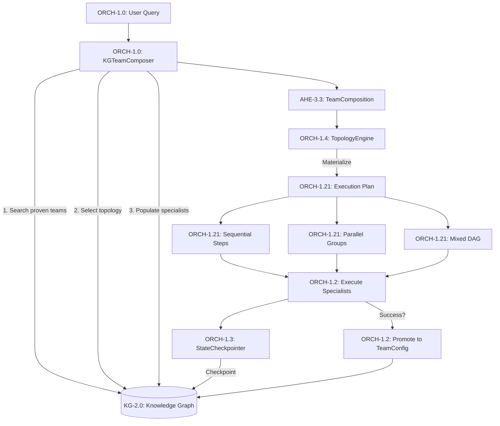
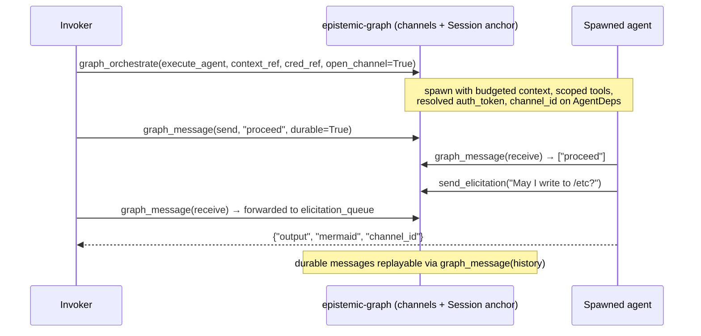

# KG-Native Orchestration Architecture

> **CONCEPT:AU-ORCH.planning.recursion-nesting-depth through ORCH-1.19** — Dynamic, Knowledge-Graph-Driven Agent Orchestration

## Overview

KG-Native Orchestration transforms agent-utilities from a **KG-aware** system (where the Knowledge Graph is optionally consulted) into a **KG-driven** system where the KG is the primary control surface for all orchestration decisions.

```
Before:  Query → Static Graph Topology → (optionally consult KG) → Execute
After:   Query → KG resolves topology → Dynamic Graph Materialization → Execute → KG learns
```

## Architecture



## Core Components

### 1. KG-Driven Team Composer (`graph/team_composer.py`)

**CONCEPT:AU-ORCH.planning.recursion-nesting-depth** — Replaces static `discover_agents()` registration with dynamic KG-topology-driven team assembly.

**Composition Flow:**
1. **Reuse**: Search KG for proven `TeamConfigNode` matching the query (AHE-3.3)
2. **Select**: Choose best `TopologyTemplateNode` by domain + complexity
3. **Populate**: Walk KG edges (`PROVIDES`, `HAS_CAPABILITY`) to assign tools
4. **Promote**: On success, save the team as a new `TeamConfigNode`

**Default Topologies:**

| Template | Mode | Complexity | Specialists |
|----------|------|-----------|-------------|
| Single Agent | Sequential | 1 | 1 executor |
| Simple Q&A | Sequential | 1-2 | router → expert → verifier |
| Multi-Source Research | Mixed | 3-4 | router → planner → [researchers] → synthesizer → verifier |
| Expert Team | Mixed | 4-5 | router → planner → architect → [implementer, reviewer] → synthesizer |
| Finance Pipeline | Sequential | 3-5 | router → alpha → risk → execution → attribution |

### 2. Dynamic Topology Engine (`graph/topology_engine.py`)

**CONCEPT:AU-ORCH.adapter.hot-cache-invalidation** — Materializes KG-stored topology templates into executable graphs.

**Supported Execution Modes:**

- **Sequential**: `A → B → C` — Simple pipeline
- **Parallel**: `[A, B, C]` — All execute concurrently
- **Fan-out**: `A → [B₁, B₂, ..., Bₙ]` — Scatter
- **Fan-in**: `[B₁, B₂, ..., Bₙ] → C` — Gather
- **Mixed**: `A → [B, C] → D → [E, F] → G` — Arbitrary DAG

Each materialized specialist gets:
- **System Prompt**: Role-specific or KG-loaded via `PromptNode`
- **MCP Tools**: Only the tools needed for that role
- **Model**: Per-specialist model selection
- **Memory Channels**: Shared KG channels for P2P communication

### 3. Execution State Checkpointing (`core/checkpoint/manager.py`)

**CONCEPT:AU-ORCH.planning.recursion-nesting-depth** — Bridges ephemeral `GraphState` with persistent KG. The
former `graph/state_checkpoint.StateCheckpointer` was consolidated into the
`core/checkpoint/` package (`KGBackend` + `CheckpointManager`).

```python
from agent_utilities.core.checkpoint.manager import KGBackend

backend = KGBackend(engine)
checkpoint_id = backend.checkpoint(state, session_id="sess:abc")
restored = backend.restore("sess:abc")
```

**Capabilities:**
- Checkpoint at HSM transition boundaries
- Session resume after crashes
- Cross-session learning
- Multi-agent coordination (other agents can query active state)

### 4. Topological Routing Policy (`graph/routing/strategies/policy.py`)

**CONCEPT:AU-ORCH.adapter.kg-graph-materialization** — Routes using KG-derived topological signals instead of keyword TF-IDF.

**Scoring Dimensions:**
1. **PageRank centrality** — Highly-connected specialists preferred
2. **Historical success rate** — Weighted by outcome evaluations
3. **Tool affinity** — Specialists with relevant `PROVIDES` edges score higher

Falls back to `RuleBasedPolicy` when no KG is available (cold start).

### 5. Persistent Background Agents (`graph/persistent_agents.py`)

**CONCEPT:AU-ORCH.adapter.kg-graph-materialization** — Long-running KG-coordinated agents.

```python
mgr = PersistentAgentManager(engine)
mgr.register_agent("bg:monitor", "System Monitor",
                     subscriptions=["system.alert"],
                     schedule_cron="*/5 * * * *")
```

**Lifecycle:** `registered → idle → running → idle → ... → terminated`

**Agent Types:**
- **Monitor**: Watches KG for conditions
- **Scheduler**: Runs periodic tasks
- **Rebalancer**: Continuously adjusts configurations
- **Background**: General-purpose

### 6. Shareable Team Compositions

**CONCEPT:AU-ORCH.planning.recursion-nesting-depth Extension** — Export/import proven team configurations.

```python
# Export
bundle = engine.export_team_config("tc:proven-team")

# Import on another deployment
new_id = engine.import_team_config(bundle)
```

## Pydantic Models

| Model | Type | Purpose |
|-------|------|---------|
| `TopologyTemplateNode` | `RegistryNode` | KG-stored execution topology template |
| `SessionCheckpointNode` | `RegistryNode` | Persisted execution state |
| `PersistentAgentNode` | `RegistryNode` | Long-running background agent |
| `TeamComposition` | `BaseModel` | Result of team composition (not persisted) |

## KG Node/Edge Types

**New Node Types:**
- `TOPOLOGY_TEMPLATE` — Execution topology templates
- `SESSION_CHECKPOINT` — Execution state checkpoints
- `PERSISTENT_AGENT` — Background agent registrations
- `TOPOLOGY_TRANSITION` — Transition records

**New Edge Types:**
- `TRANSITIONS_TO` — Topology transitions between roles
- `CHECKPOINTED_STATE` — Links sessions to checkpoints
- `SUBSCRIBED_TO` — Agent event subscriptions
- `MATERIALIZED_FROM` — Links executions to templates
- `COMPOSED_TEAM` — Links compositions to team configs

## Invoker to Spawned-Agent Handoff and Native Channels

> **CONCEPT:AU-ORCH.execution.orchestration-flow-mermaid, CONCEPT:AU-ORCH.session.invoker-agent-handoff, CONCEPT:AU-ORCH.session.session-anchored-collections-native** — when one agent spawns another via
> `graph_orchestrate(action="execute_agent")`, three additive capabilities let the invoker shape,
> observe, and converse with the spawned run. All are backward-compatible: omit the new inputs and
> behaviour is unchanged.

### ORCH-1.37 — Execution-flow diagram surfacing

The ORCH-1.8 `WorkflowVisualizer` already generates a Mermaid diagram of the routed graph; ORCH-1.37
**surfaces** it in the `graph_orchestrate` responses instead of only logging it. `swarm`,
`compile_workflow`, and `execute_workflow` add an additive `mermaid` JSON key (null when
unavailable); `execute_agent` returns a JSON object `{"output", "mermaid"}` when a diagram was
produced (otherwise the bare output string, preserving the old contract).

### ORCH-1.39 — Curated context, budget, tool-scope & credential handoff

The invoking agent can hand the spawned agent a curated working set so it starts informed and
bounded, without leaking secrets:

| Input (`execute_agent`) | Effect on the spawned run | Mechanism |
|---|---|---|
| `context` | Injected as an `### INVOKER CONTEXT` system-prompt block | Budgeted to the target model window (`invoker_context_section`) |
| `context_ref` | Same, but the content is fetched from a persisted `ContextBlob` by id | Cross-process handoff; the run's `RunTrace` links the consumed blob for provenance |
| `budget_tokens` | Hard `UsageLimits.total_tokens_limit` on the spawned run | `spawn_usage_limits` |
| `allowed_tools` | Least-privilege allow-list; tools/toolsets are intersected with it | `apply_tool_scope` |
| `cred_ref` | A **reference** (secret key) resolved to the raw token on the transient `AgentDeps.auth_token` at spawn | `_resolve_invoker_cred` — the raw secret is **never** written to a graph node, `GraphState`, or logs |

> **Security invariant:** only a *reference* to a credential ever travels through the graph or the
> context. The raw token is resolved from the secrets backend onto the ephemeral `AgentDeps` at
> spawn time and is never persisted or logged.

`context`/`context_ref` are stored and fetched with the **`graph_context`** MCP tool (`put`/`get`/`list`).

### AU-ORCH.session.session-anchored-collections-native — Session-anchored collections & native message channels

The epistemic-graph engine is a pure id-addressed store with **no property/label index** — it is
reliable at id-lookup and traversal-*from-a-known-id*, but unreliable at property scans. AU-ORCH.session.session-anchored-collections-native
builds on that strength rather than fighting it:

- **Session anchor.** Each session has an id-addressable `Session` node (`session:{sid}`). Its
  collections hang off single-hop edges — `HAS_CONTEXT → ContextBlob`, `HAS_MESSAGE → AgentMessage`,
  `HAS_RUN → RunTrace`. "List by session" is then a reliable anchored traversal
  (`MATCH (s {id:$snode})-[:HAS_CONTEXT]->(c:ContextBlob) RETURN c`), not a property scan. This also
  hardened a latent bug: an unparsed `WHERE` no longer silently returns the whole graph (opt-in
  `KG_ALLOW_FULL_SCAN`).

- **Native channels.** The invoker and the spawned agent exchange ordered, cross-process messages
  over the engine's native Communication Channels (KG-2.0, ~sub-ms/op), via the **`graph_message`**
  MCP tool and the `messaging/agent_channel.py` helper. The channel id is deterministic —
  `orch:{session_id}:{run_id}`. `graph_orchestrate(execute_agent, open_channel=True)` opens it and
  returns the `channel_id`; the spawned agent receives it on `AgentDeps.message_channel_id`.

  Channels are the **`Group`** type (members may join after creation, unlike `PeerToPeer` which locks
  membership), and `send` auto-joins the sender so any sender label works.

- **Durable backstop.** Live channel messages are in-RAM. `send(durable=True)` additionally
  dual-writes each message as a `Session -[:HAS_MESSAGE]-> AgentMessage` node, so the dialogue is
  replayable via `graph_message(action="history")` and survives an engine restart.

- **Elicitation bridge.** A spawned agent can ask its invoker (→ user) a question with
  `send_elicitation`; the invoker forwards it to its in-process `elicitation_queue`/`ApprovalManager`
  with `drain_to_elicitation_queue` — a clean cross-process → in-process bridge with no UI change.



See [`docs/examples/graph-os-mcp-examples.md`](../examples/graph-os-mcp-examples.md) for `graph_context`
and `graph_message` tool call examples.

## Integration with Existing Systems

- **SubagentPatternRouter** (AU-ORCH.planning.legal-automation-roadmap): Now uses KG backend for O(1) historical lookups instead of O(N) NX scans; persists decisions via tiered architecture
- **CognitiveScheduler** (OS-5.2): Unified scheduler for both ephemeral and persistent agents
- **EventStreamIngester** (Company Brain): Routes events to persistent agent subscribers
- **TeamConfigNode** (AHE-3.3): Extended with export/import for cross-deployment sharing
