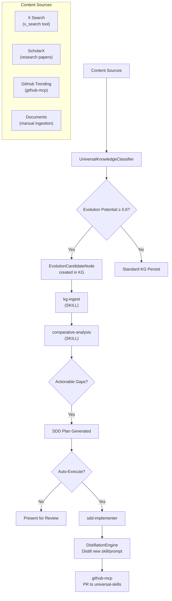

# Universal Knowledge Assimilation Engine

**CONCEPT:KG-2.6** — Universal Knowledge Assimilation

> The "Master Control Program" for autonomous self-evolution. A unified pipeline
> that discovers, classifies, ingests, and evolves agent-utilities from ALL
> incoming knowledge sources.

---

## Overview

The Knowledge Assimilation Engine extends the existing `agent-utilities-evolution`
skill (which is **pull-based** — scans ScholarX for papers) with a **push-based**
pathway where any high-signal content from ANY source automatically triggers the
evolution loop.

### How It Works



### Agent Composition (Pydantic Graph Flow)

| Agent | MCP Tools | Role |
|-------|-----------|------|
| **Scout** | `x_search`, `scholarx_sx_search`, `github-mcp` | Discovers content from X, arXiv, GitHub trending |
| **Classifier** | `graph_search`, `graph_query` | Scores with `UniversalKnowledgeClassifier` against KG context |
| **Ingester** | `graph_ingest`, `graph_write` | Persists to KG with proper node type + edges |
| **Analyst** | `graph_analyze` | Runs comparative-analysis against agent-utilities |
| **Implementer** | `graph_write`, `github-mcp` | Generates SDD plans, optionally executes + PRs |
| **Distiller** | `graph_write` | Distills successful patterns into reusable skills/prompts |

---

## Push vs Pull Evolution

| Dimension | Pull (agent-utilities-evolution) | Push (knowledge-assimilation) |
|-----------|----------------------------------|-------------------------------|
| **Trigger** | Cron (every 60 min) or manual | Incoming content with high evolution potential |
| **Sources** | ScholarX papers only | X, ScholarX, GitHub, documents, memories |
| **Classifier** | Dynamic scorer (keyword-based) | `UniversalKnowledgeClassifier` (LLM-backed) |
| **KG Node** | `ResearchTopic` | `EvolutionCandidateNode` |
| **Output** | SDD plan only | SDD plan + distilled skills + PRs |

Both pipelines share the same downstream tools: `comparative-analysis`,
`sdd-implementer`, `DistillationEngine`.

---

## Content Source Details

### X Search (via xAI Responses API)

- **Tool:** `x_search` with `grok-4.3` model
- **Signal types:** Trending AI/ML discussions, framework announcements, quantitative analysis threads
- **Auto-ingest:** `browse_x_post(url, auto_ingest=True)` pipes through classifier
- **Article handling:** Long-form X Articles fetched via browser → `KBIngestionEngine.ingest_url()` (full KB document processing)

### ScholarX (via scholarx-mcp)

- **Tool:** `mcp_scholarx-mcp_sx_search` with `action="recent"`
- **Categories:** cs.AI, cs.MA, cs.CL, cs.SE
- **Signal types:** New research papers, preprints, review articles
- **Scoring:** `dynamic_scorer.py` from research-scanner skill

### GitHub Trending (via github-mcp)

- **Tool:** `mcp_github-mcp_github` with repository search
- **Signal types:** Top repos of the day, starred projects, emerging frameworks
- **Strategy:** Clone → ingest → comparative-analysis against agent-utilities

### KG Memory Review

- **Tool:** `graph_query` for pending `EvolutionCandidateNode` nodes
- **Signal types:** Previously ingested content that hasn't been processed

---

## Self-Evolution Feedback Loop

1. **Scout** discovers content (X, ScholarX, GitHub)
2. **Classifier** determines evolution potential against KG topics
3. If high potential: **Ingester** persists + creates `EvolutionCandidateNode`
4. **Analyst** runs `comparative-analysis` to detect gaps in agent-utilities
5. **Implementer** generates SDD plan with constitution-mandated artifacts
6. Optionally auto-executes → creates skill/prompt → PRs to universal-skills
7. Logs `EvolutionCycle` node in KG for tracking and momentum
8. **Distiller** distills successful patterns as reusable workflow templates

---

## Configuration

All configuration is managed via XDG-compliant paths:

```
~/.config/agent-utilities/config.json    # Model registry, API keys
~/.agent-utilities/secrets.db            # OAuth tokens (encrypted)
```

**Environment Variables:**

| Variable | Default | Description |
|----------|---------|-------------|
| `KG_EVOLUTION_INTERVAL` | `3600` | Evolution scheduler-tick cycle (seconds), read by `_tick_evolution` in `engine_tasks.py` |
| `XAI_API_KEY` | (none) | Fallback API key if OAuth unavailable |

> Note: `EVOLUTION_AUTO_EXECUTE` and `EVOLUTION_MIN_POTENTIAL` are not currently
> read by the engine; auto-execute and minimum-potential gating are decided by
> the `agent-utilities-evolution` skill rather than environment variables.

---

## Related Components

- [x-assistant.md](./x-assistant.md) — X search/browse tools and social ingestion
- [knowledge-graph.md](./knowledge-graph.md) — Ingestion engine, distillation
- [agent-utilities-evolution SKILL](../../../../skills/universal-skills/universal_skills/research/agent-utilities-evolution/SKILL.md) — Pull-based research scanner
- [comparative-analysis SKILL](../../../../skills/universal-skills/universal_skills/analysis/comparative-analysis/SKILL.md) — Feature extraction
- [ontology_social.ttl](../../../agent_utilities/knowledge_graph/ontology_social.ttl) — OWL schema for social content
