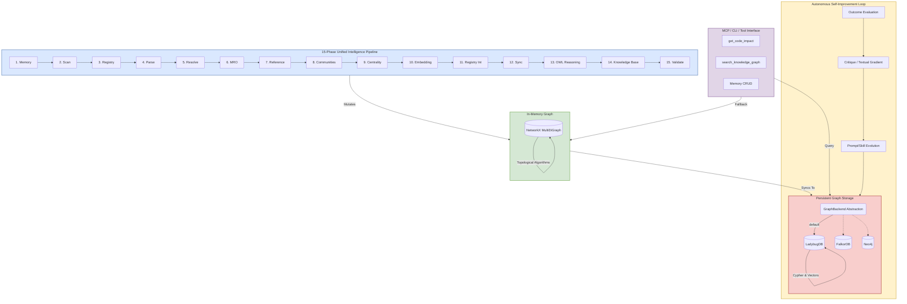
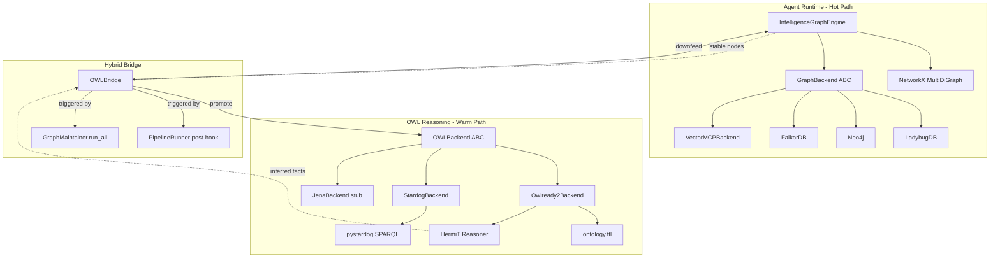
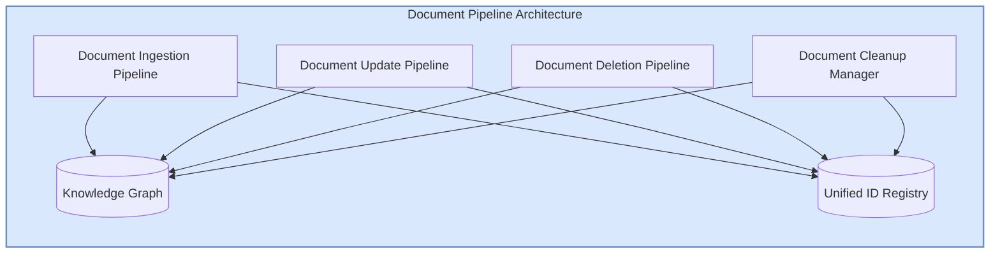
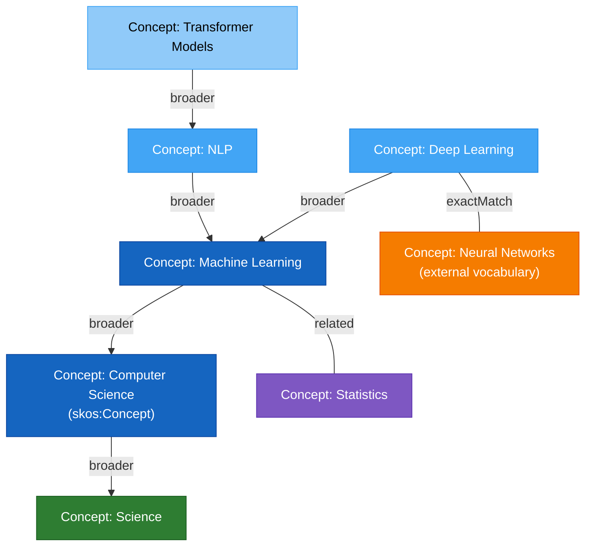

# Knowledge Graph

## The Unified Intelligence Graph (UIG)

The ecosystem leverages a **Unified Intelligence Graph** (UIG) that bridges long-term agent memory with deep structural codebase awareness and cross-domain research knowledge. This single, intelligence-driven cognitive substrate allows agents to reason simultaneously about specialists, tools, memory, code, and external standard operating procedures.

### Core Components
- **Autonomous Memory & Reasoning**:
    - **Episodes**: Discrete interaction units (e.g., a specific tool run or chat turn).
    - **Reasoning Traces**: Step-by-step "chains of thought" stored as linked nodes.
    - **Reflections & Goals**: High-level summaries and objective nodes that guide future planning.
- **Research Knowledge Base (KB)**:
    - **Topics & Concepts**: Domain-specific hubs (e.g., "Medical Oncology") linked to atomic knowledge units ("p53 gene").
    - **Evidence & Sources**: Verifiable claims grounded in original documents (Sources) with metadata like DOI and authors.
    - **Cross-Domain Emergence**: Unrelated topics (e.g., Chemistry and Medicine) automatically link through shared concepts or molecular pathways.
- **Temporal Dynamics & Importance**:
    - **Importance Scoring**: Every node has an `importance_score` (0.0 - 1.0) calculated via PageRank centrality.
    - **Temporal Decay**: Ebbinghaus-style decay reduces the importance of old memories over time, allowing the graph to "forget" low-signal noise.
    - **Hub Node Protection**: Critical foundational concepts can be marked as `is_permanent` to prevent automated pruning.
- **Unified Discovery Library**:
    - **Tools**: Dynamic registry of MCP tools, A2A agents, and internal skill graphs.
    - **Prompts**: Versioned system prompts and templates discovered via semantic search.
- **Governance & Policies**:
    - **Guardrails**: Graph-native policies that enforce constraints (e.g., "Always use TDD").
    - **SOP Execution**: Process flows and step sequences retrieved from the KG to guide agent behavior.

### Maintenance & Scalability
The `GraphMaintainer` (`knowledge_graph/maintainer.py`) autonomously manages the graph's health:
1. **Validation**: Pydantic-based schema validation for all entity types.
2. **Pruning**: Automated detached deletion of low-importance, non-permanent nodes.
3. **Consolidation**: Distilling old chat episodes into high-level summaries.
4. **Deduplication**: Merging similar concepts via semantic embedding similarity.

---

## Knowledge Graph Architecture



## OWL Reasoning Sidecar

The Knowledge Graph supports an optional **Hybrid OWL Reasoning Layer** that enriches the LPG with deterministic, cross-domain semantic inference. OWL reasoning runs as a warm-path sidecar -- the LPG remains the hot-path engine, while the OWL layer handles formal ontological reasoning (transitive closure, subclass inference, disjointness checking) via HermiT (Owlready2) or Stardog.



**Key design decisions:**
1. **OWL is a sidecar, not a replacement** -- LPG stays the hot-path engine
2. **Enabled by default (opt-out)** -- set `enable_owl_reasoning: false` to disable
3. **Promotion is deterministic** -- filters by importance, recency, and permanence; no LLM needed
4. **Downfeed is immediate** -- inferred facts write back to LPG as new edges with `inferred=True`
5. **Dual trigger** -- runs after every pipeline cycle AND during maintenance
6. **Java Dependency** -- **`Owlready2` (HermiT) requires a Java Runtime Environment.** Ensure `default-jre` is installed in the host/container.

**OWL Ontology** (`ontology.ttl`): Formalizes 30+ node types with `owl:TransitiveProperty` on `inheritsFrom`/`dependsOn`/`partOf`, `rdfs:subClassOf` hierarchies (Incident < Event, Hypothesis < Belief), inverse properties (`provides` <-> `providedBy`), and disjointness axioms (`Belief != Fact`).

## Advanced Cognition & Maintenance

1. **Hybrid Retrieval**: Combines semantic vector similarity search with N-hop topological graph traversal (`HybridRetriever`), allowing agents to find contextually related code and memories even if they don't match exact keywords.
2. **Rule-Augmented Inference**: Analyzes graph topology to derive implicit relationships (e.g., multi-hop dependencies) via the `InferenceEngine`, persisting them for faster future access.
3. **LLM-Driven Consolidation**: The `GraphMaintainer` automatically evaluates low-level conversational episodes, rolling them up into highly dense semantic summaries to maintain long-term memory scalability.
4. **Episodic Ingestion**: Agents can dynamically extract knowledge triples (`Entity -> Relation -> Entity`) from task episodes to autonomously extend the graph geometry (`kg_evolution_tools`).
5. **P2P Graph Sharing**: Agents can selectively export context subgraphs or "agent cards" to share capabilities and learned knowledge across the A2A network (`kg_share_tools`).

## Unified Intelligence Pipeline (15 Phases)

| Phase | Name | Purpose |
|-------|------|---------|
| 1 | **Memory** | Hydrates existing state (Nodes/Edges) from **LadybugDB** to maintain continuity. |
| 2 | **Scan** | Walks the filesystem, respects `.gitignore`, and identifies all source code files. |
| 3 | **Registry** | Ingests `prompts/*.json` and MCP server definitions into the **Knowledge Graph** as specialist nodes. |
| 4 | **Parse** | AST parsing (**tree-sitter**) to extract symbols (Classes, Functions, Imports) from code. |
| 5 | **Resolve** | Maps raw import strings to actual `File` or `Symbol` nodes across the workspace. |
| 6 | **MRO** | Resolves Method Resolution Order and inheritance chains for OO structures. |
| 7 | **Reference** | Builds the call graph by identifying where specific symbols are referenced or invoked. |
| 8 | **Communities** | Clusters nodes into tightly-coupled modules using **Louvain** topological clustering. |
| 9 | **Centrality** | Runs **PageRank** analysis to identify critical path "God Objects" and core utilities. |
| 10 | **Embedding** | Generates semantic vector embeddings via LM Studio (`text-embedding-nomic-embed-text-v2-moe`) for hybrid search. |
| 11 | **Sync** | Projects the NetworkX graph into the persistent **LadybugDB** Cypher store. |
| 12 | **OWL Reasoning** | Promotes stable nodes to OWL, runs HermiT/Stardog inference, downfeeds inferred facts. |
| 13 | **Knowledge Base** | Compiles articles, concepts, and facts into the **LLM Knowledge Base** layer. |
| 14 | **Workspace Sync** | Clones repos from `workspace.yml` using **repository-manager** and triggers auto-ingestion. |
| 15 | **Validate** | Runs **CONCEPT:KG-2.3 Graph Integrity Validator** — 4-tier non-blocking post-ingestion validation with auto-fix. |

## MAGMA-Inspired Orthogonal Reasoning Views

The graph engine supports policy-guided retrieval across five orthogonal views, ensuring the agent has the right context for the right task:
- **Semantic View**: Traditional RAG/vector search for conceptual similarity.
- **Temporal View**: Episodic memory retrieval based on chronological sequences and Ebbinghaus-style temporal decay.
- **Causal View**: Reasoning traces and "Why" links (e.g., `ReasoningTrace -> ToolCall -> OutcomeEvaluation`).
- **Entity View**: Structural knowledge of People, Organizations, Locations, and Code Symbols.
- **Epistemic View** (CONCEPT:KG-2.2): Beliefs, supporting evidence (BUILDS_ON, EXEMPLIFIES, CITES), and contradictions (CONTRADICTS). Powered by `retrieve_epistemic_view()`.

## Autonomous Self-Improvement Loop

The system autonomously refines its own performance through a continuous feedback loop:
1. **Outcome Evaluation**: Every significant episode is evaluated for success (Reward) using `record_outcome`.
2. **Critique (Textual Gradients)**: Unsuccessful episodes generate "textual gradients" (Critiques) identifying failure points.
3. **Prompt Evolution**: Critiques are used to generate improved versions of system prompts (`SystemPrompt` nodes) via `optimize_prompt`.
4. **Skill Spawning**: The agent can propose and persist new Python skills (`ProposedSkill`) based on observed needs.

## Unified Resource Management (CallableResource)

All external resources are first-class graph nodes, allowing the agent to reason over its own capabilities:
- **MCP_TOOL**: Tools discovered from external MCP servers.
- **A2A_AGENT**: Remote agent peers reachable via fastA2A.
- **AGENT_SKILL**: Local Python skills defined with YAML/Markdown frontmatter.
- **SPAWNED_AGENT**: Dynamically created sub-agent instances with minimal, curated toolsets.

## Backend Abstraction Layer

All graph storage is routed through the `GraphBackend` ABC (`backends/base.py`), providing **hot-swappable** database backends with unified methods for execution, schema creation, and **functional pruning**.

**Supported Graph Backends:**
| Backend | Status | Connection | Use Case |
|---|---|---|---|
| **LadybugDB** | Full (default) | File path (`knowledge_graph.db`) | Embedded, zero-config, schema-enforced Cypher |
| **FalkorDB** | Stub | `host:port` (Redis protocol) | Distributed, high-throughput graph workloads |
| **Neo4j** | Stub | `bolt://host:port` | Enterprise, ACID-compliant graph databases |

**OWL Reasoning Backends** (for Hybrid OWL Layer):
| Backend | Status | Connection | Use Case |
|---|---|---|---|
| **Owlready2** | Full (default) | SQLite quadstore (`owl_store.db`) | Local, embedded, HermiT reasoning |
| **Stardog** | Full | `http://host:5820` | Enterprise, remote OWL/SPARQL reasoning |

**Factory Usage:**
```python
from agent_utilities.knowledge_graph.backends import create_backend

# Default: LadybugDB at knowledge_graph.db
backend = create_backend()

# Explicit backend selection
backend = create_backend(backend_type="neo4j", uri="bolt://prod-neo4j:7687")
backend = create_backend(backend_type="falkordb", host="redis-host", port=6380)

# With db_path for LadybugDB
backend = create_backend(db_path="/data/agent.db")
```

**Environment Variables:**
| Variable | Description | Default |
|---|---|---|
| `GRAPH_BACKEND` | Backend type: `ladybug`, `falkordb`, `neo4j` | `ladybug` |
| `GRAPH_DB_PATH` | File path for LadybugDB | `knowledge_graph.db` |
| `GRAPH_DB_HOST` | Host for FalkorDB/Neo4j | `localhost` |
| `GRAPH_DB_PORT` | Port for FalkorDB (6379) or Neo4j (7687) | varies |
| `GRAPH_DB_URI` | Full URI for Neo4j | `bolt://localhost:7687` |
| `GRAPH_DB_USER` | Username for Neo4j | `neo4j` |
| `GRAPH_DB_PASSWORD` | Password for Neo4j | `password` |
| `GRAPH_DB_NAME` | Database name for FalkorDB | `agent_graph` |
| `OWL_BACKEND` | OWL backend type: `owlready2`, `stardog` | `owlready2` |
| `OWL_DB_PATH` | SQLite quadstore path for Owlready2 | `owl_store.db` |
| `STARDOG_ENDPOINT` | Stardog server URL | `http://localhost:5820` |
| `STARDOG_DATABASE` | Stardog database name | `agent_kg` |
| `STARDOG_USER` | Stardog username | `admin` |
| `STARDOG_PASSWORD` | Stardog password | `admin` |

**Architecture:** All consumers (engine, pipeline phases, server, MCP manager, registry builder) use `create_backend()` or receive a shared `backend` instance via dependency injection. No module directly imports a specific backend class -- the factory handles selection based on config/env.

## Knowledge Base (KB) Layer

An LLM-maintained personal wiki system built directly into the knowledge graph -- replacing Obsidian as the "IDE frontend" with a graph-native, agent-queryable alternative.

**Architecture Flow:**
```
Raw Sources (PDF/DOCX/EPUB/MD/URL)
    | KBDocumentParser (vector-mcp pattern: SimpleDirectoryReader + chunking)
DocumentChunks (hash-deduplicated)
    | KBExtractor (Pydantic AI: result_type=ExtractedArticle)
Validated Articles / Facts / Concepts (type-safe)
    | KBIngestionEngine
Graph Nodes: KnowledgeBase -> Article -> KBConcept / KBFact / KBIndex
    | Phase 13 / Backend Sync
Persistent Storage (LadybugDB / Neo4j / FalkorDB)
    | KB Tools (list, search, get, health, archive, export)
Agent Q&A and Knowledge Queries
```

**KB Node Hierarchy:**
- `KnowledgeBase` (namespace root, e.g., `kb:pydantic-ai-docs`) -- top-level namespace for agent discoverability
  - `Article` -- compiled wiki article with full markdown content and embedding
  - `KBConcept` -- key concepts extracted from articles (linked via `ABOUT`)
  - `KBFact` -- atomic facts with certainty scores (linked via `CITES` to sources)
  - `RawSource` -- original ingested documents (linked via `COMPILED_FROM`)
  - `KBIndex` -- auto-maintained discovery index with suggested queries (linked via `INDEXES_KB`)

**KB Tools (8 total):**
| Tool | Description |
|---|---|
| `ingest_knowledge_base` | Ingest directory, file, URL, or skill-graph into a named KB |
| `list_knowledge_bases` | List all KBs with status, article counts, and suggested queries |
| `search_knowledge_base_tool` | Hybrid keyword search within a specific or all KBs |
| `get_kb_article` | Retrieve full markdown content of a specific article |
| `update_knowledge_base` | Incrementally re-ingest changed files (hash-based, cheap) |
| `run_kb_health_check` | LLM-backed audit: contradictions, orphans, gaps, suggestions |
| `archive_knowledge_base` | Compress low-importance articles to summary-only (saves memory) |
| `export_knowledge_base` | Export to Obsidian-compatible markdown with YAML frontmatter |

## Memory Maintenance & Pruning

The `GraphMaintainer` class (`knowledge_graph/maintainer.py`) runs several background maintenance operations using the unified `GraphBackend.prune()` interface:
1. **Embedding Enrichment**: Vectorizes unembedded content via LM Studio.
2. **Cron Log Pruning**: Deletes successful logs older than 30 days.
3. **Chat Summarization**: Compresses old threads into `ChatSummary` nodes.
4. **Importance Scoring**: PageRank-based centrality scoring for all nodes.
5. **Temporal Decay**: Ebbinghaus-style 5%/day decay on importance scores.
6. **Memory Consolidation**: Distills old episodes into semantic summaries.
7. **Low-Signal Pruning**: Removes nodes below importance threshold (0.05) using the backend-native pruning logic.
8. **Knowledge Base Maintenance**: Archiving and health checks for the KB layer.
9. **OWL Reasoning Cycle**: Promotes stable nodes -> runs HermiT/Stardog reasoning -> downfeeds inferred facts.
10. **OWL Stale Triple Pruning**: Removes OWL individuals for nodes that no longer exist in LPG or have decayed below threshold.
11. **OWL Ontology Consistency**: Validates OWL consistency -- detects unsatisfiable classes or contradictions.

## Document Pipeline (Unified ID System)

> **Note:** The complete specification, tasks, and acceptance criteria for the Document Pipeline are now formally tracked using SDD in `.specify/specs/document_pipeline.md`.

The Document Pipeline provides a tightly-wired system for managing documents natively within the Knowledge Graph. By leveraging the Graph DB's inherent structure and native vector indexing capabilities, it eliminates the need for redundant external document and vector storage dependencies. The Knowledge Graph acts as the single source of truth for seamless semantic and topological retrieval.



## KG v2 Schema Extensions

The schema at `agent_utilities/models/knowledge_graph.py` was extended with 10 new `RegistryNode` subclasses and 20 new edge types. All are type-checked via Pydantic and persisted via the standard `GraphBackend` path.

**New node types:**
| Node | Purpose |
|---|---|
| `OrganizationNode` | External or internal organizational entity (company, team, consortium) |
| `RoleNode` | Role definition decoupled from a specific person |
| `PlaceNode` | Physical or logical location |
| `PhaseNode` | Time-bounded project/program phase |
| `DecisionNode` | Explicit decision record with rationale |
| `IncidentNode` | Operational incident / outage / postmortem root |
| `SystemNode` | Deployed system, service, or application component |
| `BeliefNode` | Claim the agent currently holds as true |
| `HypothesisNode` | Claim under investigation, with confidence and evidence edges |
| `PrincipleNode` | Long-lived design or operating principle |

**New edge types:** `HAS_ROLE`, `PLAYED_ROLE_DURING`, `OCCURRED_AT_PLACE`, `OCCURRED_DURING_PHASE`, `DECIDED_BY`, `MOTIVATED_BY`, `RESULTED_IN`, `SUPPORTS_BELIEF`, `CONTRADICTS_BELIEF`, `GENERALIZES_TO`, `INSTANCE_OF_PATTERN`, `CAUSED_INCIDENT`, `RESOLVED_INCIDENT`, `OWNS_SYSTEM`, `DEPENDS_ON_SYSTEM`, `PREDICTS`, `OBSERVES`, `SUPERSEDES_BY`, `BELONGS_TO_ORGANIZATION`, `EMPLOYS`.

## Standard Ontology Alignment

The knowledge graph ontology (`ontology.ttl`) is formally aligned to industry-standard W3C/ISO vocabularies. This enables:
- **Cross-system interoperability** — entities map to universally understood schemas
- **Standardized provenance tracking** — full W3C PROV-O provenance chain
- **Deep OWL reasoning** — BFO upper ontology enables hierarchical classification
- **Full SKOS taxonomy** — concept hierarchies with broader/narrower/related navigation
- **Finance domain support** — FIBO-aligned financial instrument and transaction modeling

### Standard Namespace Prefixes

| Prefix | URI | Purpose |
|---|---|---|
| `bfo:` | `http://purl.obolibrary.org/obo/BFO_` | **BFO** (ISO 21838-2) — Upper ontology backbone |
| `schema:` | `http://schema.org/` | **Schema.org** — Broad entity descriptions |
| `dc:` | `http://purl.org/dc/terms/` | **Dublin Core** — Document metadata (title, creator, date, identifier) |
| `foaf:` | `http://xmlns.com/foaf/0.1/` | **FOAF** — People and organizations |
| `prov:` | `http://www.w3.org/ns/prov#` | **PROV-O** — W3C provenance (wasGeneratedBy, wasDerivedFrom) |
| `skos:` | `http://www.w3.org/2004/02/skos/core#` | **SKOS** — Concept taxonomies (broader, narrower, related) |
| `time:` | `http://www.w3.org/2006/time#` | **OWL-Time** — Temporal intervals and instants |
| `bibo:` | `http://purl.org/ontology/bibo/` | **BIBO** — Bibliographic ontology (documents, articles) |
| `fibo-org:` | `https://spec.edmcouncil.org/.../Organizations/` | **FIBO** — Financial industry organizations |
| `fibo-fi:` | `https://spec.edmcouncil.org/.../FinancialInstruments/` | **FIBO** — Financial instruments |

### BFO Upper Ontology Alignment

Every entity class is formally classified under the BFO (Basic Formal Ontology, ISO 21838-2) hierarchy. This enables the OWL reasoner to automatically classify entities and propagate properties through the hierarchy.

```mermaid
graph TB
    subgraph "BFO Upper Ontology (ISO 21838-2)"
        Entity["bfo:Entity"]
        Continuant["bfo:Continuant"]
        Occurrent["bfo:Occurrent"]
        IndCont["bfo:IndependentContinuant"]
        SpecDep["bfo:SpecificallyDependentContinuant"]
        GenDep["bfo:GenericallyDependentContinuant"]
        Process["bfo:Process"]
        TempReg["bfo:TemporalRegion"]

        Entity --> Continuant
        Entity --> Occurrent
        Continuant --> IndCont
        Continuant --> SpecDep
        Continuant --> GenDep
        Occurrent --> Process
        Occurrent --> TempReg
    end

    subgraph "Independent Continuants"
        Agent[":Agent ≡ prov:SoftwareAgent"]
        Person[":Person ≡ foaf:Person"]
        Organization[":Organization ≡ foaf:Organization"]
        Tool[":Tool → schema:SoftwareApplication"]
        System[":System"]
        Place[":Place → schema:Place"]
        SoftwareProject[":SoftwareProject"]
        MedicalEntity[":MedicalEntity"]
    end

    subgraph "Generically Dependent Continuants"
        Memory[":Memory → prov:Entity"]
        Fact[":Fact → skos:Concept"]
        Concept[":Concept ⊂ skos:Concept"]
        Document[":Document → bibo:Document"]
        CreativeWork[":CreativeWork ≡ schema:CreativeWork"]
        Dataset[":Dataset ≡ schema:Dataset"]
        FinInstrument[":FinancialInstrument → FIBO"]
        Regulation[":Regulation"]
        Policy[":Policy"]
        Evidence[":Evidence"]
    end

    subgraph "Specifically Dependent Continuants"
        Belief[":Belief"]
        Hypothesis[":Hypothesis ⊂ Belief"]
        Role[":Role"]
        Reflection[":Reflection"]
    end

    subgraph "Processes (Occurrents)"
        Event[":Event ≡ schema:Event"]
        Episode[":Episode → prov:Activity"]
        Action[":Action → prov:Activity"]
        Incident[":Incident ⊂ Event"]
        Decision[":Decision ⊂ Event"]
        Observation[":Observation ⊂ Event"]
        ReasoningTrace[":ReasoningTrace"]
        Procedure[":Procedure → schema:HowTo"]
        FinTxn[":FinancialTransaction"]
    end

    subgraph "Temporal Regions"
        Phase[":Phase → time:ProperInterval"]
    end

    IndCont -.-> Agent
    IndCont -.-> Person
    IndCont -.-> Organization
    IndCont -.-> Tool
    IndCont -.-> System
    IndCont -.-> Place
    IndCont -.-> SoftwareProject
    IndCont -.-> MedicalEntity

    GenDep -.-> Memory
    GenDep -.-> Fact
    GenDep -.-> Concept
    GenDep -.-> Document
    GenDep -.-> CreativeWork
    GenDep -.-> Dataset
    GenDep -.-> FinInstrument
    GenDep -.-> Regulation
    GenDep -.-> Policy
    GenDep -.-> Evidence

    SpecDep -.-> Belief
    SpecDep -.-> Hypothesis
    SpecDep -.-> Role
    SpecDep -.-> Reflection

    Process -.-> Event
    Process -.-> Episode
    Process -.-> Action
    Process -.-> ReasoningTrace
    Process -.-> Procedure
    Process -.-> FinTxn
    TempReg -.-> Phase

    style Entity fill:#2e7d32,stroke:#1b5e20,color:#fff
    style Continuant fill:#1565c0,stroke:#0d47a1,color:#fff
    style Occurrent fill:#f57c00,stroke:#e65100,color:#fff
    style IndCont fill:#42a5f5,stroke:#1e88e5,color:#fff
    style SpecDep fill:#7e57c2,stroke:#5e35b1,color:#fff
    style GenDep fill:#26a69a,stroke:#00897b,color:#fff
    style Process fill:#ff7043,stroke:#e64a19,color:#fff
    style TempReg fill:#ffb74d,stroke:#f57c00,color:#fff
```



### Cross-Domain Coverage Matrix

The standard ontology alignment provides coverage across all major professional domains:

| Domain | Key Classes | Standard Vocabulary | Use Cases |
|---|---|---|---|
| **Technology** | Agent, Tool, System, SoftwareProject, Code | Schema.org, PROV-O | Code analysis, agent orchestration, dependency tracking |
| **Medical** | MedicalEntity, Person, Procedure, Evidence | Schema.org (stub) | Clinical data, patient records, treatment protocols |
| **White-Collar** | Document, Organization, Role, Decision, Policy | Dublin Core, FOAF, FIBO | Business docs, compliance, financial instruments |
| **Blue-Collar** | Procedure, Place, Event, Regulation | Schema.org (HowTo) | SOPs, safety procedures, operational protocols |
| **Finance** | FinancialInstrument, FinancialTransaction, Account, Regulation | FIBO | Securities, transactions, regulatory compliance |
| **Research** | Document, Evidence, Source, Concept, Dataset | Dublin Core, BIBO, SKOS | Papers, citations, knowledge bases, taxonomies |

### SKOS Taxonomy Support

The ontology provides full SKOS (Simple Knowledge Organization System) taxonomy support for concept hierarchies:



**SKOS Properties Available:**
| Property | Type | Purpose |
|---|---|---|
| `broader` | Transitive | Parent concept in hierarchy |
| `narrower` | Inverse of broader | Child concept in hierarchy |
| `related` | Symmetric | Associative relationship |
| `exactMatch` | Symmetric + Transitive | Same concept across vocabularies |
| `closeMatch` | Symmetric | Similar concept across vocabularies |
| `broadMatch` | — | Broader concept across vocabularies |
| `prefLabel` | Datatype | Preferred human-readable label |
| `altLabel` | Datatype | Alternative label |
| `notation` | Datatype | Code or identifier in a scheme |

### Extending with Domain-Specific Ontologies

To add a new domain ontology (e.g., SNOMED-CT for medical, ISO 27001 for security):

1. **Add the namespace** to `ontology.ttl`:
   ```turtle
   @prefix snomed: <http://snomed.info/id/> .
   ```

2. **Create alignment classes** in `ontology.ttl`:
   ```turtle
   :Condition a owl:Class ;
       rdfs:subClassOf :MedicalEntity ;
       rdfs:seeAlso snomed:404684003 .
   ```

3. **Add the node type** to `RegistryNodeType` enum in `knowledge_graph.py`

4. **Add the Pydantic model** following the existing pattern (e.g., `ConditionNode`)

5. **Register** in `PROMOTABLE_NODE_TYPES`, `_NODE_TYPE_TO_OWL_CLASS`, and `SCHEMA.nodes`

6. **Add tests** to `test_standard_ontology.py`

> [!TIP]
> For most use cases, consider using **Schema Packs** (below) instead of manually extending the ontology. Packs automate steps 3–6 and provide domain-scoped filtering.

---

## Schema Packs (CONCEPT:KG-2.2)

Schema Packs are domain-configurable KG profiles that scope the active node types, edge types, retrieval boosts, and OWL extensions to a specific domain.

### Operating Modes

| Mode | Behavior | Use Case |
|---|---|---|
| **ADDITIVE** (default) | Pack types are layered on top of all existing types | General-purpose: "I want research types *plus* everything else" |
| **EXCLUSIVE** | Only the pack's types + protected core are active | Focused deployments: "Only clinical types for this biomedical pipeline" |

Both modes always include a **protected core** set (memory, episode, person, concept, fact, agent, tool, skill) to prevent breaking fundamental agent operations.

### Pre-Built Packs

| Pack | Key Types | Backlink Strategy | Retrieval Boosts |
|---|---|---|---|
| `core` | All 90+ types | `global` | None |
| `research-state` | hypothesis, dataset, document, evidence | `context_only` | `cites_source: 1.5`, `tests_hypothesis: 1.4` |
| `biomedical` | medical_entity, procedure, regulation | `global` | `exact_match: 1.5`, `cites_source: 1.4` |
| `finance` | financial_instrument, transaction, account | `global` | `has_financial_instrument: 1.4`, `executed_transaction: 1.3` |

### Usage

```python
from agent_utilities.models.schema_packs import get_schema_pack

# Load a pre-built pack
pack = get_schema_pack("research-state")

# Check active types
active_nodes = pack.get_active_node_types()
assert RegistryNodeType.HYPOTHESIS in active_nodes

# Use with HybridRetriever
retriever = HybridRetriever(engine, schema_pack=pack)
```

### Custom Packs

```python
from agent_utilities.models.schema_pack import SchemaPack, SchemaPackMode
from agent_utilities.models.schema_packs import register_schema_pack

class LegalSchemaPack(SchemaPack):
    name: str = "legal"
    mode: SchemaPackMode = SchemaPackMode.EXCLUSIVE
    node_types: set = {RegistryNodeType.REGULATION, RegistryNodeType.DOCUMENT}
    edge_types: set = {RegistryEdgeType.CITES_SOURCE, RegistryEdgeType.BROADER}

register_schema_pack("legal", LegalSchemaPack)
```

---

## Backlink-Density Retrieval Boost (CONCEPT:KG-2.2)

The `HybridRetriever` supports optional backlink-density retrieval weighting that boosts the relevance score of hub entities (nodes with many inbound edges).

### Scoring Formula

```
boosted_score = base_score × (1.0 + factor × log(1 + in_degree))
```

| In-Degree | Factor=0.1 | Factor=0.5 |
|---|---|---|
| 0 | 1.00× | 1.00× |
| 1 | 1.07× | 1.35× |
| 10 | 1.24× | 2.20× |
| 100 | 1.46× | 3.31× |

### Strategies

| Strategy | Applied During | Best For |
|---|---|---|
| `global` | Semantic search scoring | CRM, people-centric, hub-entity queries |
| `context_only` | Multi-hop context assembly | Research (preserves novel/low-citation papers) |
| `disabled` | Never | Domains where all nodes are equally important |

Strategy and factor are configured per `SchemaPack`. The research pack defaults to `context_only`; all others default to `global`.

---

## KG Eval Capture (CONCEPT:KG-2.2)

The KG Eval Capture harness records real queries and their retrieval results to a **separate SQLite database** (never in the KG itself), enabling replay-based regression testing when KG configuration changes.

### Architecture

```
┌─────────────┐     ┌─────────────────────┐
│  KG Engine   │────▶│  HybridRetriever    │
│              │     │  (backlink boost)   │
└─────────────┘     └────────┬────────────┘
                              │ capture()
                    ┌─────────▼──────────┐
                    │  eval_log.db       │  ← Separate SQLite
                    │  (query, results,  │
                    │   scores, latency) │
                    └─────────┬──────────┘
                              │ replay()
                    ┌─────────▼──────────┐
                    │  EvalReplayResult  │
                    │  - Jaccard@k       │
                    │  - top-1 stability │
                    │  - latency delta   │
                    │  - regressions[]   │
                    └────────────────────┘
```

### Configuration

| Env Variable | Default | Description |
|---|---|---|
| `KG_EVAL_CAPTURE` | `false` | Enable/disable capture |
| `KG_EVAL_DB_PATH` | `~/.agent-utilities/eval_log.db` | Database path |

### Usage

```python
from agent_utilities.knowledge_graph.eval_capture import KGEvalCapture

capture = KGEvalCapture(enabled=True)
capture.capture("who founded Acme?", "hybrid", ["acme-01", "bob-02"], [0.94, 0.87])

# After making KG changes, replay:
result = capture.replay(search_fn=engine.search_hybrid)
if result.regressions:
    print(f"⚠️ {len(result.regressions)} queries regressed!")
```

---

## Structural Fingerprint Engine (CONCEPT:KG-2.3)

The fingerprint engine enables incremental KG updates by classifying file changes into three levels, avoiding costly full re-ingestion when only cosmetic changes (comments, formatting) have occurred.

### Change Classification

| Level | Meaning | KG Action |
|---|---|---|
| `NONE` | File content identical (same SHA-256) | Skip entirely |
| `COSMETIC` | Content changed but structure identical (comments, docstrings, whitespace) | Update content hash only |
| `STRUCTURAL` | Signature-level changes (new params, renamed classes, changed imports) | Full re-ingestion |

### Python AST Extraction

For Python files, the engine extracts a structural skeleton via `ast`:
- Function/method names, parameters, return types, decorators
- Class names, base classes, method lists
- Import specifiers (module + imported name)
- `__all__` exports

The skeleton is hashed independently of the file content, enabling the COSMETIC/STRUCTURAL distinction.

### Usage

```python
from agent_utilities.knowledge_graph.fingerprint import (
    FingerprintManager,
    compute_fingerprint,
    classify_change,
)

# Single file fingerprinting
fp = compute_fingerprint("src/engine.py")
print(fp.functions)  # [{"name": "run", "args": ["ctx"], ...}]

# Workspace-level incremental analysis
manager = FingerprintManager("/path/to/repo")
current = manager.scan()
structural_only = manager.get_structural_changes(previous_snapshot)
# Only re-ingest files in structural_only list
```

### Git Staleness Detection

`detect_stale_files()` uses `git diff` to identify changed files since a reference commit, providing a fast pre-filter before fingerprint comparison.

---

## Graph Integrity Validator (CONCEPT:KG-2.3)

Non-blocking, tiered validation for the Unified Intelligence Graph. Inspired by Understand-Anything's `graph-reviewer` agent with a 4-tier auto-fix pipeline.

### Validation Tiers

| Tier | Behavior | Examples |
|---|---|---|
| **1 — Auto-fix** | Silently corrected, logged as INFO | LLM type aliases (`func` → `symbol`), score clamping, missing names |
| **2 — Integrity** | Logged as WARNING, reported | Dangling edges, missing node types, untyped edges, duplicate IDs |
| **3 — Quality** | Logged as INFO, advisory | Orphan nodes, self-referencing edges, generic descriptions, underscored hubs |
| **4 — Fatal** | Only fires on catastrophic failures | Zero nodes, graph fragmented below 50% largest component |

### LLM Alias Normalization

The validator includes comprehensive alias maps for both node types (30+ aliases like `func` → `symbol`, `service` → `agent`) and edge types (30+ aliases like `extends` → `inherits_from`, `uses` → `depends_on`), ensuring consistent schema regardless of which LLM generated the graph data.

### Pipeline Integration

The validator runs as the **15th pipeline phase** (`validate`), executing after `knowledge_base` ingestion. Results are stored via `KGEvalCapture` (CONCEPT:KG-2.2) for trend analysis.

```python
from agent_utilities.knowledge_graph.graph_validator import GraphValidator

validator = GraphValidator(engine)
report = validator.validate()

print(report.summary())
# Graph Validation Report (2026-05-05T02:30:00Z)
#   Nodes: 1247 | Edges: 3891 | Duration: 12.3ms
#   Tier 1 (auto-fixed): 8
#   Tier 2 (violations): 0
#   Tier 3 (warnings):   3
#   Status: HEALTHY
```

---

## Entity-Claim Extraction — MAGMA Completion (CONCEPT:KG-2.2)

Completes the MAGMA epistemic view system by implementing real entity-claim extraction from ingested documents. Claims participate in `BUILDS_ON`, `CONTRADICTS`, and `EXEMPLIFIES` relationships for epistemic reasoning.

### Two-Phase Extraction

| Phase | Method | Scope |
|---|---|---|
| **Deterministic** | Regex patterns | Citations `(Author, YYYY)`, `[[wikilinks]]`, assertion patterns (`must`, `recommend`, `therefore`) |
| **Semantic** (planned) | LLM-based | Implicit relationships, nuanced claims, cross-document contradiction detection |

### New Schema Elements

**Node type:** `ClaimNode` — a discrete claim, assertion, or thesis with confidence scoring and epistemic metadata.

**Edge types:**
| Edge | Meaning |
|---|---|
| `BUILDS_ON` | Claim extends or depends on another claim |
| `CONTRADICTS` | Claim opposes another claim (existing) |
| `EXEMPLIFIES` | Concrete example supporting a general claim |
| `AUTHORED_BY` | Attribution link to a person/org |

### MAGMA Epistemic View (Now Complete)

The `retrieve_epistemic_view()` method on `IntelligenceGraphEngine` is now fully implemented with real Cypher reasoning:

```python
# Returns beliefs, supporting evidence, and contradictions
view = engine.retrieve_epistemic_view("graph validation")
# {
#   "beliefs": [ClaimNode(claim_text="Tiered validation prevents server crashes", confidence=0.85)],
#   "supporting": [EntityNode(name="UA graph-reviewer", _relationship="builds_on")],
#   "contradicting": [ClaimNode(claim_text="Single-pass validation is sufficient", _relationship="contradicts")]
# }
```

**NetworkX fallback:** When no Cypher backend is available, the epistemic view falls back to in-memory graph traversal using `in_edges()` with edge type filtering.

---

## Context-Aware Entity Representations (CONCEPT:KG-2.2)

Injects multi-hop structural logic and OWL relationships directly into node vector embeddings to enable "topology-aware" semantic search.

### ContextualRepresentationBuilder

The `ContextualRepresentationBuilder` dynamically assembles a rich text description for any node before embedding. It extracts:
1. **Node Profile**: The node's raw content, `name`, `type`, and `description`.
2. **Topological Hierarchy**: A 2-level traversal capturing up to 5 immediate parent/grandparent relations, and up to 5 child/grandchild relations.
3. **OWL Inferences**: Any relationships specifically marked with `inferred=True` (typically originating from HermiT or Stardog downfeed).

This contextual string is passed to the embedding model (LM Studio), ensuring the resulting vector captures both the semantic meaning of the node *and* its position in the broader ontology.

### Immediate Re-Embedding on Inference Downfeed

To prevent the vector space from drifting out of sync with the topological space:
1. When the `OWLBridge` promotes nodes and runs reasoning, it downfeeds new facts back to the LPG.
2. The bridge tracks every LPG node that received a new edge.
3. It immediately triggers `re_embed_node()` on those specific nodes.
4. The `ContextualRepresentationBuilder` rebuilds the description (now including the new OWL inferences) and generates a fresh embedding.

---

## Inductive Knowledge Hypergraphs (CONCEPT:KG-2.4)

The `agent-utilities` ecosystem supports hypergraph capabilities via **Positional Interaction Encodings (EncPI)**, breaking beyond the limitations of standard binary Labeled Property Graphs (LPGs). This enables the system to model n-ary relations (Hyperedges) and achieve zero-shot inductive generalization for novel relationships.

### Positional Intersections & EncPI

Instead of just embedding node text or binary edge labels, the knowledge graph computes embeddings for the *structural intersections* between relationships.
If an entity acts as the `head` (Position 1) in Relation X, and the `tail` (Position 2) in Relation Y, that is a `(1, 2)` interaction.

The `PositionalInteractionEncoder` computes these intersections using a 2-layer Multilayer Perceptron (MLP) over concatenated sinusoidal encodings of the input positions.

### Vectorizing Positional Interactions

This interaction logic is fully integrated with the 15-Phase Ingestion Pipeline (specifically Phase 10: Embedding) and the OWL ontology sync (CONCEPT:KG-2.2):

1. **Topology & OWL Convergence**: As the OWL reasoning bridge infers new implicit facts (e.g., `subClassOf`), these new edges create additional positional intersections.
2. **Native Vectorization**: The `EncPI` engine natively computes the dense vector embeddings for these positional interactions.
3. **Retrieval Application**: During test-time, the `HybridRetriever` uses `cosine_similarity` across the vectorized `EncPI` embeddings stored in `LadybugDB`. This allows the retriever to infer that a completely novel relation topologically behaves like a known relation, enabling true zero-shot reasoning over dynamic autonomous data.
