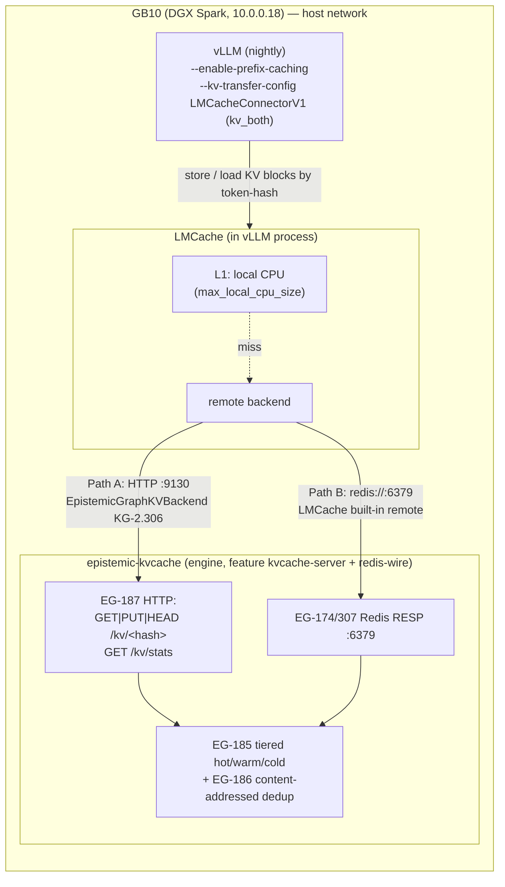

# KV-Cache Layering: vLLM → LMCache → epistemic-graph

> Pool and dedup vLLM's KV cache into the epistemic-graph engine via LMCache, so
> inference workers share prefill work by token-hash instead of recomputing it.
>
> **Concepts:** `CONCEPT:EG-187` (engine kvcache-server HTTP surface) ·
> `CONCEPT:KG-2.306` (`EpistemicGraphKVBackend` Python connector) ·
> `CONCEPT:EG-185` (tiered hot/warm/cold cache) · `CONCEPT:EG-186` (content-addressed
> shared dedup) · `CONCEPT:EG-174`/`EG-307` (Redis RESP wire).

## Why

vLLM already does in-process **prefix caching** (`--enable-prefix-caching`): a
single worker reuses the KV cache of a shared prompt prefix. What it does **not**
do is share that KV cache **across requests once it's evicted**, or **across
workers**. [LMCache](https://docs.lmcache.ai/) adds exactly that: it offloads KV
blocks to a tiered store (CPU → local disk → a **remote** backend) keyed by a hash
over the block's token ids, and loads them back on a later request — cutting
time-to-first-token on any repeated prefix (system prompts, few-shot exemplars,
long documents, multi-turn history) and letting the box offload KV under memory
pressure instead of dropping it.

The epistemic-graph engine is that remote backend. Its KV-cache server
(`CONCEPT:EG-187`) is a small HTTP surface over the same tiered cache
(`CONCEPT:EG-185`) and **content-addressed shared dedup** (`CONCEPT:EG-186`) the
engine already runs — so an identical KV page produced twice is stored **once**,
and every vLLM process on the box (or, later, across boxes) pools into one store.

## Architecture



Two wiring paths reach the **same** engine store — pick one:

| | **Path A — custom connector** | **Path B — Redis drop-in** |
|---|---|---|
| LMCache backend | external `EpistemicGraphExternalBackend` → EG-187 HTTP | built-in remote → EG-174/307 Redis wire |
| Custom code | one adapter class (shipped) | **none** |
| Surface used | `GET/PUT/HEAD /kv/<hash>`, `GET /kv/stats` (dedup counters, exists probe) | Redis RESP |
| When | you want the native HTTP semantics / stats | **default / simplest** — recommended to start |

Both hit `CONCEPT:EG-185`/`EG-186`, so dedup + tiering are identical; the only
difference is the wire LMCache speaks.

## Files

All deployment artifacts live in `services/vllm/` (co-located on GB10):

| File | Role |
|---|---|
| `compose.kvcache.yml` | the **epistemic-kvcache** engine server (EG-187 + Redis wire) on GB10 |
| `Dockerfile.lmcache` | vLLM nightly + `pip install lmcache` (+ `agent-utilities` for Path A) |
| `compose.lmcache.yml` | **opt-in override** — adds `--kv-transfer-config` + `LMCACHE_CONFIG_FILE` to the live `vllm-llm` |
| `lmcache/lmcache.redis.yaml` | Path B config (`remote_url: redis://localhost:6379`) |
| `lmcache/lmcache.epistemic.yaml` | Path A config (`external_backends` → the adapter) |
| `lmcache/epistemic_graph_backend.py` | Path A `StorageBackendInterface` adapter → `EpistemicGraphKVBackend` (KG-2.306) |

## LMCache integration mechanism (confirmed)

- **vLLM ↔ LMCache.** vLLM nightly loads LMCache in-process through the
  `--kv-transfer-config` flag; `kv_role: "kv_both"` makes the instance both **store**
  and **load** KV cache. vLLM dynamically imports `LMCacheConnectorV1` from the
  installed `lmcache` package (no vLLM rebuild):
  ```bash
  vllm serve … --kv-transfer-config '{"kv_connector":"LMCacheConnectorV1","kv_role":"kv_both"}'
  ```
  LMCache is configured out-of-band via `LMCACHE_CONFIG_FILE=<yaml>` (file config
  wins over `LMCACHE_*` env vars).
- **Path B — built-in Redis remote backend.** LMCache's `remote_url` accepts
  `redis://host:port`; `remote_serde: naive` stores bytes verbatim (the engine
  dedups server-side). Point it at our Redis wire — **zero custom code**.
- **Path A — external storage backend.** LMCache loads a custom backend that
  subclasses `lmcache.v1.storage_backend.abstract_backend.StorageBackendInterface`,
  referenced from YAML:
  ```yaml
  external_backends: "epistemic_graph"
  extra_config:
    external_backend.epistemic_graph.module_path: epistemic_graph_lmcache.epistemic_graph_backend
    external_backend.epistemic_graph.class_name: EpistemicGraphExternalBackend
  ```
  The adapter (`epistemic_graph_backend.py`) implements the interface's abstract
  methods (`contains` / `batched_submit_put_task` / `get_blocking` / `remove` /
  `pin` / `close` / …) and delegates byte transport to `EpistemicGraphKVBackend`
  (`CONCEPT:KG-2.306`), which drives the EG-187 HTTP surface. The connector reads
  `EPISTEMIC_GRAPH_KVCACHE_URL|ADDR|TOKEN` from env (`KvCacheConfig.from_env`).

> **Version note.** Pin `lmcache` in `Dockerfile.lmcache` to the version your vLLM
> nightly expects, then validate. The `external_backends` mechanism and the
> `StorageBackendInterface` method *signatures* are stable, but the `MemoryObj`
> byte accessor and allocator call are lmcache-internal and can shift between
> releases — the one thing to confirm for Path A. Path B has no such coupling.

## Deploy

> The live vLLM is unchanged until you opt in. Nothing below restarts the live
> service until Step 3, which is an explicit, windowed restart (GB10 SBSA reset
> risk — do it deliberately).

### 1. Build a KV-cache-enabled engine image

The fleet's default `epistemic-graph` image does **not** compile the KV features.
Build a tag that does (multi-arch — GB10 needs `linux/arm64`):

```bash
cd agent-packages/epistemic-graph
docker buildx build --platform linux/arm64 \
  --build-arg EG_FEATURES="node,ast-extended,kvcache-server,redis-wire" \
  -t registry.arpa/epistemic-graph:kvcache \
  -f docker/Dockerfile --push .
```

`kvcache-server` exposes EG-187; `redis-wire` exposes the EG-174/307 Redis wire
(only needed for Path B). (These features ship on epistemic-graph branch
`feat/udb-w21-kvcache` — merge to `main` so the fleet CI build carries them.)

### 2. Bring up the kvcache-server on GB10

Seed a bearer token (mirror to OpenBao `apps/epistemic-kvcache`), then start it:

```bash
# on GB10 / via DOCKER_HOST
export EPISTEMIC_GRAPH_KVCACHE_TOKEN="$(openssl rand -hex 32)"   # into services/vllm/.env
DOCKER_HOST=ssh://genius@10.0.0.18 \
  docker compose -f compose.kvcache.yml up -d

# verify the KV surface
curl -fsS http://10.0.0.18:9130/kv/stats
# → {"unique_blocks":0,"total_refs":0,"dedup_savings_bytes":0,...}
```

### 3. Get the LMCache image + enable the override (WINDOWED restart)

The customized vLLM image (vLLM nightly + `lmcache` + the connector + configs) is a
**first-class build definition** at **`images/vllm`**, built by GitLab CI and pushed
to the private registry as **`registry.arpa/vllm-lmcache`** (arm64/GB10). Prefer the
pre-compiled registry image; `compose.lmcache.yml` already references it:

```bash
# ensure GB10 resolves the registry (once): 10.0.0.13 registry.arpa in /etc/hosts
DOCKER_HOST=ssh://genius@10.0.0.18 docker pull registry.arpa/vllm-lmcache:latest
```

Offline / local build (no registry) — the in-tree `Dockerfile.lmcache` mirrors the
`images/vllm` build; then set `image: vllm-openai:lmcache` in `compose.lmcache.yml`:

```bash
cd services/vllm
DOCKER_HOST=ssh://genius@10.0.0.18 docker build -f Dockerfile.lmcache -t vllm-openai:lmcache .
```

Enable the override (recreates `vllm-llm` on the custom image — the windowed restart):

```bash
# pick the path in compose.lmcache.yml's LMCACHE_CONFIG_FILE:
#   Path B (default): /etc/lmcache/lmcache.redis.yaml   (-> engine Redis wire :6379)
#   Path A:           /etc/lmcache/lmcache.epistemic.yaml (-> EG-187 HTTP :9130)

DOCKER_HOST=ssh://genius@10.0.0.18 \
  docker compose -f compose.standalone.yml -f compose.lmcache.yml up -d vllm-llm
```

## Test / validate

1. **KV server is live and empty:**
   ```bash
   curl -fsS http://10.0.0.18:9130/kv/stats
   ```
2. **vLLM loaded LMCache:** `docker logs vllm-llm 2>&1 | grep -i lmcache` shows the
   connector init (and, Path A, `EpistemicGraphExternalBackend ready (base_url=…)`).
3. **Drive repeated prefills.** Send the same long prompt prefix twice (a cold run
   populates the cache, a warm run reuses it):
   ```bash
   PROMPT=$(printf 'You are a careful assistant.%.0s ' {1..400})
   for i in 1 2; do
     curl -s http://10.0.0.18:8000/v1/completions \
       -H 'content-type: application/json' \
       -d "{\"model\":\"qwen/qwen3.6-35b-a3b\",\"prompt\":\"$PROMPT explain KV caching.\",\"max_tokens\":16}" \
       -o /dev/null -w "run $i: %{time_total}s\n"
   done
   ```
   Expect **run 2 < run 1** (prefix loaded from LMCache/the engine, not recomputed).
4. **Blocks + dedup are growing in the engine:**
   ```bash
   curl -fsS http://10.0.0.18:9130/kv/stats
   # unique_blocks > 0, total_refs ≥ unique_blocks, dedup_savings_bytes grows as
   # identical pages recur (EG-186). get_hits climbs on the warm run.
   ```
   (Or from Python — `EpistemicGraphKVBackend.from_env().stats()` returns the same
   `KvCacheStats`.)
5. **OOM-offload behavior.** Under memory pressure LMCache offloads KV to the remote
   tier instead of dropping it: push concurrency (`--max-num-seqs` worth of distinct
   long prompts) and watch `unique_blocks`/`resident_bytes` climb while vLLM stays
   healthy (`curl http://10.0.0.18:8000/health`) — the cold tier absorbs eviction
   (EG-185) rather than the box recomputing every prefill.

## Rollback

Redeploy the live service from the base compose only (drops the override, back to
the untouched vLLM) — again a windowed restart:

```bash
DOCKER_HOST=ssh://genius@10.0.0.18 \
  docker compose -f compose.standalone.yml up -d vllm-llm
```

The `epistemic-kvcache` server can stay up harmlessly (nothing points at it) or be
stopped with `docker compose -f compose.kvcache.yml down`.

## Sources

- [LMCache — vLLM `--kv-transfer-config` / `LMCacheConnectorV1` (kv_both), offload KV](https://docs.lmcache.ai/getting_started/quickstart/offload_kv_cache.html)
- [LMCache — Configuration reference (`LMCACHE_CONFIG_FILE`, `remote_url`, `remote_serde`)](https://docs.lmcache.ai/api_reference/configurations.html)
- [LMCache — Configurable / external storage backends (`external_backends`, `extra_config`)](https://docs.lmcache.ai/kv_cache/storage_backends/external_backend.html)
- [LMCache blog — Extending backends: custom `StorageBackendInterface` + packaging](https://blog.lmcache.ai/en/2025/09/11/extending-lmcache-backends-a-comprehensive-guide-to-custom-backend-development/)
- [LMCache — vLLM dynamic connector](https://docs.lmcache.ai/api_reference/dynamic_connector.html)
- [vLLM docs — LMCache example](https://docs.vllm.ai/en/v0.10.1/examples/others/lmcache.html)
