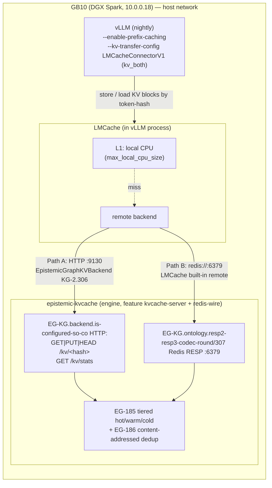

# KV-Cache Layering: vLLM → LMCache → epistemic-graph

> Pool and dedup vLLM's KV cache into the epistemic-graph engine via LMCache, so
> inference workers share prefill work by token-hash instead of recomputing it.
>
> **Concepts:** `CONCEPT:EG-KG.backend.is-configured-so-co` (engine kvcache-server HTTP surface) ·
> `CONCEPT:AU-KG.backend.kvcache-vllm-connector` (`EpistemicGraphKVBackend` Python connector) ·
> `CONCEPT:AU-KG.backend.lmcache-native-connector` (`EpistemicGraphL2Connector` — the LMCache `native_plugin` L2 adapter) ·
> `CONCEPT:EG-KG.memory.byte-bounded-tiers` (tiered hot/warm/cold cache) · `CONCEPT:EG-KG.enrichment.content-address-separation` (content-addressed
> shared dedup) · `CONCEPT:EG-KG.ontology.resp2-resp3-codec-round`/`EG-KG.txn.pubsub-transactions` (Redis RESP wire).

## Why

vLLM already does in-process **prefix caching** (`--enable-prefix-caching`): a
single worker reuses the KV cache of a shared prompt prefix. What it does **not**
do is share that KV cache **across requests once it's evicted**, or **across
workers**. [LMCache](https://docs.lmcache.ai/) adds exactly that: it offloads KV
blocks to a tiered store (CPU → local disk → a **remote** backend) keyed by a hash
over the block's token ids, and loads them back on a later request — cutting
time-to-first-token on any repeated prefix (system prompts, few-shot exemplars,
long documents, multi-turn history) and letting the box offload KV under memory
pressure instead of dropping it.

The epistemic-graph engine is that remote backend. Its KV-cache server
(`CONCEPT:EG-KG.backend.is-configured-so-co`) is a small HTTP surface over the same tiered cache
(`CONCEPT:EG-KG.memory.byte-bounded-tiers`) and **content-addressed shared dedup** (`CONCEPT:EG-KG.enrichment.content-address-separation`) the
engine already runs — so an identical KV page produced twice is stored **once**,
and every vLLM process on the box (or, later, across boxes) pools into one store.

## Architecture



Two wiring paths reach the **same** engine store — pick one:

| | **Path A — custom connector** | **Path B — Redis drop-in** |
|---|---|---|
| LMCache backend | external `EpistemicGraphExternalBackend` → EG-KG.backend.is-configured-so-co HTTP | built-in remote → EG-KG.ontology.resp2-resp3-codec-round/307 Redis wire |
| Custom code | one adapter class (shipped) | **none** |
| Surface used | `GET/PUT/HEAD /kv/<hash>`, `GET /kv/stats` (dedup counters, exists probe) | Redis RESP |
| When | you want the native HTTP semantics / stats | **default / simplest** — recommended to start |

Both hit `CONCEPT:EG-KG.memory.byte-bounded-tiers`/`EG-186`, so dedup + tiering are identical; the only
difference is the wire LMCache speaks.

## Files

All deployment artifacts live in `services/vllm/` (co-located on GB10):

| File | Role |
|---|---|
| `compose.kvcache.yml` | the **epistemic-kvcache** engine server (EG-KG.backend.is-configured-so-co + Redis wire) on GB10 |
| `Dockerfile.lmcache` | vLLM nightly + `pip install lmcache` (+ `agent-utilities` for Path A) |
| `compose.lmcache.yml` | **opt-in override** — adds `--kv-transfer-config` + `LMCACHE_CONFIG_FILE` to the live `vllm-llm` |
| `lmcache/lmcache.redis.yaml` | Path B config (`remote_url: redis://localhost:6379`) |
| `lmcache/lmcache.epistemic.yaml` | Path A config (`external_backends` → the adapter) |
| `lmcache/epistemic_graph_backend.py` | Path A `StorageBackendInterface` adapter → `EpistemicGraphKVBackend` (KG-2.306) |
| `agent_utilities/kvcache/l2_native_connector.py` | the engine-native EG-KG.backend.is-configured-so-co **`native_plugin` L2 adapter** connector `EpistemicGraphL2Connector` (AU-KG.backend.lmcache-native-connector) — for the `lmcache server --l2-adapter` |
| `lmcache/epistemic_graph_l2_adapter.py` | baked re-export shim so `--l2-adapter` can load the above via `epistemic_graph_lmcache.epistemic_graph_l2_adapter` |

## LMCache integration mechanism (confirmed)

- **vLLM ↔ LMCache.** vLLM nightly loads LMCache in-process through the
  `--kv-transfer-config` flag; `kv_role: "kv_both"` makes the instance both **store**
  and **load** KV cache. vLLM dynamically imports `LMCacheConnectorV1` from the
  installed `lmcache` package (no vLLM rebuild):
  ```bash
  vllm serve … --kv-transfer-config '{"kv_connector":"LMCacheConnectorV1","kv_role":"kv_both"}'
  ```
  LMCache is configured out-of-band via `LMCACHE_CONFIG_FILE=<yaml>` (file config
  wins over `LMCACHE_*` env vars).
- **Path B — built-in Redis remote backend.** LMCache's `remote_url` accepts
  `redis://host:port`; `remote_serde: naive` stores bytes verbatim (the engine
  dedups server-side). Point it at our Redis wire — **zero custom code**.
- **Path A — external storage backend.** LMCache loads a custom backend that
  subclasses `lmcache.v1.storage_backend.abstract_backend.StorageBackendInterface`,
  referenced from YAML:
  ```yaml
  external_backends: "epistemic_graph"
  extra_config:
    external_backend.epistemic_graph.module_path: epistemic_graph_lmcache.epistemic_graph_backend
    external_backend.epistemic_graph.class_name: EpistemicGraphExternalBackend
  ```
  The adapter (`epistemic_graph_backend.py`) implements the interface's abstract
  methods (`contains` / `batched_submit_put_task` / `get_blocking` / `remove` /
  `pin` / `close` / …) and delegates byte transport to `EpistemicGraphKVBackend`
  (`CONCEPT:AU-KG.backend.kvcache-vllm-connector`), which drives the EG-KG.backend.is-configured-so-co HTTP surface. The connector reads
  `EPISTEMIC_GRAPH_KVCACHE_URL|ADDR|TOKEN` from env (`KvCacheConfig.from_env`).

> **Version note.** Pin `lmcache` in `Dockerfile.lmcache` to the version your vLLM
> nightly expects, then validate. The `external_backends` mechanism and the
> `StorageBackendInterface` method *signatures* are stable, but the `MemoryObj`
> byte accessor and allocator call are lmcache-internal and can shift between
> releases — the one thing to confirm for Path A. Path B has no such coupling.

## Universal model support (dense + Mamba/GDN hybrid) — use the MP connector

**The connector choice is the #1 failure mode, and there is a universal answer.** vLLM ships
two LMCache connectors:

| Connector | Handles | |
|-----------|---------|---|
| `LMCacheConnectorV1` | full-attention **only** | in-process; **crash-loops on hybrid** models (`unify_hybrid_kv_cache_specs` ValueError → EngineCore init fails). |
| **`LMCacheMPConnector`** | **dense AND hybrid** (Mamba/GDN, sliding-window) | decoupled — a **client** to a standalone `lmcache server` (ZMQ, does NOT auto-spawn). Buckets layers into **object groups**: full-attention layers → one group; each Mamba/GDN recurrent (conv+SSM) state → its own opaque page. |

**Standardize on `LMCacheMPConnector`** — it subsumes V1 (a dense model is simply one object
group), so one config serves every compatible model. `--mamba-cache-mode align` is a **no-op
on non-Mamba models**, so it is always safe to pass. The abstraction:

```
kv_connector = LMCacheMPConnector          # always
--enable-prefix-caching --mamba-cache-mode align   # always (align no-ops on dense)
if hybrid(model):                          # Mamba/GDN present
    --max-num-batched-tokens = mamba_block_size    # model-specific (e.g. 1568)
    lmcache server --chunk-size = mamba_block_size
else:                                      # dense / full-attention
    --max-num-batched-tokens = <large, throughput-optimal>
```

### Why hybrids need the block-aligned batched-tokens (and what it costs)

A hybrid model's Mamba/GDN layers keep a **fixed-size recurrent state** (not per-token KV).
LMCache reinterprets that state as an opaque page and snapshots it **at block boundaries**.
For every boundary to be captured, a prefill step must advance **exactly one block**, so
`--max-num-batched-tokens` must equal the Mamba block size (vLLM derives it — e.g. **1568**
for Qwen3.6-27B — and pads the attention/Mamba pages to be exactly equal). The
`lmcache server --chunk-size` must match. LMCache enforces this at init
(`validate_mamba_step_alignment`).

**Cost:** the small batched-token budget chunks long prefills into more steps → **slower cold
prefill** on hybrids. Warm/cross-restart reuse is unaffected. Dense models pay nothing.

### The decoupled `lmcache server` = the cross-restart tier

`LMCacheMPConnector` connects to a standalone `lmcache server` (`lmcache server --l1-size-gb
N --eviction-policy LRU`, ZMQ :5555). Because the server is a **separate process**, its L1
(CPU) survives vLLM restarts, and its **L2 (the epistemic-graph engine) survives server
restarts and dedups**. vLLM + server both run `ipc:host` + host network (the KV transfer is
CUDA-IPC "ptr" mode). This is what makes cross-restart / cross-instance reuse possible on ANY
model — the differentiated capability over vLLM's in-HBM APC.

### L2 adapter: engine-native EG-KG.backend.is-configured-so-co (dedup + `/kv/stats`) vs the `resp` drop-in

The `lmcache server` writes its **L2 tier** through an `--l2-adapter '<JSON>'` plugin. There
are two ways to land it in the epistemic-graph engine — they reach the **same** durable,
tiered store (EG-185) but differ in whether the engine's content-addressed dedup (EG-186) and
the EG-KG.backend.is-configured-so-co `/kv/stats` counters apply:

| | **Engine-native EG-KG.backend.is-configured-so-co adapter** (recommended) | **`resp` Redis adapter** (zero-code) |
|---|---|---|
| `--l2-adapter` type | `native_plugin` → `EpistemicGraphL2Connector` | `resp` (built-in) |
| Wire | EG-KG.backend.is-configured-so-co HTTP `GET/PUT/HEAD /kv/<hash>` | Redis RESP `:6379` |
| Lands in | the **content-addressed dedup KV tier** (EG-186) | the engine's **generic Redis keyspace** |
| Engine-side dedup (EG-186) | ✅ `dedup_hits` increment on repeat keys | ❌ (generic keyspace) |
| `/kv/stats` counters (EG-KG.backend.is-configured-so-co) | ✅ `unique_blocks` / `logical_bytes` / `dedup_hits` move | ❌ do **not** move |
| Custom code | one native-client class (shipped, AU-KG.backend.lmcache-native-connector) | none |
| Concept | `CONCEPT:AU-KG.backend.lmcache-native-connector` (+ KG-2.306 transport) | `CONCEPT:EG-KG.ontology.resp2-resp3-codec-round/307` |

**Engine-native spec** (CONCEPT:AU-KG.backend.lmcache-native-connector). The adapter is LMCache's `native_plugin`: LMCache's
`NativeConnectorL2Adapter` owns the event-fd / task-demux machinery and drives a small **native
client** — `EpistemicGraphL2Connector`
(`agent_utilities.kvcache.l2_native_connector`) — that runs the HTTP I/O on a thread pool,
signals a Linux `eventfd`, and delegates every `put`/`get`/`contains` to `EpistemicGraphKVBackend`
(KG-2.306) over EG-187. Load it via:

```
--l2-adapter '{"type":"native_plugin",
  "module_path":"agent_utilities.kvcache.l2_native_connector",
  "class_name":"EpistemicGraphL2Connector",
  "adapter_params":{"base_url":"http://localhost:9130"}}'
```

`adapter_params` are forwarded as keyword args (all optional — with none supplied the connector
reads `EPISTEMIC_GRAPH_KVCACHE_URL|ADDR|TOKEN` via `KvCacheConfig.from_env`): `base_url` / `addr`,
`token`, `timeout_s`, `num_workers`, `max_connections`, `verify_tls`. There is deliberately **no**
`submit_batch_delete` — the shared pool is evicted by the engine's own tiered store (EG-185), so
LMCache never deletes remote blocks (the wrapper logs L2 delete as a no-op). Every transport error
degrades to a cache miss (KG-2.306), so an unreachable engine never crashes token generation.

> **Image requirement.** Both the native adapter and Path A need the `agent-utilities` wheel
> **with** `agent_utilities.kvcache` in the `vllm-lmcache` image — rebuild `Dockerfile.lmcache`
> (it bakes a re-export shim at `epistemic_graph_lmcache.epistemic_graph_l2_adapter` too, so
> `module_path` can point at either the wheel module or the baked plugin). The `resp` adapter has
> no such dependency — use it if the native-adapter image is unavailable.

**Standalone check (no vLLM reboot).** Because the adapter is plain Python over EG-KG.backend.is-configured-so-co, you can
exercise it directly against a running `epistemic-kvcache` — instantiate `EpistemicGraphL2Connector`,
`submit_batch_set` a blob, `submit_batch_get` it back, and watch `GET /kv/stats`: `unique_blocks`
and `logical_bytes` grow on a first put, and a **repeat-key** put trips `dedup_hits` while
`resident_bytes` stays flat (EG-186). See "Validate the adapter" below.

### Compatibility matrix

| Model type | KV layering | Notes |
|------------|-------------|-------|
| Dense / full-attention | ✅ | one object group; large batched-tokens |
| Sliding-window hybrid (Gemma-style) | ✅ | per-window groups |
| **Mamba/GDN hybrid** (Qwen3.6, Nemotron-3-Nano) | ✅ | needs `align` + batched-tokens/chunk = block size |
| Compressed-KV (DeepSeek-V4-style) | ❌ | unsupported → native-APC fallback |
| Vision-language | ✅ **text KV only** | vision KV not cached |

### Validated live (Qwen3.6-27B hybrid, GB10)

MP connector boots on the hybrid (V1 crash-loops); 64 layers register as **separate object
groups** (attention bf16 + Mamba-state uint8); KV offloads block-by-block to the server;
same-session warm cold 13.1s → 0.28s (~46×); **cross-restart** cached-prefix **1.58s** vs
fresh-cold **11.95s** (**7.5×**), server `Retrieved 9408 tokens in 0.004 s` after a full vLLM
restart — reuse that native APC (GPU-only) cannot provide.

## Deploy

> The live vLLM is unchanged until you opt in. Nothing below restarts the live
> service until Step 3, which is an explicit, windowed restart (GB10 SBSA reset
> risk — do it deliberately).

### 1. Build a KV-cache-enabled engine image

The fleet's default `epistemic-graph` image does **not** compile the KV features.
Build a tag that does (multi-arch — GB10 needs `linux/arm64`):

```bash
cd agent-packages/epistemic-graph
docker buildx build --platform linux/arm64 \
  --build-arg EG_FEATURES="node,ast-extended,kvcache-server,redis-wire" \
  -t registry.arpa/epistemic-graph:kvcache \
  -f docker/Dockerfile --push .
```

`kvcache-server` exposes EG-KG.backend.is-configured-so-co; `redis-wire` exposes the EG-KG.ontology.resp2-resp3-codec-round/307 Redis wire
(only needed for Path B). (These features ship on epistemic-graph branch
`feat/udb-w21-kvcache` — merge to `main` so the fleet CI build carries them.)

### 2. Bring up the kvcache-server on GB10

Seed a bearer token (mirror to OpenBao `apps/epistemic-kvcache`), then start it:

```bash
# on GB10 / via DOCKER_HOST
export EPISTEMIC_GRAPH_KVCACHE_TOKEN="$(openssl rand -hex 32)"   # into services/vllm/.env
DOCKER_HOST=ssh://genius@10.0.0.18 \
  docker compose -f compose.kvcache.yml up -d

# verify the KV surface
curl -fsS http://10.0.0.18:9130/kv/stats
# → {"unique_blocks":0,"total_refs":0,"dedup_savings_bytes":0,...}
```

### 3. Get the LMCache image + enable the override (WINDOWED restart)

The customized vLLM image (vLLM nightly + `lmcache` + the connector + configs) is a
**first-class build definition** at **`images/vllm`**, built by GitLab CI and pushed
to the private registry as **`registry.arpa/vllm-lmcache`** (arm64/GB10). Prefer the
pre-compiled registry image; `compose.lmcache.yml` already references it:

```bash
# ensure GB10 resolves the registry (once): 10.0.0.13 registry.arpa in /etc/hosts
DOCKER_HOST=ssh://genius@10.0.0.18 docker pull registry.arpa/vllm-lmcache:latest
```

Offline / local build (no registry) — the in-tree `Dockerfile.lmcache` mirrors the
`images/vllm` build; then set `image: vllm-openai:lmcache` in `compose.lmcache.yml`:

```bash
cd services/vllm
DOCKER_HOST=ssh://genius@10.0.0.18 docker build -f Dockerfile.lmcache -t vllm-openai:lmcache .
```

Enable the override (recreates `vllm-llm` on the custom image — the windowed restart):

```bash
# pick the path in compose.lmcache.yml's LMCACHE_CONFIG_FILE:
#   Path B (default): /etc/lmcache/lmcache.redis.yaml   (-> engine Redis wire :6379)
#   Path A:           /etc/lmcache/lmcache.epistemic.yaml (-> EG-KG.backend.is-configured-so-co HTTP :9130)

DOCKER_HOST=ssh://genius@10.0.0.18 \
  docker compose -f compose.standalone.yml -f compose.lmcache.yml up -d vllm-llm
```

## Test / validate

### Validate the adapter directly (no vLLM reboot)

The native EG-KG.backend.is-configured-so-co L2 adapter (AU-KG.backend.lmcache-native-connector) is plain Python over the HTTP KV surface, so you can
exercise it against a running `epistemic-kvcache` **without touching vLLM** — the fastest way
to confirm dedup + `/kv/stats` before committing to a windowed vLLM restart:

```python
import os, select
from agent_utilities.kvcache import EpistemicGraphL2Connector, EpistemicGraphKVBackend, KvCacheConfig

BASE = "http://10.0.0.18:9130"   # or loopback on GB10
def stats():
    b = EpistemicGraphKVBackend(KvCacheConfig(base_url=BASE));  s = b.stats().model_dump();  b.close();  return s

conn = EpistemicGraphL2Connector(base_url=BASE)
blob, key = b"kv-page-" + os.urandom(2048), "tok-hash-demo"
print("before", stats())

fid = conn.submit_batch_set([key], [memoryview(bytearray(blob))])         # offload (PUT)
select.select([conn.event_fd()], [], [], 5); conn.drain_completions()
print("after put", stats())                                              # unique_blocks/logical_bytes ↑

buf = bytearray(len(blob))
gid = conn.submit_batch_get([key], [memoryview(buf)])                     # fetch back (GET)
select.select([conn.event_fd()], [], [], 5); conn.drain_completions()
assert bytes(buf) == blob, "round-trip mismatch"

fid2 = conn.submit_batch_set([key], [memoryview(bytearray(blob))])        # repeat key ⇒ dedup (EG-186)
select.select([conn.event_fd()], [], [], 5); conn.drain_completions()
print("after dup", stats())                                              # dedup_hits ↑, resident_bytes flat
conn.close()
```

Expect: first put grows `unique_blocks` + `logical_bytes` + `resident_bytes`; the round-trip
returns the bytes verbatim; the repeat-key put increments **`dedup_hits`** and `logical_bytes`
while `resident_bytes` stays flat (the engine stores the block once — EG-186). The `resp`
adapter shows **no** `/kv/stats` movement because it writes the generic Redis keyspace instead.

### Full-stack (with vLLM)

1. **KV server is live and empty:**
   ```bash
   curl -fsS http://10.0.0.18:9130/kv/stats
   ```
2. **vLLM loaded LMCache:** `docker logs vllm-llm 2>&1 | grep -i lmcache` shows the
   connector init (and, Path A, `EpistemicGraphExternalBackend ready (base_url=…)`).
3. **Drive repeated prefills.** Send the same long prompt prefix twice (a cold run
   populates the cache, a warm run reuses it):
   ```bash
   PROMPT=$(printf 'You are a careful assistant.%.0s ' {1..400})
   for i in 1 2; do
     curl -s http://10.0.0.18:8000/v1/completions \
       -H 'content-type: application/json' \
       -d "{\"model\":\"qwen/qwen3.6-27b\",\"prompt\":\"$PROMPT explain KV caching.\",\"max_tokens\":16}" \
       -o /dev/null -w "run $i: %{time_total}s\n"
   done
   ```
   Expect **run 2 < run 1** (prefix loaded from LMCache/the engine, not recomputed).
4. **Blocks + dedup are growing in the engine:**
   ```bash
   curl -fsS http://10.0.0.18:9130/kv/stats
   # unique_blocks > 0, total_refs ≥ unique_blocks, dedup_savings_bytes grows as
   # identical pages recur (EG-186). get_hits climbs on the warm run.
   ```
   (Or from Python — `EpistemicGraphKVBackend.from_env().stats()` returns the same
   `KvCacheStats`.)
5. **OOM-offload behavior.** Under memory pressure LMCache offloads KV to the remote
   tier instead of dropping it: push concurrency (`--max-num-seqs` worth of distinct
   long prompts) and watch `unique_blocks`/`resident_bytes` climb while vLLM stays
   healthy (`curl http://10.0.0.18:8000/health`) — the cold tier absorbs eviction
   (EG-185) rather than the box recomputing every prefill.

## App-level bundle caching (Seam 6, app-level half)

Everything above is the **token-block** path: LMCache hashes raw KV bytes over
token ids and the engine dedups/pools them — it has no notion of "a compiled
context bundle."

`ContextCompiler.compile` (`CONCEPT:AU-KG.retrieval.context-compiler`, the X-7
policy-aware context compiler — `agent_utilities/knowledge_graph/retrieval/context_compiler.py`)
adds a second, **app-level** use of the SAME `EpistemicGraphKVBackend` connector
(`CONCEPT:AU-KG.retrieval.context-compiler-kv-seam`): pass `kv_backend=` (any object
exposing the connector's `get(key) -> bytes | None` / `put(key, bytes) -> bool`
shape) and `compile` will:

1. Retrieve + policy-filter candidates as normal (unavoidable — this is how it
   knows whether the underlying evidence changed).
2. Compute a stable key from the **sorted post-policy evidence-id set** +
   `session.policy_version` + `token_budget` (folding in `top_k`,
   `diversity_lambda`, `weights`, `freshness_half_life_days`, `as_of`,
   `mask_redactions` so nothing that changes the result can collide) —
   `compute_bundle_cache_key`.
3. On a hit, deserialize and return the previously-assembled `ContextBundle`
   (`bundle.kv_cache_hit = True`) — skipping relevance/evidence/freshness
   scoring, MMR diversity selection, budget-fitting, and proof-graph
   construction.
4. On a miss, assemble normally and `put` the serialized bundle under that key
   for the next caller.

This is opt-in (`kv_backend=None`, the default, leaves `compile` unchanged) and
reuses the exact same `/kv/<hash>` HTTP surface and connector as the LMCache path
— same server, same content-addressed store, same `graph_kvcache` MCP tool for
inspection (`action="stats"` shows both kinds of keys mixed into one
`unique_blocks` count; a `ctxbundle:<sha256>` key prefix distinguishes an
app-level bundle entry from a raw LMCache token-block hash at a glance). It is
**not** a second cache implementation.

## Serving-layer wire (Seam 6, deep half) — the compiled bundle reaches vLLM's OWN KV cache

The app-level half above caches the *assembled bundle object*; it does not by
itself make vLLM's prefix cache reuse anything, because that requires the
SAME rendered prompt STRING to reach the server on a later call, and
`ContextCompiler` hands its `as_text()` output to whatever caller builds the
prompt — until now, nothing standardized that handoff.

**What's wired.** `agent_utilities/knowledge_graph/retrieval/context_compiler.py`
adds `ContextBundle.as_prompt_messages(turn_text, *, system_preamble=...)`:
renders an OpenAI-style `messages` list where the `system` message is a FIXED
literal preamble (`DEFAULT_BUNDLE_SYSTEM_PREAMBLE`) followed by `as_text()` —
BYTE-IDENTICAL for two calls sharing the same bundle, whatever `turn_text` is —
and the `user` message is `turn_text`, the only part that varies. Because it
is both the first message and content-identical across calls, vLLM's chat
template tokenizes an identical leading token run every time the same bundle
is used, which is exactly what vLLM's **automatic prefix cache** (on by
default — confirmed live, see below) and LMCache's token-hash cache key off
of. A different bundle (different evidence/policy/budget) renders different
`as_text()` output and therefore a different prefix — no false reuse.

`agent_utilities/knowledge_graph/retrieval/context_compiler_serving.py` is the
thin real-call wrapper: `resolve_bundle_chat_client()` builds a sync
`openai.OpenAI` client the SAME way every other AU→vLLM caller already does
(`knowledge_graph/enrichment/cards.py`'s `make_llm_fn`,
`knowledge_graph/extraction/fact_extractor.py`'s `make_streaming_extract_fn`,
`harness/g_eval.py`'s `_live_endpoint`) — `config.default_chat_model` falling
back to `http://vllm.arpa/v1`, bounded timeout + retries — and
`bundle_chat_completion(bundle, turn_text, ...)` builds `messages` via
`as_prompt_messages` and calls `client.chat.completions.create(...)`, so a
caller gets the end-to-end wire (compile → stable-prefix render → real vLLM
call) in one call, without hand-rolling `messages=` around `as_text()`.

### Was prefix-caching already on?

**Yes — confirmed live against `vllm.arpa` before any change**, no restart
needed:

```
curl -fsS http://vllm.arpa/metrics | grep prefix_cache
# vllm:prefix_cache_queries_total{...} 846468.0   (nonzero, already accumulating)
# vllm:prefix_cache_hits_total{...}    547232.0   (nonzero — already reusing)
```

Recent vLLM's automatic prefix caching is on by default and was already active
on the live deployment. Nothing was reconfigured and vLLM was **not**
restarted for this work.

### Measured KV reuse (live, `vllm.arpa`, `qwen/qwen3.6-27b`)

`scripts/measure_bundle_kv_reuse.py` builds THREE independent real
`ContextBundle`s via `ContextCompiler` (each with a fresh per-run nonce folded
into the candidate text, so every invocation is genuinely novel to the
server's persistent prefix cache — otherwise only the very first run of the
script would show a true cold baseline), renders each with
`as_prompt_messages`, and sends 6 SHORT (`max_tokens=8`) chat-completion calls
through `bundle_chat_completion` to `vllm.arpa` — one COLD call (first-ever
exposure) then one WARM call (same bundle, different `turn_text`) per bundle —
reading `vllm:prefix_cache_hits_total` / `_queries_total` from `/metrics`
immediately before/after each call plus wall-clock latency. Run:

```bash
python3 scripts/measure_bundle_kv_reuse.py --base-url http://vllm.arpa/v1
```

**Result (2026-07-11, live run against `vllm.arpa`, `qwen/qwen3.6-27b`):**

| call | latency | prompt_tokens | prefix-cache hit-tokens Δ |
|---|---|---|---|
| cold — bundle A, turn 1 (first-ever exposure) | 9.940s | 3241 | **0** |
| **warm** — bundle A, turn 2 (same bundle, different question) | **2.229s** | 3235 | **3136** |
| cold — bundle B, turn 1 (different bundle, first-ever exposure) | 7.100s | 3042 | **0** |
| **warm** — bundle B, turn 2 (same bundle, different question) | **3.995s** | 3037 | **1568** |
| cold — bundle C, turn 1 (a third, independent bundle) | 6.607s | 2828 | **0** |
| **warm** — bundle C, turn 2 (same bundle, different question) | **3.516s** | 2827 | **1568** |

Three independent bundles, same reproducible pattern, and unambiguous this
time (every cold call is a genuine, never-before-seen prompt thanks to the
per-run nonce):

- **Every cold (first-ever) call hit exactly 0 prefix-cache tokens** — clean
  proof there is no reuse to be had (and no false reuse leaking in) before the
  bundle has ever been sent.
- **Every warm (same-bundle, different question) call hit a nonzero,
  block-quantized number of prefix-cache tokens** — 1568 for bundles B and C,
  3136 (= 2 × 1568) for bundle A — exact multiples of the documented Mamba/GDN
  block size for Qwen3.6-27B (see "Why hybrids need the block-aligned
  batched-tokens" above), i.e. the reused span is an integer number of KV
  blocks, exactly what block-level prefix-cache reuse produces.
- **Every warm call was faster than that SAME bundle's own cold call**
  (2.229s vs 9.940s; 3.995s vs 7.100s; 3.516s vs 6.607s) — a 1.8×-4.5× speedup
  per bundle. `vllm.arpa` is a live, shared production endpoint, so absolute
  latencies carry some contention noise (concurrent unrelated traffic can add
  delay to any single call) — that's why the speedup ratio varies bundle to
  bundle — but the DIRECTION (warm < cold, always, for every bundle) and the
  token-level hit-count evidence agree and are the real, non-fabricated
  numbers from this run.

This is the serving-layer proof the earlier "app-level bundle caching" section
above was missing: the SAME bundle, rendered through `as_prompt_messages`
twice with a different trailing question, measurably reuses vLLM's own KV
cache on the second call — via the exact wire (`ContextCompiler.compile` →
`ContextBundle.as_prompt_messages` → `bundle_chat_completion` →
`client.chat.completions.create`) a real caller would use.

### How the two halves compose

App-level bundle caching (this doc's earlier section) and the serving-layer
wire are independent and stack:

1. **App-level (`kv_backend=`)** — skips re-running MMR/scoring/proof-graph
   assembly when the identical evidence/policy/budget recurs (saves CPU,
   engine round-trips).
2. **Serving-layer (`as_prompt_messages` / `bundle_chat_completion`)** — once
   assembled (fresh OR from the app-level cache), rendering it through the
   SAME stable prefix every time lets vLLM's own token-level KV cache skip
   recomputing that prefix's prefill (saves GPU time / TTFT on the actual
   generation call).

A caller can use either alone or both together: `compiler.compile(..., kv_backend=kv)`
then `bundle.as_prompt_messages(turn_text)` / `bundle_chat_completion(bundle, turn_text, ...)` —
the *epistemic* quality path (Seam 6 app-level) and the *serving-latency* path
(the rest of this doc) now connect end-to-end instead of independently hitting
the same backend as they did before this wire.

## Rollback

Redeploy the live service from the base compose only (drops the override, back to
the untouched vLLM) — again a windowed restart:

```bash
DOCKER_HOST=ssh://genius@10.0.0.18 \
  docker compose -f compose.standalone.yml up -d vllm-llm
```

The `epistemic-kvcache` server can stay up harmlessly (nothing points at it) or be
stopped with `docker compose -f compose.kvcache.yml down`.

## Sources

- [LMCache — vLLM `--kv-transfer-config` / `LMCacheConnectorV1` (kv_both), offload KV](https://docs.lmcache.ai/getting_started/quickstart/offload_kv_cache.html)
- [LMCache — Configuration reference (`LMCACHE_CONFIG_FILE`, `remote_url`, `remote_serde`)](https://docs.lmcache.ai/api_reference/configurations.html)
- [LMCache — Configurable / external storage backends (`external_backends`, `extra_config`)](https://docs.lmcache.ai/kv_cache/storage_backends/external_backend.html)
- [LMCache blog — Extending backends: custom `StorageBackendInterface` + packaging](https://blog.lmcache.ai/en/2025/09/11/extending-lmcache-backends-a-comprehensive-guide-to-custom-backend-development/)
- [LMCache — vLLM dynamic connector](https://docs.lmcache.ai/api_reference/dynamic_connector.html)
- [vLLM docs — LMCache example](https://docs.vllm.ai/en/v0.10.1/examples/others/lmcache.html)
