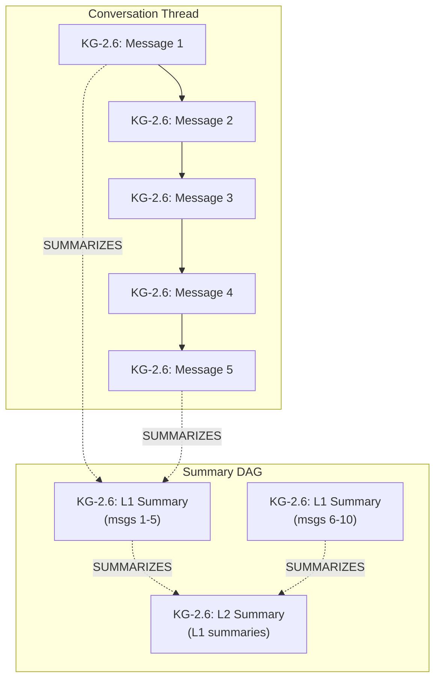

# Lossless Context Management (LCM) Guide

## Overview

Lossless Context Management extends agent-utilities' memory system with a persistent
**Summary DAG** (Directed Acyclic Graph) in the Knowledge Graph. Instead of naively
truncating conversation history when the context window fills up, LCM compacts messages
into hierarchical summaries that preserve all information losslessly — original messages
are always recoverable by traversing the DAG.

## Architecture



### Key Concepts

| Concept | Description |
|---------|-------------|
| **Summary Node** | A KG node containing compacted text from multiple messages |
| **SUMMARIZES Edge** | Links a Summary to its source messages or lower-level summaries |
| **Level** | Hierarchy depth: L1 = direct message summaries, L2+ = meta-summaries |
| **Escalation** | Creating higher-level summaries from existing lower-level ones |
| **Expansion** | Recovering original messages by traversing the DAG downward |

## Programmatic Usage (`AgentContextManager`)

LCM operations are driven automatically by the maintenance scheduler (see
*Compaction* below) and are also available directly on `AgentContextManager`
(aliased as `ElasticContextManager`) in
`knowledge_graph/memory/agent_context.py`. There is no standalone `kg_memory`
MCP tool — these are Python methods invoked by the engine.

### Compact a Thread

```python
ecm.compact_thread(thread_id="thread_abc123", engine=engine, strategy="progressive")
```

Triggers compaction for the specified thread. Returns status and summary count.

### Grep Memories

```python
AgentContextManager.grep_memories(query="architecture decision", partition="antigravity", engine=engine)
```

Searches across all messages and summaries. The `partition` argument provides
per-IDE memory isolation.

### Describe a Summary

```python
AgentContextManager.describe_summary("sum_20250516_143022", engine=engine)
```

Returns metadata about a summary node: level, child count, creation time, content preview.

### Expand a Summary

```python
AgentContextManager.expand_summary("sum_20250516_143022", engine=engine)
```

Traverses the Summary DAG to recover the original source messages that were compacted.
Supports multi-level traversal (L2 → L1 → messages).

## Partition-Aware Memory

LCM supports per-IDE memory isolation via the `partition` property:

- `partition:antigravity` — Messages from Antigravity IDE
- `partition:windsurf` — Messages from Windsurf IDE
- `partition:claude` — Messages from Claude Code
- `partition:codex` — Messages from Codex

Partitions are automatically assigned during conversation ingestion and respected
by all LCM operations.

## Compaction (Maintenance Scheduler Tick)

Compaction is no longer a standalone daemon thread. It runs as the
`_tick_compaction` job inside the **consolidated** `_maintenance_scheduler_loop`
(`knowledge_graph/core/engine_tasks.py`), which gates all `_tick_*` jobs behind
a single background-throttle:

- **Interval**: Every 30 minutes (the `compaction` job is registered at `1800.0`s)
- **Threshold**: `Thread` nodes with > 30 uncompacted messages
- **Strategy**: Progressive compaction (oldest messages first), via
  `ElasticContextManager.compact_thread(strategy="progressive")`
- **Limit**: Processes up to 3 threads per cycle

### Configuration

No additional configuration needed. The scheduler starts automatically with the
KG engine. To adjust the threshold, modify the `COMPACTION_THRESHOLD` constant
in `_tick_compaction` (`engine_tasks.py`).

## Evolution (Maintenance Scheduler Tick)

The `_tick_evolution` job runs alongside compaction in the same consolidated
scheduler loop:

- **Interval**: Every 60 minutes (configurable via `KG_EVOLUTION_INTERVAL` env var)
- **Purpose**: Scans KG for unresolved research topics, runs relevance sweeps
- **Tracking**: Logs each cycle as an `EvolutionCycle` node in the KG

## Implementation Details

### AgentContextManager (unified entry point)

All LCM operations live on `AgentContextManager`
(`knowledge_graph/memory/agent_context.py`); `ElasticContextManager` is a
backward-compatible alias for the same class:

- `compact_thread()` — Orchestrates compaction for a specific thread
- `persist_compaction()` — Writes Summary nodes and SUMMARIZES edges to KG
- `escalate()` — Builds higher-level summaries from existing L1 summaries
- `get_summary_dag()` — Retrieves the full summary hierarchy for a thread
- `grep_memories()` — Partition-aware search across messages and summaries
- `describe_summary()` — Summary metadata retrieval
- `expand_summary()` — DAG traversal for message recovery

All operations follow the vertical scaling principle — extending existing pillars
rather than creating parallel modules.
