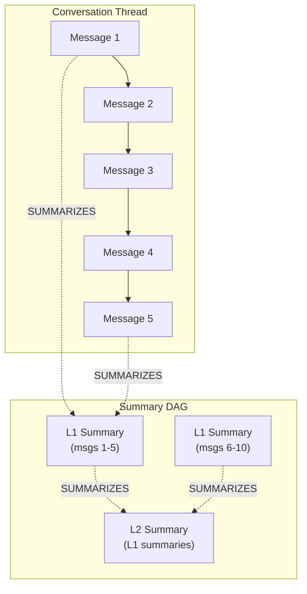

# Lossless Context Management (LCM) Guide

## Overview

Lossless Context Management extends agent-utilities' memory system with a persistent
**Summary DAG** (Directed Acyclic Graph) in the Knowledge Graph. Instead of naively
truncating conversation history when the context window fills up, LCM compacts messages
into hierarchical summaries that preserve all information losslessly — original messages
are always recoverable by traversing the DAG.

## Architecture



### Key Concepts

| Concept | Description |
|---------|-------------|
| **Summary Node** | A KG node containing compacted text from multiple messages |
| **SUMMARIZES Edge** | Links a Summary to its source messages or lower-level summaries |
| **Level** | Hierarchy depth: L1 = direct message summaries, L2+ = meta-summaries |
| **Escalation** | Creating higher-level summaries from existing lower-level ones |
| **Expansion** | Recovering original messages by traversing the DAG downward |

## MCP Tool Usage

All LCM operations are exposed through the `kg_memory` MCP tool with specific actions:

### Compact a Thread

```json
{
  "action": "compact",
  "content": "thread_abc123"
}
```

Triggers compaction for the specified thread. Returns status and summary count.

### Grep Memories

```json
{
  "action": "grep",
  "query": "architecture decision",
  "content": "antigravity"
}
```

Searches across all messages and summaries. The `content` field is used as the
partition filter for per-IDE memory isolation.

### Describe a Summary

```json
{
  "action": "describe",
  "content": "sum_20250516_143022"
}
```

Returns metadata about a summary node: level, child count, creation time, content preview.

### Expand a Summary

```json
{
  "action": "expand",
  "content": "sum_20250516_143022"
}
```

Traverses the Summary DAG to recover the original source messages that were compacted.
Supports multi-level traversal (L2 → L1 → messages).

## Partition-Aware Memory

LCM supports per-IDE memory isolation via the `partition` property:

- `partition:antigravity` — Messages from Antigravity IDE
- `partition:windsurf` — Messages from Windsurf IDE
- `partition:claude` — Messages from Claude Code
- `partition:codex` — Messages from Codex

Partitions are automatically assigned during conversation ingestion and respected
by all LCM operations.

## Compaction Daemon

The `KG-Compaction-Daemon` runs as a background thread in the KG engine:

- **Interval**: Every 30 minutes
- **Threshold**: Threads with > 30 uncompacted messages
- **Strategy**: Progressive compaction (oldest messages first)
- **Limit**: Processes up to 3 threads per cycle

### Configuration

No additional configuration needed. The daemon starts automatically with the
KG engine. To adjust the threshold, modify the `COMPACTION_THRESHOLD` constant
in `engine_tasks.py`.

## Evolution Daemon

The `KG-Evolution-Daemon` runs alongside the compaction daemon:

- **Interval**: Every 60 minutes (configurable via `KG_EVOLUTION_INTERVAL` env var)
- **Purpose**: Scans KG for unresolved research topics, runs relevance sweeps
- **Tracking**: Logs each cycle as an `EvolutionCycle` node in the KG

## Implementation Details

### ContextCompactor Extensions

The existing `ContextCompactor` class was extended with:

- `persist_compaction()` — Writes Summary nodes and SUMMARIZES edges to KG
- `escalate()` — Builds higher-level summaries from existing L1 summaries
- `get_summary_dag()` — Retrieves the full summary hierarchy for a thread

### ElasticContextManager Extensions

The `ElasticContextManager` serves as the unified entry point:

- `compact_thread()` — Orchestrates compaction for a specific thread
- `grep()` — Partition-aware search across messages and summaries
- `describe()` — Summary metadata retrieval
- `expand()` — DAG traversal for message recovery

All operations follow the vertical scaling principle — extending existing pillars
rather than creating parallel modules.
