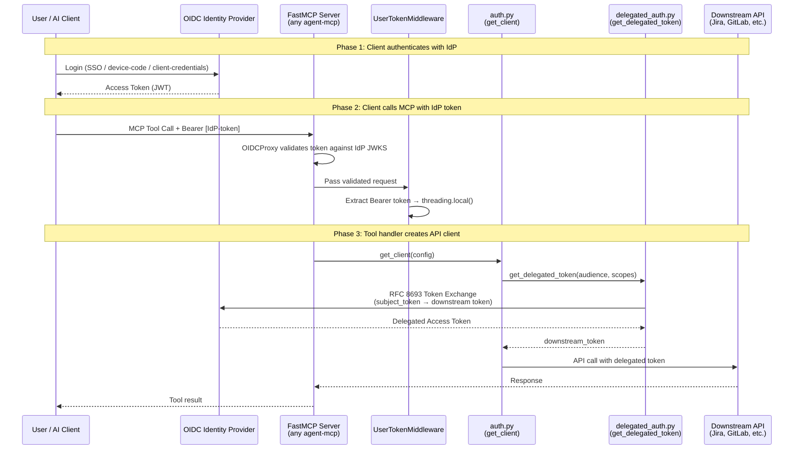
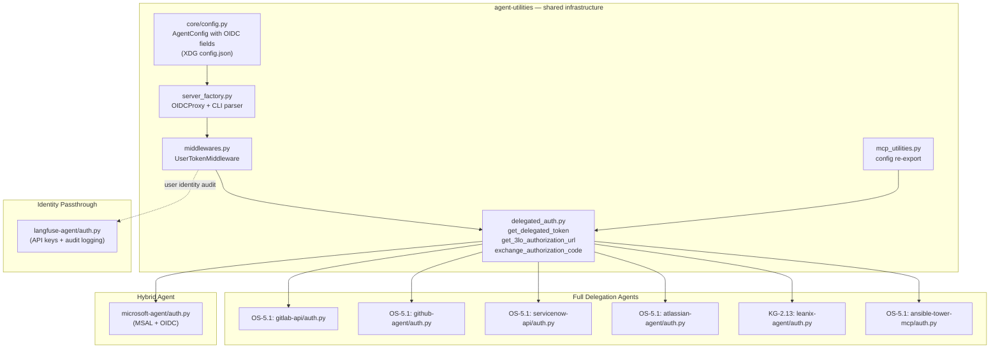
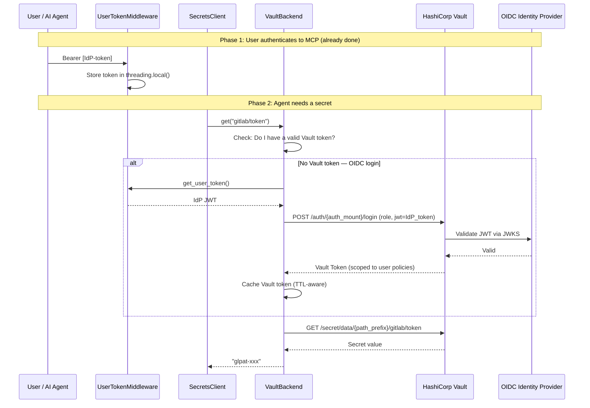
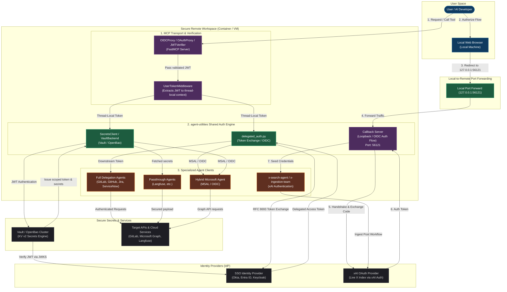

# OAuth 2.0 / OIDC SSO Authentication Guide

This guide documents the standardized OAuth 2.0 / OIDC authentication
architecture used across the entire agent-packages ecosystem.  It replaces
personal access tokens (PATs) with enterprise SSO-based identity propagation.

## Overview

Every MCP server in the ecosystem supports three authentication patterns:

| Pattern | When to Use | Example Agents |
|---------|-------------|----------------|
| **Full Delegation** | Downstream API supports OIDC token exchange (RFC 8693) | GitLab, GitHub, ServiceNow, Atlassian*, LeanIX*, Ansible Tower* |
| **Hybrid** | Agent has its own auth flow (e.g. MSAL) alongside OIDC | Microsoft Agent |
| **Identity Passthrough** | Downstream API uses API keys only; SSO secures MCP layer | Langfuse |

\* = Can also use identity passthrough if the downstream service doesn't support token exchange.

## Architecture

### Authentication Flow



### Component Architecture



## Two-Layer Auth Architecture

Authentication is split into two independent layers:

### Layer 1: MCP Transport Security (already built into `agent-utilities`)

The MCP server itself is protected by an OIDC/OAuth proxy.  This layer
validates that the **caller** has a valid IdP-issued token before any tool
is executed.

- Configured via `--auth-type oidc-proxy` on the MCP CLI
- Uses FastMCP's built-in `OIDCProxy` / `OAuthProxy` / `JWTVerifier`
- `UserTokenMiddleware` extracts the Bearer token into `threading.local()`

### Layer 2: Downstream API Delegation (this module)

Each agent's `auth.py` reads the stored user token and performs an
**RFC 8693 Token Exchange** to obtain a service-specific token for the
downstream API.

- Centralized in `agent_utilities.mcp.delegated_auth`
- Shared helper `get_delegated_token()` eliminates code duplication
- Falls back to env-var credentials when delegation is disabled

## Quick Start

### 1. Set Environment Variables

```bash
# Required for OIDC delegation
export AUTH_TYPE=oidc-proxy
export OIDC_CONFIG_URL=https://your-idp.example.com/.well-known/openid-configuration
export OIDC_CLIENT_ID=your-client-id
export OIDC_CLIENT_SECRET=your-client-secret
export ENABLE_DELEGATION=True
export AUDIENCE=https://api.downstream-service.com
export DELEGATED_SCOPES="api read write"
```

Or add them to the XDG config file at
`~/.config/agent-utilities/knuckles-team/config.json`:

```json
{
    "oidc_config_url": "https://your-idp.example.com/.well-known/openid-configuration",
    "oidc_client_id": "your-client-id",
    "oidc_client_secret": "your-client-secret",
    "enable_delegation": true,
    "delegation_audience": "https://api.downstream-service.com",
    "delegated_scopes": "api read write"
}
```

### 2. Start the MCP Server

```bash
# Any agent — the auth flags are handled by create_mcp_server()
python -m gitlab_api.mcp_server \
  --transport streamable-http \
  --auth-type oidc-proxy \
  --oidc-config-url $OIDC_CONFIG_URL \
  --oidc-client-id $OIDC_CLIENT_ID \
  --oidc-client-secret $OIDC_CLIENT_SECRET \
  --enable-delegation
```

### 3. Call Tools with Bearer Token

```bash
# The client includes the IdP-issued token
curl -X POST http://localhost:8000/mcp/tools/call \
  -H "Authorization: Bearer <your-idp-token>" \
  -H "Content-Type: application/json" \
  -d '{"name": "gitlab_projects", "arguments": {"action": "list_projects"}}'
```

## Environment Variable Reference

| Variable | Required | Default | Description |
|----------|----------|---------|-------------|
| `AUTH_TYPE` | No | `none` | Auth type: `none`, `oidc-proxy`, `oauth-proxy`, `jwt`, `remote` |
| `OIDC_CONFIG_URL` | For OIDC | — | OIDC discovery URL (`.well-known/openid-configuration`) |
| `OIDC_CLIENT_ID` | For OIDC | — | OAuth 2.0 client ID from your IdP |
| `OIDC_CLIENT_SECRET` | For OIDC | — | OAuth 2.0 client secret from your IdP |
| `ENABLE_DELEGATION` | No | `False` | Enable RFC 8693 token exchange for downstream APIs |
| `AUDIENCE` | For delegation | — | Target audience for the delegated token |
| `DELEGATED_SCOPES` | No | `api` | Space-separated scopes for the delegated token |

### Per-Agent Variables (fallback when delegation is disabled)

| Agent | Variables |
|-------|-----------|
| **gitlab-api** | `GITLAB_URL`, `GITLAB_TOKEN`, `GITLAB_SSL_VERIFY` |
| **github-agent** | `GITHUB_URL`, `GITHUB_TOKEN`, `GITHUB_VERIFY` |
| **servicenow-api** | `SERVICENOW_INSTANCE`, `SERVICENOW_USERNAME`, `SERVICENOW_PASSWORD` |
| **atlassian-agent** | `ATLASSIAN_AGENT_URL`, `ATLASSIAN_AGENT_USER`, `ATLASSIAN_AGENT_TOKEN` |
| **leanix-agent** | `LEANIX_WORKSPACE`, `LEANIX_TOKEN` |
| **ansible-tower-mcp** | `ANSIBLE_BASE_URL`, `ANSIBLE_USERNAME`, `ANSIBLE_PASSWORD` |
| **microsoft-agent** | `OIDC_CLIENT_ID` (for MSAL) |
| **langfuse-agent** | `LANGFUSE_HOST`, `LANGFUSE_PUBLIC_KEY`, `LANGFUSE_SECRET_KEY` |

## Auth Patterns in Detail

### Full Delegation (RFC 8693 Token Exchange)

Used when the downstream API accepts OIDC tokens or supports the
Token Exchange grant type.

```python
# In any agent's auth.py:
from agent_utilities.mcp.delegated_auth import (
    get_delegated_token,
    get_user_identity,
    is_delegation_enabled,
)

def get_client():
    if is_delegation_enabled():
        token = get_delegated_token(
            audience="https://gitlab.example.com",
            scopes="api read_repository",
        )
        return Api(url=instance, token=token)

    # Fallback to env-var credentials
    return Api(url=instance, token=os.getenv("GITLAB_TOKEN"))
```

### Three-Legged OAuth (3LO)

Used for services like Atlassian Cloud that require explicit user consent
via the Authorization Code Grant flow.

```python
from agent_utilities.mcp.delegated_auth import (
    get_3lo_authorization_url,
    exchange_authorization_code,
    refresh_access_token,
)

# Step 1: Build authorization URL
auth_url = get_3lo_authorization_url(
    authorization_endpoint="https://auth.atlassian.com/authorize",
    client_id="your-app-client-id",
    redirect_uri="http://localhost:8080/callback",
    scopes=["read:jira-work", "write:jira-work"],
)

# Step 2: User visits auth_url, consents, gets redirected with ?code=...
# Step 3: Exchange authorization code for tokens
tokens = exchange_authorization_code(
    token_endpoint="https://auth.atlassian.com/oauth/token",
    client_id="your-app-client-id",
    client_secret="your-app-client-secret",
    code=authorization_code,
    redirect_uri="http://localhost:8080/callback",
)

# Step 4: Use access_token, refresh when expired
new_tokens = refresh_access_token(
    token_endpoint="https://auth.atlassian.com/oauth/token",
    client_id="your-app-client-id",
    client_secret="your-app-client-secret",
    refresh_token=tokens["refresh_token"],
)
```

### Identity Passthrough

Used when the downstream API does not support OIDC at all (e.g. API key
authentication only).  SSO still secures the MCP server.

```python
from agent_utilities.mcp.delegated_auth import (
    get_user_identity,
    is_delegation_enabled,
)

def get_client():
    # Log SSO user identity for audit trail
    if is_delegation_enabled():
        identity = get_user_identity()
        logger.info(
            "Identity passthrough — MCP SSO-protected, downstream uses API keys",
            extra={"sso_user": identity.get("email")},
        )

    # Always use API keys for the downstream service
    return ServiceClient(api_key=os.getenv("SERVICE_API_KEY"))
```

### Hybrid (MSAL + OIDC)

Used by Microsoft Agent, which has its own MSAL device-code flow alongside
standard OIDC delegation.

```python
from agent_utilities.mcp.delegated_auth import (
    get_delegated_token,
    get_user_token,
    is_delegation_enabled,
)

async def get_client():
    # Priority 1: OIDC delegation
    if is_delegation_enabled():
        token = get_delegated_token(audience="https://graph.microsoft.com")
        auth.access_token = token
        return MicrosoftGraphApi(auth)

    # Priority 2: MSAL cached token
    token = auth.get_token()
    if token:
        return MicrosoftGraphApi(auth)

    # Priority 3: MCP user token passthrough
    user_token = get_user_token()
    if user_token:
        auth.access_token = user_token
        return MicrosoftGraphApi(auth)
```

## Troubleshooting

### "No user token available for delegation"

**Cause**: The MCP server received a request without a Bearer token, or
`UserTokenMiddleware` is not configured.

**Fix**: Ensure:
1. The MCP server is started with `--auth-type oidc-proxy`
2. The client sends `Authorization: Bearer <token>` in the request
3. `--enable-delegation` is passed at MCP startup

### "No token_endpoint configured"

**Cause**: The OIDC discovery URL wasn't resolved at startup.

**Fix**: Set `OIDC_CONFIG_URL` to your IdP's well-known endpoint:
```bash
export OIDC_CONFIG_URL=https://your-idp.example.com/.well-known/openid-configuration
```

### "Token exchange failed (HTTP 400/401)"

**Cause**: The IdP rejected the token exchange request.

**Fix**: Verify:
1. `OIDC_CLIENT_ID` and `OIDC_CLIENT_SECRET` are correct
2. The client is authorized for the `token-exchange` grant type in your IdP
3. The `AUDIENCE` matches the service registered in your IdP
4. The `DELEGATED_SCOPES` are valid for the target service

### "OIDC delegation failed, falling back to credentials"

**Info**: This is a warning, not an error.  The agent will try env-var
credentials as a fallback.  If you want strict delegation (no fallback),
ensure the IdP configuration is correct.

---

## Vault & OpenBao Integration

The secrets engine (`agent_utilities.security.secrets_client`) integrates with HashiCorp Vault and OpenBao using the same OIDC identity infrastructure documented above. This means the SSO user token that protects the MCP server can also be used to **authenticate to Vault / OpenBao** — eliminating static `VAULT_TOKEN` secrets.

### How It Works



### Config ↔ Path Mapping

The `VaultBackend` constructs full secret paths from three components:

```
vault_mount:        secret          ← KV v2 secrets engine mount point
vault_path_prefix:  agents/mcp/     ← where in the mount to scope secrets
key:                gitlab/token    ← the key passed to get()/set()

Full path: secret/data/agents/mcp/gitlab/token
                │          │            │
                │          │            └── key passed to client.get()
                │          └── VAULT_PATH_PREFIX
                └── SECRETS_VAULT_MOUNT
```

The auth method mount is **separate** from the secrets path:

```
vault_auth_mount:   oidc            ← auth method mount (custom endpoint)
vault_role:         agent-reader    ← role bound to OIDC claims

Auth endpoint: POST /auth/oidc/login
               (supports any custom mount: 'jwt', 'my-okta-auth', etc.)
```

### Authentication Strategies

The `VaultBackend` supports four authentication methods, tried in priority
order when `VAULT_AUTH_METHOD=auto` (the default):

| Priority | Method | Use Case | Required Config |
|----------|--------|----------|-----------------|
| 1 | **OIDC/JWT** | User-scoped access via SSO token | `VAULT_ROLE`, `VAULT_AUTH_MOUNT` |
| 2 | **AppRole** | CI/CD pipelines, service accounts | `VAULT_ROLE_ID`, `VAULT_SECRET_ID` |
| 3 | **Static Token** | Legacy / development | `VAULT_TOKEN` |
| 4 | **Kubernetes** | K8s pod workloads | `VAULT_ROLE`, SA token mount |

### Vault Environment Variables

| Variable | Required | Default | Description |
|----------|----------|---------|-------------|
| `SECRETS_BACKEND` | No | `inmemory` | Set to `vault` to enable Vault |
| `SECRETS_VAULT_URL` | For vault | `http://127.0.0.1:8200` | Vault cluster URL |
| `SECRETS_VAULT_MOUNT` | No | `secret` | KV v2 mount point |
| `VAULT_AUTH_METHOD` | No | `auto` | `auto`, `oidc`, `approle`, `token`, `kubernetes` |
| `VAULT_AUTH_MOUNT` | No | `jwt` | Auth method mount path (custom endpoints supported) |
| `VAULT_ROLE` | For OIDC/K8s | `default` | Vault role name |
| `VAULT_TOKEN` | For token auth | — | Static Vault token |
| `VAULT_PATH_PREFIX` | No | — | Path prefix within the mount |
| `VAULT_ROLE_ID` | For AppRole | — | AppRole role_id |
| `VAULT_SECRET_ID` | For AppRole | — | AppRole secret_id |
| `VAULT_K8S_SA_TOKEN_PATH` | For K8s | `/var/run/secrets/kubernetes.io/serviceaccount/token` | SA token path |

### Usage Examples

#### OIDC/JWT Authentication (Recommended)

```bash
# Environment
export SECRETS_BACKEND=vault
export SECRETS_VAULT_URL=https://vault.example.com
export VAULT_AUTH_METHOD=oidc
export VAULT_AUTH_MOUNT=oidc               # or 'jwt', 'my-okta-auth', etc.
export VAULT_ROLE=agent-reader
export VAULT_PATH_PREFIX=agents/mcp/
```

```python
from agent_utilities.security.secrets_client import create_secrets_client

client = create_secrets_client()
# When called inside an MCP tool handler, the user's SSO token is
# automatically used to authenticate to Vault.
gitlab_token = client.get("gitlab/token")
# → reads: secret/data/agents/mcp/gitlab/token
```

#### AppRole Authentication (CI/CD)

```bash
export SECRETS_BACKEND=vault
export SECRETS_VAULT_URL=https://vault.example.com
export VAULT_AUTH_METHOD=approle
export VAULT_ROLE_ID=your-role-id
export VAULT_SECRET_ID=your-secret-id
export VAULT_PATH_PREFIX=pipelines/
```

#### Static Token (Legacy)

```bash
export SECRETS_BACKEND=vault
export SECRETS_VAULT_URL=https://vault.example.com
export VAULT_AUTH_METHOD=token
export VAULT_TOKEN=hvs.your-token-here
```

#### CLI Usage

```bash
# Read a secret with OIDC auth and path prefix
secret-manager --backend vault \
  --vault-auth oidc \
  --vault-auth-mount my-okta-auth \
  --vault-role agent-reader \
  --vault-path-prefix agents/mcp/ \
  get gitlab/token
```

### Vault Admin Setup (Prerequisites)

For OIDC/JWT authentication to work, the Vault server must have the auth
method enabled and configured.  This is a one-time setup performed by
the Vault admin:

```bash
# 1. Enable the OIDC auth method (custom mount path supported)
vault auth enable -path=oidc oidc

# 2. Configure it to trust your IdP
vault write auth/oidc/config \
  oidc_discovery_url="https://your-idp.example.com" \
  oidc_client_id="vault-client-id" \
  oidc_client_secret="vault-client-secret" \ # sanitizer:ignore
  default_role="agent-reader"

# 3. Create a role that maps OIDC claims to Vault policies
vault write auth/oidc/role/agent-reader \
  role_type="jwt" \
  bound_audiences="vault-client-id" \
  user_claim="sub" \
  groups_claim="groups" \
  policies="agent-secrets-read" \
  ttl="1h"

# 4. Create the policy granting KV v2 read access
vault policy write agent-secrets-read - <<EOF
path "secret/data/agents/mcp/*" {
  capabilities = ["read", "list"]
}
EOF
```

### XDG Configuration

All Vault settings can be persisted in the XDG config file:

```json
{
    "vault_url": "https://vault.example.com",
    "vault_mount": "secret",
    "vault_auth_method": "oidc",
    "vault_auth_mount": "oidc",
    "vault_role": "agent-reader",
    "vault_path_prefix": "agents/mcp/"
}
```

---

## 🔗 Generalized Authentication & Credentials Topology

The following diagram provides a comprehensive system-wide visualization of the unified authentication flows across the entire `agent-packages` and `agent-utilities` ecosystem, illustrating the OIDC Proxy verification layer, RFC 8693 Token Delegation, Hybrid MSAL auth, Vault/OpenBao dynamic credential extraction, and the remote loopback port-forwarding flow:




This file lives at `~/.config/agent-utilities/knuckles-team/config.json`
(following XDG Base Directory Specification).
