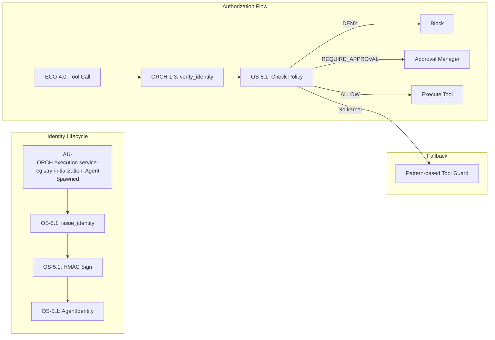
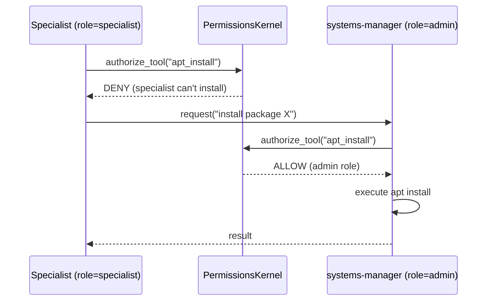

# CONCEPT:AU-OS.config.secrets-authentication — Permissions Kernel

> Identity-based governance with signed agent tokens and role-based tool access policies.

## Overview

The Permissions Kernel (`agent_utilities/security/permissions_kernel.py`) shifts agent security from **tool-centric** ("is this tool dangerous?") to **identity-centric** ("which agent is requesting, and do they have permission?").

Every specialist agent receives a **signed identity** (HMAC-SHA256) when spawned, binding it to a role and a set of capabilities. Tool access is governed by **role-based policies** loaded from `agent_policies.json` and synced to the Knowledge Graph.

## Architecture



## Role Hierarchy

| Role | Access Level | Token Quota | Use Case |
|:---|:---|:---|:---|
| **admin** | Full access, no approval needed | 500,000 | `systems-manager`, kernel ops |
| **operator** | Broad access, approval for destructive | 200,000 | Infrastructure management |
| **specialist** | Domain tools only, OS denied | 100,000 | Standard specialist agents |
| **sandbox** | Read-only safe tools | 50,000 | Untrusted or experimental agents |
| **guest** | No tool access | 10,000 | Observers, monitoring |

## Policy Schema (`agent_policies.json`)

```json
{
  "policies": [
    {
      "role": "specialist",
      "allowed_tools": ["*"],
      "denied_tools": ["*reboot*", "*shutdown*", "*install*"],
      "require_approval_for": ["*delete*", "*remove*", "*execute*"],
      "max_token_quota": 100000,
      "description": "Domain tools — OS-level operations denied"
    },
    {
      "role": "sandbox",
      "allowed_tools": ["read_*", "list_*", "get_*", "describe_*"],
      "denied_tools": ["*"],
      "require_approval_for": [],
      "max_token_quota": 50000,
      "description": "Read-only — can only access safe retrieval tools"
    }
  ]
}
```

## Configuration

| Variable | Default | Description |
|:---|:---|:---|
| `AGENT_POLICIES_PATH` | `None` | Path to `agent_policies.json` |
| `PERMISSIONS_SIGNING_KEY` | Auto-generated | HMAC key for identity signing |

## Integration with Tool Guard

The Permissions Kernel integrates as a **pre-check** in the existing `tool_guard.py` pipeline:

1. If a `PermissionsKernel` and `AgentIdentity` are available → identity-based policy check
2. If the policy returns `ALLOW` → tool executes without further checks
3. If the policy returns `DENY` or `REQUIRE_APPROVAL` → approval flow triggered
4. If no kernel is available → falls back to existing pattern-based matching

This ensures **full backward compatibility** — existing deployments without `agent_policies.json` work exactly as before.

## Integration with systems-manager

The `systems-manager` MCP server should run with an **admin** identity, allowing it to execute OS-level commands without approval. Other agents requesting OS operations must route through `systems-manager`, which validates the caller's identity before proxying the command.



## KG Persistence

- **Policies** → `PolicyNode` entries (synced at startup)
- **Identities** → `AgentIdentityNode` entries (created on issue)
- **Relationships**: `HAS_IDENTITY` (agent→identity), `AUTHORIZED_FOR` (identity→tool)
