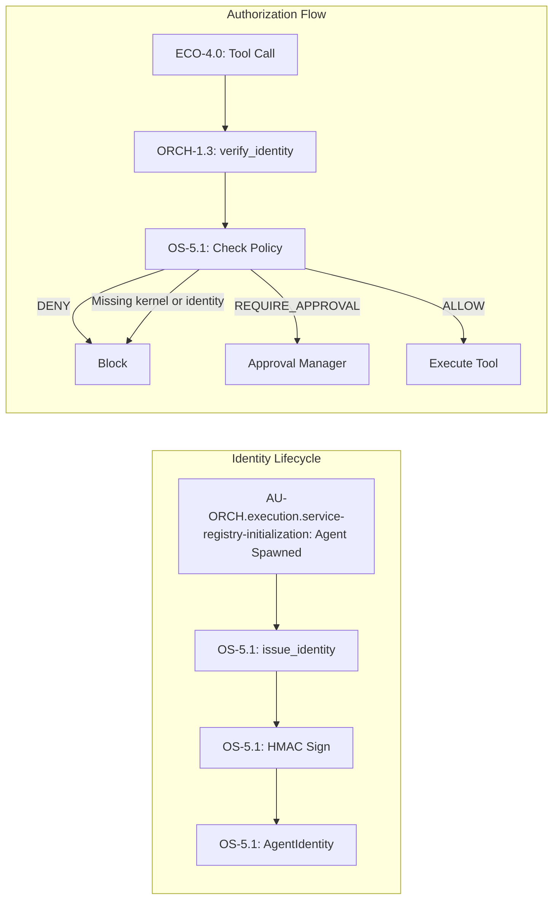
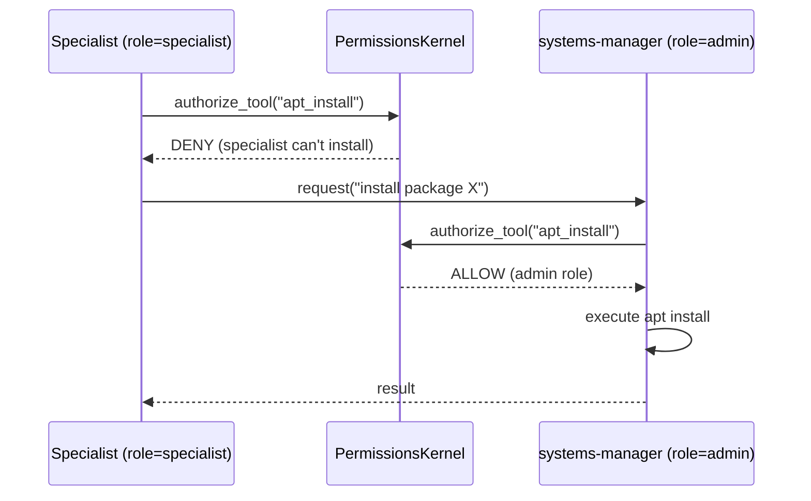

# CONCEPT:AU-OS.config.secrets-authentication — Permissions Kernel

> Identity-based governance with signed agent tokens and role-based tool access policies.

## Overview

The Permissions Kernel (`agent_utilities/security/permissions_kernel.py`) shifts agent security from **tool-centric** ("is this tool dangerous?") to **identity-centric** ("which agent is requesting, and do they have permission?").

Every specialist agent receives a **signed identity** (HMAC-SHA256) when spawned, binding it to a role and a set of capabilities. Its stored ID is a stable HMAC-derived pseudonym of the construction subject, so display names are not copied into the identity graph. Tool access is governed by **role-based policies** loaded from `agent_policies.json` and synced to the Knowledge Graph.

## Architecture


```mermaid
flowchart LR
    subgraph Identity Lifecycle
        SPAWN[AU-ORCH.execution.service-registry-initialization: Agent Spawned] --> ISSUE[OS-5.1: issue_identity]
        ISSUE --> SIGN[OS-5.1: HMAC Sign]
        SIGN --> ID[OS-5.1: AgentIdentity]
    end

    subgraph Authorization Flow
        CALL[ECO-4.0: Tool Call] --> VERIFY[ORCH-1.3: verify_identity]
        VERIFY --> POLICY[OS-5.1: Check Policy]
        POLICY --> |DENY| BLOCK[Block]
        POLICY --> |REQUIRE_APPROVAL| APPROVE[Approval Manager]
        POLICY --> |ALLOW| EXEC[Execute Tool]
    end

    POLICY --> |Missing kernel or identity| BLOCK
```

## Role Hierarchy

| Role | Access Level | Token Quota | Use Case |
|:---|:---|:---|:---|
| **admin** | Full access, no approval needed | 500,000 | `systems-manager`, kernel ops |
| **operator** | Broad access, approval for destructive | 200,000 | Infrastructure management |
| **specialist** | Domain tools only, OS denied | 100,000 | Standard specialist agents |
| **sandbox** | Read-only safe tools | 50,000 | Untrusted or experimental agents |
| **guest** | No tool access | 10,000 | Observers, monitoring |

## Policy Schema (`agent_policies.json`)

```json
{
  "policies": [
    {
      "role": "specialist",
      "allowed_tools": ["*"],
      "denied_tools": ["*reboot*", "*shutdown*", "*install*"],
      "require_approval_for": ["*delete*", "*remove*", "*execute*"],
      "max_token_quota": 100000,
      "description": "Domain tools — OS-level operations denied"
    },
    {
      "role": "sandbox",
      "allowed_tools": ["read_*", "list_*", "get_*", "describe_*"],
      "denied_tools": ["*"],
      "require_approval_for": [],
      "max_token_quota": 50000,
      "description": "Read-only — can only access safe retrieval tools"
    }
  ]
}
```

## Configuration

| Variable | Default | Description |
|:---|:---|:---|
| `AGENT_POLICIES_PATH` | `None` | Path to `agent_policies.json` |
| `PERMISSIONS_SIGNING_KEY_REF` | `None` | `env://`, `vault://`, or `secret://` reference resolving to at least 32 bytes of stable HMAC material |

Raw signing material is not an AgentConfig field. For example, an environment
deployment can set `PERMISSIONS_SIGNING_KEY_REF=env://AGENT_PERMISSION_AUTHORITY`
and inject the referenced value at process start. Production requires the
reference even when the built-in role policy set is used.

## Integration with Tool Guard

The Permissions Kernel is the authorization authority for MCP tools in the
`tool_guard.py` pipeline:

1. A `PermissionsKernel` and signed `AgentIdentity` are mandatory; a missing authority fails closed
2. If the policy returns `ALLOW` → tool executes without further checks
3. If the policy returns `DENY` → execution is rejected and cannot be approved around
4. If the policy returns `REQUIRE_APPROVAL` → the human-approval flow is triggered
5. Ontological argument guardrails remain an additional policy constraint

A non-empty identity capability list is an additional closed-world constraint,
not an elevation: the requested tool name must match one of its glob grants, or
the governed action's declared `required_capability` must match. The role policy
still applies afterward, so a capability never overrides a role denial. An empty
capability list leaves the role policy as the governing boundary.

Native function tools use `TOOL_GUARD_MODE=on` for configured sensitivity
patterns or `TOOL_GUARD_MODE=strict` for approval on every non-read-only tool.
There is no disabled mode, and those patterns are not an MCP authorization
fallback.

When no external `agent_policies.json` is configured, the kernel uses its
current built-in role policies; guest and sandbox roles remain deny-by-default.
When `AGENT_POLICIES_PATH` is configured, an absent, oversized, duplicate-key,
empty, incomplete, or malformed document aborts bootstrap with no fallback to
broader defaults.

Graph construction and the generic served-agent factory both call the same
verified context bootstrap. An explicitly injected kernel and identity must be
provided together and verify against each other; otherwise the signing-key
reference is resolved in memory and one shared context is issued. Ontology
`ActionExecutor` instances likewise require an explicit kernel and never create
their own authority. Run `agent-utilities doctor --only permission_governance`
to verify the redacted signing, policy, and identity contract.

## Integration with systems-manager

The `systems-manager` MCP server should run with an **admin** identity, allowing it to execute OS-level commands without approval. Other agents requesting OS operations must route through `systems-manager`, which validates the caller's identity before proxying the command.


```mermaid
sequenceDiagram
    participant S as Specialist (role=specialist)
    participant PK as PermissionsKernel
    participant SM as systems-manager (role=admin)

    S->>PK: authorize_tool("apt_install")
    PK-->>S: DENY (specialist can't install)
    S->>SM: request("install package X")
    SM->>PK: authorize_tool("apt_install")
    PK-->>SM: ALLOW (admin role)
    SM->>SM: execute apt install
    SM-->>S: result
```

## KG Persistence

- **Policies** → `PolicyNode` entries (synced at startup)
- **Identities** → `AgentIdentityNode` entries keyed by opaque derived IDs (created on issue)
- **Relationships**: `HAS_IDENTITY` (agent→identity), `AUTHORIZED_FOR` (identity→tool)
