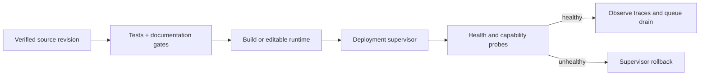

# Safely Redeploying graph-os

Redeploy graph-os when a new MCP action, REST route, registry entry, or runtime
dependency must become visible to a running service. An "unknown action" response
from a valid action commonly means the served artifact predates the checked-out
code; verify the published capability catalog before assuming the action is wired.

This runbook is deployment-neutral. It discovers the checkout at runtime, keeps
configuration under XDG, resolves credentials through the configured secret store,
and delegates process lifecycle to the active supervisor.

## Redeploy contract



The engine is the graph authority. Restarting the graph-os gateway should not
replace, delete, or relocate engine state. A deployment that couples gateway and
engine lifecycle must checkpoint the engine before rollout and prove recovery in
its environment-specific playbook.

## 1. Discover and verify the source

Run from anywhere inside the checkout:

```bash
REPO_ROOT="$(git rev-parse --show-toplevel)"
git -C "$REPO_ROOT" status --short
git -C "$REPO_ROOT" pull --ff-only
uv --directory "$REPO_ROOT" sync --locked
uv --directory "$REPO_ROOT" run pre-commit run --all-files
uv --directory "$REPO_ROOT" run python scripts/docs_contract.py --check
```

Do not continue with a dirty checkout, a non-fast-forward update, a stale generated
catalog, or a failing privacy/link gate. Production should deploy a versioned image
or package built by CI. An editable source mount is suitable only for an explicitly
managed development environment.

## 2. Resolve runtime configuration

Use `setup-config generate` to create the XDG configuration and
`agent-utilities-doctor` to validate it. Do not paste DSNs, tokens, endpoints, home
directories, or host identities into a command or runbook.

```bash
uv --directory "$REPO_ROOT" run agent-utilities-doctor
uv --directory "$REPO_ROOT" run setup-config doctor
```

The supervisor should inject only config/secret references. Endpoint values come
from deployment configuration such as `GRAPH_SERVICE_ENDPOINTS`, auth issuer/JWKS
settings, and the fleet registry. Secret values remain in the configured secret
backend.

## 3. Ask the active supervisor to roll out

Use exactly one lifecycle path:

- User service: `systemctl --user restart graph-os-daemon.service`
- Container service: `docker service update --force "${STACK_NAME}_${SERVICE_NAME}"`
- Kubernetes: `kubectl rollout restart deployment/graph-os --namespace "$NAMESPACE"`

For immutable deployments, update the pinned artifact digest first and let the
orchestrator perform its normal health-gated rollout. Do not use process-name kills,
background `nohup` commands, or a copied environment dump; those bypass lifecycle,
audit, and rollback controls.

## 4. Verify the served revision

Probe the configured health URL without embedding it in the repository:

```bash
curl --fail --silent --show-error "${GRAPH_OS_HEALTH_URL:?configure health URL}/health"
uv --directory "$REPO_ROOT" run agent-utilities-doctor
```

Then verify the action through the same authenticated MCP or REST entrypoint used by
clients. Compare the result with the generated
[Capability & Action Catalog](../capabilities-power.md); the tool/action pair must
exist there before deployment.

## 5. Observe or roll back

Confirm that request traces, engine connectivity, queue depth, and worker heartbeats
remain healthy for the deployment watch window. If a probe fails, roll back to the
previous pinned artifact through the same supervisor and preserve the failed rollout
trace for diagnosis. Never repair a failed deployment by committing a local endpoint,
credential, workspace path, or host-specific override.
