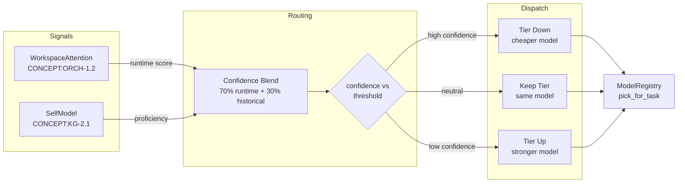
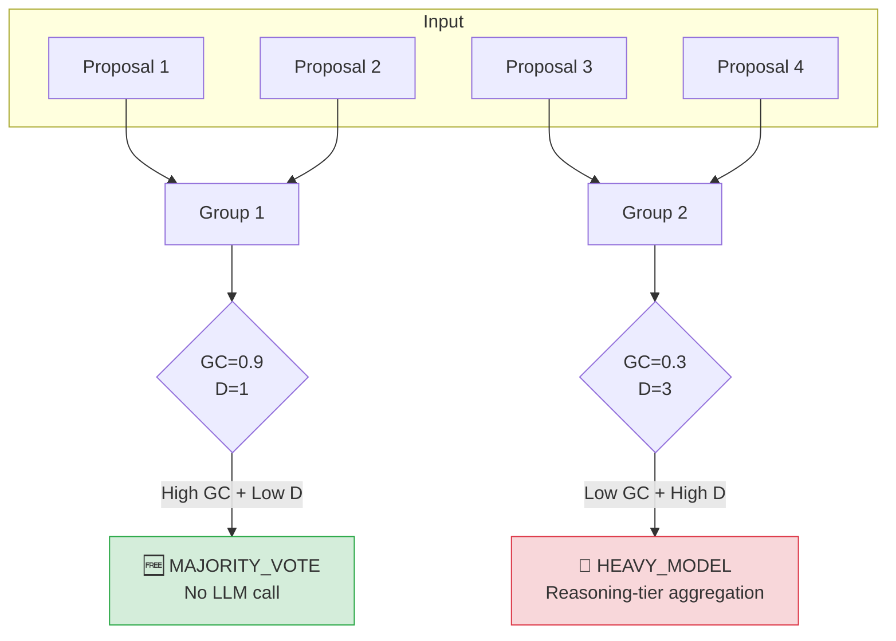
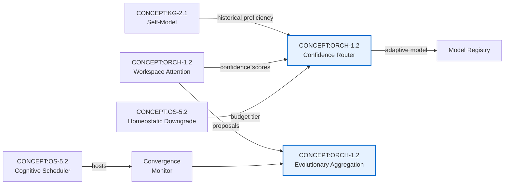

# Squeeze Evolve: Confidence-Gated Routing & Evolutionary Aggregation

> **Concepts**: CONCEPT:ORCH-1.2 (Confidence-Gated Router), CONCEPT:ORCH-1.2 (Evolutionary Aggregation Engine)
>
> **Based on**: *SQUEEZE EVOLVE: Adaptive Multi-Model Orchestration for Mathematical Reasoning*
> (Maheswaran et al., 2026) — [arXiv:2604.07725v2](https://arxiv.org/abs/2604.07725v2)

## Overview

Agent-utilities integrates two key innovations from the Squeeze Evolve paper
to optimise model dispatch efficiency and reasoning quality:

1. **CONCEPT:ORCH-1.2 — Confidence-Gated Router**: Adaptively selects cheaper or more
   expensive models based on runtime confidence signals from specialist consensus
   and historical performance.

2. **CONCEPT:ORCH-1.2 — Evolutionary Aggregation Engine**: Groups specialist outputs,
   computes group-level fitness (confidence + diversity), and routes aggregation
   to the most cost-effective strategy.

### Core Principle

> *Allocate model capability where it has the highest marginal utility.*

Strong models should initialise solutions (where reasoning depth matters most),
while cheaper models can handle aggregation when specialists already agree.
This achieves significant cost reduction with equivalent or improved accuracy.

---

## CONCEPT:ORCH-1.2: Confidence-Gated Model Router

### How It Works



### Composition with CONCEPT:OS-5.2 (Homeostatic Downgrade)

The confidence-gated router composes with the existing budget-pressure
downgrade (CONCEPT:OS-5.2):

1. **CONCEPT:OS-5.2 runs first**: If the ResourceOptimizer detects budget pressure, it
   reduces the tier (e.g., `heavy → medium`).
2. **CONCEPT:ORCH-1.2 runs second**: The confidence signal further adjusts within the
   budget-allowed range (e.g., `medium → light` if confidence is high).

This means budget pressure always takes precedence, but confidence can
further optimise within the budget constraint.

### Self-Model Integration (Soft Dependency)

CONCEPT:ORCH-1.2 optionally uses historical proficiency from CONCEPT:KG-2.1 (Persistent Self-Model):

```python
# When SelfModel is available:
historical_confidence = self_model.tool_proficiency.get(specialist_id, 0.5)
effective = 0.7 * runtime_confidence + 0.3 * historical_confidence

# When no SelfModel (graceful degradation):
historical_confidence = 0.5  # Neutral — no bias
effective = 0.7 * runtime_confidence + 0.15  # Pure runtime signal
```

### Configuration

| Parameter | Location | Default | Description |
|:---|:---|:---|:---|
| `routing_percentile` | `GraphDeps` | `50.0` | Threshold (0–100). Lower = more aggressive downgrade. |
| `ROUTING_PERCENTILE` | Env var | `50.0` | Default for `routing_percentile`. |

### API Reference

```python
from agent_utilities.models.model_registry import ModelRegistry

registry = ModelRegistry(models=[...])
chosen = registry.pick_for_task_adaptive(
    complexity="medium",
    confidence_signal=0.85,     # High confidence → downgrade
    routing_percentile=30.0,    # Aggressive: route 70% to cheap models
    required_tags=["code"],
)
```

---

## CONCEPT:ORCH-1.2: Evolutionary Aggregation Engine

### Group Fitness Signals

The engine computes two signals for each group of specialist proposals:

| Signal | Formula | Description |
|:---|:---|:---|
| **Group Confidence (GC)** | `GC(g) = (1/K) × Σ C(τ)` | Mean confidence across proposals |
| **Group Diversity (D)** | `D(g) = \|{answer(τ) : τ ∈ g}\|` | Unique answer cluster count |

### Three-Tier Aggregation



| Strategy | When | Cost |
|:---|:---|:---|
| `MAJORITY_VOTE` | High GC + Low D (specialists agree) | **Free** — no LLM call |
| `LIGHT_MODEL` | High GC + Some D (partial agreement) | **Cheap** — fast model synthesis |
| `HEAVY_MODEL` | Low GC + High D (specialists disagree) | **Expensive** — reasoning model |

### Convergence Monitor

The `ConvergenceMonitor` tracks diversity across evolutionary iterations
and signals early stopping when diversity collapses:

```python
from agent_utilities.graph.hierarchical_planner import ConvergenceMonitor

monitor = ConvergenceMonitor(convergence_threshold=0.1, patience=3)

for iteration in evolutionary_loop:
    diversity = compute_diversity(proposals)
    if monitor.update(diversity):
        break  # Diversity collapsed — stop early
```

### Configuration

| Parameter | Default | Description |
|:---|:---|:---|
| `population_size` | `4` | Max proposals to consider (N) |
| `group_size` | `2` | Proposals per fitness group (K) |
| `confidence_threshold` | `0.7` | GC above this → lite aggregation |
| `diversity_threshold` | `2` | D above this + low GC → heavy aggregation |
| `convergence_threshold` | `0.1` | Diversity below this = converged |
| `patience` | `3` | Consecutive low-diversity readings before stopping |

---

## Architecture Integration



## Related Concepts

| Concept | Relationship |
|:---|:---|
| [CONCEPT:KG-2.1 Self-Model](overview.md) | Provides historical confidence priors |
| [CONCEPT:ORCH-1.2 Workspace Attention](overview.md) | Provides runtime scoring and proposals |
| [CONCEPT:OS-5.2 Resource Optimization](overview.md) | Budget-aware model selection |
| [CONCEPT:OS-5.2 Cognitive Scheduler](overview.md) | Hosts convergence monitor |
| [CONCEPT:OS-5.2 Homeostatic Downgrade](overview.md) | Composes with confidence routing |
