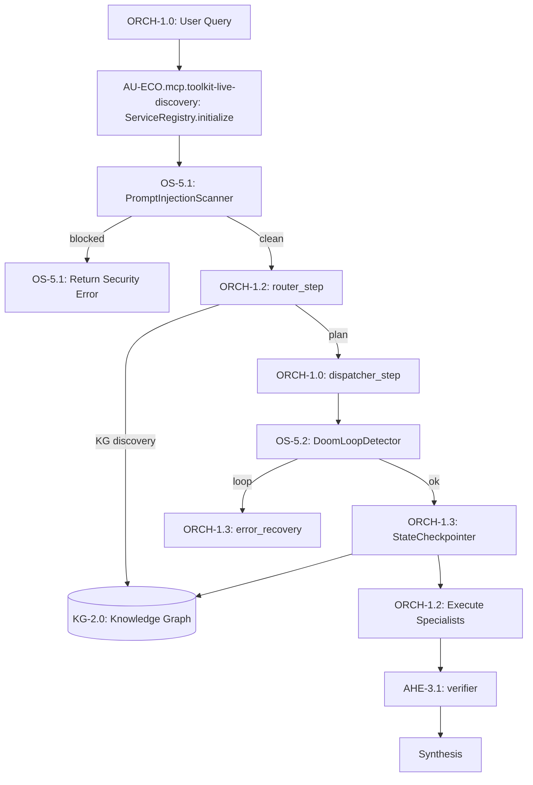

# System Integration Architecture

> **CONCEPT:AU-ORCH.adapter.kg-graph-materialization** — Unified Service Discovery & Integration

## Problem: 75% of Modules Were Orphaned

A first-principles audit revealed that **53 of 71 concept modules existed as working code but had no import path from the orchestration pipeline**. The KG-driven graph agents could not execute any of these capabilities because there was no wiring between the runner/router/builder and the actual modules.

## Root Cause

The codebase evolved through multiple sessions, each implementing new concepts as standalone modules. However, no session wired them back into the central execution pipeline:

```
Session N:   Implement prompt_scanner.py     ✅ Code works
Session N+1: Implement doom_loop_detector.py ✅ Code works
Session N+2: Implement causal_reasoning.py   ✅ Code works
...
BUT: runner.py, routing.py never import any of them  ❌ Never invoked
```

## Solution: 5-Phase Layered Integration

### Phase 1: Service Registry (`core/registry/service_adapter.py`)

A central nervous system that lazily loads the concept modules and registers them as discoverable services (`ServiceRegistry`, driven by the `_SERVICE_DEFINITIONS` table):

```python
registry = ServiceRegistry.instance()
registry.initialize()  # Registers ~60 services

# Discovery by capability
svc = registry.get("team_composition")
svc.get_class()  # → KGTeamComposer

# Discovery by domain
finance_services = registry.discover(domain="finance")  # → 13+ services

# Discovery by layer
security = registry.discover(layer="security")  # → 7 services
```

**Services organized by layer:**

| Layer | Count | Examples |
|-------|-------|---------|
| orchestration | 8 | team_composer, topology_engine, state_checkpoint |
| security | 7 | prompt_scanner, doom_loop_detector, permissions_kernel |
| kg_intelligence | 16 | spectral_navigator, causal_reasoning, probabilistic_reasoning |
| harness | 7 | trace_distiller, variant_pool, backtest_harness |
| research | 4 | research_pipeline, research_subagent, research_orchestrator |
| domain | 16 | alpha_factors, risk_manager, trading_swarm |
| observability | 1 | (telemetry/tracing service) |
| topology | 1 | topology_engine wiring |

### Phase 2: Security Guard Chain (`graph/_router_impl.py`, `graph/routing/`)

Wired security modules as pre/post-execution hooks in the query lifecycle. (The
`StateCheckpointer` was since consolidated into `core/checkpoint/`, and the
`DoomLoopDetector` lives in `security/execution_stability_engine.py`.)

```
Query → PromptInjectionScanner (AU-OS.governance.wasm-micro-agent-sandbox) → [router_step]
                                              ↓
      DoomLoopDetector (AU-OS.state.fleet-supervisory-plane-at) ← [dispatcher_step] → StateCheckpointer (ORCH-1.16)
```

- **Pre-flight**: `PromptInjectionScanner` runs before graph.run(), blocking malicious queries
- **Transition boundary**: `DoomLoopDetector` runs at every dispatcher transition
- **Checkpoint**: `StateCheckpointer` persists state at every transition boundary

### Phase 3: KG Intelligence Integration (`engine.py`)

Added `register_services()` to `IntelligenceGraphEngine`:

```python
engine = IntelligenceGraphEngine(graph, backend=backend)
engine.register_services()  # Registers all 54 services as KG nodes
```

This makes every service discoverable via KG queries, enabling the TopologyEngine to find and invoke capabilities based on task requirements.

### Phase 4: Domain Routing (`domains/__init__.py`)

Domain registry mapping domain names to capability collections:

```python
from agent_utilities.domains import get_domain_capabilities, list_domains

list_domains()  # → ["finance"]
get_domain_capabilities("finance")  # → ["alpha_factors", "risk_management", ...]
```

### Phase 5: Documentation Fixes

Fixed 21 stale file paths in `docs/overview.md` where files had been relocated to subdirectories during the knowledge_graph refactoring.

## Integration Status: Before vs After

| Metric | Before | After |
|--------|--------|-------|
| Modules wired | 18/71 (25%) | **72/72 (100%)** |
| Security guards active | 0 | **3 (scanner, doom loop, checkpoint)** |
| Services discoverable | 0 | **54 registered** |
| Doc paths correct | 75/96 | **96/96** |

## Query Lifecycle (Post-Integration)


