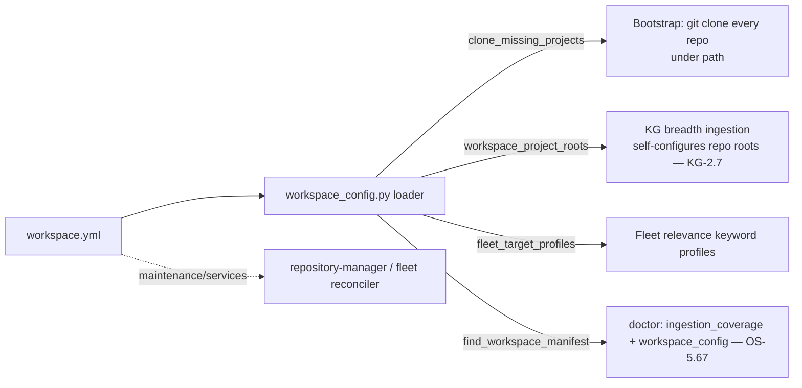

# `workspace.yml` — the repository manifest

`workspace.yml` is the **canonical map of every git repository in the
ecosystem**. It is a single declarative file that says *which repos exist, where
on disk they live, and how they nest* — and the platform reads it to bootstrap a
fresh checkout, to self-configure what the Knowledge Graph ingests, and during
genesis.

This page documents the **real schema the loader parses** (every key
`agent_utilities/core/workspace_config.py` actually reads), how it is consumed,
and a copy-paste annotated template.

> Validate any `workspace.yml` from the CLI:
> `agent-utilities-doctor --only workspace_config`
> (the `workspace_config` check parses it through the same loader and reports
> errors/warnings with fixes — CONCEPT:OS-5.67).

## Where it lives

There are two locations, in precedence order:

1. **The workspace root** — e.g. `/home/apps/workspace/workspace.yml`. This is the
   file an operator edits; it is discovered by walking up the directory tree from
   the package (`find_workspace_manifest`) and is what the KG ingestion-coverage
   and the `workspace_config` doctor checks validate.
2. **The XDG config dir** — `~/.config/agent-utilities/workspace.yml`
   (`get_workspace_yml_path()`), honoring `XDG_CONFIG_HOME` /
   `AGENT_UTILITIES_CONFIG_DIR`. If **no** file exists there, `load_workspace_yml()`
   auto-seeds a built-in default (`DEFAULT_WORKSPACE_YML`) the first time it is
   read, so the platform always has a working manifest.

A caller can also pass an explicit `yml_path=` to any of the loader functions to
read a specific file (used in tests); an explicit path that does not exist is a
no-op (returns empty), never auto-seeded.

## The schema (what the loader reads)

The loader is intentionally small. The **recursive walk**
(`_extract_repositories`) consumes exactly these keys:

| Key | Type | Required | Consumed by | Meaning |
|-----|------|:---:|-------------|---------|
| `path` | string (absolute) | no¹ | `clone_missing_projects`, `workspace_project_roots` | Base directory every repo is resolved/cloned under. Each repo lands at `<path>/<…subdirs…>/<repo-name>`. **If omitted, the bootstrap falls back to the current working directory.** |
| `repositories` | list of `{url, description}` | no | the recursive walk (root + every subdirectory) | The repos at *this* level of the tree. |
| `repositories[].url` | string | **yes** | `_extract_repositories`, `fleet_relevance` | The git **clone URL**. The on-disk repo name is the URL basename minus `.git` (`…/servicenow-api.git` → `servicenow-api`). An entry with no `url` is **skipped entirely** by the loader — which is why the doctor flags it as an error. |
| `repositories[].description` | string | no | `fleet_relevance` (keyword profiles for KG relevance) | Human/semantic description; advisory for cloning, used for the fleet relevance index. |
| `subdirectories` | mapping `name → node` | no | the recursive walk | Nested directories created under `path`. **Each value is itself a node** that may carry its own `description`, `repositories`, and further `subdirectories`, walked recursively. So a repo under `subdirectories.agent-packages.subdirectories.skills` is cloned to `<path>/agent-packages/skills/<repo-name>`. |
| `subdirectories.<name>.description` | string | no | advisory | Describes that directory grouping. |

¹ `path` is not strictly required (there is a `cwd` fallback) but a real
deployment should always set it — the doctor emits an advisory **warning** when
it is absent.

### Top-level identity (advisory)

| Key | Type | Meaning |
|-----|------|---------|
| `name` | string | Human label for the workspace. Advisory only (the doctor warns if missing). |
| `description` | string | One-line summary of the workspace. Advisory. |

### KG ingestion toggles

| Key | Type | Meaning |
|-----|------|---------|
| `graph.enabled` | bool | Opt the workspace into KG breadth ingestion. |
| `graph.multimodal` | bool | Ingest non-code artifacts as well as code. |
| `graph.incremental` | bool | Prefer delta-sync over full re-ingest. |
| `graph.groups` | list | Optional explicit repo/group filter (empty = all). |

### Other top-level blocks (consumed by sibling tools, not the loader)

The full root `workspace.yml` may also carry `maintenance:` (a phased
update/version-bump sequence — `phases[].{name, phase, projects, wait_minutes,
bulk_bump, bulk_push}`) and `services:` (declared Swarm services with `url` +
`domain`). **These are *not* read by `workspace_config.py`'s loader** — they are
consumed by other tools (the `repository-manager` maintenance workflow and the
fleet reconciler respectively). They are valid to include and are preserved by
the doctor's structural validation (it does not reject unknown top-level keys),
but the cloning/ingestion path ignores them. Document them where those tools own
them; this guide covers the keys the agent-utilities loader parses.

## How it is consumed



- **Bootstrap / clone.** `clone_missing_projects()` parses the file, resolves
  every repo path under `path`, and `git clone`s any that are missing — the
  one-file way to stand a fresh workspace up.
- **KG ingestion breadth (KG-2.7).** `workspace_project_roots()` is the read-only
  sibling — it resolves the same repo paths and keeps only those present on disk.
  This is what lets the KG's breadth stage self-configure from the manifest
  (ingest *all* ecosystem repos) instead of requiring `KG_BREADTH_REPO_ROOTS` by
  hand. The doctor's `ingestion_coverage` check compares the `agent-packages`
  subtree of `workspace.yml` against what's actually in the KG.
- **Fleet relevance.** `fleet_relevance.fleet_target_profiles()` walks the same
  tree to build a `name → keyword-profile` map (from each repo's name +
  `description`) used to score research/relevance — no per-package disk reads.
- **Genesis.** Genesis treats the manifest as the list of repos to provision.

## Validate it (the `workspace_config` doctor check)

The `agent-utilities-doctor` `workspace_config` check (CONCEPT:OS-5.67) validates
the manifest **through the same loader** — it never re-parses with a second
schema. It:

- locates the file (root manifest preferred, else the XDG default);
- confirms it parses to a YAML **mapping** (not empty, not a list);
- checks `path` is a string when present (else a warning that bootstrap falls
  back to cwd);
- walks the recursive `repositories` / `subdirectories` shape and asserts every
  `repositories[].url` is present, a string, and well-formed (contains a `/`);
- reports **errors** (blocking — malformed YAML, missing/bad `url`, non-mapping
  `subdirectories`), **warnings** (advisory — missing `name`/`description`/`path`,
  a repo with no `description`), and the total repo count, each with a remediation
  pointing back to this guide and the template.

```text
$ agent-utilities-doctor --only workspace_config
agent-utilities doctor — HEALTHY

  ✓ workspace_config workspace.yml valid at /home/apps/workspace/workspace.yml — 234 repositories
```

It is wired into the doctor's `CHECKS` registry, so it also runs as part of a full
`agent-utilities-doctor` sweep and via the `graph_configure action=system_doctor`
MCP action / `POST /graph/configure` REST surface.

## Annotated template

A minimal, valid starting point lives at
[`docs/examples/workspace.yml`](../examples/workspace.yml). Copy it to your
workspace root and edit it for your repos:

```yaml
name: "My Agent Workspace"
path: "/home/apps/workspace"           # absolute base dir; repos clone under here
description: "Main development environment."

repositories:                          # repos at the workspace root
  - url: "https://github.com/Knuckles-Team/pipelines.git"
    description: "CI pipelines for the ecosystem."

subdirectories:                        # nested dirs (recursive)
  agent-packages:
    description: "Core utility packages and agent implementations."
    repositories:
      - url: "https://github.com/Knuckles-Team/agent-utilities.git"
        description: "The framework / KG engine."
    subdirectories:
      skills:
        description: "Agent capabilities and skill graphs."
        repositories:
          - url: "https://github.com/Knuckles-Team/universal-skills.git"
            description: "Central skill repository."

graph:                                 # KG ingestion toggles
  enabled: true
  multimodal: true
  incremental: true
  groups: []
```
