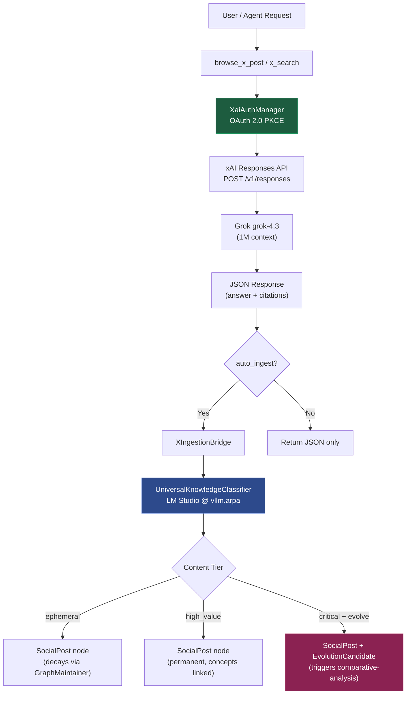

# X Personal Assistant & Social Content Ingestion Guide

**CONCEPT:ECO-4.0** — Social Content Ingestion
**CONCEPT:KG-2.6** — Universal Knowledge Assimilation

> This guide covers the native X (formerly Twitter) integration in agent-utilities,
> including authenticated search, post retrieval, automatic Knowledge Graph ingestion,
> and self-evolution triggers.

---

## Architecture Overview



## Authentication

### xAI OAuth 2.0 PKCE Flow

The X integration uses the xAI OAuth system, which counts against your
**subscription quota** (SuperGrok/X Premium+), NOT paid API credits.

**Configuration:**

| Setting | Value |
|---------|-------|
| Client ID | `b1a00492-073a-47ea-816f-4c329264a828` |
| Auth Endpoint | `https://auth.x.ai/oauth2/authorize` |
| Token Endpoint | `https://auth.x.ai/oauth2/token` |
| Callback | `http://127.0.0.1:56121/callback` |
| Token Storage | `~/.agent-utilities/secrets.db` |

**Resolution chain:**

```
XaiAuthManager.resolve_credentials(auto_login=True)
  1. Check XAI_API_KEY env var / secrets.db
  2. If no API key → load cached OAuth tokens from secrets.db
  3. If tokens expired → refresh via token endpoint
  4. If no tokens → interactive browser OAuth PKCE on 127.0.0.1:56121
  5. Return: Bearer access_token
```

**Implementation:** [xai_auth.py](../../../agent_utilities/security/xai_auth.py)
extends [BaseBrowserAuthManager](../../../agent_utilities/security/browser_auth.py).

---

## Tools

### `x_search`

Search the live X index via xAI's Responses API.

```python
@tool
async def x_search(
    ctx: RunContext[AgentDeps],
    query: str,                            # Natural language search query
    allowed_x_handles: list[str] = None,   # Filter to specific accounts
    excluded_x_handles: list[str] = None,  # Exclude accounts (mutually exclusive with allowed)
    from_date: str = None,                 # YYYY-MM-DD start
    to_date: str = None,                   # YYYY-MM-DD end
) -> str:  # JSON response
# The xAI model (default "grok-4.3") is resolved from AgentConfig, not a parameter.
```

**API Call:**
```
POST https://api.x.ai/v1/responses
{
  "model": "grok-4.3",
  "input": [{"role": "user", "content": "<query>"}],
  "tools": [{
    "type": "x_search",
    "allowed_x_handles": ["phosphenq"],
    "from_date": "2026-05-01"
  }],
  "store": false
}
```

### `browse_x_post`

Retrieve a specific X post by URL.

```python
@tool
async def browse_x_post(
    ctx: RunContext[AgentDeps],
    url: str,                  # e.g., "https://x.com/phosphenq/status/2057129225593741768"
    auto_ingest: bool = False, # Auto-classify + persist to KG
) -> str:  # JSON with answer, citations, engagement, ingestion result
```

**Supported URL formats:**
- `https://x.com/username/status/12345`
- `https://twitter.com/username/status/12345`
- `https://x.com/i/status/12345`

**Implementation:** [x_search_tool.py](../../../agent_utilities/tools/x_search_tool.py)

---

## Knowledge Graph Ingestion

### Universal Knowledge Classifier

The classifier is **source-agnostic** — it applies the same scoring pipeline
to X posts, ScholarX papers, GitHub repos, and documents.

**Classification Output:**

```python
class KnowledgeClassification(BaseModel):
    importance_score: float          # 0.0–1.0
    is_permanent: bool               # Hub-protected, no decay
    content_tier: Literal["ephemeral", "standard", "high_value", "critical"]
    evolution_potential: float        # 0.0–1.0 — self-evolution signal
    evolution_reasoning: str          # Why it could help agent-utilities evolve
    suggested_node_type: str          # SocialPost, Article, Document, etc.
    concepts: list[str]              # Extracted key concepts
    matching_kg_topics: list[str]    # Matches against existing KG
    action: Literal["ingest", "ingest_and_evolve", "decay", "skip"]
```

**Tier Definitions:**

| Tier | Score | Behavior | Examples |
|------|-------|----------|----------|
| `critical` | ≥ 0.9 | Permanent + auto-evolve | Breakthrough AI research, novel agent architectures |
| `high_value` | 0.7–0.9 | Permanent | Technical frameworks, quant analysis, implementation guides |
| `standard` | 0.4–0.7 | Persisted but may decay | Product launches, dev threads, perspectives |
| `ephemeral` | ≤ 0.3 | Decays via GraphMaintainer | Memes, promo, engagement bait |

**Implementation:** [knowledge_classifier.py](../../../agent_utilities/knowledge_graph/kb/knowledge_classifier.py)

### SocialPost Node Type

```python
class SocialPostNode(RegistryNode):
    post_id: str           # Platform ID (e.g., "2057129225593741768")
    author_handle: str     # "@phosphenq"
    platform: str          # "x"
    content_text: str      # Full post text
    post_url: str          # Canonical URL
    post_type: str         # "tweet" | "article" | "thread"
    engagement_metrics: dict  # {likes, reposts, views, bookmarks, ...}
    citations: list[dict]  # URL citations from the post
    evolution_potential: float  # Self-evolution signal
```

**OWL Alignment:** `ontology_social.ttl` — `SocialPost rdfs:subClassOf CreativeWork`,
aligned to `schema:SocialMediaPosting`.

**Edges created:**
- `CREATED_BY_PERSON` → `Person` node (author)
- `ABOUT` → `KBConcept` nodes (extracted concepts)
- `PROMOTES_RESEARCH` → `Document`/`Article` (if applicable)
- `EVOLUTION_CANDIDATE_OF` ← `EvolutionCandidate` (if high evolution potential)

### X Ingestion Bridge

Connects X tool output → Classifier → KG, accessible directly or via ``IngestionEngine`` (CONCEPT:KG-2.7):

```python
from agent_utilities.knowledge_graph.ingestion import IngestionEngine, IngestionManifest, ContentType

engine = IngestionEngine(kg_engine=my_kg)
result = await engine.ingest(IngestionManifest(
    content_type=ContentType.SOCIAL,
    source_uri=browse_json,
))
# result.details: {action: "ingest_and_evolve", node_id: "social:x:2057129225593741768", ...}
```

**Implementation:** [x_ingestion.py](../../../agent_utilities/knowledge_graph/kb/x_ingestion.py)

---

## X Articles (Long-Form Content)

X Articles (up to ~100K chars) are **not available via the xAI API** — the
`x_search` tool returns only the linked tweet, not the article body.

**Handling strategy:**
1. Detect article links in browse results (URLs matching `x.com/*/articles/*`)
2. Fetch via `read_url_content` or browser subagent
3. Route through `IngestionEngine` with `ContentType.DOCUMENT` for full KB processing
4. Link back to SocialPost via `PROMOTES_RESEARCH` edge

---

## Self-Evolution Integration

When the classifier detects high evolution potential (≥ 0.6), it creates an
`EvolutionCandidateNode` in the KG. This enables the push-based evolution
pipeline (complement to the existing pull-based research-scanner):

```
Incoming X Post (high evolution potential)
  → EvolutionCandidateNode created
  → knowledge-assimilation workflow detects pending candidates
  → comparative-analysis runs against agent-utilities
  → SDD plan generated if actionable gaps found
  → Optional auto-execution → skill/prompt distillation → PR
```

---

## vLLM Execution Path

All classification and extraction runs through the local LLM:

```
AgentConfig.default_chat_model
  → model_id: "qwen/qwen3.5-9b"
  → base_url: "http://vllm.arpa/v1"
  → UniversalKnowledgeClassifier._get_agent()
  → Pydantic AI Agent(model=..., output_type=KnowledgeClassification)
  → Structured JSON output validated by Pydantic
```

**Note:** The xAI Grok calls go to `api.x.ai` for search retrieval, but all
intelligence/classification is done by the local LLM — keeping costs at zero.
