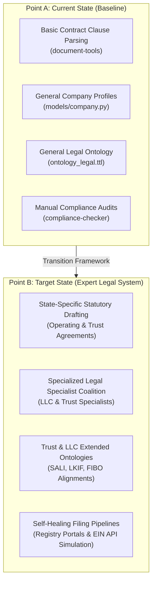
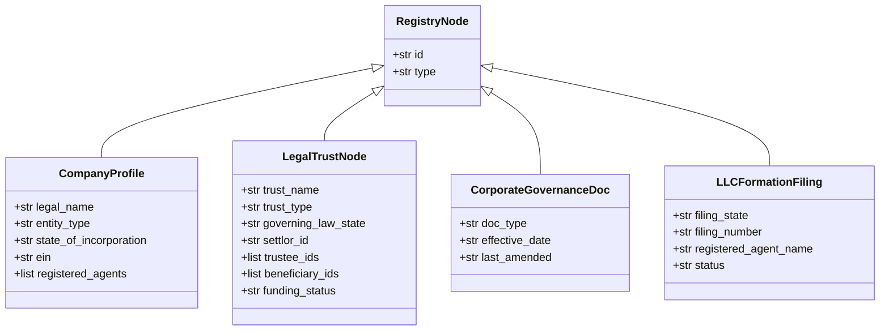
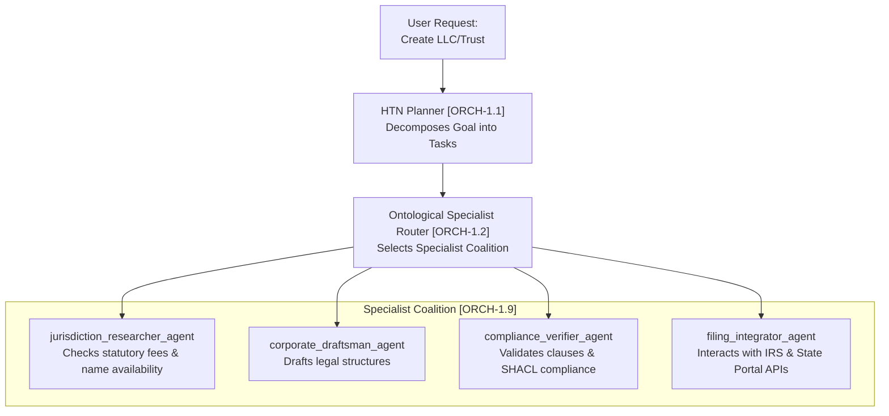
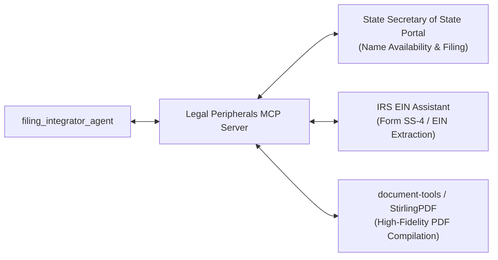
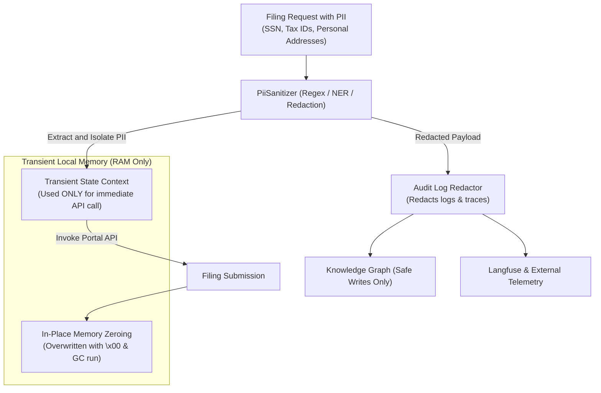
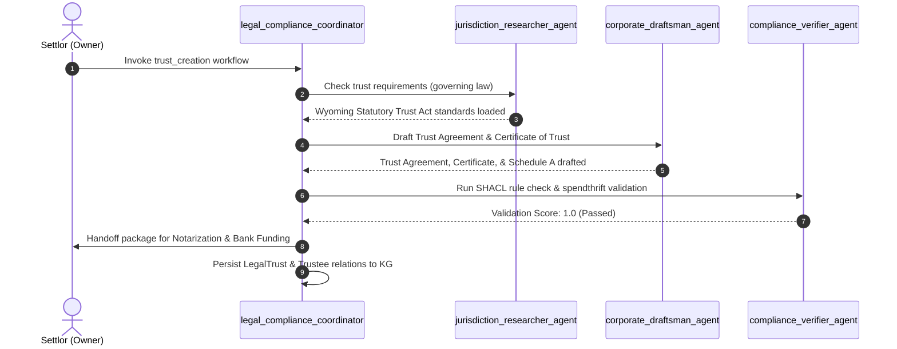

# Legal Automation Roadmap: Trust & LLC Creation
## Point A to Point B Engineering Blueprint for `agent-utilities`

This document defines the comprehensive, high-fidelity engineering roadmap for extending `agent-utilities` into a domain expert system capable of autonomously researching, drafting, validating, and managing the legal formation of **Limited Liability Companies (LLCs)** and **Legal Trusts**.

---

> **Status note (implementation in progress):** Phase 1 is partially landed.
> `LegalTrustNode` and `LLCFormationFiling` already exist in
> `agent_utilities/domains/law/models.py`, the OWL classes (`:LegalTrust`,
> `:TrusteeRole`, `:SettlorRole`, `:BeneficiaryRole`, `:LLCFormationFiling`) and
> their properties exist in `knowledge_graph/ontology_legal.ttl`, the
> `legal_compliance_coordinator` prompt exists in `agent_utilities/prompts/`, and
> the `PiiSanitizer` is already implemented in `agent_utilities/security/guardrails.py`.
> Remaining work concentrates on the skill workflows, SHACL legal shapes, and the
> SoS/IRS integration tooling.

## 1. Executive Summary: Point A to Point B



| Dimension | Point A (Current State) | Point B (Target State) |
| :--- | :--- | :--- |
| **Data Models** | Standard `CompanyProfile` with simple `entity_type` string literal. Zero representation of Trust structures, Grantors, Trustees, or Beneficiaries. | Rich `LegalTrustNode`, `LLCFormationFiling`, and relationship graphs mapped directly to standard legal schemas (LKIF-Core, Akoma Ntoso, and SALI/CLNR). |
| **Ontologies** | `ontology_legal.ttl` defines standard entities (`RegulatoryFiling`, `CorporateGovernanceDoc`, `FederalStatute`), but lacks Trust roles, spendthrift structures, and state-level LLC filing statuses. | Expanded `ontology_legal.ttl` containing comprehensive assertions for Trusts, registered agents, operating agreement clauses, and statutory validation constraints. |
| **Agent Coalitions** | Single `legal_compliance_coordinator` executing standard contract clause risk scoring and compliance tracking. | Dedicated **Legal Entity Creator Coalition** featuring a lead coordinator, jurisdictional researcher, legal drafting specialist, compliance validator, and filing integrator. |
| **Workflows** | Generic contract review and compliance checks. | High-fidelity, multi-phase `llc_formation` and `trust_creation` skill workflows with automated document compilers, SHACL validations, and human-in-the-loop gates. |
| **Integration** | File parsing via local utilities (`document-tools`, `StirlingPDF`). | Real-world API simulators/scrapers interacting with state secretary of state registries, IRS EIN registration, and banking APIs for funding. |

---

## 2. Code Reuse & Integration (No Wheel Reinvention)

To maintain a clean and robust codebase, we strictly leverage and extend existing abstractions within `agent-utilities` rather than writing redundant systems.

```mermaid
graph TD
    subgraph Existing ["Existing Utilities & Libraries"]
        DocTools["document-tools & stirlingpdf-agent<br/>(PDF Assembly / Extraction)"]
        WasmRunner["core/wasm_runner.py [WasmAgentRunner]<br/>(Safe Sandbox Execution)"]
        CompanyPy["models/company.py [CorporateGovernanceDoc]<br/>(Base Schema Definitions)"]
        LawPy["domains/law/models.py [LegalMatterNode]<br/>(Legal Baseline Models)"]
        KGCoord["mcp/kg_coordinator.py & GraphBackend<br/>(PostgreSQL/epistemic_graph — Transactional Graph Access)"]
        Guard["security/guardrails.py<br/>(Input/Output Sanitization)"]
    end

    subgraph Extensions ["Plugs Directly Into"]
        LawPy -->|Add subclass| LegalTrustNode["LegalTrustNode"]
        CompanyPy -->|Extend usage of| CorpDoc["OperatingAgreement / TrustAgreement"]
        WasmRunner -->|Safe execution environment for| WasmDraft["WASM Draft Compilation"]
        DocTools -->|Used for| PDFGen["Signature & Notary PDF Generation"]
        KGCoord -->|Graph serialization of| SerNode["Trust & LLC Nodes / Relationships"]
        Guard -->|Inject PII scrubbing in| PiiSan["PiiSanitizer Utility"]
    end
end
```

### Existing Wirings Utilized:
1. **Pydantic Model Extensions**:
   - We reuse the existing `CorporateGovernanceDoc` and `RegulatoryFiling` classes in `agent_utilities/models/company.py` to represent LLC Operating Agreements, Articles of Organization, and IRS filing records.
   - We extend `agent_utilities/domains/law/models.py` by adding our new `LegalTrustNode` subclass directly alongside `CaseLawNode`, `StatuteNode`, `ContractClauseNode`, and `LegalMatterNode`.
2. **Knowledge Graph Transactions**:
   - All serialization, node storage, and edge creation utilize the unified `kg_coordinator.py` transactional pipeline via the configured `GraphBackend` (PostgreSQL durable / `epistemic_graph` primary; `ladybug` is an opt-in contrib backend) with full rollback support in case of structural failures.
3. **High-Fidelity Document Generation**:
   - Instead of writing bespoke PDF generation wrappers, we reuse the existing `document-tools` skill and the `stirlingpdf-agent` Docker service for professional, legal-grade PDF formatting (margins, signatures, notarial blocks).
4. **Sandboxed Operations**:
   - The system utilizes the existing `agent_utilities.core.wasm_runner.WasmAgentRunner` micro-agent sandbox (which features a robust fallback emulation mode) to safely execute template rendering, local calculations, and untrusted document parsing scripts, ensuring zero host vulnerabilities.
5. **PII Guardrails**:
   - We hook our custom `PiiSanitizer` class into the existing `agent_utilities.security.guardrails` framework to inspect, sanitize, and redact sensitive personal identifiers before any logging, telemetry, or Knowledge Graph writes occur.

---

## 3. Pillar-by-Pillar Technical Architecture

To preserve the architectural integrity of `agent-utilities`, the legal automation system is designed across the **5 Core Pillars**.

### Pillar 2: Epistemic Knowledge Graph (Ontology & Schema Extensions)
To support Trusts and LLCs, we must extend the active knowledge graph schemas and OWL ontologies.



#### A. OWL Legal Ontology Extensions (`knowledge_graph/ontology_legal.ttl`)
We introduce new OWL classes and object/datatype properties to represent legal Trust and LLC structures:

```turtle
# New OWL Classes in ontology_legal.ttl
:LegalTrust a owl:Class ;
    rdfs:label "Legal Trust" ;
    rdfs:comment "A fiduciary relationship in which a settlor gives a trustee the right to hold title to assets for the benefit of a beneficiary." ;
    rdfs:subClassOf bfo:0000031 .  # Generically Dependent Continuant

:TrusteeRole a owl:Class ;
    rdfs:label "Trustee Role" ;
    rdfs:comment "A role held by an individual or corporation administering trust assets." ;
    rdfs:subClassOf bfo:0000023 .  # Role

:SettlorRole a owl:Class ;
    rdfs:label "Settlor Role" ;
    rdfs:comment "The creator and funder of the trust." ;
    rdfs:subClassOf bfo:0000023 .

:BeneficiaryRole a owl:Class ;
    rdfs:label "Beneficiary Role" ;
    rdfs:comment "The recipient of the trust benefits." ;
    rdfs:subClassOf bfo:0000023 .

# Object Properties
:hasSettlor a owl:ObjectProperty ;
    rdfs:domain :LegalTrust ;
    rdfs:range :Person .

:hasTrustee a owl:ObjectProperty ;
    rdfs:domain :LegalTrust ;
    rdfs:range [ owl:unionOf (:Person :Company) ] .

:hasBeneficiary a owl:ObjectProperty ;
    rdfs:domain :LegalTrust ;
    rdfs:range [ owl:unionOf (:Person :Company) ] .

:trustAgreement a owl:ObjectProperty ;
    rdfs:domain :LegalTrust ;
    rdfs:range :CorporateGovernanceDoc .

# Datatype Properties
:trustType a owl:DatatypeProperty ;
    rdfs:domain :LegalTrust ;
    rdfs:range xsd:string ;
    rdfs:comment "revocable, irrevocable, asset_protection, special_needs, charitable." .
```

#### B. Pydantic Model Definitions (`domains/law/models.py`)
These model definitions bridge Cypher nodes dynamically to memory via the configured `GraphBackend` transaction proxy (PostgreSQL/`epistemic_graph`). Note: `LegalTrustNode` and `LLCFormationFiling` are already implemented in `agent_utilities/domains/law/models.py`.

```python
from typing import Literal
from pydantic import Field
from agent_utilities.models.knowledge_graph import RegistryNode, RegistryNodeType

class LegalTrustNode(RegistryNode):
    """Fiduciary trust entity tracking.
    Maps to OWL class :LegalTrust in ontology_legal.ttl.
    """
    type: RegistryNodeType = Field(default="legal_trust")
    trust_name: str = Field(..., description="Full legal name of the trust")
    trust_type: Literal["revocable", "irrevocable", "asset_protection", "special_needs"] = Field(
        ..., description="Legal category of the trust"
    )
    governing_law_state: str = Field(..., description="US state of governing law (e.g., 'WY', 'NV')")
    settlor_id: str = Field(..., description="Person node ID of the settlor")
    trustee_ids: list[str] = Field(default_factory=list, description="Person/Company IDs of trustees")
    beneficiary_ids: list[str] = Field(default_factory=list, description="Person/Company IDs of beneficiaries")
    is_funded: bool = Field(default=False, description="Whether assets have been assigned to Schedule A")
    ein: str | None = Field(default=None, description="Employer Identification Number for irrevocable trusts")

class LLCFormationFiling(RegistryNode):
    """State filing lifecycle tracker for an LLC.
    Maps to OWL class :RegulatoryFiling in ontology_legal.ttl.
    """
    type: RegistryNodeType = Field(default="llc_formation_filing")
    company_id: str = Field(..., description="CompanyProfile node ID")
    filing_state: str = Field(..., description="Filing state (e.g., 'DE', 'WY')")
    registered_agent_name: str = Field(..., description="Designated registered agent")
    registered_agent_address: str = Field(..., description="Address of registered agent")
    articles_of_organization_path: str = Field(..., description="Path to generated articles document")
    filing_status: Literal["draft", "pending_submission", "submitted", "active", "rejected"] = Field(
        default="draft"
    )
```

---

### Pillar 1: Graph Orchestration (Specialist Routing & Task Planning)
The creation of complex legal entities requires a multi-step planner (`ORCH-1.1: HTN Planning`) and a specialist routing matrix (`ORCH-1.2: Specialist Routing`).



- **HTN Planning Pipeline (`ORCH-1.1`)**: Break down a high-level command like `"Create a Wyoming Asset Protection Trust funded with $10,000"` into concrete sub-goals:
  1. Conflict checks against the existing KG database (ABA Rule 1.7 compliance).
  2. Jurisdiction lookup for Wyoming statutory trust requirements.
  3. Draft standard Spendthrift Trust Agreement.
  4. Generate Certificate of Trust.
  5. Prepare Schedule A Asset Assignment.
  6. Execute SHACL validation.
  7. Route to Human-in-the-Loop approval gate.
  8. Finalize funding transfers under secure ledger rules.
- **Specialist Routing & Department Orchestration (`ORCH-1.2` & `ORCH-1.9`)**: Allocate roles to specific specialized agents using `TeamConfigNode` under a dynamic legal department, leveraging the unified `legal_compliance_coordinator.json` structure.

---

### Pillar 3: Agentic Harness (SHACL Validation & Quality Evals)
To guarantee legal and logical soundness before any documents are presented to the user, we employ strict automated validation checks.

> [!IMPORTANT]
> **Zero-Error Statutory Compliance Guarantee**: No legal document generated by the agent may proceed to human review without scoring `1.0` on structural validations.

- **SHACL Shape Validation** (target shapes file `knowledge_graph/shapes/legal.shapes.ttl`; the existing SHACL shapes live in `knowledge_graph/shapes/governance.shapes.ttl`):
  Enforces structural completeness on legal nodes before they are written to the graph backend:
  - An `LLC` node must have an assigned `registered_agent_name`, `state_of_incorporation`, and at least one member with `memberInterest` totaling exactly `1.0`.
  - A `LegalTrust` node must have distinct entities for `settlor_id` and at least one `beneficiary_id` to prevent merger of legal and equitable title (except in standard revocable living trusts governed by state statutes).
- **Interpretability and Safety Testing (`AHE-3.8`)**:
  Drafted documents are audited by the `compliance_verifier_agent` using strict, multi-dimensional scorecards:
  - **Statutory Alignment**: Does the Wyoming Operating Agreement contain the exact LLC liability limitation clauses required under *W.S. § 17-29-101 et seq.*?
  - **Clause Risk Scoring**: Every drafted indemnification or spendthrift clause is assigned a risk classification (High, Medium, Low) against historical precedents in the graph.

---

### Pillar 4: Ecosystem & Peripherals (Tooling & API Interfaces)



#### A. Gap Analysis & Sourcing Strategy
We have audited the existing `agent-packages/agents` workspace and identified **three critical tooling gaps** required for full autonomous operation. Rather than creating disjointed standalone utilities, we will construct these tools as unified MCP interfaces, sourcing accurate data from public legal records and containerized browser controllers.

| Tooling Gap | Description of Gap | Sourcing Strategy & Data Providers |
| :--- | :--- | :--- |
| **Secretary of State (SoS) MCP Server** | Lacks standard programmatic tools to check entity name availability and submit automated Articles of Organization. | • **Public Search Scrapers**: Scrapes state business entity registries (e.g. Delaware Division of Corporations, Wyoming Business Center) using a headless Playwright container.<br/>• **Registered Agent Directories**: Indexes public registered agent lists via state regulatory disclosures. |
| **IRS EIN Assistant MCP Server** | No current tool exists to submit Form SS-4 filings or interact with the IRS EIN Portal. | • **Containerized Browser State-Machine**: Navigates the IRS Online EIN Assistant portal (operating strictly Mon-Fri 7 AM - 10 PM EST) via automated browser wrappers.<br/>• **Off-Hours Queueing**: Automatically drafts and outputs pre-filled PDF Form SS-4 documents for manual fax/mail submission when portals are closed. |
| **State Statute & Template Library** | Lacks specialized legal reference lookups inside the active graph for state-specific corporate statutes and trust codes. | • **Cornell LII / CourtListener APIs**: Sources raw statutory databases directly from open-source legal repositories.<br/>• **Markdown Template Registries**: Pre-registers statutory templates for WY/DE LLCs and NV/WY Asset Protection Trusts in the `agent-utilities` local catalog. |

---

### Pillar 5: Agent OS Infrastructure (Sandbox, Privacy, & Budget Guardrails)
Since legal formation involves processing highly sensitive corporate and personal data, security and data privacy are treated with zero-tolerance stringency.

> [!CAUTION]
> **Data Privacy and Leakage Prevention**: Personal identifying information (PII) like Social Security Numbers or tax IDs used for EIN filing must never be persisted in the active Knowledge Graph, logs, or external telemetry systems.



#### A. Comprehensive PII Sanitation & Ephemeral Cleanup
1. **PII Sanitizer Utility (`security/guardrails.py`)**:
   - The robust `PiiSanitizer` class (already implemented in `agent_utilities/security/guardrails.py`) intercepts transaction payloads before they enter the pipeline.
   - It performs automated Regex and Named Entity Recognition (NER) scans for SSNs (`^\d{3}-\d{2}-\d{4}$`), EINs (`^\d{2}-\d{7}$`), bank routing numbers, and residential addresses.
2. **Ephemeral RAM-Only Lifecycles**:
   - SSNs and sensitive personal identifiers are strictly prohibited from being written to disk, outputted to logs, or serialized into the Knowledge Graph database.
   - They reside exclusively in transient memory (`thread_local` context or ephemeral Python dictionaries) for the absolute minimum time needed to execute the API call or headless browser filing submission.
   - Immediately following the execution of the API call, a **Scrubbing Hook** executes:
     - The sensitive variables are overwritten in-place with zero-bytes (`b"\x00"`).
     - Ephemeral data contexts are popped and garbage-collected (`gc.collect()`).
3. **Log & Telemetry Interceptor (`observability/audit_logger.py`)**:
   - A global logging filter intercepts stdout, stderr, and any trace payloads destined for Langfuse, replacing any detected PII strings with `[REDACTED_SSN]` or `[REDACTED_TAX_ID]`.

#### B. Sandboxed Template Compilation (`OS-5.5`)
- Drafting scripts, template compilation, and local state integrations are executed inside our **existing** `agent_utilities.core.wasm_runner.WasmAgentRunner` micro-agent sandbox.
- Standard memory bounds (`limit_memory_pages: int = 16`) are enforced to completely isolate third-party legal data and prevent any prompt-injection exploits from compromising the host system.

#### C. Budget Guardrails (`OS-5.3`)
- State filing fees represent real-world financial transactions. The `budget_guardrail` enforces a strict threshold—agents can never execute credit card transactions or filing fee payments; they must compile the filing payload and hand it off as a **Pending Payment Action** to a human operator.

---

## 4. High-Fidelity Skill Workflows

We define the step-by-step sequential workflows that will live in `/skills/llc_formation/` and `/skills/trust_creation/`.

### Workflow A: Limited Liability Company (LLC) Formation

```mermaid
sequenceDiagram
    autonumber
    actor User as Human Owner
    participant Coord as legal_compliance_coordinator
    participant Research as jurisdiction_researcher_agent
    participant Draft as corporate_draftsman_agent
    participant Val as compliance_verifier_agent
    participant Portal as SoS & IRS Portal Integrator

    User->>Coord: Invoke llc_formation workflow
    Coord->>Research: Check name availability & state filing rules
    Research-->>Coord: Name available; Wyoming fee: $100
    Coord->>Draft: Draft Articles of Organization & Operating Agreement
    Draft-->>Coord: Documents drafted (Markdown/PDF format)
    Coord->>Val: Run compliance audit & SHACL check
    Val-->>Coord: Validation Score: 1.0 (Passed)
    Coord->>User: Request Signature & Payment Authorization (Human Gate)
    User-->>Coord: Approved & Signed
    Coord->>Portal: Submit filing & Request EIN (Scrub PII immediately after!)
    Portal-->>Coord: LLC Active; EIN Assigned
    Coord->>Coord: Persist LLC Profile & Filings to KG (Active status)
    Coord-->>User: Delivery of LLC Formation Package
```

#### Step-by-Step Verification Gates
1. **Intake Gate**: The user must provide `dba_name` (optional), `legal_name`, `registered_agent_name`, `state_of_incorporation`, and list of `members` with ownership interest.
2. **Name Availability Gate**: The workflow queries the selected SoS registry. If unavailable, the agent generates three alternative name suggestions and halts for user selection.
3. **Drafting Gate**: Automatically generates:
   - `Articles of Organization` ( Wyoming *W.S. § 17-29-201* compliant)
   - `Operating Agreement` (covering management structure, transfer of interests, dissolution terms, tax classifications).
4. **SHACL Verification Gate**: Asserts that `LLCFormationFiling` contains valid filing metadata and distinct registered agent details.
5. **Execution Gate (Human-in-the-Loop)**: Displays drafted documents, filing fees, and demands explicit human approval before submitting.
6. **Post-Filing Ingestion Gate**: Serializes the newly created `CompanyProfile` node, `CorporateGovernanceDoc` nodes, and `RegulatoryFiling` nodes into the KG, setting their states to `ACTIVE`.

---

### Workflow B: Legal Trust Creation (Revocable Living or Asset Protection)



#### Step-by-Step Verification Gates
1. **Intake Gate**: User specifies `trust_name`, `trust_type` (e.g. revocable vs asset protection), `settlor_id`, `trustee_ids` (must not overlap with sole beneficiary), and `beneficiary_ids`.
2. **Jurisdiction Gate**: Checks state laws regarding the Rule Against Perpetuities and statutory asset protection trust rules (e.g. Nevada's 2-year seasoned transfer rule vs Wyoming's qualified transfers).
3. **Drafting Gate**: Generates:
   - `Declaration of Trust / Trust Agreement`: Containing full administrative powers, trustee duties, spendthrift protections, trust termination rules, and successor trustee appointments.
   - `Certificate of Trust`: Shorthand document to open bank accounts without revealing trust asset breakdowns.
   - `Schedule A / Asset Assignment`: Documents identifying properties, bank accounts, or nominal assets to fund the trust corpus.
4. **SHACL Verification Gate**: Asserts that `LegalTrustNode` maintains complete properties and logical separation of Settlor and Trustee roles.
5. **Ingestion Gate**: Write the `LegalTrustNode` into the KG. Connects the trust to `Settlor` via `HAS_SETTLOR`, `Trustee` via `HAS_TRUSTEE`, and `Beneficiary` via `HAS_BENEFICIARY` using standard, type-safe LPG edges.

---

## 5. Phase-by-Phase Execution Plan (From Point A to Point B)

To successfully implement this, we lay out a **4-Phase Spec-Driven Development Plan** in alignment with `CONCEPT:ORCH-1.5` (DSTDD Pipeline).

```
Phase 1: Ontological Core (Week 1)
 ├── Expand ontology_legal.ttl to include LegalTrust & LLC classes
 ├── Implement Pydantic models in agent_utilities/domains/law/models.py
 └── Map OWL properties to Rust-compiled epistemic reasoning backend

Phase 2: Specialist Agent Scaffolding (Week 2)
 ├── Scaffold TeamConfig for Legal Entity Creator Coalition
 ├── Generate prompt manifests in agent_utilities/prompts/
 └── Wire capabilities for document parsing, templates, and web crawling

Phase 3: Universal Skill & Pipeline Building (Week 3)
 ├── Code the llc_formation and trust_creation skill workflows
 ├── Integrate document compilers (document-tools / StirlingPDF)
 └── Wire SHACL validation gates and PII Sanitizer cleanup guardrails

Phase 4: Real-World Integrations & Pilot (Week 4)
 ├── Develop SoS and IRS simulation portals in a mock environment
 ├── Execute end-to-end sandbox dry-run using WasmAgentRunner
 └── Human-in-the-loop validation, audit logging, and production handoff
```

### Phase 1: Ontological Core & Schema Definitions
- Extend `ontology_legal.ttl` with detailed properties for Trusts and LLCs.
- Register new Pydantic nodes in `agent_utilities/models/company.py` and `agent_utilities/domains/law/models.py`.
- Run active reasoner tests using the OWL bridge (`knowledge_graph/core/owl_bridge.py`, `CONCEPT:KG-2.23` Rust-accelerated reasoning with a Python RDFS+ fallback) to verify transitive inheritance (e.g. ensuring `LegalTrust` correctly inherits from BFO concepts).

### Phase 2: Agent Scaffolding
- Deploy the specialized legal agents by creating their prompt JSON descriptors in `agent_utilities/prompts/`.
- Register the coalition under a new department named `legal` using `AgentDepartment` Pydantic models.
- Set strict guardrails in the coordinator configuration prohibiting the collection or storage of tax IDs/SSNs in active logs.

### Phase 3: Universal Skill Development
- Write the Python orchestrators for `llc_formation` and `trust_creation`.
- Create premium HTML/Markdown template libraries for state Articles of Organization and standard Living Trust Agreements.
- Implement the SHACL validator wrapper to verify nodes dynamically prior to graph-write.

### Phase 4: Integration & Validation
- Develop a mock environment simulating the IRS EIN Assistant portal and a state corporate registry to support rigorous automated testing (`AHE-3.6: Backtest & Curriculum`).
- Conduct a complete, E2E sandbox trial run: generate a full LLC formation filing, verify that the active database registers the correct graph-edges, and hand off the print-ready filing package to the console.
- Output an execution report and update the project's `walkthrough.md`.

---

## 6. Vision: The Autonomous Enterprise Lifecycle

When `agent-utilities` reaches **Point B**, it unlocks a highly cohesive corporate governance lifecycle where health, productivity, infrastructure, finance, and law seamlessly communicate through the Epistemic Knowledge Graph.

```
┌────────────────────────────────────────────────────────────────────────┐
│                        Epistemic Knowledge Graph                       │
└───────────────────────────────────┬────────────────────────────────────┘
                                    │
         ┌──────────────────────────┼──────────────────────────┐
         ▼                          ▼                          ▼
┌──────────────────┐       ┌──────────────────┐       ┌──────────────────┐
│   Law & Corporate│       │ Infrastructure & │       │Finance & Banking │
│  Governance      │       │ Software Ops     │       │Asset Management  │
├──────────────────┤       ├──────────────────┤       ├──────────────────┤
│• LegalTrust Node │       │• CompanySoftware │       │• Banking API     │
│• Articles of Org │◄─────►│  (ERPNext, CRM)  │◄─────►│  Integration     │
│• Operating Agrmt │       │• Docker Blueprints│      │• Funding Logs    │
│• Regulatory deadlines    │• DNSRewrites     │       │• Asset Ledgers   │
└──────────────────┘       └──────────────────┘       └──────────────────┘
```

1. **Autonomous Creation**: The AI drafts and files an LLC (`Wyoming LLC`) and a revocable trust (`Family Wealth Trust`) under strict human supervision.
2. **Infrastructure Hook**: The newly created company profile immediately triggers container deployments (`CompanySoftware`) for the new entity (like standard ERPNext or Twenty CRM instances) via Docker Swarm blueprints.
3. **Financial Synergy**: The generated `Certificate of Trust` and LLC operating agreements are pushed to bank APIs, spawning dedicated escrow/checking accounts and recording transactions in the financial ontology (`ontology_quant.ttl`).
4. **Governance Monitoring**: Regulatory filing deadlines (annual corporate fees, tax filings) are automatically calculated based on state effective dates, registering proactive tasks in Nextcloud calendar and Jira pipelines.

By linking every step to the unified Knowledge Graph substrate, the agent is never just performing "isolated scripts"—it is operating a cohesive, resilient, and legally sound autonomous enterprise.
