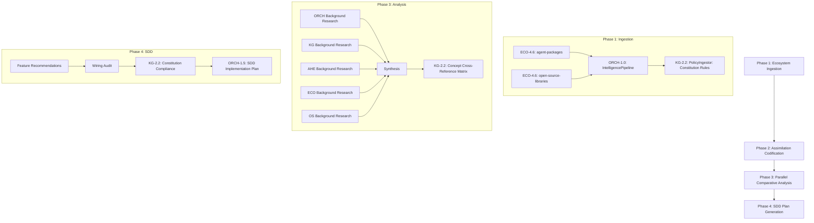

# Agent Utilities — Concept Overview

> See [docs/concept_map.md](concept_map.md) for the canonical concept registry.
> See [docs/pillars/architecture_c4.md](pillars/architecture_c4.md) for C4 architecture diagrams.

## Pillar Summaries

1. [Pillar 1: Graph Orchestration Engine](pillars/1_graph_orchestration.md)
2. [Pillar 2: Epistemic Knowledge Graph](pillars/2_epistemic_knowledge_graph.md)
3. [Pillar 3: Agentic Harness Engineering](pillars/3_agentic_harness_engineering.md)
4. [Pillar 4: Ecosystem & Peripherals](pillars/4_ecosystem_peripherals.md)
5. [Pillar 5: Agent OS Infrastructure](pillars/5_agent_os_infrastructure.md)

## Engine Facades

| Engine | Concept | Path | Description |
|--------|---------|------|-------------|
| **IntelligenceGraphEngine** | KG-2.0 | `knowledge_graph/core/engine.py` | Core graph engine with 15-phase pipeline |
| **TopologicalAnalysisEngine** | KG-2.5 | `knowledge_graph/core/topological_analysis_engine.py` | Analogy, spectral, blast radius |
| **EvaluationEngine** | AHE-3.1 | `harness/evaluation_engine.py` | Decomposed reward signals + trace distillation |
| **ParallelEngine** | ORCH-1.8 | `graph/parallel_engine.py` | Unified 1→300+ agent parallel execution engine |
| **Gateway Aggregator** | OS-5.9 | `gateway/aggregator.py` | 50-widget parallel service dashboard data layer |

## The 5 Core Pillars Architecture

```mermaid
graph TD
    %% Pillar 1: Graph Orchestration Engine
    subgraph P1 ["Pillar 1: Graph Orchestration Engine"]
        ORCH10["<b>ORCH-1.0: Core Orchestration Engine</b>"]
        ORCH11["<b>ORCH-1.1: HTN Planning Pipeline</b>"]
        ORCH12["<b>ORCH-1.2: Specialist Routing</b>"]
        ORCH13["<b>ORCH-1.3: Execution Safety</b>"]
        ORCH14["<b>ORCH-1.4: Capability Wiring</b>"]
        ORCH16["<b>ORCH-1.5: DSTDD Pipeline</b>"]
        ORCH17["<b>ORCH-1.6: Prediction Linkage Layer</b>"]
        ORCH18["<b>ORCH-1.7: RecursiveMAS Latent Orchestrator</b>"]
        ORCH125["<b>ORCH-1.8: Parallel Execution & Synthesis Engine</b>"]
        ORCH127["<b>ORCH-1.9: Dept Orchestration</b>"]
        ORCH128["<b>ORCH-1.10: Reactive Dispatch</b>"]
        ORCH129["<b>ORCH-1.11: WASM Sandbox</b>"]
    end

    %% Pillar 2: Epistemic Knowledge Graph
    subgraph P2 ["Pillar 2: Epistemic Knowledge Graph"]
        KG20["<b>KG-2.0: Active Knowledge Graph</b>"]
        KG21["<b>KG-2.1: Tiered Memory</b>"]
        KG22["<b>KG-2.2: Ontology & Epistemics</b>"]
        KG23["<b>KG-2.3: Unified Retrieval & Graph Integrity</b>"]
        KG24["<b>KG-2.4: Inductive Hypergraphs</b>"]
        KG25["<b>KG-2.5: Topological Analysis</b>"]
        KG26["<b>KG-2.6: Domain Ontologies & Vertical Subgraphs</b>"]
        KG28["<b>KG-2.6: Memory Stability</b>"]
        KG29["<b>KG-2.7: Quant Orchestration</b>"]
        KG215["<b>KG-2.7: Transaction Proxy</b>"]
        KG216["<b>KG-2.7: Rust-Native High-Performance Compute (FFI)</b>"]
        KG219["<b>KG-2.7: Event Backbone</b>"]
        KG220["<b>KG-2.7: Query Router</b>"]
        KG221["<b>KG-2.21: Working Set Manager</b>"]
        KG260["<b>KG-2.7: Single Company Brain</b>"]
    end

    %% Pillar 3: Agentic Harness Engineering
    subgraph P3 ["Pillar 3: Agentic Harness Engineering"]
        AHE30["<b>AHE-3.0: Harness Core</b>"]
        AHE31["<b>AHE-3.1: Evaluation Engine</b>"]
        AHE32["<b>AHE-3.2: Evolution Engine</b>"]
        AHE33["<b>AHE-3.3: Team Optimization</b>"]
        AHE34["<b>AHE-3.4: Distributed Evolution</b>"]
        AHE35["<b>AHE-3.5: Heavy Thinking</b>"]
        AHE36["<b>AHE-3.6: Backtest & Curriculum</b>"]
        AHE315["<b>AHE-3.8: Interpretability & Model Evolution</b>"]
    end

    %% Pillar 4: Ecosystem & Peripherals
    subgraph P4 ["Pillar 4: Ecosystem & Peripherals"]
        ECO40["<b>ECO-4.0: Tool Interface & MCP</b>"]
        ECO41["<b>ECO-4.1: A2A Network</b>"]
        ECO42["<b>ECO-4.2: Telemetry & Ecosystem</b>"]
        ECO43["<b>ECO-4.3: Market Data</b>"]
        ECO44["<b>ECO-4.4: KG MCP Server</b>"]
        ECO410["<b>ECO-4.6: Dynamic Capability Ingestion & Discovery</b>"]
        ECO414["<b>ECO-4.14: Infrastructure Blueprint Library</b>"]
        ECO415["<b>ECO-4.9: Queue Backend</b>"]
        ECO416["<b>ECO-4.10: Automated Documentation & AGENTS.md Governance</b>"]
        ECO418["<b>ECO-4.11: Lint Enforcement</b>"]
        ECO419["<b>ECO-4.12: Plugin Bundles</b>"]
        ECO420["<b>ECO-4.13: Ecosystem Governance & Policy Engine</b>"]
    end

    %% Pillar 5: Agent OS Infrastructure
    subgraph P5 ["Pillar 5: Agent OS Infrastructure"]
        OS50["<b>OS-5.0: Agent OS Kernel</b>"]
        OS51["<b>OS-5.1: Security & Auth</b>"]
        OS52["<b>OS-5.2: Resource Scheduling</b>"]
        OS53["<b>OS-5.3: OS Guardrails & Safety Boundaries</b>"]
        OS54["<b>OS-5.4: Telemetry</b>"]
        OS56["<b>OS-5.5: Massive Scale</b>"]
    end

    %% Cross-pillar relationships
    ORCH10 <--> KG20
    ORCH11 --> ORCH12
    ORCH12 --> KG22
    ORCH14 --> ECO40
    KG21 --> KG20
    KG25 --> KG20
    KG26 --> KG20
    KG29 --> KG20
    KG215 --> KG20
    KG216 --> KG20
    KG219 --> KG20
    KG220 --> KG20
    KG221 --> KG216
    KG260 --> KG22
    AHE31 --> KG20
    AHE33 --> ORCH12
    AHE34 --> ECO42
    ECO44 --> KG20
    ECO410 --> ECO40
    ECO415 --> ECO44
    OS51 --> ORCH13
    OS53 --> OS51
    OS54 --> KG20
    OS56 --> OS50
    ECO416 --> KG20
    ECO420 --> OS51

    style P1 fill:#dae8fe,stroke:#6c8ebf,stroke-width:2px
    style P2 fill:#d5e8d4,stroke:#82b366,stroke-width:2px
    style P3 fill:#fff2cc,stroke:#d6b656,stroke-width:2px
    style P4 fill:#e6ccff,stroke:#9673a6,stroke-width:2px
    style P5 fill:#cce5ff,stroke:#004085,stroke-width:2px
```

## Concept Index

> **Canonical Registry**: See [concept_map.md](concept_map.md) for the full canonical concept registry with module paths.

### Pillar 1: Graph Orchestration Engine (ORCH-1.0 – 1.29)

| ID | Concept | Description |
|---|---|---|
| ORCH-1.0 | Core Orchestration Engine | Pydantic Graph-based DAG execution with state management and multi-agent execution |
| ORCH-1.1 | HTN Planning Pipeline | Recursive hierarchical task network decomposition |
| ORCH-1.2 | Specialist Routing & Discovery | Ontological routing, specialist tag loading, and fallback chains |
| ORCH-1.3 | Execution Safety & State | Checkpointing, retry, and state persistence |
| ORCH-1.4 | Capability Wiring Engine | Dynamic capability discovery and capability auto-activation |
| ORCH-1.5 | DSTDD Pipeline | Design-Spec-Test Driven Development lifecycle |
| ORCH-1.6 | Prediction Linkage Layer 🔬 | Prediction linking across execution iterations |
| ORCH-1.7 | RecursiveMAS Latent Orchestrator 🔬 | Continuous latent space multi-agent recursion and projection |
| ORCH-1.8 | Parallel Execution & Synthesis Engine | Unified 1→300+ agent execution engine with concurrency, DAG scheduling, and output synthesis |
| ORCH-1.9 | Autonomous Department Orchestration | OWL-materialized company departments with `reportsTo` hierarchy |
| ORCH-1.10 | Reactive Event Sourcing | Reactive event-driven state and graph staging dispatcher |
| ORCH-1.11 | WASM Micro-Agent Sandbox | Isolated micro-agent WebAssembly sandbox runner with gas/memory limits and Python emulation fallback |
| ORCH-1.27 | Role-Specialized Model Routing | Binds planner/generator/learner/judge + RLM (executor/proposer/sub-LM) roles to model tiers+tags over the registry |
| ORCH-1.28 | Composable Skills + Generic Adapter | Structured Skill units (instructions+packages+modules+tools) + merge; minimal generic env adapter preserving the host evaluator |
| ORCH-1.29 | RLM Resilience + Telemetry | Structured RunTrace + FailureClass taxonomy; recoverable tool timeout vs fatal sandbox error |
| ORCH-1.30 | Generalizing GEPA | Held-out feedback/Pareto split + AgentSpec anti-overfit grounding + held-out candidate selection (transferable skills) |
| ORCH-1.31 | Graph-Native Optimization State | Persist the GEPA Pareto frontier + ancestry to the epistemic-graph; resumable, cross-session optimization |

### Pillar 2: Epistemic Knowledge Graph (KG-2.0 – 2.23)

| ID | Concept | Description |
|---|---|---|
| KG-2.0 | Active Knowledge Graph | Core 15-phase pipeline, OGM, IntelligenceGraphEngine |
| KG-2.1 | Tiered Memory & Context 🔬 | Episodic/semantic/procedural memory, context compaction |
| KG-2.2 | Ontology & Epistemics | OWL ontology bridge, FIBO/BFO, semantic subsumption |
| KG-2.3 | Unified Retrieval & Graph Integrity 🔬 | Fingerprinting, vectorized semantic indexing, hybrid retriever, consistency validation |
| KG-2.4 | Inductive Knowledge | Knowledge synthesis and cross-pillar synergy engine |
| KG-2.5 | Topological Analysis | Analogy engine, spectral clusters, blast radius |
| KG-2.6 | Domain Ontologies & Vertical Subgraphs | Aggregated vertical domains including Finance, Enterprise, Company Operations, and Research |
| KG-2.6 | Memory Stability | Self-reflecting memory observer and stability checks |
| KG-2.7 | Multi-Domain Architecture | Decoupled graph frameworks and multi-domain graph orchestration |
| KG-2.7 | Transaction Proxy | Centralized gateway and transactional persistence layer |
| KG-2.7 | Rust-Native High-Performance Compute | High-performance quantitative execution, graph traversal, and epistemic reasoning via the out-of-process epistemic-graph engine (MessagePack/UDS client; no PyO3) plus Rustworkx |
| KG-2.7 | Event Backbone | Protocol-based pub/sub with MemoryEventBackend (default) and RedpandaEventBackend (distributed) |
| KG-2.7 | Query Router | Cost-based query planner routing to L1 Rust / L2 Cache / L3 Persistent / L4 Vector tiers |
| KG-2.11 | Bi-Temporal Memory Layers | Event-time vs storage-time + valid_from/valid_to on the graph; as-of queries and event-time contradiction precedence; procedural memory layer |
| KG-2.12 | Memory-First Retrieval (HyDE) | HyDE query expansion + dual thresholds + self-correcting two-pass + quantitative-fidelity ledger over the hybrid retriever |
| KG-2.13 | Background Learning Engine | Async, semaphore-bounded learner emitting typed, outcome-grounded ADD/UPDATE/DELETE bi-temporal memory edits |
| KG-2.14 | Ground-Truth Context Authority | Authority-ranked startup context + a Ground-Truth preamble so injected memory is treated as authoritative (no re-fetching) |
| KG-2.15 | Resilient Retrieval | 4-level retrieval fallback cascade + social-closer triviality gate |
| KG-2.17 | Memory Hygiene | Scheduled decay scanner (archive via valid_to, never delete) + semantic-merge dedup |
| KG-2.18 | Evidence-Weighted Memory | Bayesian trust feedback loop + recall/usage telemetry + generation lineage extending the quality gate |
| KG-2.19 | Self-Curating Wiki | Delta-skip (SHA-256) continuous ingest of a markdown knowledge vault, reusing the ingestion engine + synthesis |
| KG-2.20 | Rust-Native Finance Compute Suite | epistemic-graph quant kernels (KG-2.20f/g/h/i): market-making (Avellaneda-Stoikov/GLT/logit), microstructure (OFI/VPIN/microprice/Hawkes), sizing (Kelly/Bayesian/empirical), validation (purged-CPCV/DSR/PBO/Brier), forensic scores, state-space/stat-arb (Kalman/OU/ADF), signal combination (alpha-engine/IR=IC√N) |
| KG-2.21 | Working Set Manager | LRU-evicting subgraph cache for L1 Rust engine with 50K node cap |
| KG-2.22 | Data Science Primitives | Rust-backed OLS / K-means / PCA / estimators (ridge/lasso/RF/GB/SVR) replacing scikit-learn on the hot path, parity-validated |
| KG-2.7 | Single Company Brain | Extensible operational state layer encompassing Ontology Bridges, Enterprise Architecture Repositories, and Entailment-Aware Permissions |

### Pillar 3: Agentic Harness Engineering (AHE-3.0 – 3.15)

| ID | Concept | Description |
|---|---|---|
| AHE-3.0 | Agentic Harness Core | Harness lifecycle, initialization, SDD integration |
| AHE-3.1 | Continuous Evaluation Engine | Multi-strategy EvalRunner, decomposed rewards |
| AHE-3.2 | Agentic Evolution Engine | Skill neologism, config versioning, variant pool |
| AHE-3.3 | Team & Synergy Optimization | TeamConfig, coalition composition, synergy scoring |
| AHE-3.4 | Distributed Agentic Evolution | Self-model, stability, ecosystem PR generation |
| AHE-3.5 | Heavy Thinking & Background Intelligence | Heavy thinking, background intelligence |
| AHE-3.6 | Backtest & Curriculum | Backtest harness, horizon-aware curriculum |
| AHE-3.8 | Interpretability & Model Evolution | Agent-Interpretable Model Evolver workflows and LLM-Graded Interpretability Tests |
| AHE-3.12 | LongMemEval-S Validation Harness | FastAPI /benchmark surface (Quarq-runner compatible) + frozen corpus + CI floor gate proving the memory-first stack vs 98.2% |

### Pillar 4: Ecosystem & Peripherals (ECO-4.0 – 4.20)

| ID | Concept | Description |
|---|---|---|
| ECO-4.0 | Tool Interface & MCP Factory | MCP server factory, skill loading, tool assignment |
| ECO-4.1 | A2A Network & Consensus 🔬 | Agent-to-agent discovery, delegation, consensus |
| ECO-4.2 | Community Telemetry & Ecosystem Map | Ecosystem topology, 40-repo graph, telemetry |
| ECO-4.3 | Market Data Connectors | External data source protocols for finance domain |
| ECO-4.4 | KG MCP Server & Execution | KG MCP exposure, durable execution, sandbox |
| ECO-4.6 | Dynamic Capability Ingestion & Discovery | Ingests external agent toolkits, discovers MCP endpoints in real-time, and builds self-documenting skill-graphs |
| ECO-4.7 | Domain Workflow Bindings | Parallel execution workflows and capability bindings for specialized domain processes |
| ECO-4.9 | Queue Backend | Abstract QueueBackend with Memory, Nats, and Kafka implementations for multi-scale event distribution |
| ECO-4.10 | Automated Documentation & AGENTS.md Governance | Deterministic hierarchical AGENTS.md management, self-improving reflectors, and codebase map generation |
| ECO-4.11 | Deterministic Lint Enforcement Hook | PRE_TOOL_USE subprocess hook for ruff/mypy/eslint enforcement |
| ECO-4.12 | Plugin Bundle Distribution System | Manifest-based skill/hook/config packaging with KG registry |
| ECO-4.13 | Ecosystem Governance & Policy Engine | Unified engine managing permission policies, configuration staleness auditing, and governance workflows |
| ECO-4.14 | Infrastructure Blueprint Library | Library of modular, declarative system infrastructure configurations |

### Pillar 5: Agent OS Infrastructure (OS-5.0 – 5.6)

| ID | Concept | Description |
|---|---|---|
| OS-5.0 | Agent OS Kernel & XDG Paths | Kernel lifecycle, XDG path resolution |
| OS-5.1 | Security & Auth | JWT/API auth, session concurrency, injection scanner |
| OS-5.2 | Resource Scheduling 🔬 | Cognitive scheduler, token quotas, preemption |
| OS-5.3 | OS Guardrails & Safety Boundaries | Holistic boundary definition integrating tool guards, reactive budgets/homeostasis, and ontological guardrails |
| OS-5.4 | Telemetry & Observability | OTEL, token tracking, audit logging |
| OS-5.5 | Massive Scale | Pluggable distributed queues, epistemic-graph Rust UDS RPC, and wasmtime sandbox integration |

### Gateway Service Dashboard (OS-5.9)

| ID | Concept | Description |
|---|---|---|
| OS-5.9 | Gateway Service Dashboard | Unified 50-widget dashboard data layer with registry, aggregator, REST+WS API, and MCP auto-discovery. Synthesized from former `service-dashboard-core` into `agent_utilities/gateway/`. |

## Agent OS Architecture

The Agent OS is a multi-subsystem architecture where the **Active Knowledge Graph (KG-2.0)** drives all tool discovery and routing:

| Subsystem | Package | Role |
|:---|:---|:---|
| 🧠 **Kernel** | `agent-utilities` | Models, logic, graph orchestration, KG, default catalog |
| 🖥️ **Desktop Cockpit** | `geniusbot` | Premium multi-platform PySide6 Systems & Finance Cockpit GUI (CONCEPT:GBOT-6.0) |
| ⚙️ **OS Layer** | `systems-manager` | Host OS operations + Agent OS MCP wrappers (23+ tools) |
| 📦 **Container Runtime** | `container-manager-mcp` | Docker/Podman lifecycle (60+ tools) |
| 🌐 **Network Stack** | `tunnel-manager` | SSH tunnels, remote exec, file transfer (43 tools) |
| 📂 **Workspace** | `repository-manager` | Git workspace mgmt, dependency graphs (24 tools) |

## Query Lifecycle Walkthrough

1. **Protocol Ingress (ECO-4.0)**: Query arrives via `/acp`, `/ag-ui`, or `/a2a`.
2. **Usage Guard (OS-5.1)**: Validates rate limits, execution budgets (ORCH-1.3).
3. **TeamConfig Check (AHE-3.3)**: Router checks KG for proven specialist coalition.
4. **Planner (ORCH-1.1)**: HTN goal decomposition and LATS fallback logic.
5. **Memory Injection (KG-2.1)**: Fetches Virtual Context Blocks and rationales.
6. **Dispatcher (ORCH-1.0)**: Spawns Specialist Superstates in parallel.
7. **Execution (ECO-4.0)**: Specialists interact with MCP servers or Universal Skills.
8. **Verification (AHE-3.1)**: Quality scoring with feedback loop on `< 0.7`.
9. **Persistence (KG-2.0)**: Traces/evaluations stored into the Knowledge Graph.

## Evolution Pipeline — Super-Assimilation Architecture

The evolution pipeline (`agent-utilities-evolution`) provides autonomous, KG-driven
assimilation of external codebases and research papers into the `agent-utilities` core.

### Assimilation Heuristic

All assimilation follows the **Wire or Discard** principle:

1. **Wire-First**: Every feature MUST connect to an existing hot path (≤3 hops from entry point)
2. **Extend, Don't Duplicate**: Overlap ≥ 0.7 similarity → extend existing CONCEPT:ID
3. **No Dead Code**: No live call path → rejected
4. **Constitution Preservation**: External codebases' governance rules are ingested as PolicyNodes

### 4-Phase Pipeline

### Integration Points

| Component | Role in Evolution |
|-----------|------------------|
| `PolicyIngestor` (KG-2.2) | Ingests external constitutions as PolicyNodes |
| `IntelligencePipeline` (KG-2.0) | Bulk codebase ingestion via graph-os MCP native ingestion |
| `graph_analyze` (KG-2.0) | Parallelized L1→L2→L3→OWL analysis per pillar |
| `concept_map.md` | Source of truth for 70 canonical concepts to cross-reference |
| `constitution.md` | Assimilation Governance rules enforced during SDD |

### KG Node Types

| Node Type | Purpose |
|-----------|---------|
| `EvolutionCycle` | Tracks each evolution pipeline run with metrics |
| `SDDPlan` | Generated implementation plan from analysis |
| `ResearchTopic` | Topics detected for research scanning |
| `PolicyNode` | Constitution rules from ingested codebases |
