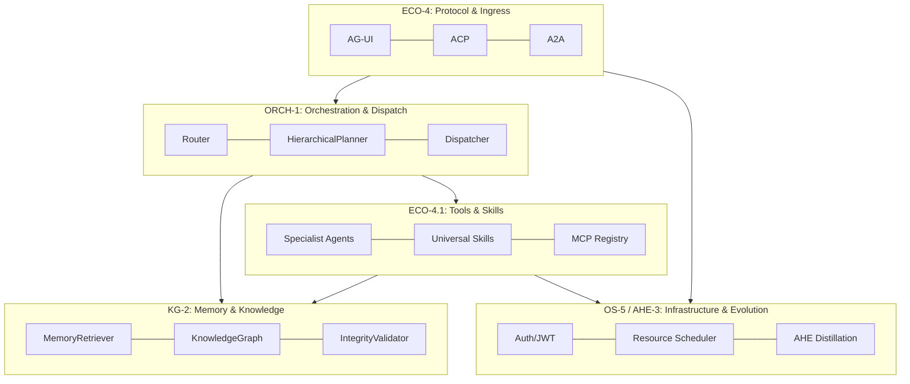

# Agent Utilities Concept Overview

> The **Concept Galaxy** — A high-level orientation of the `agent-utilities` ecosystem (88 concepts). The ecosystem has been ontologically compressed from 60+ flat concepts into **5 Unified Pillars** to reduce cognitive load and enhance native synergies.

## Deep Dive Breakdowns

To understand the rationale (why), the implementation details (how), and the comprehensive benefits of each pillar, please read our full-page breakdowns:
1. [Pillar 1: Graph Orchestration Engine](pillars/1_graph_orchestration.md)
2. [Pillar 2: Epistemic Knowledge Graph](pillars/2_epistemic_knowledge_graph.md)
3. [Pillar 3: Agentic Harness Engineering](pillars/3_agentic_harness_engineering.md)
4. [Pillar 4: Ecosystem & Peripherals](pillars/4_ecosystem_peripherals.md)
5. [Pillar 5: Agent OS Infrastructure](pillars/5_agent_os_infrastructure.md)

## The 5 Unified Pillars Architecture

```mermaid
graph TD
    %% Pillar 1: Graph Orchestration Engine
    subgraph P1 [Pillar 1: Graph Orchestration Engine]
        ORCH10["<b>ORCH-1.0: Unified Intelligence Graph</b>"]
        ORCH11["<b>ORCH-1.1: Recursive HTN Planning</b>"]
        ORCH12["<b>ORCH-1.2: Specialist Routing</b>"]
        ORCH13["<b>ORCH-1.3: Execution & State Safety</b>"]
        ORCH14["<b>ORCH-1.4: Swarm Preset Template Engine</b>"]
        ORCH15["<b>ORCH-1.5: Multi-Level Abstraction Layering</b>"]
        ORCH16["<b>ORCH-1.6: Subagent Lifecycle Patterns</b>"]
        ORCH17["<b>ORCH-1.7: Spec-Driven Development</b>"]
        ORCH18["<b>ORCH-1.8: Learned Agent Routing</b>"]
        ORCH114["<b>ORCH-1.14: Ontological Fallback Chains</b>"]
        ORCH119["<b>ORCH-1.19: Dynamic Subgraph Orchestration</b>"]
        ORCH120["<b>ORCH-1.20: KG-Driven Pydantic Graph Engine</b>"]
    end

    %% Pillar 2: Epistemic Knowledge Graph
    subgraph P2 [Pillar 2: Epistemic Knowledge Graph]
        KG20["<b>KG-2.0: Active Knowledge Graph</b>"]
        KG21["<b>KG-2.1: Tiered Memory & Rationale</b>"]
        KG22["<b>KG-2.2: Ontology & Epistemics</b>"]
        KG23["<b>KG-2.3: Graph Integrity & Fingerprinting</b>"]
        KG24["<b>KG-2.4: Inductive Knowledge Hypergraphs</b>"]
        KG25["<b>KG-2.5: Topological Partitioning</b>"]
        KG26["<b>KG-2.6: Financial Trading Pipeline</b>"]
        KG27["<b>KG-2.7: Risk Scoring Ontology</b>"]
        KG28["<b>KG-2.8: Retrieval Quality Gate</b>"]
        KG29["<b>KG-2.9: Cross-Agent Context Provenance</b>"]
        KG210["<b>KG-2.10: Token-Aware Context Compaction</b>"]
        KG211["<b>KG-2.11: Research Intelligence Pipeline</b>"]
        KG212["<b>KG-2.12: KG Source Resolver</b>"]
        KG213["<b>KG-2.13: Cross-Session Chat Recall</b>"]
        KG214["<b>KG-2.14: Project-Aware Context</b>"]
        KG215["<b>KG-2.15: Topological Analogy Engine</b>"]
        KG216["<b>KG-2.16: Semantic Subsumption</b>"]
        KG220["<b>KG-2.20: Elastic Context Operators</b>"]
        KG221["<b>KG-2.21: Multi-Timescale Memory</b>"]
        KG222["<b>KG-2.22: Versioned KG Mutations</b>"]
        KG233["<b>KG-2.33: Research Intelligence Sub-Agent</b>"]
        KG234["<b>KG-2.34: Spectral Cluster Navigator</b>"]
        KG235["<b>KG-2.35: Symbol Blast Radius Analyzer</b>"]
        KG236["<b>KG-2.36: Auto-Similarity Memory Graph</b>"]
        KG237["<b>KG-2.37: Hybrid Search Index</b>"]
        KG238["<b>KG-2.38: RAG-KG Unification</b>"]
        KG239["<b>KG-2.39: Research Orchestration</b>"]
        KG240["<b>KG-2.40: Graph Distillation Migration</b>"]
        KG250["<b>KG-2.50: Vectorized Context Filtering</b>"]
        KG251["<b>KG-2.51: Multi-Domain Architecture</b>"]
        KG252["<b>KG-2.52: Ontological Team Sharing</b>"]
        KG253["<b>KG-2.53: Ontological State Checkpointing</b>"]
    end

    %% Pillar 3: Agentic Harness Engineering
    subgraph P3 [Pillar 3: Agentic Harness Engineering]
        AHE30["<b>AHE-3.0: Agentic Harness</b>"]
        AHE31["<b>AHE-3.1: Evaluation & Distillation</b>"]
        AHE32["<b>AHE-3.2: Evolution & Discovery</b>"]
        AHE33["<b>AHE-3.3: Team & Synergy Optimization</b>"]
        AHE34["<b>AHE-3.4: Distributed Agentic Evolution</b>"]
        AHE35["<b>AHE-3.5: Continual Learning & Experience</b>"]
        AHE36["<b>AHE-3.6: Temporal Drift & EWC Consolidation</b>"]
        AHE37["<b>AHE-3.7: Heavy Thinking Orchestration</b>"]
        AHE38["<b>AHE-3.8: Backtest Evaluation Harness</b>"]
        AHE39["<b>AHE-3.9: Horizon-Aware Task Curriculum</b>"]
        AHE310["<b>AHE-3.10: Decomposed Reward Signals</b>"]
        AHE311["<b>AHE-3.11: Structured Retry Manager</b>"]
        AHE312["<b>AHE-3.12: Multi-Strategy EvalRunner</b>"]
        AHE313["<b>AHE-3.13: Agent Config Versioning</b>"]
        AHE314["<b>AHE-3.14: Agentic Engineering Patterns</b>"]
        AHE317["<b>AHE-3.17: Long-Running Background Context Spawner</b>"]
        AHE318["<b>AHE-3.18: Graph-Native Team Evolution</b>"]
        AHE324["<b>AHE-3.24: KG-Native Agentic Task Detection</b>"]
        AHE325["<b>AHE-3.25: Topological Reasoning Detection</b>"]
    end

    %% Pillar 4: Ecosystem & Peripherals
    subgraph P4 [Pillar 4: Ecosystem & Peripherals]
        ECO40["<b>ECO-4.0: Unified Tool Interface</b>"]
        ECO41["<b>ECO-4.1: MCP & Universal Skills</b>"]
        ECO42["<b>ECO-4.2: A2A Network & Consensus</b>"]
        ECO43["<b>ECO-4.3: Community Telemetry</b>"]
        ECO44["<b>ECO-4.4: Market Data Connector Protocol</b>"]
        ECO45["<b>ECO-4.5: Provider Prompt Adaptation</b>"]
        ECO46["<b>ECO-4.6: Self-Describing Function Registry</b>"]
        ECO48["<b>ECO-4.8: Dynamic Skill Evolution</b>"]
        ECO49["<b>ECO-4.9: Dynamic Tool Assignment Orchestration</b>"]
        ECO410["<b>ECO-4.10: Adaptive Tool Provisioning</b>"]
    end

    %% Pillar 5: Agent OS Infrastructure
    subgraph P5 [Pillar 5: Agent OS Infrastructure]
        OS50["<b>OS-5.0: Agent OS Kernel</b>"]
        OS51["<b>OS-5.1: Security & Auth</b>"]
        OS52["<b>OS-5.2: Resource Scheduling</b>"]
        OS53["<b>OS-5.3: Session Concurrency Mgmt</b>"]
        OS54["<b>OS-5.4: Prompt Injection Scanner</b>"]
        OS55["<b>OS-5.5: Tool Repetition Guard</b>"]
        OS56["<b>OS-5.6: Token Usage Tracker</b>"]
        OS57["<b>OS-5.7: Audit Logger</b>"]
        OS58["<b>OS-5.8: Guardrail Callback Engine</b>"]
        OS59["<b>OS-5.9: Telemetry & Observability</b>"]
        OS510["<b>OS-5.10: Policy & Prompt Governance</b>"]
        OS511["<b>OS-5.11: Topological Vulnerability Scanner</b>"]
        OS512["<b>OS-5.12: Jailbreak Robustness Hardening</b>"]
        OS518["<b>OS-5.18: Enhanced Doom-Loop Detector</b>"]
        OS519["<b>OS-5.19: Topological Session Persistence</b>"]
    end

    %% Relationships
    P1 <--> P2
    P1 --> P4
    P3 --> P1
    P5 --> P1

    style P1 fill:#dae8fe,stroke:#6c8ebf,stroke-width:2px
    style P2 fill:#d5e8d4,stroke:#82b366,stroke-width:2px
    style P3 fill:#fff2cc,stroke:#d6b656,stroke-width:2px
    style P4 fill:#e6ccff,stroke:#9673a6,stroke-width:2px
    style P5 fill:#cce5ff,stroke:#004085,stroke-width:2px
```

## Concept Index

| Pillar | Sub-Concept | Description | Path |
|---|---|---|---|
| **ORCH-1.0** | [Unified Intelligence Graph](pillars/1_graph_orchestration/ORCH-1.0-Unified_Intelligence_Graph.md) | The core hierarchical state machine (HSM) router that dynamically dispatches to specialist sub-agents. | `agent_utilities/graph/runner.py` |
| ORCH-1.1 | [Recursive HTN Planning](pillars/1_graph_orchestration/ORCH-1.1-Recursive_HTN_Planning.md) | Integrates LATS, Wide-Search, and Conductor logic into a single cohesive hierarchical planner. | `agent_utilities/graph/hierarchical_planner.py` |
| ORCH-1.2 | [Specialist Routing](pillars/1_graph_orchestration/ORCH-1.2-Specialist_Routing.md) | Confidence gating, capability activation, and unified specialist definitions. | `agent_utilities/graph/specialists.py` |
| ORCH-1.3 | [Execution & State Safety](pillars/1_graph_orchestration/ORCH-1.3-Execution_&_State_Safety.md) | Cost Governors, Execution Budgets, and payload truncation for context scaling. | `agent_utilities/graph/routing.py` |
| **KG-2.0** | [Active Knowledge Graph](pillars/2_epistemic_knowledge_graph/KG-2.0-Active_Knowledge_Graph.md) | Object-Graph Mapper persisting Pydantic models directly into the graph backend. | `agent_utilities/knowledge_graph/core/engine.py` |
| KG-2.1 | [Tiered Memory & Rationale](pillars/2_epistemic_knowledge_graph/KG-2.1-Tiered_Memory_&_Rationale.md) | Unified Working/Episodic/Semantic memory tracking and Quiet-STaR rationale persistence. | `agent_utilities/knowledge_graph/retrieval/memory_retriever.py` |
| KG-2.2 | [Ontology & Epistemics](pillars/2_epistemic_knowledge_graph/KG-2.2-Ontology_&_Epistemics.md) | Schema packs, MAGMA entity-claim extraction, and context-aware multi-hop embeddings. | `agent_utilities/models/knowledge_graph.py` |
| KG-2.3 | [Graph Integrity & Fingerprinting](pillars/2_epistemic_knowledge_graph/KG-2.3-Graph_Integrity_&_Fingerprinting.md) | Abstract syntax tree fingerprinting and structural impact analysis. | `agent_utilities/knowledge_graph/core/fingerprint.py` |
| KG-2.4 | [Inductive Knowledge Hypergraphs & Trace Distillation](pillars/2_epistemic_knowledge_graph/KG-2.4-Inductive_Knowledge_Hypergraphs_&_Trace_Distillation.md) | Positional Interaction Encoding (EncPI) and Offline/Async Trace Compression into generalized PreferenceNode and PrincipleNode elements. | `agent_utilities/knowledge_graph/core/hypergraph.py`, `agent_utilities/harness/trace_distiller.py` |
| KG-2.5 | [Topological Mincut Partitioning](pillars/2_epistemic_knowledge_graph/KG-2.5-Topological_Mincut_Partitioning.md) | Dynamic Louvain partitioning with Label Propagation fallback to identify emergent topological clusters and communities. | `agent_utilities/knowledge_graph/core/topological_partition.py` |
| **AHE-3.0** | [Agentic Harness](pillars/3_agentic_harness_engineering/AHE-3.0-Agentic_Harness.md) | Core infrastructure for prompt evolution, testing, and continuous agent improvement. | `agent_utilities/harness/` |
| AHE-3.1 | [Evaluation & Distillation](pillars/3_agentic_harness_engineering/AHE-3.1-Evaluation_&_Distillation.md) | Automated LLM-as-judge rubrics and orchestrator trace distillation. | `agent_utilities/harness/trace_distiller.py` |
| AHE-3.2 | [Evolution & Discovery](pillars/3_agentic_harness_engineering/AHE-3.2-Evolution_&_Discovery.md) | Parametric mutation, tournament selection, and autonomous knowledge discovery. | `agent_utilities/harness/variant_pool.py` |
| AHE-3.3 | [Team & Synergy Optimization](pillars/3_agentic_harness_engineering/AHE-3.3-Team_&_Synergy_Optimization.md) | Tracks multi-model combinations and promotes successful specialized teams. | `agent_utilities/knowledge_graph/core/engine_registry.py` |
| AHE-3.4 | [Distributed Agentic Evolution](pillars/3_agentic_harness_engineering/AHE-3.4-Distributed_Agentic_Evolution.md) | Autonomous skill synthesis, community telemetry tracking, and upstream PR generation via `genius-agent`. | `universal_skills/` |
| AHE-3.5 | [Continual Learning & Experience](pillars/3_agentic_harness_engineering/AHE-3.5-Continual_Learning_&_Experience.md) | Experience distillation via cross-rollout critique (CONCEPT:AHE-3.5), decomposed context retrieval (CONCEPT:AHE-3.5), and Memory-Aware Test-Time Scaling (CONCEPT:AHE-3.5). | `agent_utilities/graph/verification.py` |
| AHE-3.6 | [Temporal Drift & EWC Consolidation](pillars/3_agentic_harness_engineering/AHE-3.6-Temporal_Drift_&_EWC_Consolidation.md) | Tracks knowledge drift via cosine distance/coefficient of variation and applies Elastic Weight Consolidation (EWC++) to prevent catastrophic forgetting (CONCEPT:AHE-3.6). | `agent_utilities/knowledge_graph/memory/ewc.py` |
| AHE-3.7 | [Heavy Thinking Orchestration](pillars/3_agentic_harness_engineering/AHE-3.7-Heavy_Thinking_Orchestration.md) | Two-stage parallel-then-deliberate reasoning pipeline with tiered complexity gating, trajectory pruning/shuffling, iterative refinement, and KG-native trajectory persistence (CONCEPT:AHE-3.7). | `agent_utilities/graph/heavy_thinking.py` |
| **ECO-4.0** | [Unified Tool Interface](pillars/4_ecosystem_peripherals/ECO-4.0-Unified_Tool_Interface.md) | Dynamic registry for tools, ecosystem tour mapping, and domain routing. | `agent_utilities/tools/` |
| ECO-4.1 | [MCP & Universal Skills](pillars/4_ecosystem_peripherals/ECO-4.1-MCP_&_Universal_Skills.md) | Discovery mechanisms collapsing local Python skills and MCP Servers. | `agent_utilities/mcp/` |
| ECO-4.2 | [A2A Network & Consensus](pillars/4_ecosystem_peripherals/ECO-4.2-A2A_Network_&_Consensus.md) | Byzantine Fault Tolerance across independent agent instances via JSON-RPC. | `agent_utilities/protocols/a2a.py` |
| ECO-4.3 | [Community Telemetry](pillars/4_ecosystem_peripherals/ECO-4.3-Community_Telemetry.md) | Origin tracking, deterministic identifiers, and author tagging for distributed hive-mind capability merging. | `agent_utilities/models/knowledge_graph.py` |
| **OS-5.0** | [Agent OS Kernel](pillars/5_agent_os_infrastructure/OS-5.0-Agent_OS_Kernel.md) | Workspace management, automated initialization, file watching, and package registry. | `agent_utilities/core/workspace.py` |
| OS-5.1 | [Security & Auth](pillars/5_agent_os_infrastructure/OS-5.1-Security_&_Auth.md) | Permissions Kernel and JWT-based session security. | `agent_utilities/security/permissions_kernel.py` |
| OS-5.2 | [Resource Scheduling](pillars/5_agent_os_infrastructure/OS-5.2-Resource_Scheduling.md) | Cognitive Scheduler, cron maintenance, and API homeostatic downgrading. | `agent_utilities/core/cognitive_scheduler.py` |
| OS-5.3 | [Session Concurrency Management](pillars/5_agent_os_infrastructure/OS-5.3-Session_Concurrency_Management.md) | Distributed request queuing, interrupt mapping, and double-texting concurrency control (enqueue/reject/interrupt/rollback). | `agent_utilities/server/concurrency.py` |
| **KG-2.6** | [**Financial Trading Pipeline**](pillars/2_epistemic_knowledge_graph/KG-2.6-Financial_Trading_Pipeline.md) | FIBO-aligned KG primitives for the full trading lifecycle: Signal → Order → Position → Portfolio → Strategy. OWL-promoted with transitive provenance chains. | `agent_utilities/models/knowledge_graph.py` |
| **ECO-4.4** | [**Market Data Connector Protocol**](pillars/4_ecosystem_peripherals/ECO-4.4-Market_Data_Connector_Protocol.md) | Generic `DataConnectorProtocol` with auto-fallback chain, rate-limit awareness, and immutable `DataFetchRecordNode` provenance tracking. | `agent_utilities/protocols/data_connector.py` |
| **ORCH-1.4** | [**Swarm Preset Template Engine**](pillars/1_graph_orchestration/ORCH-1.4-Swarm_Preset_Template_Engine.md) | YAML-driven declarative multi-agent workflow engine with DAG topological sort, cycle detection, parallel dispatch identification, and variable substitution. | `agent_utilities/graph/swarm_preset.py` |
| **ORCH-1.5** | [**Multi-Level Abstraction Layering**](pillars/1_graph_orchestration/ORCH-1.5-Multi-Level_Abstraction_Layering.md) | Planners emit coarse-grained abstraction steps and delegate fine-grained execution to specialist nodes, reducing upfront planning token overhead. | `agent_utilities/graph/hierarchical_planner.py` |
| **KG-2.7** | [**Risk Scoring Ontology**](pillars/2_epistemic_knowledge_graph/KG-2.7-Risk_Scoring_Ontology.md) | Domain-agnostic risk assessment with `RiskAssessmentNode`, `RiskFactorNode`, `RiskMitigationNode`. OWL `propagatesRiskTo` enables transitive upstream risk chain inference. | `agent_utilities/models/knowledge_graph.py` |
| **AHE-3.8** | [**Backtest Evaluation Harness**](pillars/3_agentic_harness_engineering/AHE-3.8-Backtest_Evaluation_Harness.md) | Strategy evaluation harness with SQLite storage, walk-forward validation windows, benchmark comparison, and KG integration via `BacktestRunNode`/`BacktestMetricNode`. | `agent_utilities/harness/backtest_harness.py` |
| **AHE-3.9** | [**Horizon-Aware Task Curriculum**](pillars/3_agentic_harness_engineering/AHE-3.9-Horizon-Aware_Task_Curriculum.md) | Progressive horizon scheduling with macro-action composition, subgoal checkpoints, and configurable promotion policies (threshold/plateau/adaptive). Based on Long-Horizon Training research (CONCEPT:AHE-3.9). | `agent_utilities/graph/horizon_curriculum.py` |
| **AHE-3.10** | [**Decomposed Reward Signals**](pillars/3_agentic_harness_engineering/AHE-3.10-Decomposed_Reward_Signals.md) | Separates step-level reward (local constraint satisfaction) from trajectory-level reward (goal achievement) for accurate credit assignment. Feeds into ExperienceNode distillation (CONCEPT:AHE-3.10). | `agent_utilities/graph/reward_decomposition.py` |
| **KG-2.8** | [**Retrieval Quality Gate**](pillars/2_epistemic_knowledge_graph/KG-2.8-Retrieval_Quality_Gate.md) | Systematic retrieval quality measurement with 5-mode failure taxonomy (drift, truncation, staleness, low-relevance, inter-agent), configurable per-SchemaPack relevance thresholds, and temporal freshness scoring. Based on Ambekar (2026) research. | `agent_utilities/knowledge_graph/retrieval/retrieval_quality.py` |
| **KG-2.9** | [**Cross-Agent Context Provenance**](pillars/2_epistemic_knowledge_graph/KG-2.9-Cross-Agent_Context_Provenance.md) | Tracks retrieval quality scores and failure modes across agent boundaries via `ContextProvenanceRecord`. Detects cascading retrieval degradation in multi-agent pipelines. | `agent_utilities/knowledge_graph/retrieval/retrieval_quality.py` |
| **ORCH-1.6** | [**Subagent Lifecycle Patterns**](pillars/1_graph_orchestration/ORCH-1.6-Subagent_Lifecycle_Patterns.md) | Formalizes 4-tier subagent interaction taxonomy (inline_tool, fan_out, agent_pool, teams) with complexity-based pattern routing, KG-persisted decisions, and outcome-based learning. Based on Schmid (2026). | `agent_utilities/graph/subagent_patterns.py` |
| **ECO-4.5** | [**Provider Prompt Adaptation**](pillars/4_ecosystem_peripherals/ECO-4.5-Provider_Prompt_Adaptation.md) | Abstracted-backend provider-aware prompt optimization with static and KG-backed rule storage. Built-in rules for OpenAI, Anthropic, Google with contextual activation. Based on Rosetta Prompt research. | `agent_utilities/prompting/provider_adapter.py` |
| **ECO-4.6** | [**Self-Describing Function Registry**](pillars/4_ecosystem_peripherals/ECO-4.6-Self-Describing_Function_Registry.md) | Runtime function registration with input/output JSON schemas and declarative trigger bindings (http/cron/event). Unified `discover_all_capabilities()` for AgentOS-style category collapse via KG. | `agent_utilities/knowledge_graph/core/engine_registry.py` |
| **OS-5.4** | [**Prompt Injection Scanner**](pillars/5_agent_os_infrastructure/OS-5.4-Prompt_Injection_Scanner.md) | Pattern-based prompt injection and command injection scanner with 25+ threat vectors ported from Goose. Integrates with PolicyEngine and persists findings as `SecurityFindingNode` in the KG for OWL transitive risk propagation. | `agent_utilities/security/prompt_scanner.py` |
| **OS-5.5** | [**Tool Repetition Guard**](pillars/5_agent_os_infrastructure/OS-5.5-Tool_Repetition_Guard.md) | Detects infinite tool call loops via consecutive call tracking and per-session budgets. Denied repetitions distill into `ExperienceNode` tactical rules (AHE-3.5) for cross-session loop avoidance. | `agent_utilities/security/repetition_guard.py` |
| **KG-2.10** | [**Token-Aware Context Compaction**](pillars/2_epistemic_knowledge_graph/KG-2.10-Token-Aware_Context_Compaction.md) | Intelligent context window management with three strategies (summarize_tools, drop_middle, progressive). Compaction summaries persist as `EpisodeNode` snapshots for cross-session context recall. Adapted from Goose's context_mgmt. | `agent_utilities/knowledge_graph/memory/context_compactor.py` |
| **KG-2.11** | [**Research Intelligence Pipeline**](pillars/2_epistemic_knowledge_graph/KG-2.11-Research_Intelligence_Pipeline.md) | Automated end-to-end research ingestion: ScholarX Discovery → 9-domain Relevance Scoring → Tiered Ingestion (full for ≥3.0, abstract-only for ≥1.0) → OWL Enrichment → Digest Generation. Supports arXiv, local files, and web URLs. | `agent_utilities/automation/research_pipeline.py` |
| **KG-2.12** | [**KG Source Resolver**](pillars/2_epistemic_knowledge_graph/KG-2.12-KG_Source_Resolver.md) | Bridges the KG indexing layer to the comparative-analysis skill by materializing stored documents to filesystem paths with metadata enrichment. Optional — gracefully returns empty when no KG is available. | `agent_utilities/knowledge_graph/core/source_resolver.py` |
| **AHE-3.11** | [**Structured Retry Manager**](pillars/3_agentic_harness_engineering/AHE-3.11-Structured_Retry_Manager.md) | Shell-based success checks, on-failure hooks, and configurable timeouts for structured retry logic. Retry outcomes feed into TeamConfig reward signaling (AHE-3.3) for routing improvement. Adapted from Goose's retry.rs. | `agent_utilities/graph/retry_manager.py` |
| **AHE-3.12** | [**Multi-Strategy EvalRunner**](pillars/3_agentic_harness_engineering/AHE-3.12-Multi-Strategy_EvalRunner.md) | Multi-strategy evaluation runner (exact match, semantic similarity, LLM-as-Judge) with composite scoring and EvaluationMonitor integration. Ported from MATE's eval_runner.py. OWL-enabled `degradedPerformance` inference across sessions. | `agent_utilities/observability/evaluation.py` |
| **AHE-3.13** | [**Agent Config Versioning**](pillars/3_agentic_harness_engineering/AHE-3.13-Agent_Config_Versioning.md) | Immutable config snapshots with forward-only rollback, structured diffs, and SUPERSEDES edge chains. Ported from MATE's AgentConfigVersion pattern. OWL-inferred `configDrift` and `stableConfig`. | `agent_utilities/observability/config_versioning.py` |
| **OS-5.6** | [**Token Usage Tracker**](pillars/5_agent_os_infrastructure/OS-5.6-Token_Usage_Tracker.md) | 4-bucket granular token analytics (prompt/response/thoughts/tool_use) with session aggregation, agent breakdown, and budget alerting. Ported from MATE's token_usage_service.py. OWL-inferred `highCostAgent` classification. | `agent_utilities/observability/token_tracker.py` |
| **OS-5.7** | [**Audit Logger**](pillars/5_agent_os_infrastructure/OS-5.7-Audit_Logger.md) | Append-only compliance audit trail with 30+ action constants, never-raise semantics, configurable retention, and query filtering. Ported from MATE's audit_service.py. OWL-inferred `escalationChain` temporal reasoning. | `agent_utilities/observability/audit_logger.py` |
| **OS-5.8** | [**Guardrail Callback Engine**](pillars/5_agent_os_infrastructure/OS-5.8-Guardrail_Callback_Engine.md) | Push-based input/output guardrail interception with block/redact/warn actions, regex/keyword matching, and PolicyEngine adapter. Ported from MATE's guardrail_callback.py. OWL-inferred `correlatedThreat` detection. | `agent_utilities/security/guardrail_engine.py` |
| **ORCH-1.7** | [**Spec-Driven Development Pipeline**](pillars/1_graph_orchestration/ORCH-1.7-Spec-Driven_Development_Pipeline.md) | High-fidelity orchestration pipeline that decomposes goals into structured Specifications (`Spec`), Implementation Plans, and dependency-aware Tasks. | `agent_utilities/models/sdd.py` |
| **KG-2.13** | [**Cross-Session Chat Recall**](pillars/2_epistemic_knowledge_graph/KG-2.13-Cross-Session_Chat_Recall.md) | Keyword-based search across stored chat sessions using the KG Cypher backend. Adapted from Goose. | `agent_utilities/knowledge_graph/retrieval/chat_search.py` |
| **KG-2.14** | [**Project-Aware Context**](pillars/2_epistemic_knowledge_graph/KG-2.14-Project-Aware_Context.md) | Native support for Claude-style project rules. Backend automatically loads and injects `AGENTS.md` (Project Rules) into the system prompt for high-fidelity codebase awareness. | `agent_utilities/knowledge_graph/core/agents_md.py` |
| **KG-2.15** | [**Topological Analogy Engine**](pillars/2_epistemic_knowledge_graph/KG-2.15-Topological_Analogy_Engine.md) | Leverages exact subgraph isomorphism (networkx VF2) and vectorized embeddings (EncPI) to find analogous subgraphs across different domains (cross-domain innovation extraction). | `agent_utilities/knowledge_graph/core/analogy_engine.py` |
| **KG-2.16** | [**OWL-Driven Semantic Subsumption**](pillars/2_epistemic_knowledge_graph/KG-2.16-OWL-Driven_Semantic_Subsumption.md) | Enables hierarchy-aware zero-shot ontology alignment by comparing new topological embeddings against OWL class prototypes to automatically infer and inject full class lineage. | `agent_utilities/knowledge_graph/core/semantic_subsumption.py` |
| **AHE-3.14** | [**Agentic Engineering Patterns**](pillars/3_agentic_harness_engineering/AHE-3.14-Agentic_Engineering_Patterns.md) | Out-of-the-box support for TDD Cycles (Red-Green-Refactor), First Run Tests, Agentic Manual Testing, Code Walkthroughs, and Interactive Explanations. | `agent_utilities/harness/engineering.py` |
| **OS-5.9** | [**Telemetry & Observability**](pillars/5_agent_os_infrastructure/OS-5.9-Telemetry_&_Observability.md) | Real-time Graph Streaming (SSE) and lifecycle events. Per-step state snapshots via `graph.iter()`. Early OTEL/logfire gate. | `agent_utilities/observability/custom_observability.py` |
| **OS-5.10** | [**Policy & Prompt Governance**](pillars/5_agent_os_infrastructure/OS-5.10-Policy_&_Prompt_Governance.md) | Standardized Pydantic models for structured prompting. Moves away from free-form Markdown to robust, versioned JSON blueprints for high-precision task specification. | `agent_utilities/policies/` |
| **OS-5.11** | [**Topological Vulnerability Scanner**](pillars/5_agent_os_infrastructure/OS-5.11-Topological_Vulnerability_Scanner.md) | Enhances security by scanning execution graphs for structural vulnerabilities (e.g., untrusted data flows, dependency deadlocks) by matching against known risk subgraphs using the Analogy Engine. | `agent_utilities/security/topological_scanner.py` |
| **AHE-3.15** | [**Agent-Interpretable Model Evolver**](pillars/3_agentic_harness_engineering/AHE-3.15-Agent-Interpretable_Model_Evolver.md) | Autoresearch loop that evolves scikit-learn-compatible model classes optimized for dual objectives: predictive accuracy and LLM readability via `__str__()`. Pareto frontier tracking, reward decomposition (AHE-3.10), and KG-native evolutionary lineage. Based on arXiv:2605.03808. MCP-delegated model fitting via `data-science-mcp`. | `agent_utilities/harness/imodel_evolver.py` |
| **AHE-3.16** | [**LLM-Graded Interpretability Tests**](pillars/3_agentic_harness_engineering/AHE-3.16-LLM-Graded_Interpretability_Tests.md) | 6-category, 200-test protocol measuring whether an LLM can simulate model predictions, feature effects, and counterfactuals from `__str__()` alone. Reward hacking detection, numerical tolerance grading, and EvalRunner (AHE-3.12) integration. Based on arXiv:2605.03808. | `agent_utilities/harness/interpretability_tests.py` |
| **KG-2.17** | [**Model Display Optimization**](pillars/2_epistemic_knowledge_graph/KG-2.17-Model_Display_Optimization.md) | Display-predict decoupling engine: optimizes model `__str__()` for LLM consumption independently of `predict()` logic. 5 strategies (linear_collapse, piecewise_table, symbolic_equation, coefficient_summary, adaptive/SmartAdditive). Bounded complexity budgets. Based on arXiv:2605.03808. | `agent_utilities/knowledge_graph/core/model_display.py` |
| **KG-2.18** | [**Topological Graph Visualization**](pillars/2_epistemic_knowledge_graph/KG-2.18-Topological_Graph_Visualization.md) | Scalable WebGL-based Knowledge Graph visualization engine using Sigma.js and ForceAtlas2 physics for the `agent-webui`. Implements intelligent mass assignment and radial clustering for 100K+ scale. | `agent-webui/src/components/knowledge-graph/` |
| **ECO-4.7** | [**Ecosystem Topology Map**](pillars/4_ecosystem_peripherals/ECO-4.7-Ecosystem_Topology_Map.md) | Materializes the 40-repository ecosystem as first-class Knowledge Graph nodes. Scans `pyproject.toml` files, builds transitive dependency graphs, computes impact radius, and groups MCP servers into intelligent categories (Infrastructure, Media, Productivity, Data Science, DevOps, Communication). OWL classes: `EcosystemPackage`, `FrontendPackage`, `MCPServerPackage`, `SkillPackage` with `providesCapabilityTo` (transitive). | `agent_utilities/knowledge_graph/core/ecosystem_topology.py` |
| **KG-2.19** | [**Cross-Pillar Synergy Engine**](pillars/2_epistemic_knowledge_graph/KG-2.19-Cross-Pillar_Synergy_Engine.md) | Discovers non-obvious functional synergies between the 5 Unified Pillars by analyzing concept bridges, computing pillar coupling metrics, and suggesting missing relationships. Leverages the Analogy Engine (KG-2.15), SKOS taxonomy, and transitive OWL properties. OWL property: `hasSynergyWith` (symmetric). | `agent_utilities/knowledge_graph/core/synergy_engine.py` |
| **ORCH-1.8** | [**Learned Agent Routing**](pillars/1_graph_orchestration/ORCH-1.8-Learned_Agent_Routing.md) | Jointly optimizes decomposition depth, worker choice, and inference budget from execution traces. Three policies: RuleBasedPolicy (keyword pattern matching), TraceLearnedPolicy (softmax scoring from historical traces with EMA quality tracking), CostAwareRouter (Pareto-optimal cost/accuracy filtering). Derived from Uno-Orchestra (arXiv:2605.05007v1). | `agent_utilities/graph/routing_policy.py` |
| **KG-2.20** | [**Elastic Context Operators**](pillars/2_epistemic_knowledge_graph/KG-2.20-Elastic_Context_Operators.md) | 5 atomic operators for elastic context orchestration: Skip, Compress, Rollback, Snippet, Delete. Compress is expressively complete while specialized operators reduce hallucination risk. Includes checkpoint/rollback support for speculative context operations. Derived from LongSeeker (arXiv:2605.05191v1). | `agent_utilities/knowledge_graph/memory/context_compactor.py` |
| **KG-2.21** | [**Multi-Timescale Memory Dynamics**](pillars/2_epistemic_knowledge_graph/KG-2.21-Multi-Timescale_Memory_Dynamics.md) | Three-tier memory with timescale-aware exponential decay: Working (5min half-life), Episodic (4hr), Semantic (30-day). High-activation memories consolidate from Working→Episodic→Semantic via access-count thresholds. Relevance-weighted retrieval with keyword scoring. Derived from Continual Knowledge Updating (arXiv:2605.05097v1). | `agent_utilities/knowledge_graph/memory/timescale_memory.py` |
| **KG-2.22** | [**Versioned KG Mutations**](pillars/2_epistemic_knowledge_graph/KG-2.22-Versioned_KG_Mutations.md) | Git-like transactional mutation semantics for Knowledge Graph evolution: KGTransaction (batched mutations), KGCommit (atomic application with rollback data), KGVersionEngine (commit/rollback/diff), KGDiff (structural diff between graph versions). Derived from Evolving Idea Graphs (arXiv:2605.04922v1). | `agent_utilities/knowledge_graph/core/kg_versioning.py` |
| **ECO-4.8** | [**Dynamic Skill Evolution**](pillars/4_ecosystem_peripherals/ECO-4.8-Dynamic_Skill_Evolution.md) | On-the-fly skill creation and consolidation to avoid catastrophic forgetting during continual learning. SkillNeologismDetector (identifies when existing skills don't cover a task), SkillFactory (creates new skills from execution traces), SkillMerger (detects overlapping skills via Jaccard similarity and consolidates). Derived from Skill Neologisms (arXiv:2605.04970v1). | `agent_utilities/knowledge_graph/adaptation/skill_evolver.py` |
| **OS-5.12** | [**Jailbreak Robustness Hardening**](pillars/5_agent_os_infrastructure/OS-5.12-Jailbreak_Robustness_Hardening.md) | Extends Prompt Injection Scanner (OS-5.4) with 4-category jailbreak attack taxonomy from SoK research: template-based (DAN, AIM, UCAR, Grandma), optimization-based (GCG suffix, token smuggling), LLM-based (context confusion, multi-turn escalation), manual (role-play, authority override). 12 new threat patterns. Derived from SoK: Robustness against Jailbreak (arXiv:2605.05058v1). | `agent_utilities/security/prompt_scanner.py` |
| **KG-2.33** | [**Research Intelligence Sub-Agent**](pillars/2_epistemic_knowledge_graph/KG-2.33-Research_Intelligence_Sub-Agent.md) | Isolated research context with citation graph traversal (Semantic Scholar API), doom-loop detection, and KG persistence. Findings become `EvidenceNode` entries with `wasDerivedFrom` provenance chains. Adapted from ml-intern's research_tool.py sub-agent pattern. | `agent_utilities/knowledge_graph/orchestration/research_subagent.py` |
| **KG-2.34** | [**Spectral Cluster Navigator**](pillars/2_epistemic_knowledge_graph/KG-2.34-Spectral_Cluster_Navigator.md) | Tuning-free spectral clustering using normalized Laplacian eigengap heuristics for automatic k-selection. OWL-integrated via `skos:Concept` alignment with `broader`/`narrower` edges. Financial regime detection extension. Adapted from contextplus's clustering.ts. | `agent_utilities/knowledge_graph/core/spectral_navigator.py` |
| **KG-2.35** | [**Symbol Blast Radius Analyzer**](pillars/2_epistemic_knowledge_graph/KG-2.35-Symbol_Blast_Radius_Analyzer.md) | Regex-based symbol usage tracking across Python codebases with definition-line exclusion, low-usage warnings, and KG integration via `BlastRadiusNode`. Impact scoring uses log-scaled usage count × file diversity. Adapted from contextplus's blast-radius.ts. | `agent_utilities/knowledge_graph/core/blast_radius.py` |
| **KG-2.36** | [**Auto-Similarity Memory Graph**](pillars/2_epistemic_knowledge_graph/KG-2.36-Auto-Similarity_Memory_Graph.md) | Auto-creates `SIMILAR_TO` edges between KG memory nodes when cosine similarity ≥ threshold (default 0.72). Exponential decay scoring with stale edge pruning and hub control. Adapted from contextplus's memory-graph.ts. | `agent_utilities/knowledge_graph/memory/auto_similarity.py` |
| **KG-2.37** | [**Hybrid Search Index**](pillars/2_epistemic_knowledge_graph/KG-2.37-Hybrid_Search_Index.md) | Weighted semantic+keyword search scoring (72%/28% default) with CamelCase/snake_case token splitting, phrase boost, and symbol-specific matching. Uses existing `create_embedding_model()` infrastructure. Adapted from contextplus's embedding.ts. | `agent_utilities/knowledge_graph/retrieval/hybrid_search_scorer.py` |
| **OS-5.18** | [**Enhanced Doom-Loop Detector**](pillars/5_agent_os_infrastructure/OS-5.18-Enhanced_Doom-Loop_Detector.md) | Pattern-aware doom-loop detection with result-aware tool call signatures, repeating sequence detection (patterns 2-5), and corrective prompt generation. KG persistence via `DoomLoopIncidentNode`. Adapted from ml-intern's doom_loop.py. | `agent_utilities/security/doom_loop_detector.py` |
| **KG-2.38** | [**RAG-KG Unification**](pillars/2_epistemic_knowledge_graph/KG-2.38-RAG-KG_Unification.md) | Collapses separate RAG vector index into KG-native retrieval using three acceleration layers: similarity-edge shortcuts (O(degree) vs O(N)), spectral cluster scoping (search space reduction), and hybrid semantic+keyword scoring. Drop-in enhancement for HybridRetriever via `retrieve_unified()`. | `agent_utilities/knowledge_graph/retrieval/unified_rag_kg.py` |
| **KG-2.39** | [**Research Orchestration Integration**](pillars/2_epistemic_knowledge_graph/KG-2.39-Research_Orchestration_Integration.md) | Connects ResearchSubagent (KG-2.33) to ResearchPipelineRunner (KG-2.11) and UnifiedRAGKGRetriever (KG-2.38) for automated daily research cycles. 7-phase pipeline: discovery → subagent session → citation traversal → pipeline ingestion → similarity linking → cluster refresh → KG persistence. MCP-compatible for `run_research_cycle` tool registration. | `agent_utilities/knowledge_graph/orchestration/research_orchestrator.py` |
| **KG-2.40** | [**Graph Distillation Migration**](pillars/2_epistemic_knowledge_graph/KG-2.40-Graph_Distillation_Migration.md) | Migrates standard RAG retrieval to pre-computed SimilarityEdgeNode shortcuts for O(degree) retrieval. Manages distillation index lifecycle: batch creation, incremental updates, stale edge pruning, and coverage health monitoring. Includes `migrate_existing()` for batch migration of legacy nodes. | `agent_utilities/knowledge_graph/retrieval/graph_distillation.py` |
| **KG-2.41** | [**Formal Graph Theory Primitives**](pillars/2_epistemic_knowledge_graph/KG-2.41-Formal_Graph_Theory_Primitives.md) | Mathematically rigorous graph operations from MCS (MIT 6.042J): DAG critical path analysis (O(V+E) makespan), k-connectivity certificates (Whitney's theorem), Euler tour serialization, chromatic scheduling (conflict-free parallelism), personalized PageRank (random walk with restart), adjacency matrix power path counting, and curated MCS seed taxonomy for KG preloading. | `agent_utilities/knowledge_graph/core/graph_theory_primitives.py` |
| **KG-2.42** | [**Embedding Alignment Diagnostics**](pillars/2_epistemic_knowledge_graph/KG-2.42-Embedding_Alignment_Diagnostics.md) | Multi-layer embedding quality analysis from MINER (arXiv:2605.06460v1): Centered Kernel Alignment (CKA) for structural space comparison, Alignment Ratio diagnostics, adaptive sparse fusion with neuron-level masking, and continuous embedding health monitoring via SVD effective dimensionality. | `agent_utilities/knowledge_graph/retrieval/embedding_diagnostics.py` |
| **KG-2.43** | [**Structural Causal Reasoning Engine**](pillars/2_epistemic_knowledge_graph/KG-2.43-Structural_Causal_Reasoning_Engine.md) | Explicit causal chain modeling from MedCausalX (arXiv:2603.23085v1): Structural Causal Models (SCMs) with do-calculus interventions, d-separation conditional independence testing, causal verification protocol (`<causal>`/`<verify>` tokens), counterfactual generation, spuriousness detection, and trajectory-level causal alignment scoring. | `agent_utilities/knowledge_graph/core/causal_reasoning.py` |
| **KG-2.44** | [**Latent Space Anti-Collapse Regularizer**](pillars/2_epistemic_knowledge_graph/KG-2.44-Latent_Space_Anti-Collapse_Regularizer.md) | Formal anti-collapse guarantees from LeWorldModel (arXiv:2603.19312v2): SIGReg normality testing via random projections, SVD-based collapse detection, diversity-preserving EWC consolidation (extends AHE-3.6), participation ratio monitoring, and predictive consistency scoring for agent action sequences. | `agent_utilities/knowledge_graph/memory/latent_space_regularizer.py` |
| **KG-2.45** | [**Probabilistic Knowledge Graph Reasoning**](pillars/2_epistemic_knowledge_graph/KG-2.45-Probabilistic_Knowledge_Graph_Reasoning.md) | Probabilistic reasoning from MCS Ch 17–21: Bayesian belief propagation with loopy BP over graph topology, random walk exploration with surprise scoring, Law of Total Probability aggregation (anti-Simpson's Paradox), Birthday Paradox collision detection for probabilistic deduplication, and d-separation conditional independence testing. | `agent_utilities/knowledge_graph/core/probabilistic_reasoning.py` |
| **KG-2.46** | [**Optimal Execution Engine**](pillars/2_epistemic_knowledge_graph/KG-2.46-Optimal_Execution_Engine.md) | Mathematical optimal execution from Oxford HFT (Drissi, 2024): Almgren-Chriss discrete/continuous (HJB), Cartea-Jaimungal with Riccati ODE, Avellaneda-Stoikov market making (reservation price + optimal spread), cointegration pairs trading (OU process), and signal-adaptive execution. Full glossary in `docs/mathematical_foundations.md`. | `agent_utilities/knowledge_graph/core/optimal_execution.py` |
| **KG-2.47** | [**Formal Relations Engine**](pillars/2_epistemic_knowledge_graph/KG-2.47-Formal_Relations_Engine.md) | Mathematical relation properties (Reflexive, Symmetric, Transitive closures) and Equivalence Classes from MCS Ch 4. Provides zero-shot entity resolution by formally defining equivalence sets. | `agent_utilities/knowledge_graph/core/formal_relations.py` |
| **KG-2.48** | [**State Machine Invariant Engine**](pillars/2_epistemic_knowledge_graph/KG-2.48-State_Machine_Invariant_Engine.md) | Deterministic Finite Automata (DFA) abstractions and provable state invariants from MCS Ch 6. Formally validates transitions against structural invariants, preventing infinite loops. | `agent_utilities/knowledge_graph/core/state_machines.py` |
| **KG-2.49** | [**Markov Transition Forecasting**](pillars/2_epistemic_knowledge_graph/KG-2.49-Markov_Transition_Forecasting.md) | Markov Chain transition matrices over agent interaction traces (Vectorized Topologies) from MCS Ch 21. Calculates stationary distribution (Eigenvector) to predict statistical failure nodes. | `agent_utilities/knowledge_graph/core/markov_transitions.py` |
| **ORCH-1.14** | [**Ontological Fallback Chains**](pillars/1_graph_orchestration/ORCH-1.14-Ontological_Fallback_Chains.md) | Uses the KG to find fallback models dynamically rather than relying on static lists during rate limits. | `agent_utilities/graph/routing_policy.py` |
| **KG-2.50** | [**Vectorized Context-Window Filtering**](pillars/2_epistemic_knowledge_graph/KG-2.50-Vectorized_Context-Window_Filtering.md) | Semantically prunes non-relevant subgraph context before swapping models on token overflow. | `agent_utilities/graph/context_filter.py` |
| **KG-2.51** | [**Multi-Domain Architecture**](pillars/2_epistemic_knowledge_graph/KG-2.51-Multi-Domain_Architecture.md) | Transitioned to a Multi-Domain Expert System supporting modular expansion into `finance`, `medical`, `law`, and `science`. | `agent_utilities/domains/` |
| **KG-2.60** | **Alpha Factor Library** | 20 battle-tested alpha factors (momentum, mean-reversion, volatility, volume, value) with IC/IR analysis for factor selection. Sourced from Qlib Alpha158. | `agent_utilities/domains/finance/alpha_factors.py` |
| **KG-2.61** | **Risk Management Engine** | Risk-first guard pipeline with VaR (Historical/Parametric/Monte Carlo), stress testing, and pre-trade validation. Sourced from AutoHedge/OpenAlice. | `agent_utilities/domains/finance/risk_manager.py` |
| **KG-2.62** | **Portfolio Optimization Suite** | Mean-Variance (Markowitz), Risk Parity, and Black-Litterman portfolio optimization with KG-backed allocation tracking. | `agent_utilities/domains/finance/portfolio_optimizer.py` |
| **KG-2.63** | **Versioned Order System** | "Trading-as-Git" order staging with immutable snapshots, version chains, and pre-commit guard hooks. Sourced from OpenAlice. | `agent_utilities/domains/finance/versioned_orders.py` |
| **KG-2.64** | **Market Data Abstraction Layer** | Protocol-based data provider system with auto-fallback chains, OHLCV normalization, and KG data provenance. | `agent_utilities/domains/finance/market_data.py` |
| **KG-2.65** | **x402 AI Payment Protocol** | First-class HTTP 402 challenge-response handler for autonomous AI agent payments with budget guards. | `agent_utilities/domains/finance/payments.py` |
| **KG-2.66** | **Profit Attribution Engine** | P&L decomposition into alpha/beta/residual components with Sharpe, Sortino, Calmar, and Information Ratio. Sourced from Qlib. | `agent_utilities/domains/finance/profit_attribution.py` |
| **KG-2.67** | **Universal Real-Time Streaming** | Domain-agnostic pub/sub message bus with WebSocket adapter for market data, telemetry, and agent events. | `agent_utilities/domains/finance/streaming.py` |
| **KG-2.70** | **Kronos Foundation Model Forecaster** | K-line candlestick tokenizer (1200-token vocab) and autoregressive transition matrix predictor for time series forecasting. | `agent_utilities/domains/finance/kronos_forecaster.py` |
| **KG-2.71** | **Multi-Agent Trading Swarm** | 8-role trading swarm (Director, Quant, Risk, Execution, Indicator, Pattern, Trend, Sentiment) with weighted consensus and risk veto. | `agent_utilities/domains/finance/trading_swarm.py` |
| **KG-2.72** | **Visual Technical Analysis Engine** | Chart pattern detection (double top/bottom, breakout), support/resistance levels, and trend analysis via linear regression. | `agent_utilities/domains/finance/visual_ta.py` |
| **KG-2.73** | **Real-Time Market Feeds** | Finance-specific StreamBus adapter with tick-to-bar aggregation, multi-symbol routing, and price alert triggers. | `agent_utilities/domains/finance/market_feeds.py` |
| **KG-2.74** | **Multi-Platform Strategy Export** | Code generation engine producing Pine Script v6 (TradingView), MQL5 (MetaTrader 5), and TDX (通达信) from universal StrategySpec. | `agent_utilities/domains/finance/strategy_export.py` |
| **KG-2.75** | **Research Autopilot** | Automated hypothesis → backtest → report loop with configurable pass criteria (Sharpe, drawdown, win rate, profit factor). | `agent_utilities/domains/finance/research_autopilot.py` |
| **KG-2.76** | **Strategy Sharing System** | Strategy cards with metadata, configuration presets, registry search, fork capability, and community marketplace. | `agent_utilities/domains/finance/strategy_sharing.py` |
| **ORCH-1.19** | [**Dynamic Subgraph Orchestrator**](pillars/1_graph_orchestration/ORCH-1.19-Dynamic_Subgraph_Orchestrator.md) | Dynamically synthesizes subgraph transition logic from the Knowledge Graph on the fly without using predefined templates. Uses KG-2.41 Formal Graph Theory. | `agent_utilities/graph/dynamic_subgraph.py` |
| **AHE-3.17** | [**Long-Running Background Context Spawner**](pillars/3_agentic_harness_engineering/AHE-3.17-Long-Running_Background_Context_Spawner.md) | A module that polls background tasks via KG state and autonomously spawns specialized sub-agents by evaluating impact scores. | `agent_utilities/harness/background_spawner.py` |
| **ECO-4.9** | [**Dynamic Tool Assignment Orchestration**](pillars/4_ecosystem_peripherals/ECO-4.9-Dynamic_Tool_Assignment_Orchestration.md) | Matches tool ontology to agent tasks dynamically at runtime based on task context and KG embeddings. | `agent_utilities/tools/dynamic_tool_orchestrator.py` |
| **KG-2.52** | [**Ontological Team Sharing**](pillars/2_epistemic_knowledge_graph/KG-2.52-Ontological_Team_Sharing.md) | Serializes the dynamically created and successful subgraphs into OWL/Turtle ontology formats so they can be exported/imported as "shareable team compositions". | `agent_utilities/knowledge_graph/core/ontological_team_sharing.py` |

## Agent OS Architecture

The Agent OS is a multi-subsystem architecture where the **Active Knowledge Graph (KG-2.0)** drives all tool discovery and routing across cooperating packages:

### OS Subsystems (auto-installed)

| Subsystem | Package | Role |
|:---|:---|:---|
| 🧠 **Kernel** | `agent-utilities` | Models, logic, graph orchestration, KG, default catalog |
| ⚙️ **OS Layer** | `systems-manager` | Host OS operations + Agent OS MCP wrappers (23+ tools) |
| 📦 **Container Runtime** | `container-manager-mcp` | Docker/Podman lifecycle, multi-endpoint, specialist deploy (60+ tools) |
| 🌐 **Network Stack** | `tunnel-manager` | SSH tunnels, remote exec, file transfer, host inventory (43 tools) |
| 📂 **Workspace** | `repository-manager` | Git workspace mgmt, project lifecycle, dependency graphs (24 tools) |

### Deployment Patterns

`agent-utilities` acts as the lightweight **Agent OS Kernel** operating entirely in the background. Because expensive operations (LLM Inference, massive vector DBs, Neo4j persistence) are typically offloaded to external endpoints or lightweight local variants (like SQLite/NetworkX), the local resource footprint of the system is extremely small (~100-200MB RAM), enabling it to run seamlessly on edge devices like a Raspberry Pi.

The primary user-facing frontend is **`genius-agent`** (located in `agent-packages/agents/genius-agent`). It acts as the Orchestrator UI:
1. `genius-agent` mounts all MCP tools and `universal-skills`.
2. It invokes `agent-utilities` in the backend to intelligently route tasks, plan recursive actions, and maintain the Knowledge Graph.
3. It utilizes the lightweight mathematical logic in `agent-utilities` (like `numpy` for EWC diagonal proxies or `networkx` for Louvain partitioning) instantly, without requiring massive hardware overhead.

## Query Lifecycle Walkthrough

When a user submits a query, it traverses the system through specific phases natively aligned to the 5 Pillars:

1. **Protocol Ingress (`ECO-4.0`)**: The query arrives via `/acp`, `/ag-ui`, or `/a2a`. The payload is normalized.
2. **Usage Guard & Validation (`OS-5.1`)**: Validates rate limits, execution budgets (`ORCH-1.3`), and ensures the user has authorization.
3. **TeamConfig Check (`AHE-3.3`)**: The router checks the KG for a proven specialist coalition from a previous successful execution.
4. **Hierarchical Planner (`ORCH-1.1`)**: Determines the topological path via HTN goal decomposition and LATS fallback logic.
5. **Memory Injection (`KG-2.1`)**: The unified `MemoryRetriever` fetches Virtual Context Blocks and Quiet-STaR rationales to enrich the prompt.
6. **Dispatcher (`ORCH-1.0`)**: Spawns necessary Specialist Superstates in parallel.
7. **Execution (`ECO-4.1`)**: Specialists interact with MCP servers or Universal Skills to gather data and write code.
8. **Verification & Feedback (`AHE-3.1`)**: Results are verified. If the quality score is `< 0.7`, it feeds back to the Planner. On success, the **Self-Model** is updated and the coalition is rewarded.
9. **Synthesis & Persistence (`KG-2.0`)**: Final results are composed, and traces/evaluations are natively stored into the Knowledge Graph for ongoing continuous improvement.

## Layered Architecture

