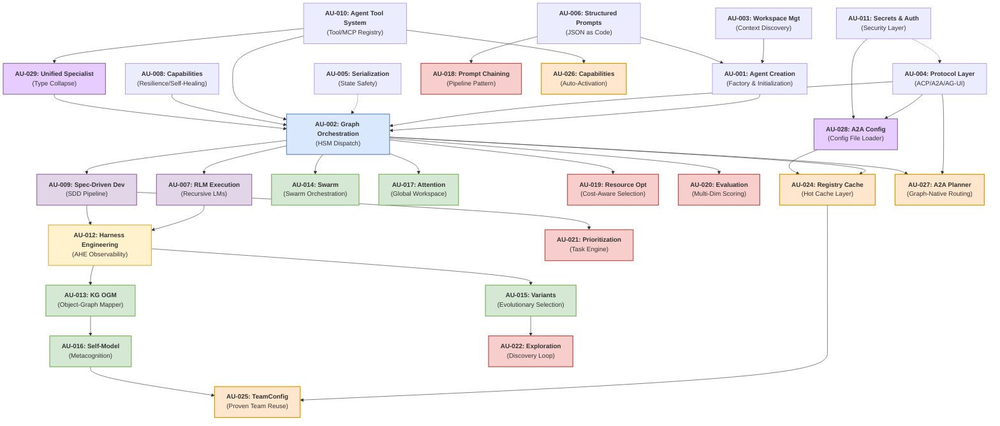
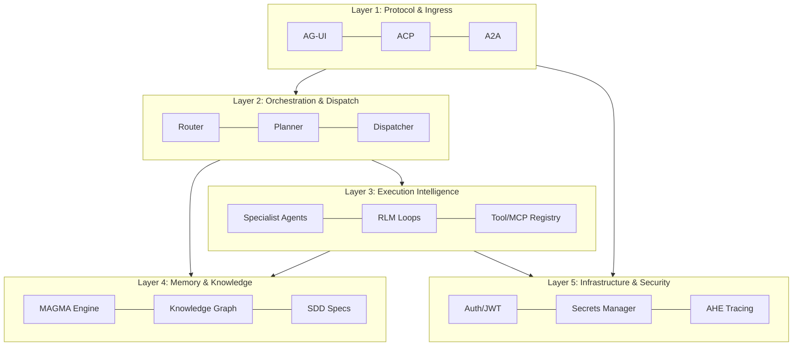

# Agent Utilities Concept Overview

> The **Concept Galaxy** — A high-level orientation of the `agent-utilities` ecosystem. Read this page first to understand how the 29 concepts tie together.

## Concept Galaxy Diagram

The `agent-utilities` architecture is composed of 29 foundational concepts working together.

## Concept Index

| ID | Concept | Summary | Package / Path | Deep-Dive |
|---|---|---|---|---|
| **AU-001** | Agent Creation | Factory patterns for bootstrapping agent contexts, parsing CLI args, and binding to workspaces. | `agent_utilities/agent/` | [creating-an-agent.md](creating-an-agent.md) |
| **AU-002** | Graph Orchestration | The Hierarchical State Machine (HSM) router that dynamically dispatches to specialist sub-agents. | `agent_utilities/graph/` | [architecture.md](architecture.md) |
| **AU-003** | Workspace Mgt | Automatic discovery and parsing of the `workspace.yml` and local file tree for context injection. | `agent_utilities/core/` | [features.md](features.md) |
| **AU-004** | Protocol Layer | Standardized communication interfaces supporting ACP, AG-UI, A2A, and Server-Sent Events (SSE). | `agent_utilities/protocols/` | [architecture.md](architecture.md) |
| **AU-005** | Serialization Safety | Safe handling and truncation of massive Pydantic models during recursive LLM context passing. | `agent_utilities/base_utilities.py` | [architecture.md](architecture.md) |
| **AU-006** | Structured Prompts | Moving away from free-form Markdown to versioned, strict JSON schema prompt blueprints. | `agent_utilities/prompts/` | [structured-prompts.md](structured-prompts.md) |
| **AU-007** | RLM Execution | Recursive Language Model execution — allowing models to spin up sub-shells and self-prompt. | `agent_utilities/rlm/` | [rlm.md](rlm.md) |
| **AU-008** | Capabilities | Cross-cutting resilience patterns including circuit breakers, checkpointing, and stuck-loop recovery. | `agent_utilities/capabilities/` | [capabilities.md](capabilities.md) |
| **AU-009** | Spec-Driven Dev | The `.specify` pipeline that transforms specs into dependency-aware technical execution plans. | `agent_utilities/sdd/` | [sdd.md](sdd.md) |
| **AU-010** | Agent Tool System | The dynamic registry handling standard tools and dynamically loading MCP Server toolsets. | `agent_utilities/tools/` | [tools.md](tools.md) |
| **AU-011** | Secrets & Auth | Secure handling of credentials, JWT token verification, and session delegation across processes. | `agent_utilities/security/` | [secrets-auth.md](secrets-auth.md) |
| **AU-012** | Harness Engineering | Formalized trace distillation, component observation, and prompt evolution mechanisms. | `agent_utilities/harness/` | [AHE_ARCHITECTURE.md](AHE_ARCHITECTURE.md) |
| **AU-013** | KG Object-Graph Mapper | Declarative persistence between Pydantic models and graph backend nodes. | `agent_utilities/knowledge_graph/` | [emergent-architecture.md](emergent-architecture.md) |
| **AU-014** | Swarm Orchestration | Dynamic, recursive sub-agent spawning with affinity-based coalition formation. | `agent_utilities/graph/swarm.py` | [emergent-architecture.md](emergent-architecture.md) |
| **AU-015** | Evolutionary Variants | Parametric mutation and tournament selection for prompt/skill optimization. | `agent_utilities/harness/` | [emergent-architecture.md](emergent-architecture.md) |
| **AU-016** | Persistent Self-Model | Versioned metacognitive self-model with OWL-backed capability awareness. | `agent_utilities/graph/` | [emergent-architecture.md](emergent-architecture.md) |
| **AU-017** | Global Workspace Attention | Competitive broadcast mechanism for ranking specialist proposals. | `agent_utilities/graph/workspace_attention.py` | [emergent-architecture.md](emergent-architecture.md) |
| **AU-018** | Prompt Chaining | Declarative multi-step prompt pipelines with intermediate validation and branching. | `agent_utilities/patterns/prompt_chain.py` | [design-patterns-alignment.md](design-patterns-alignment.md) |
| **AU-019** | Resource Optimization | Cost-aware model selection, per-specialist budget allocation, and latency routing. | `agent_utilities/core/resource_optimizer.py` | [design-patterns-alignment.md](design-patterns-alignment.md) |
| **AU-020** | Evaluation & Monitoring | Multi-dimensional evaluation with LLM-as-Judge rubrics and quality trend analysis. | `agent_utilities/observability/evaluation.py` | [design-patterns-alignment.md](design-patterns-alignment.md) |
| **AU-021** | Task Prioritization | Multi-factor priority scoring with dependency tracking and priority inheritance. | `agent_utilities/patterns/prioritization.py` | [design-patterns-alignment.md](design-patterns-alignment.md) |
| **AU-022** | Exploration & Discovery | Autonomous knowledge gap identification, hypothesis generation, and experiment execution. | `agent_utilities/patterns/exploration.py` | [design-patterns-alignment.md](design-patterns-alignment.md) |
| **AU-024** | Registry Hot Cache | Session-scoped O(1) specialist lookup cache with event-driven invalidation. Reduces prompt bloat to top-7 relevant specialists. | `agent_utilities/graph/config_helpers.py` | [first-principles.md](first-principles.md) |
| **AU-025** | TeamConfig Promotion | Proven specialist coalition templates persisted in the KG. Enables 3-stage hybrid routing: TeamConfig → Self-Model → LLM. | `agent_utilities/knowledge_graph/engine_registry.py` | [first-principles.md](first-principles.md) |
| **AU-026** | AgentCapability System | First-class KG capability nodes with auto-activation, trigger conditions, and dynamic handler binding. | `agent_utilities/models/knowledge_graph.py` | [first-principles.md](first-principles.md) |
| **AU-027** | A2A PlannerGraphSkill | A2A-native routing via graph-backed skill, bypassing LLM orchestration for direct graph planning. | `agent_utilities/protocols/a2a_graph_skill.py` | [first-principles.md](first-principles.md) |
| **AU-028** | A2A Config File | File-based external A2A agent discovery with `secret://` auth, soft-fail health checks, and periodic card re-fetch. | `agent_utilities/protocols/a2a_config.py` | [configuration.md](configuration.md) |
| **AU-029** | Unified Specialist | Collapses the `prompt`/`mcp` agent type distinction into a single `specialist` type that can host any combination of tools and skills. | `agent_utilities/models/mcp.py` | [architecture.md](architecture.md) |

## Query Lifecycle Walkthrough

When a user submits a query, it traverses the system through specific phases:

1. **Protocol Ingress (`protocols/`)**: The query arrives via `/acp`, `/ag-ui`, or `/a2a`. The Protocol Layer normalizes the payload into a standard `GraphState`. For A2A, the `PlannerGraphSkill` (AU-027) may bypass the full pipeline for direct graph execution.
2. **Usage Guard & Validation (`security/`)**: Validates rate limits, security constraints, and ensures the user has authorization (AU-011).
3. **TeamConfig Check (`knowledge_graph/engine_registry.py`)**: Before invoking the LLM, the router checks for a matching `TeamConfig` (AU-025) — a proven specialist coalition from a previous successful execution. If found, the system skips LLM planning and dispatches the team directly.
4. **Router (`graph/steps.py`)**: If no TeamConfig matches, a lightweight evaluation model determines the topological path. The **Registry Hot Cache** (AU-024) provides a filtered list of only the top-7 relevant specialists to reduce prompt bloat. The Self-Model (AU-016) biases specialist selection toward historically successful domains.
5. **Memory Injection (`knowledge_graph/`)**: The system queries the Knowledge Graph for contextual memories (Semantic, Temporal, Causal) and injects them into the state.
6. **Capability Activation (`graph/executor.py`)**: Before execution, the system checks for `AgentCapabilityNode` entries (AU-026) with `auto_activate=true` and activates them if trigger conditions are met (e.g., RLM for large inputs, critic for code tasks).
7. **Dispatcher (`graph/runner.py`)**: The orchestration engine spawns necessary Specialist Superstates in parallel (Python Coder, DevOps, Architect). **WorkspaceAttention** (AU-017) scores rank specialists by relevance, track record, and confidence.
8. **Execution (`tools/` & `rlm/`)**: Specialists interact with MCP servers or invoke their own recursive REPL loops to gather data and write code.
9. **Verification & Feedback (`graph/verification.py`)**: The results are passed to a Verifier. If the quality score is `< 0.7`, it's fed back to the Dispatcher with a textual gradient for self-correction. On success, the **Self-Model** is updated with session outcomes, and the specialist coalition is recorded as a **TeamConfig reward** (AU-025). Both updates trigger **cache invalidation** (AU-024).
10. **Synthesis & Persistence**: The final result is composed into Markdown, and the trace of the execution is persisted back to the Knowledge Graph for future Agentic Harness Engineering (AU-012) review.

## Layered Architecture

## Package Map

With the recent modularization, `agent_utilities` is organized as follows:

- **`agent_utilities/core/`**: Workspace injection, core exceptions, and fundamental decorators.
- **`agent_utilities/agent/`**: Factory methods and setup logic for instantiating the unified graphs.
- **`agent_utilities/graph/`**: The Pydantic-Graph state machine definitions, steps, and unified runners.
- **`agent_utilities/protocols/`**: Adapters for ACP, AG-UI, and A2A.
- **`agent_utilities/security/`**: JWT validation, CORS, and secrets management.
- **`agent_utilities/server/`**: The FastAPI routers that bind everything to network interfaces.
- **`agent_utilities/prompts/`**: The catalog of JSON schema blueprints.
- **`agent_utilities/tools/`**: The 18 tool modules spanning multiple capabilities.
- **`agent_utilities/mcp/`**: Specific wrappers for communicating with FastMCP sub-processes.
- **`agent_utilities/rlm/`**: Recursive Language Model specialized environments.
- **`agent_utilities/sdd/`**: Spec-Driven Development pipelines.
- **`agent_utilities/harness/`**: The Agentic Harness Engineering toolkit.
- **`agent_utilities/knowledge_graph/`**: The massive graph intelligence backend bridging LPGs and OWL.

## Backend Matrix

The framework abstracts heavy persistence mechanisms behind a standardized set of interfaces:

| Subsystem | Primary Backend | Alternatives | Configuration Variable |
|---|---|---|---|
| **LLM Provider** | OpenAI | Anthropic, Groq, local | `PROVIDER` / `MODEL_ID` |
| **Knowledge Graph** | LadybugDB (Embedded) | FalkorDB, Neo4j | `GRAPH_BACKEND` |
| **OWL Reasoning** | Stardog | HermiT (Local Java) | `OWL_BACKEND` |
| **Secrets Engine** | In-Memory | SQLite, HashiCorp Vault | `SECRETS_BACKEND` |
