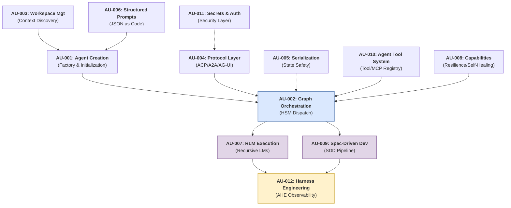
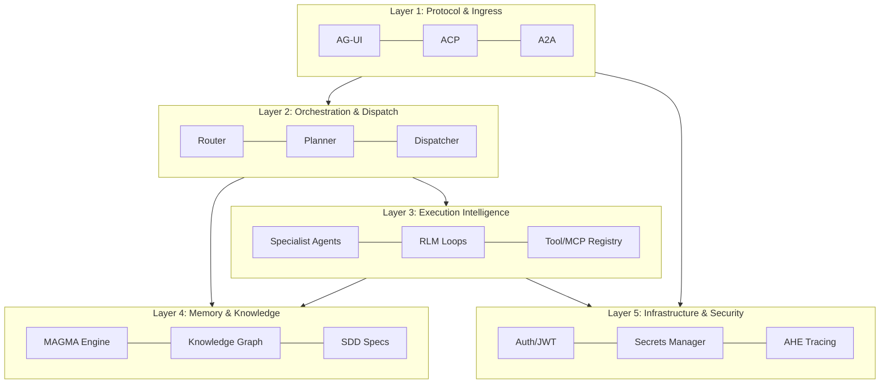

# Agent Utilities Concept Overview

> The **Concept Galaxy** — A high-level orientation of the `agent-utilities` ecosystem. Read this page first to understand how the components tie together.

## Concept Galaxy Diagram

The `agent-utilities` architecture is composed of 12 foundational concepts working together.

## Concept Index

| ID | Concept | Summary | Package / Path | Deep-Dive |
|---|---|---|---|---|
| **AU-001** | Agent Creation | Factory patterns for bootstrapping agent contexts, parsing CLI args, and binding to workspaces. | `agent_utilities/agent/` | [creating-an-agent.md](creating-an-agent.md) |
| **AU-002** | Graph Orchestration | The Hierarchical State Machine (HSM) router that dynamically dispatches to specialist sub-agents. | `agent_utilities/graph/` | [architecture.md](architecture.md) |
| **AU-003** | Workspace Mgt | Automatic discovery and parsing of the `workspace.yml` and local file tree for context injection. | `agent_utilities/core/` | [features.md](features.md) |
| **AU-004** | Protocol Layer | Standardized communication interfaces supporting ACP, AG-UI, A2A, and Server-Sent Events (SSE). | `agent_utilities/protocols/` | [architecture.md](architecture.md) |
| **AU-005** | Serialization Safety | Safe handling and truncation of massive Pydantic models during recursive LLM context passing. | `agent_utilities/base_utilities.py` | [architecture.md](architecture.md) |
| **AU-006** | Structured Prompts | Moving away from free-form Markdown to versioned, strict JSON schema prompt blueprints. | `agent_utilities/prompts/` | [structured-prompts.md](structured-prompts.md) |
| **AU-007** | RLM Execution | Recursive Language Model execution — allowing models to spin up sub-shells and self-prompt. | `agent_utilities/rlm/` | [rlm.md](rlm.md) |
| **AU-008** | Capabilities | Cross-cutting resilience patterns including circuit breakers, checkpointing, and stuck-loop recovery. | `agent_utilities/capabilities/` | [capabilities.md](capabilities.md) |
| **AU-009** | Spec-Driven Dev | The `.specify` pipeline that transforms specs into dependency-aware technical execution plans. | `agent_utilities/sdd/` | [sdd.md](sdd.md) |
| **AU-010** | Agent Tool System | The dynamic registry handling standard tools and dynamically loading MCP Server toolsets. | `agent_utilities/tools/` | [tools.md](tools.md) |
| **AU-011** | Secrets & Auth | Secure handling of credentials, JWT token verification, and session delegation across processes. | `agent_utilities/security/` | [secrets-auth.md](secrets-auth.md) |
| **AU-012** | Harness Engineering | Formalized trace distillation, component observation, and prompt evolution mechanisms. | `agent_utilities/harness/` | [AHE_ARCHITECTURE.md](AHE_ARCHITECTURE.md) |

## Query Lifecycle Walkthrough

When a user submits a query, it traverses the system through specific phases:

1. **Protocol Ingress (`protocols/`)**: The query arrives via `/acp`, `/ag-ui`, or `/a2a`. The Protocol Layer normalizes the payload into a standard `GraphState`.
2. **Usage Guard & Validation (`security/`)**: Validates rate limits, security constraints, and ensures the user has authorization (AU-011).
3. **Router (`graph/steps.py`)**: A lightweight evaluation model determines the topological path. Is it trivial? Does it require research? (AU-002).
4. **Memory Injection (`knowledge_graph/`)**: The system queries the Knowledge Graph for contextual memories (Semantic, Temporal, Causal) and injects them into the state.
5. **Dispatcher (`graph/runner.py`)**: The orchestration engine spawns necessary Specialist Superstates in parallel (Python Coder, DevOps, Architect).
6. **Execution (`tools/` & `rlm/`)**: Specialists interact with MCP servers or invoke their own recursive REPL loops to gather data and write code.
7. **Verification (`harness/verifier.py`)**: The results are passed to a Verifier. If the quality score is `< 0.7`, it's fed back to the Dispatcher with a textual gradient for self-correction.
8. **Synthesis & Persistence**: The final result is composed into Markdown, and the trace of the execution is persisted back to the Knowledge Graph for future Agentic Harness Engineering (AU-012) review.

## Layered Architecture

## Package Map

With the recent modularization, `agent_utilities` is organized as follows:

- **`agent_utilities/core/`**: Workspace injection, core exceptions, and fundamental decorators.
- **`agent_utilities/agent/`**: Factory methods and setup logic for instantiating the unified graphs.
- **`agent_utilities/graph/`**: The Pydantic-Graph state machine definitions, steps, and unified runners.
- **`agent_utilities/protocols/`**: Adapters for ACP, AG-UI, and A2A.
- **`agent_utilities/security/`**: JWT validation, CORS, and secrets management.
- **`agent_utilities/server/`**: The FastAPI routers that bind everything to network interfaces.
- **`agent_utilities/prompts/`**: The catalog of JSON schema blueprints.
- **`agent_utilities/tools/`**: The 18 tool modules spanning multiple capabilities.
- **`agent_utilities/mcp/`**: Specific wrappers for communicating with FastMCP sub-processes.
- **`agent_utilities/rlm/`**: Recursive Language Model specialized environments.
- **`agent_utilities/sdd/`**: Spec-Driven Development pipelines.
- **`agent_utilities/harness/`**: The Agentic Harness Engineering toolkit.
- **`agent_utilities/knowledge_graph/`**: The massive graph intelligence backend bridging LPGs and OWL.

## Backend Matrix

The framework abstracts heavy persistence mechanisms behind a standardized set of interfaces:

| Subsystem | Primary Backend | Alternatives | Configuration Variable |
|---|---|---|---|
| **LLM Provider** | OpenAI | Anthropic, Groq, local | `PROVIDER` / `MODEL_ID` |
| **Knowledge Graph** | LadybugDB (Embedded) | FalkorDB, Neo4j | `GRAPH_BACKEND` |
| **Document Storage**| SQLite | MongoDB, PostgreSQL | `DOC_BACKEND` |
| **OWL Reasoning** | Stardog | HermiT (Local Java) | `OWL_BACKEND` |
| **Secrets Engine** | In-Memory | SQLite, HashiCorp Vault | `SECRETS_BACKEND` |
