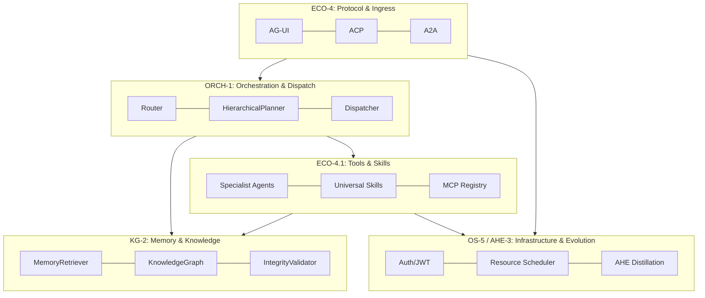

# Agent Utilities Concept Overview

> The **Concept Galaxy** — A high-level orientation of the `agent-utilities` ecosystem. The ecosystem has been ontologically compressed from 60+ flat concepts into **5 Unified Pillars** to reduce cognitive load and enhance native synergies.

## The 5 Unified Pillars Architecture

```mermaid
graph TD
    %% Pillar 1: Graph Orchestration Engine
    subgraph P1 [Pillar 1: Graph Orchestration Engine]
        ORCH10["<b>ORCH-1.0: Unified Intelligence Graph</b>"]
        ORCH11["<b>ORCH-1.1: Recursive HTN Planning</b>"]
        ORCH12["<b>ORCH-1.2: Specialist Routing</b>"]
        ORCH13["<b>ORCH-1.3: Execution & State Safety</b>"]
        ORCH14["<b>ORCH-1.4: Swarm Preset Template Engine</b>"]
        ORCH15["<b>ORCH-1.5: Multi-Level Abstraction Layering</b>"]
    end

    %% Pillar 2: Epistemic Knowledge Graph
    subgraph P2 [Pillar 2: Epistemic Knowledge Graph]
        KG20["<b>KG-2.0: Active Knowledge Graph</b>"]
        KG21["<b>KG-2.1: Tiered Memory & Rationale</b>"]
        KG22["<b>KG-2.2: Ontology & Epistemics</b>"]
        KG23["<b>KG-2.3: Graph Integrity & Fingerprinting</b>"]
        KG24["<b>KG-2.4: Inductive Knowledge Hypergraphs</b>"]
        KG25["<b>KG-2.5: Topological Partitioning</b>"]
        KG26["<b>KG-2.6: Financial Trading Pipeline</b>"]
        KG27["<b>KG-2.7: Risk Scoring Ontology</b>"]
    end

    %% Pillar 3: Agentic Harness Engineering
    subgraph P3 [Pillar 3: Agentic Harness Engineering]
        AHE30["<b>AHE-3.0: Agentic Harness</b>"]
        AHE31["<b>AHE-3.1: Evaluation & Distillation</b>"]
        AHE32["<b>AHE-3.2: Evolution & Discovery</b>"]
        AHE33["<b>AHE-3.3: Team & Synergy Optimization</b>"]
        AHE34["<b>AHE-3.4: Distributed Agentic Evolution</b>"]
        AHE35["<b>AHE-3.5: Continual Learning & Experience</b>"]
        AHE36["<b>AHE-3.6: Temporal Drift & EWC Consolidation</b>"]
        AHE37["<b>AHE-3.7: Heavy Thinking Orchestration</b>"]
        AHE38["<b>AHE-3.8: Backtest Evaluation Harness</b>"]
        AHE39["<b>AHE-3.9: Horizon-Aware Task Curriculum</b>"]
        AHE310["<b>AHE-3.10: Decomposed Reward Signals</b>"]
    end

    %% Pillar 4: Ecosystem & Peripherals
    subgraph P4 [Pillar 4: Ecosystem & Peripherals]
        ECO40["<b>ECO-4.0: Unified Tool Interface</b>"]
        ECO41["<b>ECO-4.1: MCP & Universal Skills</b>"]
        ECO42["<b>ECO-4.2: A2A Network & Consensus</b>"]
        ECO43["<b>ECO-4.3: Community Telemetry</b>"]
        ECO44["<b>ECO-4.4: Market Data Connector Protocol</b>"]
    end

    %% Pillar 5: Agent OS Infrastructure
    subgraph P5 [Pillar 5: Agent OS Infrastructure]
        OS50["<b>OS-5.0: Agent OS Kernel</b>"]
        OS51["<b>OS-5.1: Security & Auth</b>"]
        OS52["<b>OS-5.2: Resource Scheduling</b>"]
        OS53["<b>OS-5.3: Session Concurrency Mgmt</b>"]
    end

    %% Relationships
    P1 <--> P2
    P1 --> P4
    P3 --> P1
    P5 --> P1

    style P1 fill:#dae8fe,stroke:#6c8ebf,stroke-width:2px
    style P2 fill:#d5e8d4,stroke:#82b366,stroke-width:2px
    style P3 fill:#fff2cc,stroke:#d6b656,stroke-width:2px
    style P4 fill:#e6ccff,stroke:#9673a6,stroke-width:2px
    style P5 fill:#cce5ff,stroke:#004085,stroke-width:2px
```

## Concept Index

| Pillar | Sub-Concept | Description | Path |
|---|---|---|---|
| **ORCH-1.0** | Unified Intelligence Graph | The core hierarchical state machine (HSM) router that dynamically dispatches to specialist sub-agents. | `agent_utilities/graph/runner.py` |
| ORCH-1.1 | Recursive HTN Planning | Integrates LATS, Wide-Search, and Conductor logic into a single cohesive hierarchical planner. | `agent_utilities/graph/hierarchical_planner.py` |
| ORCH-1.2 | Specialist Routing | Confidence gating, capability activation, and unified specialist definitions. | `agent_utilities/graph/specialists.py` |
| ORCH-1.3 | Execution & State Safety | Cost Governors, Execution Budgets, and payload truncation for context scaling. | `agent_utilities/graph/routing.py` |
| **KG-2.0** | Active Knowledge Graph | Object-Graph Mapper persisting Pydantic models directly into the graph backend. | `agent_utilities/knowledge_graph/engine.py` |
| KG-2.1 | Tiered Memory & Rationale | Unified Working/Episodic/Semantic memory tracking and Quiet-STaR rationale persistence. | `agent_utilities/knowledge_graph/memory_retriever.py` |
| KG-2.2 | Ontology & Epistemics | Schema packs, MAGMA entity-claim extraction, and context-aware multi-hop embeddings. | `agent_utilities/models/knowledge_graph.py` |
| KG-2.3 | Graph Integrity & Fingerprinting | Abstract syntax tree fingerprinting and structural impact analysis. | `agent_utilities/knowledge_graph/fingerprint.py` |
| KG-2.4 | Inductive Knowledge Hypergraphs & Trace Distillation | Positional Interaction Encoding (EncPI) and Offline/Async Trace Compression into generalized PreferenceNode and PrincipleNode elements. | `agent_utilities/knowledge_graph/hypergraph.py`, `agent_utilities/knowledge_graph/trace_distiller.py` |
| KG-2.5 | Topological Mincut Partitioning | Dynamic Louvain partitioning with Label Propagation fallback to identify emergent topological clusters and communities. | `agent_utilities/knowledge_graph/topological_partition.py` |
| **AHE-3.0** | Agentic Harness | Core infrastructure for prompt evolution, testing, and continuous agent improvement. | `agent_utilities/harness/` |
| AHE-3.1 | Evaluation & Distillation | Automated LLM-as-judge rubrics and orchestrator trace distillation. | `agent_utilities/harness/trace_distiller.py` |
| AHE-3.2 | Evolution & Discovery | Parametric mutation, tournament selection, and autonomous knowledge discovery. | `agent_utilities/harness/variant_pool.py` |
| AHE-3.3 | Team & Synergy Optimization | Tracks multi-model combinations and promotes successful specialized teams. | `agent_utilities/knowledge_graph/engine_registry.py` |
| AHE-3.4 | Distributed Agentic Evolution | Autonomous skill synthesis, community telemetry tracking, and upstream PR generation via `genius-agent`. | `universal_skills/` |
| AHE-3.5 | Continual Learning & Experience | Experience distillation via cross-rollout critique (CONCEPT:AHE-3.5), decomposed context retrieval (CONCEPT:AHE-3.5), and Memory-Aware Test-Time Scaling (CONCEPT:AHE-3.5). | `agent_utilities/graph/verification.py` |
| AHE-3.6 | Temporal Drift & EWC Consolidation | Tracks knowledge drift via cosine distance/coefficient of variation and applies Elastic Weight Consolidation (EWC++) to prevent catastrophic forgetting (CONCEPT:AHE-3.6). | `agent_utilities/knowledge_graph/ewc.py` |
| AHE-3.7 | Heavy Thinking Orchestration | Two-stage parallel-then-deliberate reasoning pipeline with tiered complexity gating, trajectory pruning/shuffling, iterative refinement, and KG-native trajectory persistence (CONCEPT:AHE-3.7). | `agent_utilities/graph/heavy_thinking.py` |
| **ECO-4.0** | Unified Tool Interface | Dynamic registry for tools, ecosystem tour mapping, and domain routing. | `agent_utilities/tools/` |
| ECO-4.1 | MCP & Universal Skills | Discovery mechanisms collapsing local Python skills and MCP Servers. | `agent_utilities/mcp/` |
| ECO-4.2 | A2A Network & Consensus | Byzantine Fault Tolerance across independent agent instances via JSON-RPC. | `agent_utilities/protocols/a2a.py` |
| ECO-4.3 | Community Telemetry | Origin tracking, deterministic identifiers, and author tagging for distributed hive-mind capability merging. | `agent_utilities/models/knowledge_graph.py` |
| **OS-5.0** | Agent OS Kernel | Workspace management, automated initialization, file watching, and package registry. | `agent_utilities/core/workspace.py` |
| OS-5.1 | Security & Auth | Permissions Kernel and JWT-based session security. | `agent_utilities/security/permissions_kernel.py` |
| OS-5.2 | Resource Scheduling | Cognitive Scheduler, cron maintenance, and API homeostatic downgrading. | `agent_utilities/core/cognitive_scheduler.py` |
| OS-5.3 | Session Concurrency Management | Distributed request queuing, interrupt mapping, and double-texting concurrency control (enqueue/reject/interrupt/rollback). | `agent_utilities/server/concurrency.py` |
| **KG-2.6** | **Financial Trading Pipeline** | FIBO-aligned KG primitives for the full trading lifecycle: Signal → Order → Position → Portfolio → Strategy. OWL-promoted with transitive provenance chains. | `agent_utilities/models/knowledge_graph.py` |
| **ECO-4.4** | **Market Data Connector Protocol** | Generic `DataConnectorProtocol` with auto-fallback chain, rate-limit awareness, and immutable `DataFetchRecordNode` provenance tracking. | `agent_utilities/protocols/data_connector.py` |
| **ORCH-1.4** | **Swarm Preset Template Engine** | YAML-driven declarative multi-agent workflow engine with DAG topological sort, cycle detection, parallel dispatch identification, and variable substitution. | `agent_utilities/graph/swarm_preset.py` |
| **ORCH-1.5** | **Multi-Level Abstraction Layering** | Planners emit coarse-grained abstraction steps and delegate fine-grained execution to specialist nodes, reducing upfront planning token overhead. | `agent_utilities/graph/hierarchical_planner.py` |
| **KG-2.7** | **Risk Scoring Ontology** | Domain-agnostic risk assessment with `RiskAssessmentNode`, `RiskFactorNode`, `RiskMitigationNode`. OWL `propagatesRiskTo` enables transitive upstream risk chain inference. | `agent_utilities/models/knowledge_graph.py` |
| **AHE-3.8** | **Backtest Evaluation Harness** | Strategy evaluation harness with SQLite storage, walk-forward validation windows, benchmark comparison, and KG integration via `BacktestRunNode`/`BacktestMetricNode`. | `agent_utilities/harness/backtest_harness.py` |
| **AHE-3.9** | **Horizon-Aware Task Curriculum** | Progressive horizon scheduling with macro-action composition, subgoal checkpoints, and configurable promotion policies (threshold/plateau/adaptive). Based on Long-Horizon Training research (CONCEPT:AHE-3.9). | `agent_utilities/graph/horizon_curriculum.py` |
| **AHE-3.10** | **Decomposed Reward Signals** | Separates step-level reward (local constraint satisfaction) from trajectory-level reward (goal achievement) for accurate credit assignment. Feeds into ExperienceNode distillation (CONCEPT:AHE-3.10). | `agent_utilities/graph/reward_decomposition.py` |

## Agent OS Architecture

The Agent OS is a multi-subsystem architecture where the **Active Knowledge Graph (KG-2.0)** drives all tool discovery and routing across cooperating packages:

### OS Subsystems (auto-installed)

| Subsystem | Package | Role |
|:---|:---|:---|
| 🧠 **Kernel** | `agent-utilities` | Models, logic, graph orchestration, KG, default catalog |
| ⚙️ **OS Layer** | `systems-manager` | Host OS operations + Agent OS MCP wrappers (23+ tools) |
| 📦 **Container Runtime** | `container-manager-mcp` | Docker/Podman lifecycle, multi-endpoint, specialist deploy (60+ tools) |
| 🌐 **Network Stack** | `tunnel-manager` | SSH tunnels, remote exec, file transfer, host inventory (43 tools) |
| 📂 **Workspace** | `repository-manager` | Git workspace mgmt, project lifecycle, dependency graphs (24 tools) |

### Deployment Patterns

`agent-utilities` acts as the lightweight **Agent OS Kernel** operating entirely in the background. Because expensive operations (LLM Inference, massive vector DBs, Neo4j persistence) are typically offloaded to external endpoints or lightweight local variants (like SQLite/NetworkX), the local resource footprint of the system is extremely small (~100-200MB RAM), enabling it to run seamlessly on edge devices like a Raspberry Pi.

The primary user-facing frontend is **`genius-agent`** (located in `agent-packages/agents/genius-agent`). It acts as the Orchestrator UI:
1. `genius-agent` mounts all MCP tools and `universal-skills`.
2. It invokes `agent-utilities` in the backend to intelligently route tasks, plan recursive actions, and maintain the Knowledge Graph.
3. It utilizes the lightweight mathematical logic in `agent-utilities` (like `numpy` for EWC diagonal proxies or `networkx` for Louvain partitioning) instantly, without requiring massive hardware overhead.

## Query Lifecycle Walkthrough

When a user submits a query, it traverses the system through specific phases natively aligned to the 5 Pillars:

1. **Protocol Ingress (`ECO-4.0`)**: The query arrives via `/acp`, `/ag-ui`, or `/a2a`. The payload is normalized.
2. **Usage Guard & Validation (`OS-5.1`)**: Validates rate limits, execution budgets (`ORCH-1.3`), and ensures the user has authorization.
3. **TeamConfig Check (`AHE-3.3`)**: The router checks the KG for a proven specialist coalition from a previous successful execution.
4. **Hierarchical Planner (`ORCH-1.1`)**: Determines the topological path via HTN goal decomposition and LATS fallback logic.
5. **Memory Injection (`KG-2.1`)**: The unified `MemoryRetriever` fetches Virtual Context Blocks and Quiet-STaR rationales to enrich the prompt.
6. **Dispatcher (`ORCH-1.0`)**: Spawns necessary Specialist Superstates in parallel.
7. **Execution (`ECO-4.1`)**: Specialists interact with MCP servers or Universal Skills to gather data and write code.
8. **Verification & Feedback (`AHE-3.1`)**: Results are verified. If the quality score is `< 0.7`, it feeds back to the Planner. On success, the **Self-Model** is updated and the coalition is rewarded.
9. **Synthesis & Persistence (`KG-2.0`)**: Final results are composed, and traces/evaluations are natively stored into the Knowledge Graph for ongoing continuous improvement.

## Layered Architecture

