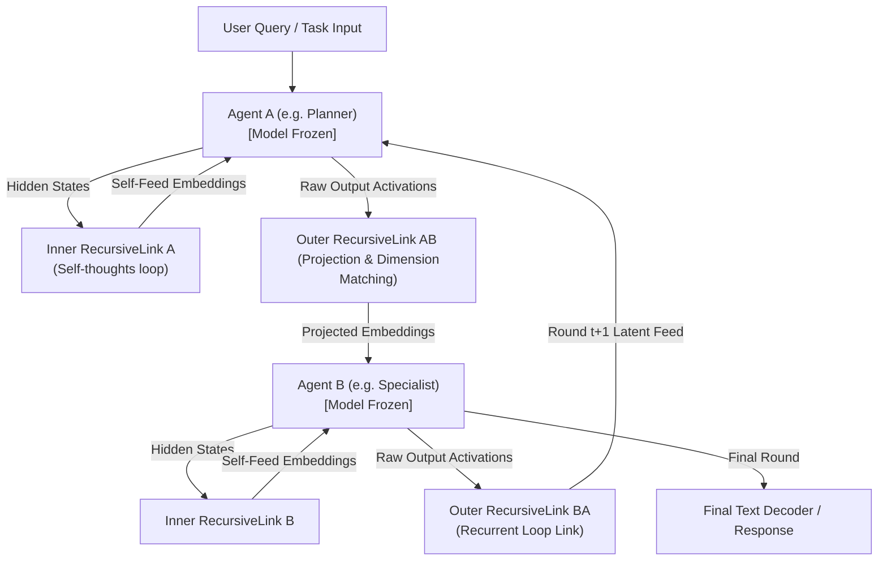
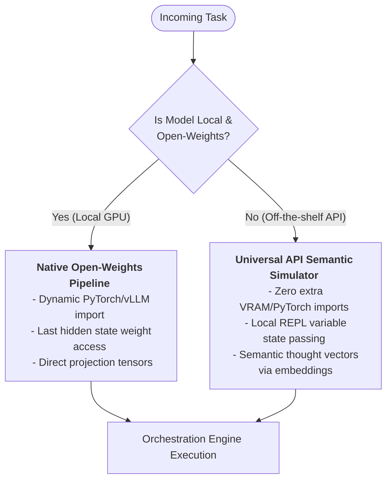

# Pillar 1: Graph Orchestration Engine

## Overview

The **Graph Orchestration Engine** represents the foundational execution layer of the `agent-utilities` ecosystem. Moving away from rigid LLM chains and monolithic prompt contexts, this pillar implements a Hierarchical Task Network (HTN) backed by Pydantic Graph, transitioning linear execution into dynamic, topological routing.

## Why We Built This (Rationale)

As our agent ecosystem scaled to include dozens of domain specialists (Python, TS, CI/CD, DB) and hundreds of MCP tools, we encountered three critical failure modes:
1. **Prompt Bloat & Context Pollution**: Injecting all available tools into a single prompt exceeded context limits and degraded LLM reasoning accuracy.
2. **Sequential Bottlenecks**: Large features were executed linearly, squandering the opportunity for parallel discovery and implementation.
3. **Catastrophic Forgetting & Loop Cycles**: Agents would forget successful tool combinations or fall into infinite retry loops without an enforced architectural guardrail.

## How It Works (Implementation)

The architecture solves these bottlenecks through several interdependent primitives:

### Registry Hot Cache & Unified Specialists (ORCH-1.2)
We collapsed the artificial boundary between `prompt` and `mcp` agents into a singular `specialist` type. The **Registry Hot Cache** maintains an O(1) session-scoped index of these specialists. Instead of passing 50+ specialists to the orchestrator, it filters down to the Top-7 relevant specialists per query, reducing prompt token bloat by ~7x.

### Spec-Driven Development Pipeline (ORCH-1.7)
The orchestrator implements a multi-stage SDD pipeline:
- **Discovery & Requirements**: Generates structured `Spec` models with measurable success criteria.
- **Task Decomposition**: Emits a `Tasks` dependency graph, identifying which subtasks can be executed in parallel (e.g., frontend and backend).
- **Parallel Dispatch**: Fuses tasks out to specific `specialist` workers, leveraging the `Execution Visibility Graph` to constrain context so a backend specialist only sees backend-related prior steps.

### Learned Agent Routing & Execution Budgets (ORCH-1.8 & ORCH-1.3)
Routing isn't static. `TraceLearnedPolicy` uses softmax scoring over historical `ExecutionTrace` records with an exponential moving average (EMA) to actively down-weight specialists with low success rates. `ExecutionBudget` acts as an absolute cost governor, preempting infinite loops by enforcing USD/token constraints at the dispatcher step.

## Benefits Introduced

- **Cost Efficiency**: By utilizing `Confidence-Gated Model Routing`, trivial queries fallback to smaller models (`gpt-4o-mini`), saving reasoning tokens for complex HTN planning.
- **Architectural Safety**: `Subagent Lifecycle Patterns` and recursive execution constraints ensure the system fails gracefully and retries contextually rather than spinning in infinite loops.
- **Test-Time Scaling**: The system achieves zero-shot generalization by spawning parallel agent rollouts and selecting the optimal path via dynamic subgraph convergence and evolutionary aggregation.

## Key Concepts Leveraged
- **ORCH-1.0**: Dynamic Subgraph Orchestrator
- **ORCH-1.1**: Agentic Planning Engine (Planning)
- **ORCH-1.2**: Agentic Planning Engine (Routing)
- **ORCH-1.3**: Execution Budgets & State Safety
- **ORCH-1.7**: Spec-Driven Development
- **ORCH-1.8**: Learned Agent Routing
- **ORCH-1.19**: Subgraph Synthesis (Legacy Compat)
- **ORCH-1.20**: KG-Driven Graph Factory — materializes pydantic-graph topologies from AgentTemplate nodes
- **ORCH-1.21**: Agent Runner — KG-to-LLM execution bridge with dynamic tool binding and provenance tracking
- **ORCH-1.22**: RecursiveMAS Latent Orchestrator 🔬 — continuous latent loop or simulated semantic collaboration


## 🧬 First Principles Architecture

The **First Principles Architecture** (CONCEPT:ORCH-1.2 through CONCEPT:ECO-4.0) rewires the routing, dispatch, and feedback layers from basic primitives. These four concepts solve the key scalability and intelligence bottlenecks that emerge when managing dozens of specialists and hundreds of tools.

| Concept | Problem Solved | Solution |
|:--------|:--------------|:---------|
| **CONCEPT:ORCH-1.2: Registry Hot Cache** | O(N) specialist lookups on every routing call | Session-scoped cache with O(1) lookups, event-driven invalidation |
| **CONCEPT:AHE-3.3: TeamConfig Promotion** | LLM re-discovers same specialist teams for recurring patterns | Persist proven coalitions as reusable templates in the KG |
| **CONCEPT:ORCH-1.2: AgentCapability System** | Static tool bindings; no dynamic capability activation | First-class KG capability nodes with trigger conditions |
| **CONCEPT:ECO-4.0: PlannerGraphSkill** | A2A requests require full LLM round-trip | Direct graph-backed A2A routing, bypassing LLM overhead |
| **CONCEPT:ECO-4.0: A2A Config File** | No mechanism to discover/register external A2A agents | File-based auto-discovery with `secret://` auth & periodic refresh |
| **CONCEPT:ORCH-1.2: Unified Specialist** | Artificial `prompt`/`mcp` type split complicates dispatch | Single `specialist` type hosting any tools/skills combination |

```mermaid
graph LR
    subgraph Routing ["3-Stage Hybrid Routing"]
        Query([ORCH-1.0: User Query]) --> TC{"ORCH-1.2: TeamConfig\nMatch?"}
        TC -- "Hit" --> Dispatch["ORCH-1.2: Direct\nDispatch"]
        TC -- "Miss" --> SM{"AHE-3.3: Self-Model\nBias"}
        SM --> LLM["ORCH-1.1: LLM Planner\n(Top-7 Filtered)"]
        LLM --> Dispatch
    end

    subgraph Execution ["Execute & Learn"]
        Dispatch --> Exec["ORCH-1.2: Specialist\nExecution"]
        Exec --> ORCH-1.3: Verify["Verify"]
        Verify --> Feedback["ORCH-1.2: Self-Model Update\n+ TeamConfig Reward"]
        Feedback -.-> TC
    end
```

→ **Deep-dive**: [docs/first-principles.md](docs/pillars/1_graph_orchestration/first-principles.md) · [docs/registry-cache.md](docs/pillars/1_graph_orchestration/registry-cache.md) · [docs/process-lifecycle.md](docs/pillars/5_agent_os_infrastructure/process-lifecycle.md)

## Architecture & Orchestration Overview

| `adguard-home-agent` | Graph |
| `agent-utilities` | Library | Production-grade Orchestration. Supports Parallel execution, Real-time sub-agent streaming, High-fidelity observability, and Session Resumability |
| `agent-webui` | Library | Cinematic Graph Activity Visualization. |
| `agent-terminal-ui` | Library | High-performance Terminal User Interface (TUI) achieving feature parity with **Claude Code** (Slash commands, Keyboard shortcuts, File mentions). |

`agent-utilities` implements a multi-stage execution pipeline using `pydantic-graph` for maximum precision and resilience. Protocol adapters (AG-UI, ACP) leverage `graph.iter()` for direct, step-by-step graph execution — bypassing the outer LLM agent entirely when a graph is present.

### Spec-Driven Development (SDD) Lifecycle

`agent-utilities` implements a rigorous SDD workflow to ensure that complex feature requests are handled with absolute technical fidelity and measurable success criteria.

1.  **Project Constitution** (`constitution-generator`): Establishes the governing principles, tech stack standards, and quality gates for the entire agent workshop.
2.  **Requirement Specification** (`spec-generator`): Decomposes user intent into a formal `Spec` including user scenarios, functional requirements, and measurable success metrics.
3.  **Technical Implementation Plan** (`task-planner`): Generates a step-by-step architectural approach and a `Tasks` model with explicit dependencies and file-path affinity for collision-free parallel execution.
4.  **Baseline & Manual Testing**: Integrates `first_run_tests` and `run_manual_test` into the implementation phase to ensure baseline stability and exploratory verification.
5.  **Parallel Execution** (`SDDManager`): The `dispatcher` leverages the SDD analysis engine to identify safe parallel execution batches, fanning out implementation tasks to domain specialists (Python, TS, etc.).
6.  **Quality Verification & Documentation**: Audits results via `spec-verifier`, then generates `code-walkthrough` and `interactive-explain` artifacts to document the final implementation.

### Execution Flow: Dynamic Multi-Layer Parallelism
`agent-utilities` implements a multi-stage execution pipeline with **autonomous gap analysis** and **resilient feedback loops**. The system can "fan out" research tasks in parallel before coalescing results. If implementation fails, it can automatically retry locally or loop back to research.

```mermaid
  graph TB
  Start([ORCH-1.0: User Query + Images]) --> ACPLayer["<b>ACP / AG-UI / SSE </b><br/><i>(Unified Protocol Layer)</i>"]
  ACPLayer --> UsageGuard[ORCH-1.3: Usage Guard: Rate Limiting]
  UsageGuard -- "Allow" --> router_step[ORCH-1.2: Router: Topology Selection]
  UsageGuard -- "Block" --> End([ORCH-1.21: End Result])

  router_step -- "Trivial Query" --> End
  router_step -- "Full Pipeline" --> dispatcher[ORCH-1.0: Dispatcher: Dynamic Routing]
  dispatcher -- "First Entry" --> mem_step[KG-2.3: Memory: Context Retrieval]
  mem_step --> dispatcher[ORCH-1.0: Dispatcher: Dynamic Routing]

  subgraph "ORCH-1.2: Discovery Phase"
    direction TB
    Researcher["<b>Researcher</b><br/>---<br/><i>u-skill:</i> web-search, web-crawler, web-fetch<br/><i>t-tool:</i> project_search, read_workspace_file"]
    Architect["<b>Architect</b><br/>---<br/><i>u-skill:</i> c4-architecture, spec-generator, product-strategy, user-research, brainstorming<br/><i>t-tool:</i> developer_tools"]
    KGDiscovery["<b>Unified Discovery</b><br/>---<br/><i>source:</i> Knowledge Graph<br/>"]
    res_joiner[ORCH-1.0: Research Joiner: Barrier Sync]
  end

  dispatcher -- "Research First" --> Researcher
  dispatcher -- "Research First" --> Architect
  dispatcher -- "Research First" --> KGDiscovery
  Researcher --> res_joiner
  Architect --> res_joiner
  KGDiscovery --> res_joiner
  res_joiner -- "Coalesced Context" --> dispatcher

  subgraph "Execution Phase"
    direction TB

    subgraph "Programmers"
      direction LR
      PyP["<b>Python</b><br/>---<br/><i>u-skill:</i> agent-builder, tdd-methodology, mcp-builder, jupyter-notebook<br/><i>g-skill:</i> python-docs, fastapi-docs, pydantic-ai-docs<br/><i>t-tool:</i> developer_tools"]
      TSP["<b>TypeScript</b><br/>---<br/><i>u-skill:</i> react-development, web-artifacts, tdd-methodology, canvas-design<br/><i>g-skill:</i> nodejs-docs, react-docs, nextjs-docs, shadcn-docs<br/><i>t-tool:</i> developer_tools"]
      GoP["<b>Go</b><br/>---<br/><i>u-skill:</i> tdd-methodology<br/><i>g-skill:</i> go-docs<br/><i>t-tool:</i> developer_tools"]
      RustP["<b>Rust</b><br/>---<br/><i>u-skill:</i> tdd-methodology<br/><i>g-skill:</i> rust-docs<br/><i>t-tool:</i> developer_tools"]
      CSP["<b>C Programmer</b><br/>---<br/><i>u-skill:</i> developer-utilities<br/><i>g-skill:</i> c-docs<br/><i>t-tool:</i> developer_tools"]
      CPP["<b>C++ Programmer</b><br/>---<br/><i>u-skill:</i> developer-utilities<br/><i>t-tool:</i> developer_tools"]
      JSP["<b>JavaScript</b><br/>---<br/><i>u-skill:</i> web-artifacts, canvas-design, developer-utilities<br/><i>g-skill:</i> nodejs-docs, react-docs<br/><i>t-tool:</i> developer_tools"]
    end

    subgraph "Infrastructure"
      direction LR
      DevOps["<b>DevOps</b><br/>---<br/><i>u-skill:</i> cloudflare-deploy<br/><i>g-skill:</i> docker-docs, terraform-docs<br/><i>t-tool:</i> developer_tools"]
      Cloud["<b>Cloud</b><br/>---<br/><i>u-skill:</i> c4-architecture<br/><i>g-skill:</i> aws-docs, azure-docs, gcp-docs<br/><i>t-tool:</i> developer_tools"]
      DBA["<b>Database</b><br/>---<br/><i>u-skill:</i> database-tools<br/><i>g-skill:</i> postgres-docs, mongodb-docs, redis-docs<br/><i>t-tool:</i> developer_tools"]
    end

    subgraph Specialized ["Specialized & Quality"]
      direction LR
      Sec["<b>Security</b><br/>---<br/><i>u-skill:</i> security-tools<br/><i>g-skill:</i> linux-docs<br/><i>t-tool:</i> developer_tools"]
      QA["<b>QA</b><br/>---<br/><i>u-skill:</i> spec-verifier, tdd-methodology<br/><i>g-skill:</i> testing-library-docs<br/><i>t-tool:</i> developer_tools"]
      UIUX["<b>UI/UX</b><br/>---<br/><i>u-skill:</i> theme-factory, brand-guidelines, algorithmic-art<br/><i>g-skill:</i> shadcn-docs, framer-docs<br/><i>t-tool:</i> developer_tools"]
      Debug["<b>Debugger</b><br/>---<br/><i>u-skill:</i> developer-utilities, agent-builder<br/><i>t-tool:</i> developer_tools"]
    end
  Programmers --> exe_joiner[ORCH-1.0: Execution Joiner: Barrier Sync]
  Infrastructure --> exe_joiner
  Specialized --> exe_joiner

  exe_joiner -- "Implementation Results" --> dispatcher

  dispatcher -- "Plan Complete" --> verifier[AHE-3.1: Verifier: Quality Gate]
  verifier -- "Score >= 0.7" --> synthesizer[ORCH-1.0: Synthesizer: Response Composition]
  verifier -- "Score 0.4-0.7" --> dispatcher
  verifier -- "Score < 0.4" --> planner_step[ORCH-1.1: Planner: Re-plan with Feedback]
  planner_step --> dispatcher
  synthesizer -- "Final Response" --> End
  dispatcher -- "Terminal Failure" --> End

  %% Styling
  style Researcher fill:#e1d5e7,stroke:#9673a6,stroke-width:2px
  style Architect fill:#e1d5e7,stroke:#9673a6,stroke-width:2px
  style A2ADiscovery fill:#e1d5e7,stroke:#9673a6,stroke-width:2px
  style MCPDiscovery fill:#e1d5e7,stroke:#9673a6,stroke-width:2px

  style Programmers fill:#dae8fe,stroke:#6c8ebf,stroke-width:2px
  style PyP fill:#dae8fe,stroke:#6c8ebf,stroke-width:1px
  style TSP fill:#dae8fe,stroke:#6c8ebf,stroke-width:1px
  style GoP fill:#dae8fe,stroke:#6c8ebf,stroke-width:1px
  style RustP fill:#dae8fe,stroke:#6c8ebf,stroke-width:1px
  style CSP fill:#dae8fe,stroke:#6c8ebf,stroke-width:1px
  style CPP fill:#dae8fe,stroke:#6c8ebf,stroke-width:1px
  style JSP fill:#dae8fe,stroke:#6c8ebf,stroke-width:1px

  style Infrastructure fill:#fad9b8,stroke:#d6b656,stroke-width:2px
  style DevOps fill:#fad9b8,stroke:#d6b656,stroke-width:1px
  style Cloud fill:#fad9b8,stroke:#d6b656,stroke-width:1px
  style DBA fill:#fad9b8,stroke:#d6b656,stroke-width:1px

  style Specialized fill:#e0d3f5,stroke:#82b366,stroke-width:2px
  style Sec fill:#e0d3f5,stroke:#82b366,stroke-width:1px
  style QA fill:#e0d3f5,stroke:#82b366,stroke-width:1px
  style UIUX fill:#e0d3f5,stroke:#82b366,stroke-width:1px
  style Debug fill:#e0d3f5,stroke:#82b366,stroke-width:1px

  style verifier fill:#fff2cc,stroke:#d6b656,stroke-width:2px
  style synthesizer fill: #d5e8d4,stroke:#82b366,stroke-width:2px
  style planner_step fill: #dae8fe,stroke:#6c8ebf,stroke-width:2px
  style End fill:#f8cecc,stroke:#b85450,stroke-width:2px
  style res_joiner fill:#f5f5f5,stroke:#666,stroke-dasharray: 5 5
  style exe_joiner fill:#f5f5f5,stroke:#666,stroke-dasharray: 5 5
  style dispatcher fill:#f5f5f5,stroke:#666,stroke-width:2px
  style Start color:#000000,fill:#38B6FF
	style subGraph0 color:#000000,fill:#f5ebd3
	style subGraph5 color:#000000,fill:#f5f1d3
	style dispatcher fill:#d5e8d4,stroke:#666,stroke-width:2px
  style LocalAgents fill:#f5d0ef,stroke:#d6b656,stroke-width:1px
	style RemotePeers fill:#f5d0ef,stroke:#d6b656,stroke-width:1px
  style ACPLayer color:#000000,fill:#38B6FF,stroke-width:2px
  style Start color:#000000,fill:#38B6FF
	style subGraph0 color:#000000,fill:#f5ebd3
	style subGraph5 color:#000000,fill:#f5f1d3
	style dispatcher fill:#d5e8d4,stroke:#666,stroke-width:2px
  style LocalAgents fill:#f5d0ef,stroke:#d6b656,stroke-width:1px
	style RemotePeers fill:#f5d0ef,stroke:#d6b656,stroke-width:1px

```

---

## 🔬 ORCH-1.22: RecursiveMAS Latent Orchestration

**RecursiveMAS** (Recursive Multi-Agent System) is a research-backed addition that redefines multi-agent collaboration by passing **continuous representations in latent space** rather than raw text sequences.

### Why RecursiveMAS?
In traditional multi-agent architectures, agents communicate via textual generation. This forces the system to undergo costly autoregressive decoding/generation cycles at every step, creating:
1. **Severe Latency Bottlenecks**: Each agent in a chain must wait for the preceding agent to fully compile its reasoning text.
2. **Context Blowup & Token Bloat**: Spells out intermediate thoughts, rapidly consuming the prompt context window and driving up costs.
3. **Discrete Handoff Loss**: Text sequences lose the continuous, high-dimensional semantic richness of the model's internal last-layer hidden states.

By routing communication through embedding projections (latent space), RecursiveMAS achieves **1.2x to 2.4x inference speedup** and **up to 75.6% token usage reduction** by the third recursion round, while improving reasoning accuracy by **8.3%** on complex mathematical and coding benchmarks.

---

### Latent Collaboration Architecture



#### Key Components:
* **RecursiveLink**: A lightweight, multi-layer projection module that acts as the connective tissue between models, leaving original LLM weights completely frozen:
  * **Inner RecursiveLink**: Maps an agent's newly generated hidden states directly back into its own input embedding space, enabling continuous internal reasoning loops without token decoding.
  * **Outer RecursiveLink**: Maps embedding dimensions between disparate model shapes (e.g. Llama-3's 4096-d space to Gemma-3's 3072-d space) to bridge latent states between heterogeneous agents.
* **Shared Backbone Brain**: Multiple agent roles (e.g., Planner, Coder, Critic) can reside on the exact same foundation model instance in VRAM, sharing base weights while utilizing lightweight individual `RecursiveLink` modules for role specialization.

---

### Dual-Architecture Implementation Strategy

To implement RecursiveMAS without introducing performance overhead or heavy dependencies into the core framework, `agent-utilities` employs a decoupled **Dual-Architecture Strategy**:



#### 1. Native Open-Weights Pipeline (Optional GPU Mode)
For specialized local runs executing open-source weights (via PyTorch, Hugging Face `transformers`, or custom vLLM adapters):
* The system accesses the model's `last_hidden_state` activations during generation, runs them through the lightweight PyTorch `RecursiveLink` projection layers, and injects them directly into the input attention space of the next agent.
* **Decoupled Security**: All neural modeling code is isolated in a modular wrapper (`agent_utilities/rlm/mas_local.py`). This ensures **zero dependencies** (like PyTorch) are imported during standard framework operations, maintaining a strict zero-overhead baseline.

#### 2. Universal API Semantic Simulator (Off-the-Shelf Fallback)
For standard deployments using cloud-hosted models (Gemini, OpenAI, Claude) where hidden layer access is technically restricted, the orchestrator extrapolates the core benefits of RecursiveMAS via **API-level symbolic emulation**:

* **State Containment via persistent REPL**: Rather than passing raw chat logs back and forth via the API, the orchestrator keeps all intermediate calculations, databases, and heavy text dumps stored locally in variables inside the persistent RLM Python REPL (`RLMEnvironment`).
* **Metadata-Only Prompting**: The API prompt is fed only constant-size **metadata** (e.g. variable names, types, and lengths) rather than raw variables. Agents interact by writing python code to mutate REPL states, achieving the whitepaper's **75% token reduction** and preventing context pollution entirely.
* **Semantic Embedding Vectors**: Agents share intermediate thought states by passing lightweight high-dimensional embedding vectors (retrieved via cheap off-the-shelf embedding endpoints) representing the semantic "Thought Mementos". These vectors are used to programmatically query the local Knowledge Graph or rank context slices without generating raw text, mimicking the continuous latent state hand-off of the neural pipeline.
