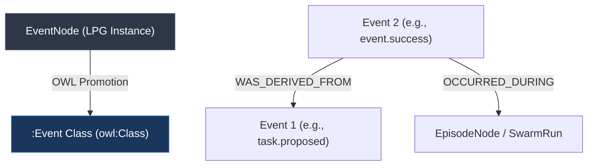

# CONCEPT:AU-ORCH.reactive.event-sourcing-ledger — Reactive Event Sourcing

## Overview

The `Reactive Event Sourcing` framework introduces fully decoupled, reactive event-driven step execution to the `agent-utilities` orchestrator. Instead of executing steps in a strictly pre-wired linear sequence, components can dynamically publish occurrences to an append-only, graph-native `EventLedger`, while other independent specialists or decorators subscribe reactively to specific topics.

This reactive loop unlocks four critical advanced capabilities:
1. **Dynamic Extensibility (Zero-Modification Scaling)**: New agents or observation nodes can join an ongoing workflow and react to existing event topics without modifying any prior step orchestration pipelines.
2. **Time-Travel Debugging & Replays**: The append-only ledger allows executing historical replays up to any specific event ceiling (`fork_run`), supporting offline optimization and regression tracing.
3. **Self-Assembling Workflows & Swarm Parallelism**: Workflows assemble dynamically based on the reactive matching of inputs, outputs, and event topics, encouraging massive parallel swarm execution.
4. **Resilient Self-Healing**: Behaviors can react to error topics (e.g., `event.error`, `budget.tripped`) to trigger alternative reasoning branches or rollbacks dynamically.

---

## Architectural Synergy: Graph & OWL Integration

To achieve a fully unified, DB-agnostic memory design, the Event Sourcing framework dual-writes all events directly into our canonical **Knowledge Graph (LPG)** utilizing standard `EventNode` models via `KGMapper`.

### OWL Ontological Mapping

Because the `EventNode` type is registered inside our `OWLBridge` promotable set, all events and relationships are automatically promoted to standard RDF OWL classes and reasoned over using Description Logic (HermiT/Stardog).



* **Node Classification**: `EventNode` instances promote directly to the OWL class `:Event` (a subclass of `:Observation`).
* **Lineage & Trajectory**: Chronological event chains are connected via `WAS_DERIVED_FROM` edges. This enables OWL reasoning to trace historical provenance and identify causal bottlenecks.
* **Context Linkage**: Events link to execution runs via `OCCURRED_DURING` edges.

---

## Code Usage Examples

### 1. Declaring Reactive Behaviors

Use the `@reactive_behavior` decorator to subscribe functions to event topics.

```python
from agent_utilities.graph.reactive import reactive_behavior, EventLedger
from agent_utilities.models.knowledge_graph import EventNode

# Register a reactive behavior for task proposals
@reactive_behavior(on="task.proposed")
async def handle_proposed_task(event: EventNode):
    payload = event.payload
    print(f"[Reactive] Processing task proposal: {payload.get('task_name')}")
    # Perform cognitive step...
```

### 2. Appending and Dispatching Events

```python
import asyncio
from agent_utilities.graph.reactive import EventLedger, BehaviorDispatcher

async def main():
    ledger = EventLedger()
    dispatcher = BehaviorDispatcher.instance()

    # Append event to the ledger (Dual-writes to Database & NetworkX Memory Cache)
    event = ledger.append_event(
        run_id="run_12345",
        node_id="analyst_agent",
        event_type="task.proposed",
        payload={"task_name": "Synthesize Market Signals", "priority": "high"},
        severity="info"
    )

    # Dispatch to all async subscribers concurrently
    await dispatcher.dispatch_event(event)

if __name__ == "__main__":
    asyncio.run(main())
```

### 3. Time-Travel Replays & Forking

To debug or optimize, fork a historical execution up to a specific step ceiling:

```python
from agent_utilities.graph.reactive import EventLedger

ledger = EventLedger()
# Reconstruct execution state up to a specific failure event
historical_trajectory = ledger.fork_run(
    run_id="run_12345",
    up_to_event_id="evt:9f8b2d1c"
)

for event in historical_trajectory:
    print(f"Replaying step: {event.event_type} - {event.name}")
```
