# ORCH-1.20: KG-Driven Graph Factory

## Concept Summary

| Field | Value |
|-------|-------|
| **Concept ID** | `ORCH-1.20` |
| **Pillar** | 1 — Graph Orchestration Engine |
| **Status** | Implemented |
| **Source Modules** | `graph/kg_graph_factory.py`, `graph/config_helpers.py`, `graph/routing.py`, `knowledge_graph/core/engine_registry.py` |
| **Test Modules** | `test_kg_graph_factory.py` |
| **C4 Component** | KG Graph Factory |

## Overview

The **KG Graph Factory** materializes pydantic-graph topologies directly from
AgentTemplate nodes stored in the Knowledge Graph. Instead of hardcoding graph
structures, it discovers agent configurations, their dependencies, and tool
requirements from the KG at runtime.

## Architecture

```mermaid
flowchart LR
    Q["User Query"] -->|"router_step"| SEARCH["KG: Hybrid Search"]
    SEARCH -->|"AgentTemplate nodes"| TOPO["Topological Sort"]
    TOPO -->|"DEPENDS_ON edges"| PROMPT["Prompt Resolution"]
    PROMPT -->|"USES_PROMPT edges"| TOOL["Tool Binding"]
    TOOL -->|"REQUIRES_TOOLSET edges"| BUILD["Graph Build"]
    BUILD -->|"KGGraphResult"| DISPATCH["ORCH: Dispatcher"]
```

## Key Components

### AgentTemplate Nodes
Stored in the KG with:
- `role` — specialist persona (e.g., `researcher`, `architect`)
- `system_prompt` — the agent's system prompt
- `model_override` — optional model ID override
- `tool_requirements` — list of required MCP toolsets

### Graph Materialization
1. **Query**: Searches KG for matching AgentTemplate nodes
2. **Sort**: Topologically sorts templates by DEPENDS_ON edges
3. **Resolve**: Resolves prompts from linked PromptNode entities
4. **Bind**: Attaches required MCP toolsets
5. **Build**: Constructs a pydantic-graph with proper step routing

### AgentTemplate CRUD (engine_registry.py)
- `register_agent_template()` — creates new templates in KG
- `get_agent_template()` — retrieves by ID
- `list_agent_templates()` — lists all templates

## Related Concepts

- **ORCH-1.21**: Agent Runner — uses factory to materialize agent-specific graphs
- **ORCH-1.2**: Specialist Routing — provides routing context
- **KG-2.0**: Active Knowledge Graph — stores AgentTemplate nodes
