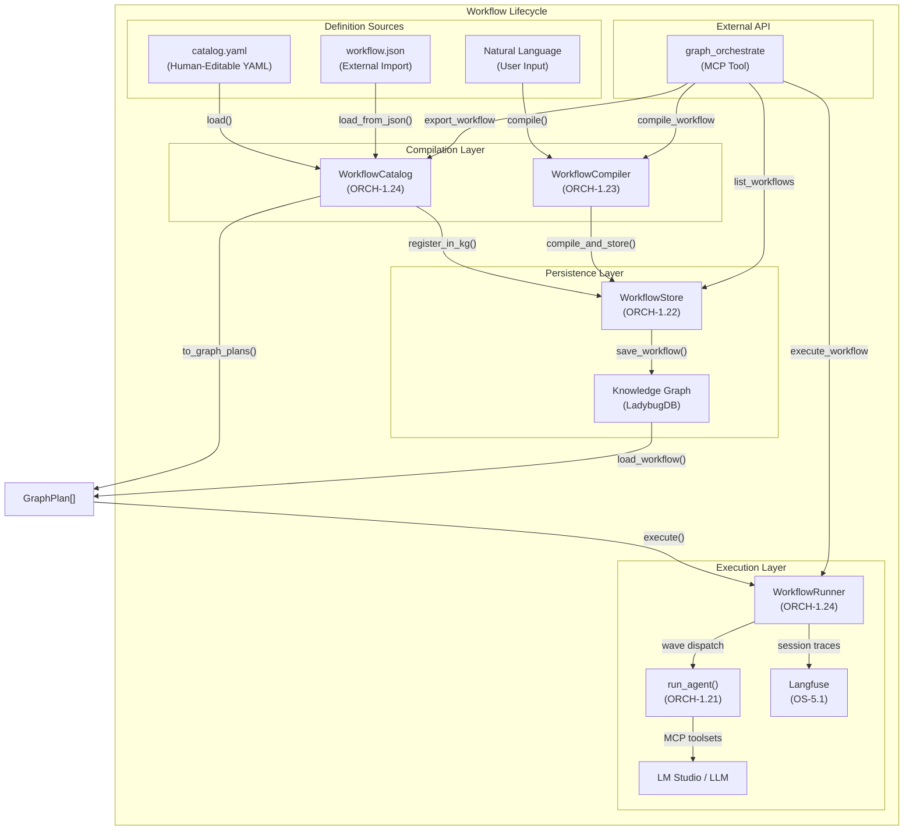

# ORCH-1.24: Workflow Lifecycle Management

## Concept ID
`CONCEPT:ORCH-1.24`

## Status
**Implemented** — v1.0

## Summary

Provides a unified system for defining, persisting, discovering, and
executing reusable agent workflows. The workflow lifecycle spans from
human-editable YAML definitions through KG persistence to live
multi-agent execution with full Langfuse tracing.

## Architecture



## Components

### WorkflowCatalog
**Module**: `agent_utilities.workflows.catalog`

Registry of all predefined workflow scenarios. Loads from YAML,
converts to `GraphPlan` objects, and persists to the KG with
auto-version-increment.

```python
from agent_utilities.workflows.catalog import WorkflowCatalog

# Load built-in catalog
catalog = WorkflowCatalog.load()

# Register in KG (auto-increments version)
workflow_ids = catalog.register_in_kg(engine)

# Filter and discover
docker_workflows = catalog.filter_by_tag("docker")
research_workflows = catalog.filter_by_domain("research")

# Export for external consumers
catalog.export_json("/tmp/workflows.json")
```

### WorkflowRunner
**Module**: `agent_utilities.workflows.runner`

Executes stored `GraphPlan` workflows step-by-step using the
agent_runner pipeline:

1. **Wave Builder** — Groups steps by dependency into concurrent waves
2. **Parallel Execution** — Runs independent steps via `asyncio.gather()`
3. **Context Injection** — Passes prior step outputs to dependent steps
4. **Langfuse Session** — Groups all traces under a single session ID
5. **KG Provenance** — Records `RunTrace` nodes for audit

```python
from agent_utilities.workflows.runner import WorkflowRunner

runner = WorkflowRunner()
result = await runner.execute_by_name("container_health_check", engine)
print(result.summary())
print(result.mermaid)
```

### MCP Surface
**Tool**: `graph_orchestrate`

External agents consume workflows via four new actions:

| Action | Description |
|--------|-------------|
| `compile_workflow` | NL → GraphPlan → KG persistence |
| `list_workflows` | List stored workflow definitions |
| `execute_workflow` | Load and run a stored workflow |
| `export_workflow` | Export a workflow as JSON |

## KG Schema

### Nodes
- **WorkflowDefinition** — Top-level workflow with name, version, description
- **WorkflowStep** — Individual step with agent, task, expected outcomes
- **RunTrace** — Execution record with status, duration, outputs

### Relationships
- `HAS_STEP` — WorkflowDefinition → WorkflowStep
- `TRANSITION_TO` — WorkflowStep → WorkflowStep (dependency)
- `REQUIRES_TOOL` — WorkflowStep → MCPServer/Skill/NativeTool
- `DERIVED_FROM` — RunTrace → WorkflowDefinition

## Version Strategy

When a workflow is re-registered (e.g., catalog updated), the
`WorkflowStore` checks for an existing definition with the same name.
If found, it auto-increments the version number rather than overwriting.
This preserves historical workflow definitions for audit and rollback.

## Catalog Location

The YAML catalog is shipped in two locations:
1. **Package-embedded**: `agent_utilities/workflows/catalog.yaml` — discoverable via `importlib.resources`
2. **Documentation**: `docs/examples/workflows/catalog.yaml` — human reference

## Dependencies

- `ORCH-1.21` — Agent Runner (step execution)
- `ORCH-1.22` — WorkflowStore (KG persistence)
- `ORCH-1.23` — WorkflowCompiler (NL compilation)
- `KG-2.0` — Knowledge Graph Engine (storage)
- `OS-5.1` — Observability / Langfuse (tracing)

## Testing

```bash
# Structural tests (no LLM)
pytest tests/integration/test_dynamic_distribution.py -v -k "not live"
pytest tests/integration/test_mcp_orchestration.py -v -k "not live"

# Live tests (LM Studio + MCP servers)
pytest tests/integration/test_mcp_orchestration.py -v -m live
```
