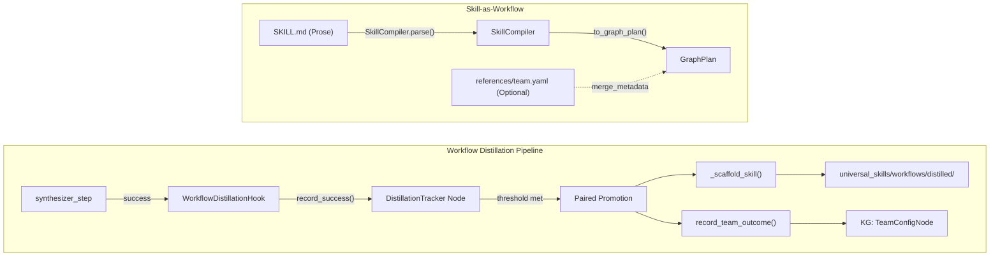

# Workflow Distillation & Skill-as-Workflow (CONCEPT:ORCH-1.25)

## Overview

Closes the "distributed agentic evolution" gap by wiring execution traces
into automatic Skill scaffolding. Workflows are now distributed natively as
executable Skills via `SkillCompiler`, abandoning legacy YAML presets.

## Architecture



## Implementation Details

### Distillation Hook
- **Source**: `agent_utilities/workflows/distillation_hook.py`
- **Entry Point**: `WorkflowDistillationHook.on_execution_complete()`
- **Trigger**: Async background task from `synthesizer_step` (does not block user response)
- **Pattern Key**: Canonical hash of agent topology (node_ids + dependency edges)
- **Scaffolding**: Automatically generates a `SKILL.md` and `references/team.yaml` in the `universal_skills/workflows/distilled` directory once the promotion threshold is met.

### Skill Compiler
- **Source**: `agent_utilities/workflows/skill_compiler.py`
- **Execution**: Natively parses `### Step N:` prose from `SKILL.md` files into executable `GraphPlan` steps.
- **Team Composition**: Checks `references/team.yaml` for optional team metadata; defaults to a general execution graph if absent.

### Domain Presets
- **Location**: `universal_skills/workflows/<domain>/`
- **Migration**: Legacy YAML presets (finance, infra, research) have been migrated into atomic skill directories.

## Cross-Pillar Integration

| Pillar | Integration Point |
|--------|------------------|
| ORCH-1.22 | GraphPlan orchestration |
| ORCH-1.24 | WorkflowCatalog export |
| AHE-3.2 | Evolution Engine awareness |
| AHE-3.3 | TeamConfig promotion |
| KG-2.0 | DistillationTracker nodes |

## Configuration

```json
{
  "distillation": {
    "promotion_threshold": 3,
    "quality_score_minimum": 0.6
  }
}
```

## Documentation Coverage
- **Pillar**: ORCH (cross-pillar: AHE)
- **Tests**: `tests/test_skill_compiler.py`
- **C4 Diagram**: `docs/pillars/architecture_c4.md` → Workflow Distillation Flow
