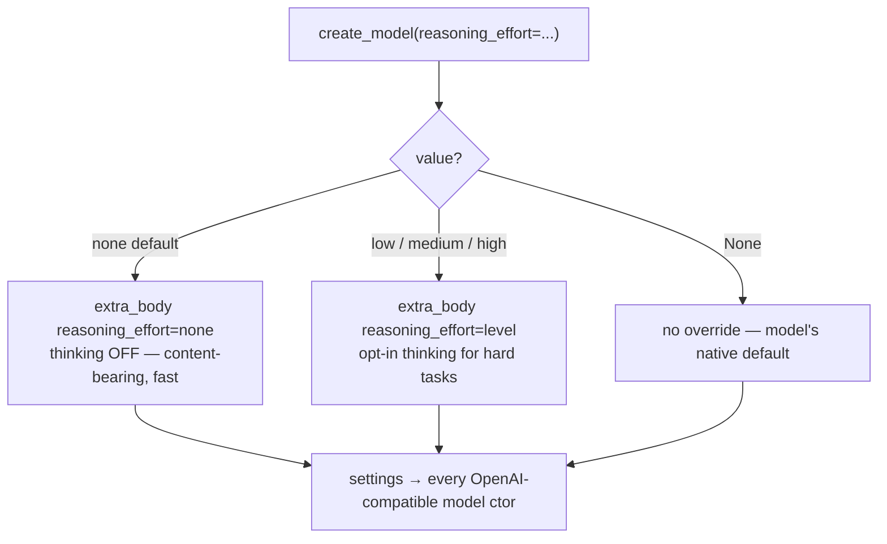

# Role-Specialized Model Routing (CONCEPT:ORCH-1.27)

## Overview

Role-Specialized Model Routing binds functional **roles** (planner / generator / learner / judge)
to model *tiers + capability tags* over the existing model registry, rather than hardcoding model
ids. Assimilated from Quarq Agent's three-specialized-model pattern (`agent-oss/agent.py:58-92`),
generalized so the same configuration runs on any provider pool and degrades gracefully. Extends
**ORCH-1.2** (Specialist Routing & Discovery).

## How it works

- **Role binding.** `ModelRole = planner | generator | learner | judge`. A `RoleSpec` (tier + tags)
  is resolved per role and delegated to the existing `pick_for_task`, inheriting its tier-fallback —
  so a role never hard-fails on a sparse pool (unless the registry is empty).
- **Default map.** planner → light + tags[plan, json]; generator → heavy + tags[synthesis];
  learner → heavy + tags[extraction]; judge → reasoning.
- **Overridable.** Per-call `RoleSpec`, registry-level `ModelRegistry.role_routing`,
  `AgentConfig.role_routing`, or live via `graph_configure(action="set_role_routing")`.
- **Consumers.** The HyDE planner (KG-2.12), the background learner (KG-2.13), and the LongMemEval
  judge/generator (AHE-3.12) all request their model here.

## Key files / API

| Piece | Location |
|---|---|
| Registry roles | `models/model_registry.py` (`ModelRole`, `RoleSpec`, `_DEFAULT_ROLE_ROUTING`, `pick_for_role`, `resolve_role`) |
| Factory | `core/model_factory.py` (`create_model(role=...)`) |
| Config + MCP | `core/config.py` (`AgentConfig.role_routing`), `mcp/kg_server.py` (`graph_configure(action="set_role_routing")`) |

## Wiring (≤3 hops)

`graph_orchestrate`/`graph_configure` → engine → `pick_for_role` (2 hops).

## Research provenance

Quarq three specialized models — `agent-oss/agent.py:58-92` (verified).

## Reasoning-effort default — `create_model(reasoning_effort="none")`

The default model (`qwen/qwen3.6-27b`) is a **reasoning** chat model: it emits
a long `reasoning` block and leaves `content` null until thinking finishes. A
utility call with a modest `max_tokens` then returns EMPTY content
(`finish_reason=length`), and the retry-on-empty path blocks to the 300s
router/verifier timeout. So `create_model` (`core/model_factory.py`) defaults
`reasoning_effort="none"` — **reasoning is OFF for utility calls**, content comes
back directly and fast. Callers opt back in *per call* for genuinely hard tasks.

`_openai_reasoning_settings(effort)` deliberately sends the value through
`OpenAIChatModelSettings(extra_body={"reasoning_effort": effort})` rather than the
typed field, because `"none"` is outside pydantic-ai's effort enum but is the
value this vLLM build honours to suppress the thinking block. `effort is None`
returns no override, so the model keeps its own native default.

> No dedicated concept ID — the behaviour is documented in the `create_model`
> docstring and rides the per-call tracing chokepoint (CONCEPT:OS-5.68).

## RLM-GEPA extension (CONCEPT:ORCH-1.28–1.31)

The registry also carries the RLM-GEPA roles — `rlm-executor` / `rlm-sublm` (cheap, run the skill) and
`rlm-proposer` (strong, reflects on traces and rewrites the skill). A skill optimized with a cheap
executor still lifts a strong one at eval (the AppWorld cost/quality trick), resolved via
`rlm/roles.py:rlm_role_model`. The GEPA proposer (ORCH-1.30) binds to `rlm-proposer`.
