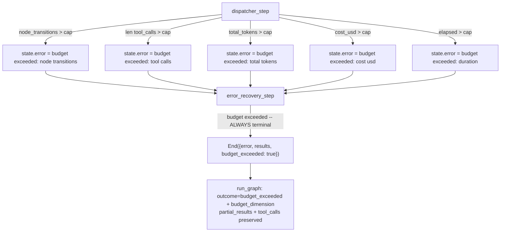

# Execution & State Safety (CONCEPT:AU-ORCH.execution.execution-budget-caps)

## Overview
Cost Governors, Execution Budgets, and payload truncation for context scaling.

`ExecutionBudget` (`agent_utilities/models/usage.py`) caps five dimensions of a
multi-agent graph run — every cap defaults to a real, finite ceiling, never
silently unbounded:

| Dimension | Field | Default | Enforced in |
|---|---|---|---|
| Loop / node transitions | `max_node_transitions` | 50 | `graph/_router_impl.py::dispatcher_step` |
| Tool calls | `max_tool_calls` | 200 | `graph/_router_impl.py::dispatcher_step` |
| Tokens | `max_total_tokens` | 500,000 | `graph/_router_impl.py::dispatcher_step` |
| Cost | `max_cost_usd` | $10.00 | `graph/_router_impl.py::dispatcher_step` |
| Wall-clock | `max_duration_seconds` | 600s | `graph/_router_impl.py::dispatcher_step` |

`max_tool_calls` is distinct from `max_node_transitions`: a single graph node
can invoke several tool calls, so the tool-call budget catches a runaway
*within* a small number of transitions the transition cap alone would not —
this is the direct defense against the class of incident where a fleet tool
silently ignores an unknown `limit` argument and returns an oversized payload.
Every `UsageLimits` construction site (the planner, verifier, spawned-task
agents, the governed dynamic-workflow orchestrator, and the direct
single-server tool loop) also sets `per_request_input_tokens_limit`
(pydantic-ai-slim 2.21.0+, `orchestration/loop_guards.DEFAULT_PER_REQUEST_INPUT_TOKENS_LIMIT`)
so an oversized tool result terminates the run instead of compounding across
further requests.

**What that cap does and does not do.** `count_tokens_before_request` is left at
its default `False`, so pydantic-ai checks `per_request_input_tokens_limit`
against the provider-reported `input_tokens` of the **response** — the oversized
request is sent and billed once, and `UsageLimitExceeded` is raised on the way
back out. It is a stop, not a pre-flight rejection: the 212 KB ServiceNow
payload would still be sent to the model exactly once, and the run then
terminates rather than carrying that context into every subsequent request.
Turning the cap into a true pre-flight guard means setting
`count_tokens_before_request=True`, which adds a provider `count_tokens` round
trip to every request; that trade-off has not been taken and is recorded as
D-W15-12 in `reports/deferred/waves1-5-gate.md`.

**Termination is an explicit, classified condition, not a bare error.** ANY
budget exhaustion (all five dimensions, not just the node-transition cap) is
treated as terminal by `graph/verification.py::error_recovery_step` — it is
never retried through the planner, because retrying would only spend more of
the resource that already tripped. `orchestration/engine.py::run_graph`
surfaces this as `metadata.outcome == "budget_exceeded"` plus a
`budget_dimension` (`node_transitions` / `tool_calls` / `total_tokens` /
`cost_usd` / `duration`), and preserves every partial specialist result
completed before the cap tripped (`results.partial_results`) alongside the
error and the full `tool_calls` provenance — a budget-exhausted run is never
recorded as a clean success, and it never silently loses the work already done.

## Implementation Details
- **Source Code**: ``agent_utilities/graph/state.py`` (cost governors, payload truncation), ``agent_utilities/models/usage.py`` (``ExecutionBudget``), ``agent_utilities/graph/_router_impl.py`` (enforcement), ``agent_utilities/graph/verification.py`` (terminal classification), ``agent_utilities/orchestration/engine.py`` (outcome surfacing), ``agent_utilities/orchestration/loop_guards.py`` (``DEFAULT_PER_REQUEST_INPUT_TOKENS_LIMIT``)
- **Pillar**: ORCH

## Documentation Coverage
*This is an auto-generated dedicated concept page to ensure 100% documentation coverage across the ecosystem.*
