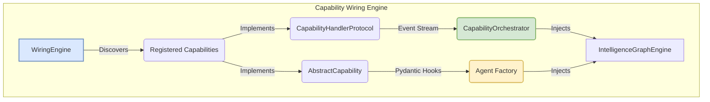

# Swarm Preset Template Engine (CONCEPT:ORCH-1.4)

## Overview
YAML-driven declarative multi-agent workflow engine with DAG topological sort, cycle detection, parallel dispatch identification, and variable substitution.

## Implementation Details
- **Source Code**: ``agent_utilities/graph/swarm_preset.py``
- **Pillar**: ORCH

## Documentation Coverage
*This is an auto-generated dedicated concept page to ensure 100% documentation coverage across the ecosystem.*
# Multi-Level Abstraction Layering (CONCEPT:ORCH-1.3)

## Overview
Planners emit coarse-grained abstraction steps and delegate fine-grained execution to specialist nodes, reducing upfront planning token overhead.

## Implementation Details
- **Source Code**: ``agent_utilities/graph/hierarchical_planner.py``
- **Pillar**: ORCH

## Documentation Coverage
*This is an auto-generated dedicated concept page to ensure 100% documentation coverage across the ecosystem.*
# Learned Agent Routing (CONCEPT:ORCH-1.4)

## Overview
Jointly optimizes decomposition depth, worker choice, and inference budget from execution traces. Three policies: RuleBasedPolicy (keyword pattern matching), TraceLearnedPolicy (softmax scoring from historical traces with EMA quality tracking), CostAwareRouter (Pareto-optimal cost/accuracy filtering). Derived from Uno-Orchestra (arXiv:2605.05007v1).

## Implementation Details
- **Source Code**: ``agent_utilities/graph/routing_policy.py``
- **Pillar**: ORCH

## Documentation Coverage
*This is an auto-generated dedicated concept page to ensure 100% documentation coverage across the ecosystem.*
# [Ontological Fallback Chains](pillars/1_graph_orchestration/ORCH-1.14-Ontological_Fallback_Chains.md) (CONCEPT:ORCH-1.2)

## Overview
Uses the KG to find fallback models dynamically rather than relying on static lists during rate limits.

## Implementation Details
- **Source Code**: ``agent_utilities/graph/routing_policy.py``
- **Pillar**: ORCH

## Documentation Coverage
*This is an auto-generated dedicated concept page to ensure 100% documentation coverage across the ecosystem.*
# Subagent Lifecycle Patterns (CONCEPT:ORCH-1.5)

## Overview
Formalizes 4-tier subagent interaction taxonomy (inline_tool, fan_out, agent_pool, teams) with complexity-based pattern routing, KG-persisted decisions, and outcome-based learning. Based on Schmid (2026).

## Implementation Details
- **Source Code**: ``agent_utilities/graph/subagent_patterns.py``
- **Pillar**: ORCH

## Documentation Coverage
*This is an auto-generated dedicated concept page to ensure 100% documentation coverage across the ecosystem.*
# ORCH-1.21: Capability Wiring Engine

The Capability Wiring Engine is the definitive sub-system for dynamic capability discovery and injection within the Agent Utilities ecosystem. It acts as the bridge between the 6-pillar ontology and the underlying Pydantic AI `Agent` lifecycle.

## Architectural Purpose

Historically, capabilities (like `StuckLoopDetection`, `CheckpointMiddleware`, `ToolOutputEviction`) were hardcoded into the agent factory and relied solely on Pydantic AI's `AbstractCapability` hooks.

The **Capability Wiring Engine** introduces the `CapabilityHandlerProtocol`, which shifts the system to a dynamic, event-driven orchestration model:

1.  **Dynamic Discovery:** The `WiringEngine` scans the environment and registered plugins to discover capabilities at runtime.
2.  **Dual-Interface Compliance:** Capabilities inherit from both `AbstractCapability` (for deep Pydantic AI integration) and `CapabilityHandlerProtocol` (for unified system orchestration).
3.  **Event-Driven Routing:** Instead of monolithic hook overrides, capabilities declare what events they handle via `can_handle(context)` and execute isolated logic via `execute(context)`.

## The CapabilityHandlerProtocol

Every registered capability must implement the following protocol:

```python
from typing import Any
from agent_utilities.protocols.capability import CapabilityContext

class CapabilityHandlerProtocol:
    @property
    def capability_name(self) -> str:
        """Returns the unique ontological identifier of the capability."""
        raise NotImplementedError

    def can_handle(self, context: CapabilityContext) -> bool:
        """Determines if this capability should intercept the current graph event."""
        raise NotImplementedError

    async def execute(self, context: CapabilityContext) -> dict[str, Any]:
        """Executes the capability logic within the orchestrator's event loop."""
        raise NotImplementedError
```

## System Integration

The Wiring Engine is tightly coupled with the `CapabilityOrchestrator` (`agent_utilities/capabilities/orchestrator.py`). During agent initialization (in `factory.py`), the factory retrieves the aggregated capabilities from the orchestrator and injects them directly into the target graph structure, ensuring a zero-stub, fully wired knowledge graph experience.


