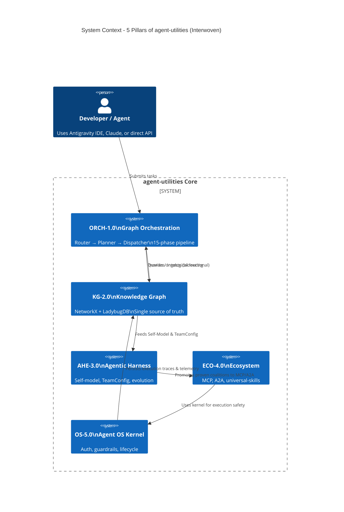

# DSTDD Pipeline: Design-Spec-Test Driven Development (CONCEPT:ORCH-1.3)

## Overview
The DSTDD (Design-Spec-Test Driven Development) pipeline is the formalized workflow that prevents architectural bloat. It ensures that all new features, external integrations, or research ideas are woven natively into the existing Knowledge Graph and 5-Pillar topology.

## The "Extend Before Invent" Mandate
> "New functionality MUST first be expressed as an extension, augmentation, or composition of an existing pillar/concept before a new CONCEPT: tag or domain is introduced. The Knowledge Graph is the arbiter."

## Workflow
1. **Design Phase**:
   - An agent reads the research paper or codebase to be ingested.
   - It uses `universal-skills` (`skill-graph-builder` + `c4-architecture`) to parse the context.
   - The KG analogy engine (`kg_analogize`) maps the new ideas onto the existing 5 pillars.
   - A design artifact (Mermaid C4 + pillar interconnection) is generated in `.specify/design/`.
2. **Spec Phase**:
   - The design is decomposed into actionable specs inside `.specify/specs/`.
   - The spec explicitly references the existing pillars being extended.
3. **Test Phase**:
   - Auto-generate TDD tests.
   - Validate against the 15-phase Intelligence Graph Pipeline.

## Five-Pillar Interwoven Context

