# AU-ORCH.execution.service-registry-initialization: KG-Driven Graph Factory

## Concept Summary

| Field | Value |
|-------|-------|
| **Concept ID** | `AU-ORCH.execution.service-registry-initialization` |
| **Pillar** | 1 — Graph Orchestration Engine |
| **Status** | Implemented |
| **Source Modules** | `graph/kg_graph_factory.py`, `graph/builder.py` (`create_graph_agent`), `graph/routing/`, `core/registry/kg_adapter.py` |
| **Test Modules** | `test_kg_graph_factory.py` |
| **C4 Component** | KG Graph Factory |

## Overview

The **KG Graph Factory** materializes pydantic-graph topologies directly from
AgentTemplate nodes stored in the Knowledge Graph. Instead of hardcoding graph
structures, it discovers agent configurations, their dependencies, and tool
requirements from the KG at runtime.

## Architecture

```mermaid
flowchart LR
    Q["ORCH-1.0: User Query"] -->|"router_step"| SEARCH["KG-2.3: KG: Hybrid Search"]
    SEARCH -->|"AgentTemplate nodes"| TOPO["AU-ORCH.execution.service-registry-initialization: Topological Sort"]
    TOPO -->|"DEPENDS_ON edges"| PROMPT["AHE-3.2: Prompt Resolution"]
    PROMPT -->|"USES_PROMPT edges"| TOOL["AU-ORCH.execution.service-registry-initialization: Tool Binding"]
    TOOL -->|"REQUIRES_TOOLSET edges"| BUILD["KG-2.0: Graph Build"]
    BUILD -->|"KGGraphResult"| DISPATCH["ORCH-1.0: ORCH: Dispatcher"]
```

## Key Components

### AgentTemplate Nodes
Stored in the KG with:
- `role` — specialist persona (e.g., `researcher`, `architect`)
- `system_prompt` — the agent's system prompt
- `model_override` — optional model ID override
- `tool_requirements` — list of required MCP toolsets

### Graph Materialization
1. **Query**: Searches KG for matching AgentTemplate nodes
2. **Sort**: Topologically sorts templates by DEPENDS_ON edges
3. **Resolve**: Resolves prompts from linked PromptNode entities
4. **Bind**: Attaches required MCP toolsets
5. **Build**: Constructs a pydantic-graph with proper step routing

### AgentTemplate CRUD (`core/registry/kg_adapter.py`)
- `get_agent_templates()` — retrieves AgentTemplate nodes from the KG (filtered by role/name)

The graph is materialized by `build_pydantic_graph_from_kg()` in `graph/kg_graph_factory.py`,
which resolves templates (`_resolve_templates_from_kg`), prompts (`_resolve_prompt_from_kg`),
tools (`_resolve_tools_from_kg`), and topology edges (`_resolve_topology_edges`).

## Related Concepts

- **ORCH-1.21**: Agent Runner — uses factory to materialize agent-specific graphs
- **ORCH-1.2**: Specialist Routing — provides routing context
- **KG-2.0**: Active Knowledge Graph — stores AgentTemplate nodes
